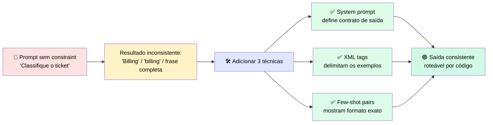
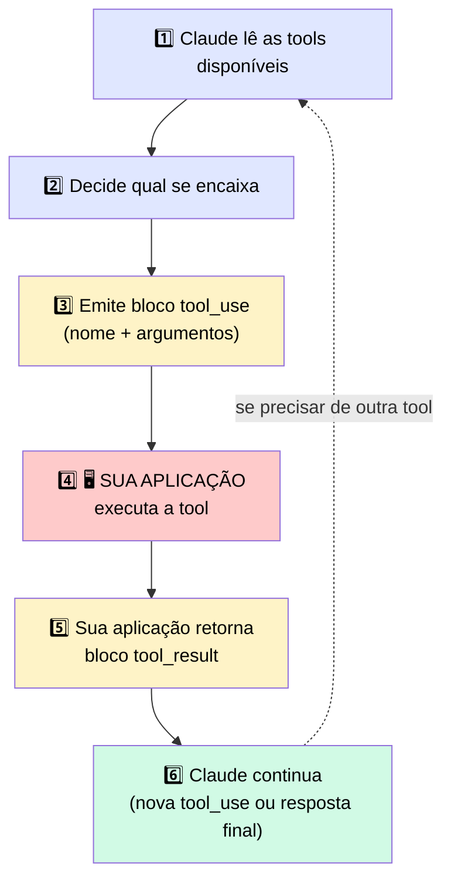
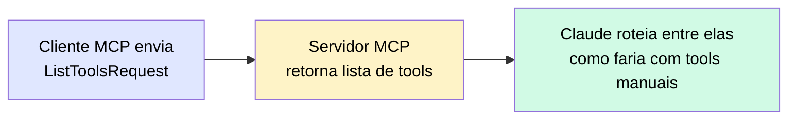
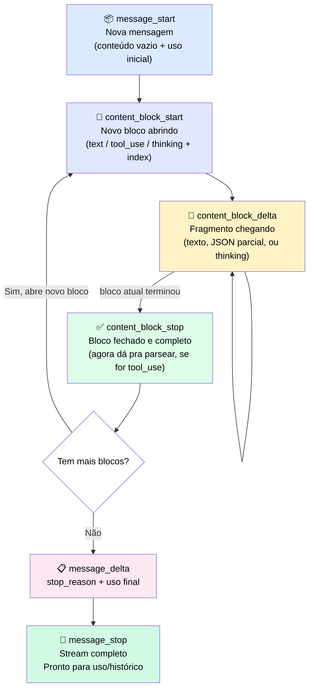
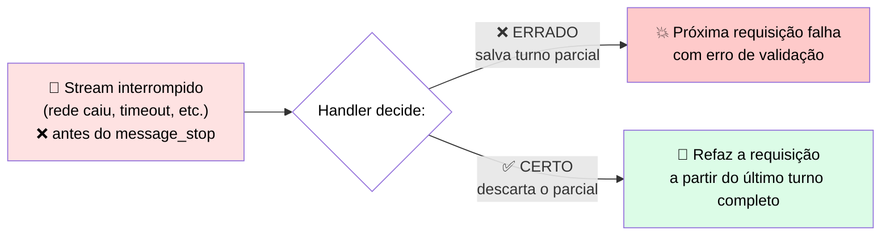
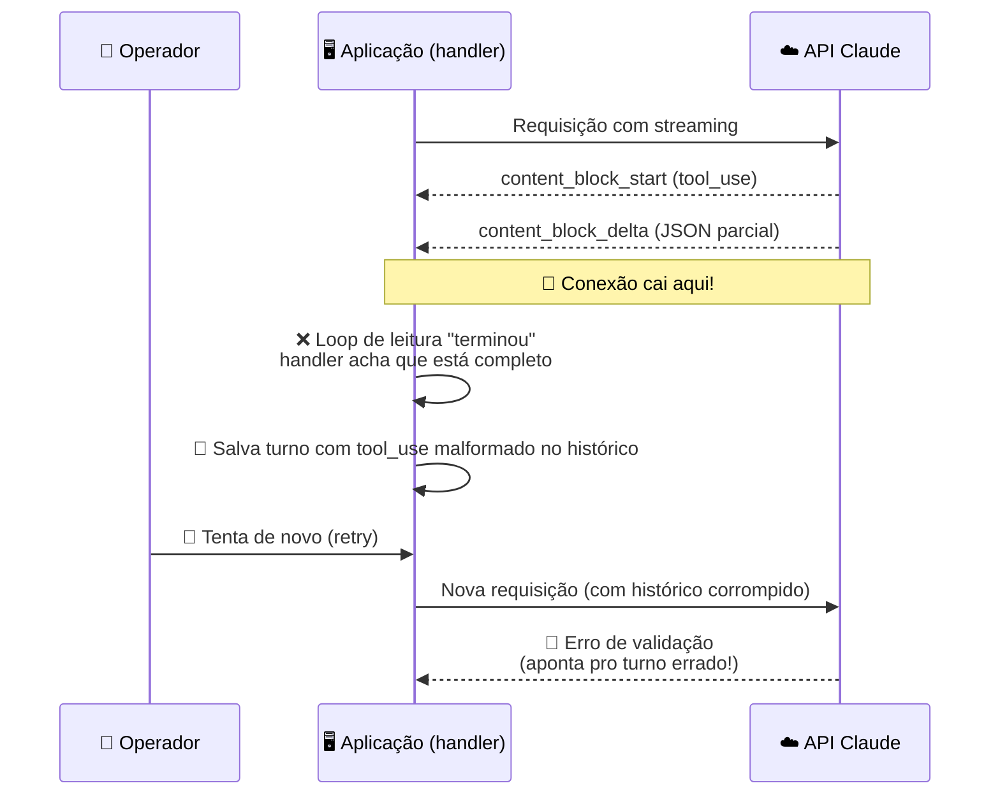

# 📚 Guia de Engenharia de Prompts, Tools e Streaming com Claude

> Guia consolidado cobrindo técnicas de prompt, design de tools, o protocolo MCP e o funcionamento interno do streaming de respostas.

---

## 🧩 1. System Prompts, XML, Few-shot e Output Constraints

### 💡 Ideia central

> Um prompt que funciona em uso interativo muitas vezes quebra em produção com inputs não testados. A solução **não é** adicionar mais palavras ao prompt — é <mark>diagnosticar qual peça estrutural está faltando</mark> e adicioná-la.

### 🔍 As quatro técnicas e quando usá-las

| 🩺 O que você observa | 🔧 O que falta no prompt | 💬 Por quê |
|---|---|---|
| Resultado no formato errado (frase em vez de label, prosa em vez de JSON) | **Output constraint** | Controla a forma da resposta independentemente do conteúdo |
| Conteúdo errado: escopo derrapa, tom muda, Claude responde além do pedido | **System prompt** mais específico | Define regras que valem para todos os turnos; se vago, nada segura papel/escopo/formato |
| Tarefa certa, mas estrutura inventada | **Few-shot examples** | Claude não infere uma estrutura exata só pela descrição; exemplos mostram o padrão |
| Funciona nos casos testados, quebra em variantes/edge cases | **Constraint cobrindo a variante** | O prompt só cobre o caminho feliz; falta nomear o caso excepcional |

> ✅ **Regra prática:** nomeie a falha → adicione a técnica correspondente → rode de novo. Se continuar falhando, diagnostique de novo.
>
> ⚠️ Prompt crescendo a cada iteração sem melhorar é sinal de que a diagnose está sendo pulada.

### 🧪 Exemplo prático: classificador de tickets

### 📏 Quando aplicar cada abordagem

| Abordagem | Quando usar |
|---|---|
| 🧱 **Empilhar as quatro técnicas** | Tarefas com contrato de saída bem definido e edge cases cobertos por exemplos |
| ✂️ **Simplificar o prompt** | Tarefas simples (ex.: "resuma este parágrafo") não precisam de few-shot nem schema |
| 🔎 **Diagnosticar antes de adicionar mais** | Prompt já reescrito várias vezes e ainda falha — pare e diagnostique antes de continuar |

### 🔒 Output constraints

Última linha de defesa antes da resposta chegar ao parser. Devem especificar:
- ✔️ nomes de campos e tipos
- ✔️ limites de tamanho
- ✔️ se deve haver preâmbulo
- ✔️ o que fazer quando faltam dados

> Use recursos de saída estruturada quando o formato precisa ser **machine-readable**.

### ⚙️ Structured Outputs na API

Em vez de pedir um formato por instrução (que pode falhar em casos não testados), você fornece um **JSON schema** e o modelo é restringido na geração (*constrained decoding*) para só produzir tokens válidos contra esse schema.

| Mecanismo | O que restringe | Configuração | Melhor uso |
|---|---|---|---|
| 🧾 **JSON outputs** | A resposta final | `output_config.format` com `type: json_schema` | Extração de campos, payloads estruturados |
| 🔗 **Strict tool use** | Argumentos passados a tools | `strict: true` na definição da tool | Loops agênticos, evita args malformados |

**⚠️ Custos a considerar:**
- 🐢 Latência na primeira chamada (compilação do schema; cache de 24h)
- 📈 Aumento de tokens de input (system prompt injetado)
- ❌ Schema garantido ≠ sucesso garantido — cheque sempre `stop_reason` (`refusal` / `max_tokens`)
- 🚫 Incompatível com *message prefilling*

---

## 🧠 2. Quando usar Extended Thinking (raciocínio estendido)

| 🎯 Formato da tarefa | Usar extended thinking? | 💬 Motivo |
|---|---|---|
| Raciocínio em várias etapas: derivação matemática, lógica multi-hop, planejamento de ações dependentes | ✅ **Ativar**, ajustando o esforço à profundidade do problema | É na etapa de raciocínio que o modelo trabalha dependências que passariam despercebidas |
| Tarefas mecânicas: classificação, conversão de formato, extração de campo, respostas factuais curtas | ❌ **Deixar desativado** | Não melhora a resposta e custa mais tokens à toa — um output constraint simples resolve |
| Loops agênticos com planejamento em várias chamadas de tools | ✅ **Ativar** e reservar orçamento para o planejamento (não por chamada individual) | Raciocinar antes de planejar reduz escolha errada de ferramenta |

---

## 🛠️ 3. Tool Schemas, Loop de Tool-Use e MCP

### 💡 Ideia central

Ao usar tools, você não está mais moldando texto — está entregando a Claude um conjunto de ações e confiando que ele escolherá a certa. Essa escolha depende quase inteiramente de como o **schema** foi escrito.

### 🔁 Como funciona o loop de tool-use

> ❗ Erro comum: achar que **Claude executa** as tools. Na verdade, quem executa é a sua aplicação.

> ⚠️ **O passo 4 não é automático** — é responsabilidade do seu código. Se a aplicação não devolver o resultado corretamente, o loop quebra.

### 🧱 Estrutura dos blocos em uma conversa com tools

| Bloco | Quem gera | Contém | 🚨 Regra crítica |
|---|---|---|---|
| 📝 `text` | Claude | Resposta em prosa | Se aparecer junto de `tool_use`, preserve o array completo ao salvar no histórico |
| 🔧 `tool_use` | Claude | Nome, ID único, argumentos | Precisa de `tool_result` correspondente no turno **imediatamente seguinte** |
| 📦 `tool_result` | Sua aplicação | ID correspondente, resultado, `is_error` opcional | O `tool_use_id` deve bater exatamente com o `tool_use` original |
| 🧵 `thinking` | Claude (extended thinking) | Raciocínio interno | Deve voltar **sem alterações** — qualquer edição quebra a validação |

> 🔒 **Invariante crítico:** todo `tool_use` precisa de um `tool_result` correspondente no turno seguinte, ou a API rejeita a requisição.

### 🧬 Anatomia de um schema de tool

| Parte | Papel |
|---|---|
| **name** | Identificador curto e específico (`get_account_balance` > `get_data`) |
| **description** | 🎯 A parte mais crítica — diz **quando usar e quando não usar** |
| **input_schema** | Define parâmetros via JSON Schema (`required` vs. opcionais) |

### 📋 Decisões de design de schema

| Decisão | Como tratar | Por quê |
|---|---|---|
| 🔗 Dependência entre subtarefas | Sequencial se depende de outra; paralelo (`tool_use` múltiplo) se independente | Modelos chamam em paralelo por padrão — use `disable_parallel_tool_use` para forçar sequência |
| ✅ Campos obrigatórios | Só marcar `required` se a tool não funciona sem o campo | Evita que Claude invente valores |
| ➖ Campos opcionais | Usar quando há default sensato | Evita que Claude "chute" informação |
| 📝 Tamanho da descrição | 3–4 frases: o que faz, quando usar, o que retorna | Curta demais = Claude chuta; longa demais = sinal escondido em ruído |
| 🪞 Parâmetros sobrepostos | Adicionar linguagem que desambigua o domínio de cada tool | Claude roteia por nome + descrição — se params são iguais, tudo cai na descrição |

### 🧪 Exemplo prático: desambiguação de tools

Duas tools com descrições que começavam iguais (`search_knowledge_base` e `get_cached_result`) causavam seleções erradas. A correção: adicionar **condições de exclusão** explícitas.

> 💬 *"Use isto para buscar... **não use isso se** uma busca anterior já cobriu a pergunta."*

⚠️ Essas condições dependem do **histórico completo** ser enviado a cada requisição — se turnos forem truncados, a lógica falha silenciosamente.

| ✅ Funciona bem | ⚠️ Não é a melhor solução |
|---|---|
| Descrições específicas com condições de exclusão claras | Duas tools muito parecidas com descrições cada vez mais longas → funda as duas em uma só, com parâmetro de tipo |

### 🌐 MCP como alternativa a escrever schemas manualmente

O MCP move a definição e execução de tools para **servidores dedicados**, fora do seu código.

> 💰 **Custo de contexto:** tools de servidores MCP consomem o context window mesmo sem uso no turno atual. Conectar vários servidores de uma vez pode pesar bastante.

**Controlando o custo via `mcp_toolset`:**
| Opção | Função |
|---|---|
| `defer_loading` | Adia o carregamento da definição até ser necessária |
| `enabled` | Liga/desliga tools individuais |
| Header `mcp-client-2025-11-20` | Obrigatório para essas configurações funcionarem |

**Transportes MCP:**
| Transporte | Uso |
|---|---|
| 🖥️ `stdio` | Servidores locais (subprocesso) |
| 🌐 `Streamable HTTP` | Servidores remotos (POST + SSE opcional) — padrão atual |

> ℹ️ O API MCP Connector da Anthropic só suporta servidores **remotos** (HTTP); servidores `stdio` precisam do Claude Desktop, Claude Code, ou SDK direto.

### 🤔 Quando usar cada abordagem

| Abordagem | Quando |
|---|---|
| 🌐 **MCP** | Já existe servidor bem mantido cobrindo o serviço necessário |
| ✍️ **Schemas manuais** | Sem servidor MCP disponível, ou controle fino de escopo/descrição necessário |
| 🤝 **Ambos** | Conectar MCP para cobertura ampla + ajuste de descrições nas tools mais usadas |

---

## 🌊 4. Streaming de Respostas

### 💡 Ideia central

Em requisições **não-streamed**, a API entrega uma mensagem completa de uma vez. No **streaming**, ela envia uma série de eventos descrevendo a mensagem sendo construída — e cabe ao seu código **remontar** os blocos e decidir o que fazer se a série parar antes do fim.

> ℹ️ O modelo não mantém nenhum objeto "vivo" aberto para você. Cada evento descreve uma mudança pontual; seu handler aplica cada evento ao estado parcial que está construindo.

### 🔄 Diagrama do fluxo completo

> 📝 **Nota:** o loop `content_block_start` → `content_block_delta` (repetido) → `content_block_stop` pode se repetir **várias vezes** por mensagem — uma vez para cada bloco de conteúdo.

### 📖 O que acontece em cada passo

| # | Evento | O que significa | O que o código deve fazer |
|---|---|---|---|
| 1️⃣ | `message_start` | Nova mensagem começando | Criar array vazio para coletar blocos |
| 2️⃣ | `content_block_start` | Bloco novo se abrindo, com índice | Criar "slot" para aquele índice |
| 3️⃣ | `content_block_delta` 🔁 | Pedaço do conteúdo chegando | **Concatenar** ao bloco — ⚠️ não usar ainda, está incompleto |
| 4️⃣ | `content_block_stop` | Bloco terminou de chegar | Finalizar bloco — **só agora** é seguro parsear JSON de `tool_use` |
| 5️⃣ | `message_delta` | Info de nível da mensagem inteira | Guardar `stop_reason` |
| 6️⃣ | `message_stop` | Stream inteiro terminou | Mensagem **completa e segura** para uso/histórico |

### 🚨 A regra de ouro: não agir sobre um bloco parcial

O bloco `tool_use` é o que exige mais cuidado. Seu input chega como string JSON parcial, espalhada por vários `content_block_delta` — e essa string **só é JSON válido depois do `content_block_stop`**.

> ❌ Se o código tentar parsear/executar antes do bloco fechar: quebra com JSON malformado **ou** roda com metade dos argumentos faltando.

✅ **Regra simples:** colete os deltas, aja **só depois** do `content_block_stop`.

A mesma disciplina vale para o histórico: <mark>só adicione o turno ao histórico depois do `message_stop`</mark>, com todos os blocos completamente montados.

### ⚡ Quando o stream para no meio do caminho

<mark>O erro mais grave é tratar o que foi coletado até ali como se estivesse completo.</mark>

| Tipo de bloco parcial | Impacto |
|---|---|
| 📝 Texto parcial mostrado ao usuário | Cosmético — só um glitch visual |
| 🔧 `tool_use` parcial salvo no histórico | 💥 **Estrutural** — corrompe o próximo turno |

**✅ Boas práticas:**
- 🎯 Rastreie a conclusão intencionalmente: turno só é utilizável depois de `message_stop`
- 🗑️ Se o stream for interrompido, **descarte** o turno parcial e refaça a requisição
- 🔍 Confira o `stop_reason` do `message_delta` antes de continuar um loop

### ⚖️ Quando usar streaming

| ✅ Funciona bem | ⚠️ Adiciona custo/complexidade | 🔄 Considere outra abordagem |
|---|---|---|
| Respostas longas e interfaces com usuário esperando — elimina a tela em branco | Você monta os blocos, não pode agir sobre parciais, precisa tratar interrupção | Respostas curtas / jobs de backend sem ninguém esperando → chamada não-streamed é mais simples |

---

## 🔬 5. Post-mortem: o stream que deixou uma tool call pela metade no histórico

### 📌 Contexto

Uma resposta em streaming pode <mark>parecer correta na tela e mesmo assim corromper a próxima requisição</mark>. O texto foi renderizado, o usuário viu uma resposta, o handler adicionou o turno ao histórico — mas o stream tinha caído no meio de um bloco `tool_use`, deixando **metade do input faltando**.

### 🧾 O que aconteceu

> 🕵️ **Em testes:** conexão local rápida → streams sempre completos → nunca reproduziu o bug.
> 🔥 **Em produção:** instabilidade de rede → stream cortado **depois** do `content_block_start` mas **antes** do `content_block_stop` → JSON truncado salvo no histórico.

⚠️ A equipe passou uma tarde investigando o **schema** e a **lógica de retry**, porque o erro aparecia na requisição de retry. Mas a causa real estava antes disso:

> <mark>O handler tratava "o loop de leitura terminou" como equivalente a "a mensagem está completa"</mark> — e essas duas coisas **não são a mesma coisa**.

### 🎯 O que observar

- <mark>Um stream terminar não é o mesmo que uma mensagem estar completa.</mark> Só `message_stop` significa mensagem inteira.
- Se o handler commita sempre que o loop termina, uma interrupção escreve um bloco pela metade — e a **falha aparece na próxima requisição**, não na que causou o problema.

**🛡️ Como evitar:**

| ✔️ Ação | Por quê |
|---|---|
| Condicionar o append ao histórico à ocorrência do `message_stop` | Garante que só turnos completos entram no histórico |
| Descartar o turno parcial em caso de interrupção | Evita corromper a próxima requisição |
| Refazer a requisição a partir do último turno completo | Mantém o histórico consistente |
| Ao ver erro de tool-use num retry, checar primeiro se o turno anterior veio de um stream | Evita perder tempo investigando o schema à toa |

---

> 💡 **Resumo do resumo:** prompts precisam de estrutura explícita (system prompt + XML + few-shot + constraints); tools precisam de descrições claras com condições de exclusão; e streaming exige tratar `message_stop` como o único ponto seguro para confiar no que foi recebido.
