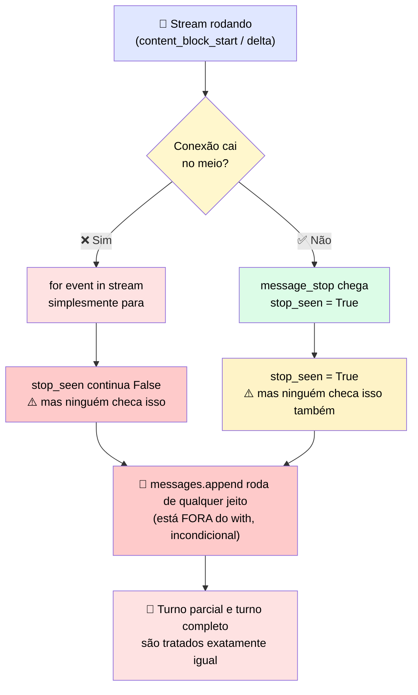

# 🧪 Checkpoint 4 · Conserte o Handler de Stream Quebrado

> 🎯 **Desafio:** o handler abaixo faz streaming de uma resposta e adiciona o turno do assistant ao histórico da conversa. Ele tem **um defeito** que só aparece quando o stream é interrompido no meio. Identifique o defeito e escreva a versão corrigida.

---

## 🐛 1. O handler quebrado

```python
blocks = {}
stop_seen = False

with client.messages.stream(model=model, max_tokens=4096, messages=messages, tools=tools) as stream:
    for event in stream:
        if event.type == "content_block_start":
            blocks[event.index] = init_block(event)
        elif event.type == "content_block_delta":
            apply_delta(blocks[event.index], event.delta)
        elif event.type == "message_stop":
            stop_seen = True

messages.append({"role": "assistant", "content": assemble(blocks)})
```

---

## 🔍 2. Onde está o defeito

| Linha do código | O que faz | 🚨 Problema |
|---|---|---|
| `stop_seen = True` | Marca que o `message_stop` chegou | A variável é **calculada mas nunca usada** para decidir algo |
| `messages.append(...)` | Roda **fora do `with`**, incondicionalmente | Executa **mesmo que o stream tenha caído antes do `message_stop`** |

> <mark>O handler trata "o loop de eventos terminou" (por qualquer motivo) como equivalente a "a mensagem está completa".</mark> Isso é exatamente o antipadrão do post-mortem anterior: se a conexão cair no meio de um bloco `content_block_delta`, o `for event in stream` simplesmente para de iterar — sem lançar nenhum sinal especial — e o código segue reto até o `append`, salvando um turno com blocos pela metade (por exemplo, um `tool_use` com JSON truncado).

### 🔄 Diagrama do bug



---

## ✅ 3. A correção

```python
blocks = {}
stop_seen = False

with client.messages.stream(model=model, max_tokens=4096, messages=messages, tools=tools) as stream:
    for event in stream:
        if event.type == "content_block_start":
            blocks[event.index] = init_block(event)
        elif event.type == "content_block_delta":
            apply_delta(blocks[event.index], event.delta)
        elif event.type == "message_stop":
            stop_seen = True

if stop_seen:
    messages.append({"role": "assistant", "content": assemble(blocks)})
else:
    raise StreamInterruptedError(
        "Stream ended before message_stop; discarding partial turn. Retry from the last complete turn."
    )
```

### 🛠️ O que mudou

| Antes ❌ | Depois ✅ | Por quê |
|---|---|---|
| `append` roda sempre, sem checar `stop_seen` | `append` só roda **se `stop_seen` for `True`** | Garante que só turnos completos entram no histórico |
| Stream interrompido → turno parcial salvo silenciosamente | Stream interrompido → `StreamInterruptedError` explícito | Torna o erro visível **no ponto onde ele aconteceu**, não numa requisição futura |
| Nenhuma orientação de retry | Mensagem de erro diz para **refazer a partir do último turno completo** | Evita que quem trata a exceção "adivinhe" o que fazer |

---

## 🎯 4. Regra de ouro por trás da correção

> <mark>`stop_seen` já existia no código original — o bug não era falta de informação, era falta de usá-la para decidir algo.</mark> A variável era calculada e depois ignorada, o que é um padrão perigoso: dá a falsa sensação de que o estado está sendo rastreado quando na verdade não está influenciando nenhum comportamento.

✅ **Checklist para qualquer handler de streaming:**
- [ ] O `append` ao histórico está **condicionado** a `message_stop` ter chegado?
- [ ] Existe um caminho de erro explícito para stream interrompido (em vez de silêncio)?
- [ ] A mensagem de erro orienta o retry a partir do **último turno completo**?
