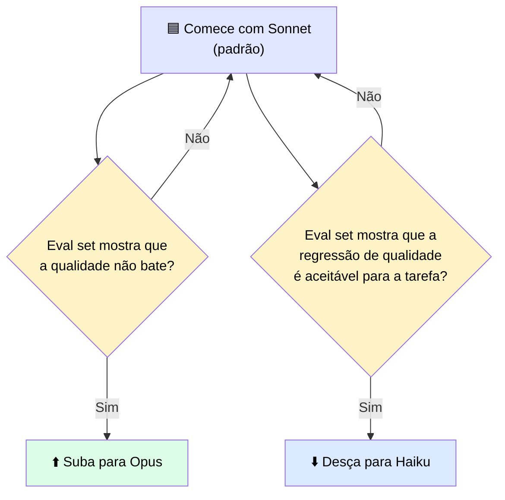
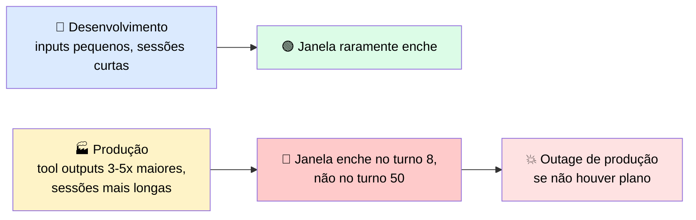
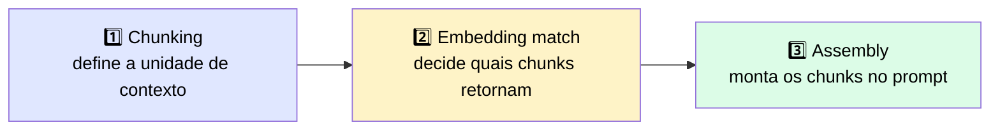
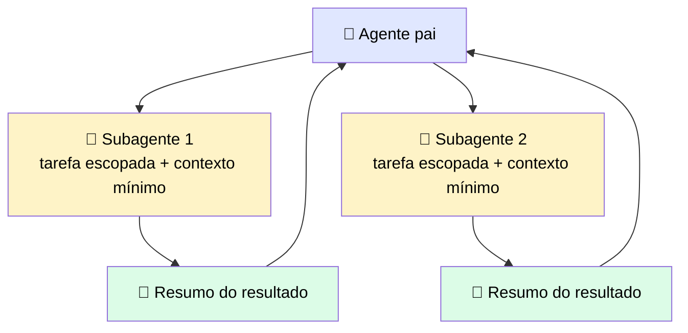

# 💰 Seleção de Modelo e Gestão de Orçamento em Sessões Multi-turno

> 🎯 **Ideia central:** a escolha do modelo define o piso de custo e velocidade de tudo que vem depois. E o *context window* (janela de contexto) **não é um recurso gratuito** — cada tool result que Claude devolve fica anexado à janela pelo resto da sessão. Decidir com antecedência o que entra, o que sai como resumo, e o que nunca entra, é o que se chama de **context engineering**.

---

## 🧭 1. Seleção de modelo: comece com Sonnet, avance com critério

A família Claude tem 4 níveis, cada um com um tradeoff diferente de custo, latência e capacidade:

| 🏷️ Modelo | 🎯 Perfil |
|---|---|
| ⚡ **Haiku** | Velocidade e custo-benefício, para tarefas dentro da sua capacidade |
| ⚖️ **Sonnet** | **Padrão balanceado** para a maioria das cargas de produção |
| 💪 **Opus** | Trabalho exigente acima do que o Sonnet dá conta |
| 🌟 **Fable** | Modelo mais capaz da Anthropic — raciocínio complexo, coding avançado, síntese de pesquisa, workflows agênticos sofisticados |

> ℹ️ Confirme o lineup atual e os identificadores de modelo em `platform.claude.com/docs` na hora de construir — essa informação muda com o tempo.

### 📏 Regra de decisão

> <mark>Mover de modelo deve sempre ser uma decisão medida (baseada em eval), nunca um chute — nem para cima (achismo de qualidade) nem para baixo (só para economizar).</mark>

---

## 🪟 2. O context window não é um recurso gratuito

Pense na janela de contexto como a **memória de trabalho** de Claude. Toda mensagem, todo tool result, todo documento injetado e toda resposta gerada ocupa espaço nela.

### ⚠️ O que acontece quando estoura

| Situação | O que a API faz |
|---|---|
| 🚫 Requisição **já maior** que a janela | Rejeitada com erro de validação **antes** de gerar qualquer coisa |
| 📏 Requisição cabe, mas a geração **atinge o teto no meio** | Retorna o que já foi gerado, com `stop_reason: model_context_window_exceeded` |

> <mark>Nenhum dos dois caminhos trunca silenciosamente o conteúdo mais antigo.</mark> Se você quer que a sessão continue além do limite, **sua aplicação** precisa gerenciar isso (aparar ou resumir histórico) antes da próxima requisição.

### 🕳️ A armadilha dev → produção

---

## 🧰 3. Quatro estratégias para manter o orçamento

> 💬 Cada token na janela custa dinheiro no input e adiciona latência na resposta — e uma sessão longa acumula os dois. As quatro estratégias abaixo servem a formatos diferentes de conversa.

| Estratégia | 🔧 O que faz | ⏰ Quando aplicar | 📉 O que você perde |
|---|---|---|---|
| ✂️ **Pruning** | Volta a uma mensagem anterior e continua dali, removendo tudo que veio depois | Depois que Claude entrou num caminho improdutivo ou acumulou debug irrelevante | O trabalho feito após o ponto de rewind — se aprendeu algo útil ali, tem que reaprender |
| 🗜️ **Compaction** (`/compact` no Claude Code; server-side no API, beta) | Resume o histórico numa versão condensada, mantendo o essencial. O resumo custa menos tokens que o original | Sessão se aproximando do teto, mas quer continuar na mesma feature com o conhecimento já acumulado | Detalhes podem se perder na sumarização — o que não está no resumo, não existe mais |
| 🧹 **Clearing** (`/clear` no Claude Code; nova sessão na API) | Começa uma conversa nova, contexto zerado | Próxima tarefa é completamente diferente — contexto anterior só atrapalharia | Todo o contexto da sessão — o que precisa persistir tem que ir para algum lugar externo (ex.: `CLAUDE.md`) |
| 🤖 **Subagent Handoffs** | Gera um subagente com janela isolada, só com a descrição da tarefa e o system prompt necessário. Devolve um resumo | Subtarefa autocontida, especialmente exploração onde o "caminho" polui o contexto principal mas a resposta é curta | Visibilidade de como o subagente chegou à conclusão — os passos intermediários são descartados |

---

## 🎚️ 4. Duas alavancas extras: prompt caching e token counting

As quatro estratégias acima controlam **o que entra** na janela. Estas duas reduzem **quanto você paga** pelo que já está lá.

### 💾 Prompt caching

Armazena o processamento feito num **prefixo estável** da requisição, para requisições seguintes reaproveitarem em vez de reprocessar.

| Passo | O que acontece |
|---|---|
| 1️⃣ Primeira requisição | Escreve o prefixo no cache |
| 2️⃣ Requisições seguintes | Se enviarem conteúdo idêntico até aquele ponto, pagam **uma fração** do custo original |

> 🎯 **Melhores candidatos:** system prompt longo, grande conjunto de definições de tools, documento de referência consultado repetidamente.

**Como habilitar:** marque um *cache breakpoint* com `cache_control: {type: "ephemeral"}` no último bloco que você quer em cache. Até **4 breakpoints** por requisição.

> <mark>Para sessões multi-turno com system prompt e schemas de tools estáveis, cachear esses prefixos uma vez e reutilizá-los é a redução de custo de maior alavancagem disponível.</mark>

### 🔢 Token counting

O endpoint `count_tokens` recebe o mesmo corpo de requisição de uma chamada `messages` e retorna a contagem de tokens **sem rodar inferência**.

| Uso | Quando |
|---|---|
| 🧪 Desenvolvimento | Verificar se as premissas de orçamento de contexto se sustentam contra tool outputs reais (não só fixtures de teste) |
| 🏭 Produção | Bloquear requisições que estourariam a janela **antes** de darem erro |

---

## 🔍 5. Os três pontos onde um caminho RAG pode quebrar

| Ponto | ⚠️ Risco | 💡 Mitigação |
|---|---|---|
| **1. Chunking** | Muito pequeno → falta contexto ao redor; muito grande → dilui o match com texto irrelevante | Chunking por sentença/seção com um pouco de overlap (evita que fatos na fronteira fiquem cortados) |
| **2. Embedding match** | Busca por similaridade semântica — pode não achar um identificador exato se algo "parecido" tiver rank maior | Rodar uma busca **lexical** em paralelo à semântica |
| **3. Assembly** | Se os chunks não chegam na estrutura que o prompt espera, o modelo responde **da memória**, não do texto recuperado | Garantir que a estrutura de entrega bate com o que o prompt espera |

### 🆚 Índice fixo (fetch-once) vs. busca iterativa (search-across-rounds)

| Abordagem | ✅ Vantagem | ⚠️ Custo |
|---|---|---|
| 📇 **Índice (fetch-once)** | Sistema inspecionável — dá pra ver quais chunks foram retornados e testar a recuperação isoladamente | Precisa construir, armazenar, manter sincronizado e proteger o índice |
| 🔄 **Busca iterativa (search-across-rounds)** | Sem infraestrutura de índice, sem staleness — lê os arquivos atuais na hora da query | Mais tokens e tempo por query, processo menos inspecionável |

> 📌 **Regra prática:** corpus estável + buscas simples → vale ter índice. Corpus mutável ou perguntas multi-etapa → busca iterativa costuma ser o sistema mais simples, mesmo custando mais por query.

> ⚠️ O ganho de performance de agentic search de agente único sobre um índice de recuperação é uma **figura fixada por versão** — confirme contra a camada de referência no momento de construir, em vez de confiar no número deste módulo.

---

## 🗜️ 6. Aplicando compaction: o que é preservado depende de como você escreve o summarizer

| Contexto | Quem decide o que entra no resumo |
|---|---|
| `/compact` no Claude Code | A própria ferramenta decide |
| Server-side compaction (API, beta) | A plataforma resume para você, quando configurado |
| Compaction manual na API | **Você** escreve o prompt do summarizer — e esse prompt define o que o agente vai "saber" nos próximos turnos |

**Comparação de prompts de summarizer:**

| ❌ Prompt fraco | ✅ Prompt forte |
|---|---|
| *"Resuma a conversa até agora"* | *"Resuma a conversa, preservando todos os caminhos de arquivo modificados, todas as decisões tomadas, e quaisquer erros encontrados e suas resoluções"* |

> <mark>Isso não é um caso extremo: perda de estado crítico para a tarefa por causa de um summarizer subespecificado é uma das causas mais comuns de falha em agentes multi-sessão.</mark>

---

## 🤖 7. Subagent handoffs: gerenciando tarefas de longo horizonte

Quando uma tarefa é grande demais para uma única janela de contexto, **aumentar a janela não é a solução** — a solução é **decompor** a tarefa e passar só o contexto relevante para cada subagente.

Cada subagente recebe:
- ✅ Tarefa escopada e o contexto mínimo necessário
- ✅ Resultados de passos anteriores diretamente relevantes
- ✅ As tools que precisa para completar a tarefa
- ✅ Condições claras de saída

> ⚠️ Assim como compaction e pruning, subagent handoffs **adicionam overhead de implementação** — use apenas onde o custo de contexto é uma restrição real. Um prompt simples de turno único ou um workflow curto não precisa disso.

---

## ⚖️ 8. Quando usar essas estratégias

| ✅ Funciona bem | 🔄 Considere outra abordagem |
|---|---|
| Sessões de agente multi-etapa que excedem o orçamento de tokens e precisam de decomposição — melhor projetado na fase de arquitetura do que remendado depois em produção | Pipelines que nunca chegam perto do limite da janela — **meça o uso real de tokens** contra o limite do modelo antes de adicionar overhead de gestão |

---

> 🔮 **Aviso do que vem a seguir:** as estratégias aqui assumem que você já sabe que o orçamento de contexto está sob pressão. O ponto crítico é que, muitas vezes, **você só descobre a pressão quando a sessão quebra** — um workload passa em todos os testes de desenvolvimento e falha em produção porque o tool output ficou maior e as sessões ficaram mais longas: a janela que aguentava 20 turnos limpos agora enche no turno 8.
