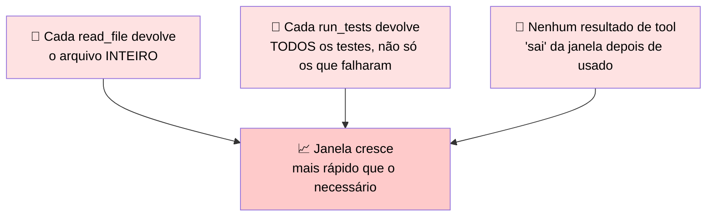
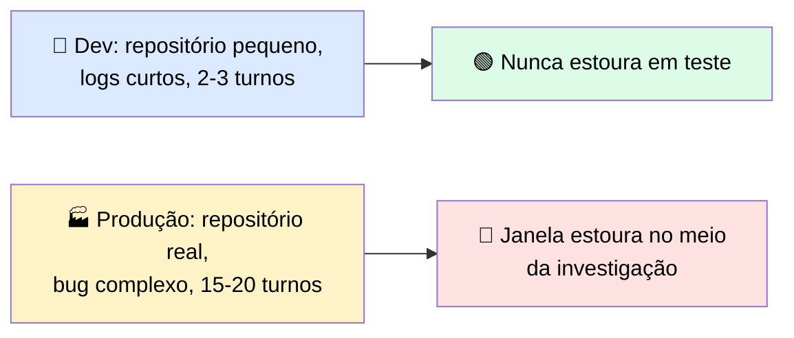

## 🧪 Exemplo prático: agente de suporte técnico que investiga bugs em um repositório

> 🎯 **Cenário:** um agente recebe um ticket como *"o endpoint de checkout está retornando 500 às vezes"* e precisa investigar sozinho, usando tools como `search_codebase`, `read_file`, `run_tests` e `query_logs`.

### 📊 Como a janela enche na prática

| Turno | Ação | 🔢 Tokens aproximados adicionados |
|---|---|---|
| 1️⃣ | Ticket original + system prompt + tool definitions | ~2.000 |
| 2️⃣ | `search_codebase("checkout")` → retorna 15 arquivos com trechos | ~3.000 |
| 3️⃣ | `read_file("checkout_service.py")` → arquivo inteiro, 800 linhas | ~6.000 |
| 4️⃣ | `read_file("payment_gateway.py")` → outro arquivo grande | ~5.500 |
| 5️⃣ | `query_logs(...)` → 200 linhas de log de erro em produção | ~4.000 |
| 6️⃣ | `run_tests(...)` → output completo da suíte, incluindo testes que passaram | ~7.000 |
| 7️⃣ | `read_file("checkout_service_test.py")` | ~4.500 |
| 8️⃣ | Mais uma busca + leitura de arquivo relacionado | ~5.000 |

> <mark>Total até o turno 8: ~37.000 tokens só de contexto acumulado</mark> — e o agente ainda não terminou de investigar.

### 🚩 Os três padrões de desperdício

> <mark>Tool outputs em produção costumam ser 3–5x maiores que nos fixtures de teste</mark> — um log de produção real é muito maior que o log sintético de 5 linhas usado para validar o agente em dev.

### 🕳️ Por que isso pega o time de surpresa

### 🛠️ Como resolver, aplicando as estratégias de context engineering

| Estratégia | 💡 Como se aplicaria aqui |
|---|---|
| ✂️ **Tool design melhor** (retornar só o high-signal) | `read_file` aceitar um range de linhas ou retornar só o trecho relevante, em vez do arquivo inteiro |
| 🗜️ **Compaction** | Depois de investigar um arquivo, resumir "o que foi aprendido" e descartar o conteúdo bruto |
| 🤖 **Subagent handoff** | Um subagente dedicado só para "vasculhar logs de produção", devolvendo um resumo de ~200 tokens em vez dos ~4.000 tokens brutos |
| 🔢 **Token counting** | Checar o orçamento antes de cada `read_file`, alertando/recusando antes de estourar |
