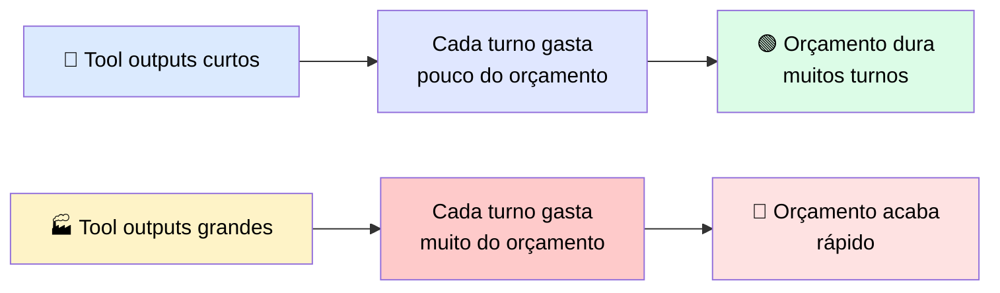
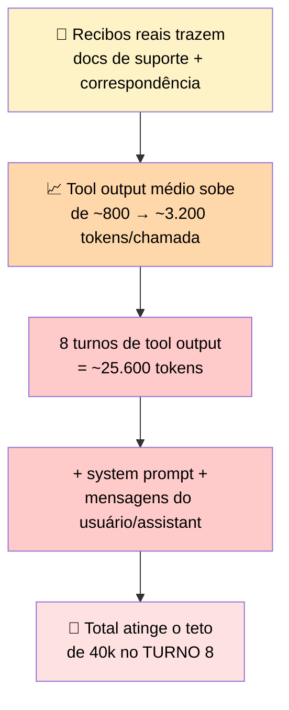

# 🔬 Post-mortem: a Sessão que Rodou Bem em Dev e Bateu no Teto em Produção

> 🎯 **Ideia central:** tool outputs consomem contexto do mesmo jeito que prompts e leituras de arquivo. A janela de contexto é um **orçamento fixo** que precisa segurar tudo que Claude vê num turno: system prompt, histórico da conversa, e cada chamada/resultado de tool acumulado até ali.

---

## 📉 A física do problema

> <mark>A janela não mudou de tamanho — o que mudou é quanto cada turno gasta dela.</mark>

> Uma sessão que roda 20 turnos limpo em desenvolvimento pode começar a falhar no turno 8 em produção — **exatamente por isso**.

---

## 🧾 Post-mortem: orçamento de contexto nunca medido contra tool outputs de produção

### 🎬 Setup

Um agente foi construído para processar recibos de venda sob um **orçamento de 40k tokens de contexto** — um teto de **custo** que o time impôs, não um limite imposto pelo modelo.

> ℹ️ Os modelos atuais da API Claude carregam pelo menos **200k tokens** de janela, e os modelos flagship mais recentes (incluindo Fable) servem **1M tokens** por padrão. Ou seja: o teto de 40k foi uma escolha deliberada de orçamento, não uma limitação técnica.

### 🧪 Em desenvolvimento

| Item | Valor |
|---|---|
| Fixture de teste | 20 recibos |
| Tool result médio | ~800 tokens |
| Sessão completa (20 turnos) | ~18.000 tokens |
| Resultado | ✅ Bem dentro do teto de 40k |

### 🏭 Em produção

Os recibos reais vinham com **documentação de suporte** — registros de transação e correspondência anexa.

### 🎭 O sintoma enganoso

> <mark>A falha parecia seleção de tool degradada — o agente começou a escolher as tools erradas e retornar análises incompletas.</mark> Mas a causa real era outra.

O system prompt e as instruções iniciais foram **expulsos da janela** pelos tool outputs acumulados que nunca foram removidos após o uso — o agente estava tomando decisões numa janela que **já não continha mais** a orientação com que tinha começado.

### 📊 Comparativo dev vs. produção

| | 🧪 Desenvolvimento | 🏭 Produção |
|---|---|---|
| Janela de contexto disponível | 200k padrão / 1M no Opus e Sonnet atuais | 200k padrão / 1M no Opus e Sonnet atuais |
| Teto de orçamento do time | 40k tokens | 40k tokens |
| Tool output médio | ~800 tokens/chamada | ~3.200 tokens/chamada |
| Turnos até a janela encher | Sessões completavam sem atingir o teto | Teto atingido no **turno 8** |
| Sintoma observado | Nenhum — sessões terminavam limpas | Seleção de tool errada + outputs incompletos a partir do turno 8 |
| Causa raiz identificada por | N/A | Auditoria de uso de tokens, **2 dias após o deploy** |
| Correção | N/A | Podar tool outputs após o uso + aplicar compaction proativamente antes do teto |

---

## 🚨 O que observar

| ⚠️ Alerta | 💡 O que fazer |
|---|---|
| Fixtures de teste são quase sempre **menores** que dados de produção | Medir o custo real em tokens de um tool result contra o **maior input que você conseguir encontrar** nos dados-alvo, antes do agente ir pra produção |
| Sintoma de context overflow **parece** falha de seleção de tool, porque o output visual é parecido | Se a seleção de tool degradar depois de um número fixo de turnos, **verifique primeiro se a janela está enchendo** antes de sair depurando o schema |

> <mark>Isso vale como regra geral: quase todo agente construído contra um conjunto de fixtures vai subestimar o custo real de tokens em produção.</mark> A auditoria que descobriu esse bug só aconteceu 2 dias **depois** do deploy — o ideal é medir isso **antes** de lançar, não depois que já quebrou.

---

## ✅ Checklist de prevenção

- [ ] Medi o tamanho real dos tool outputs contra os **maiores** dados de produção disponíveis, não só as fixtures de teste?
- [ ] Tenho um teto de orçamento de contexto explícito, e ele foi validado contra dados reais?
- [ ] Implementei alguma forma de podar (prune) ou compactar tool outputs **depois de usados**?
- [ ] Se notar seleção de tool degradando ao longo da sessão, minha primeira suspeita é a janela de contexto — **antes** de mexer no schema das tools?
