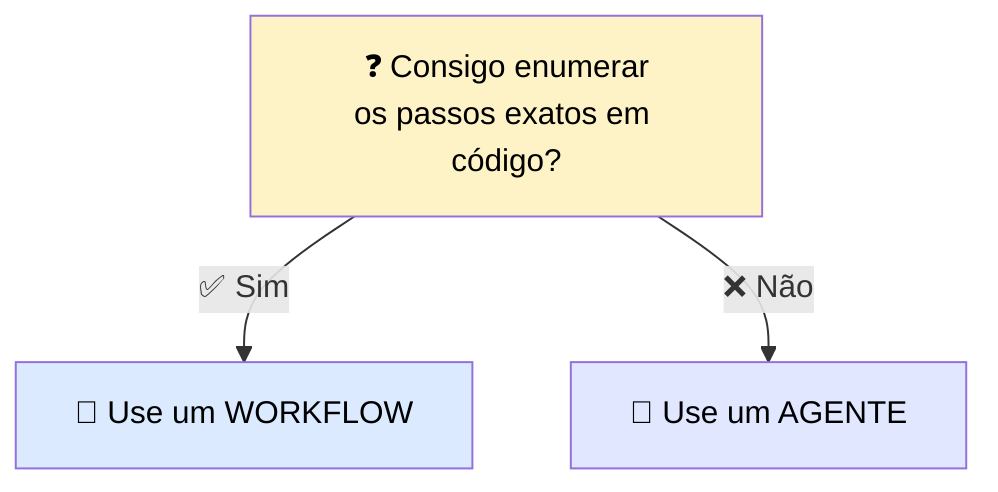
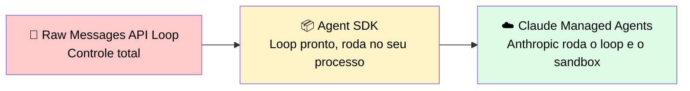
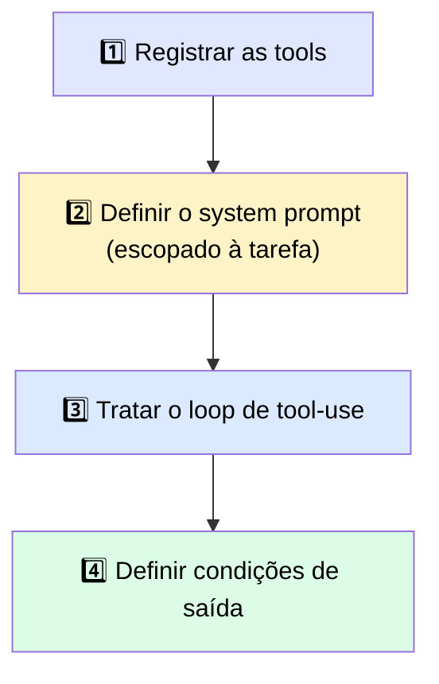
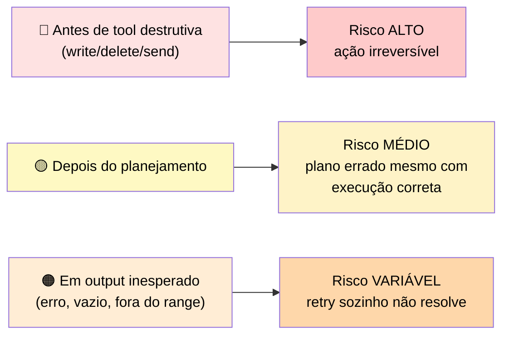
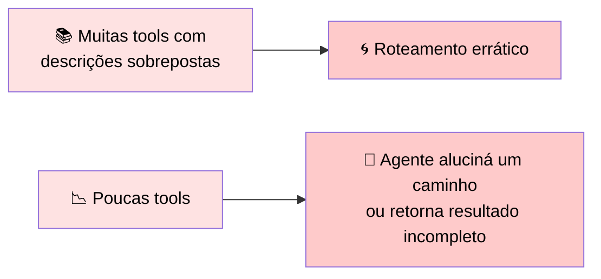
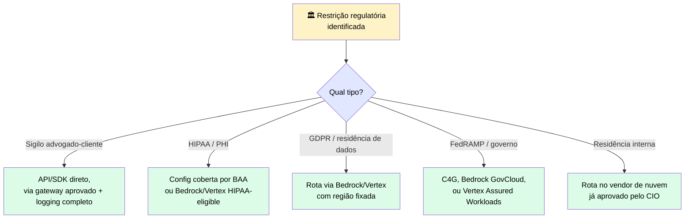

# 🤖 Construindo um Agente de Produção: Loop, Wiring Paths, Orquestração e Human-in-the-Loop

> 🎯 **Definição:** um agente é um **loop de tool-use multi-etapas**, com contexto gerenciado e um objetivo definido. Este guia conecta as peças (schemas de tools + gestão de contexto) num sistema funcionando, e adiciona a camada que nenhum dos dois tópicos cobre sozinho.

> ⚠️ Quando componentes rodam juntos ao longo de vários turnos, surgem **novos modos de falha** que testes isolados não capturam: decisões de roteamento que funcionavam em teste single-turn começam a se acumular, o contexto enche mais rápido que o esperado, um passo que depende de um resultado anterior recebe o input errado porque uma chamada de tool anterior foi mal estruturada.

> ❓ **A pergunta que deve preceder qualquer construção de agente:** *este problema realmente precisa de um agente?* Agentes carregam overhead de coordenação, custo de contexto expandido e mais superfície de falha do que padrões mais simples.

---

## 🧭 1. Workflow ou Agente? Decida antes da primeira linha de código

> <mark>O erro mais crítico no desenvolvimento de agentes é escolher o padrão errado logo no início.</mark> Usar um agente quando um workflow basta adiciona complexidade comportamental sem adicionar capacidade. Usar um workflow quando um agente é necessário produz um sistema que quebra sempre que o input do usuário foge do caminho predeterminado.

| ✅ Escolha um **workflow** quando... | 🤖 Escolha um **agente** quando... |
|---|---|
| Você consegue enumerar os passos exatos em código | Você consegue especificar o objetivo e as tools, mas não o caminho exato |
| O custo de erro é real e guardrails por etapa importam | O caminho pelo trabalho não pode ser enumerado com antecedência |
| Observabilidade com ferramentas padrão é necessária | Não-determinismo é aceitável e as ações possíveis são restritas pelo toolset registrado |
| Os inputs são bem restritos a um conjunto conhecido | Inputs do usuário variam de forma imprevisível em conteúdo e estrutura |
| Toda execução da tarefa segue a mesma sequência | A tarefa exige sequenciamento criativo das tools disponíveis |

> 📈 **Progressão recomendada:** comece com o padrão mais simples que resolve o problema — uma chamada de API única, depois um workflow, depois um agente. Suba de nível **só** quando o padrão mais simples não der conta da variabilidade exigida.

---

## 🛤️ 2. O agente é o padrão. O "wiring path" é a escolha de implementação

Uma vez decidido que a tarefa precisa de um agente, você também decidiu o **padrão**: um loop que chama tools, gerencia contexto e roda até o objetivo ser atingido. Esse padrão **não muda** conforme o caminho de implementação escolhido — o que muda é **quanto do loop você escreve** versus **quanto você delega**.

> 📊 Os três caminhos estão num **espectro de quanta infraestrutura você possui**. Escolha com base nas suas restrições de deployment e compliance — <mark>não caia na tentação de escolher o caminho só porque é mais rápido de prototipar.</mark>

### 🔧 Caminho 1 — Raw Messages API Loop

| Aspecto | Detalhe |
|---|---|
| 🔄 Quem roda o loop | **Seu código** — a cada iteração, você envia a requisição, lê os blocos `tool_use`, executa as tools e anexa os resultados |
| 📦 O que você possui | Loop completo, execução de tools, gestão de contexto, retries e condições de saída — **nada é fornecido** |
| ✅ Escolha quando | Precisa de controle total sobre cada passo, tem restrições que uma lib não acomoda, ou está aprendendo como o loop funciona antes de adicionar abstração |
| ⚠️ Checar antes | O custo de manutenção é **todo seu** — cada comportamento que um SDK daria de graça (gestão de contexto, tool calls paralelas) vira código que você escreve e testa |

### 📦 Caminho 2 — Agent SDK

| Aspecto | Detalhe |
|---|---|
| 🔄 Quem roda o loop | O **SDK**, dentro do seu próprio processo — ele itera e gerencia contexto; seu código ainda executa as tools chamadas pelo agente |
| 📦 O que você possui | Execução de tools + a aplicação ao redor. O SDK fornece a estrutura do loop, gestão de contexto e registro de tools |
| ✅ Escolha quando | Você quer o loop, a gestão de contexto e o scaffolding de tools que dão poder ao Claude Code, sem reconstruir tudo — e quer o agente rodando no seu ambiente, em Python ou TypeScript |
| ⚠️ Checar antes | Se recursos baseados em filesystem (como `CLAUDE.md` e skills) carregam ou não é controlado pela configuração `settingSources`. <mark>Nunca confie num default — sempre configure `settingSources` explicitamente</mark> (ex.: `["user", "project", "local"]` para imitar o Claude Code CLI, ou `[]` para rodar totalmente isolado). Confirme o comportamento padrão atual na referência do Agent SDK na hora de construir |

### ☁️ Caminho 3 — Claude Managed Agents (beta pública)

| Aspecto | Detalhe |
|---|---|
| 🔄 Quem roda o loop | **Anthropic** roda o loop e o sandbox. Sua aplicação envia eventos de usuário e recebe os resultados via server-sent events |
| 📦 O que você possui | A camada de aplicação e a **definição do agente** (modelo, system prompt, tools, servidores MCP, skills) — definida uma vez e referenciada por ID entre sessões |
| ✅ Escolha quando | A tarefa é longa (minutos a horas), você quer um sandbox gerenciado, ou você prefere não construir loop + sandbox + camada de execução de tools |
| ⚠️ Checar antes | Sessões são **stateful e armazenadas server-side** — <mark>não são elegíveis para Zero Data Retention ou um BAA de HIPAA</mark>. Também disponível no Claude Platform na AWS, com diferenças de recursos — verifique paridade de capacidade contra sua superfície de deployment. Requer o header beta `managed-agents-2026-04-01`; comportamentos podem mudar entre releases — construa com um plano de migração |

### 🔍 Managed Agents: o que você deixa de possuir, e o que passa a assumir

| Categoria | ❌ O que você deixa de possuir | ✅ O que você passa a assumir |
|---|---|---|
| ⚙️ Execução e infraestrutura | O loop de iteração, o sandbox de execução, os retries internos, o runtime de execução de tools | Uma definição de agente gerenciada como recurso de API versionado + uma camada de aplicação que envia eventos e consome resultados |
| ⏱️ Duração de sessão e estado | Gestão de execução longa — sessões podem rodar minutos ou horas sem seu processo segurar o loop aberto | Estado de sessão server-side. Sessões são armazenadas pela Anthropic, sujeitas às políticas de dados dela |
| 📦 Ciclo de vida do sandbox | Provisionamento e desligamento do sandbox para execução de tools | Dependência das tools disponíveis no sandbox gerenciado e no modelo de execução dele |

### 🚧 A restrição que decide para trabalho regulado

> <mark>Sessões de Managed Agents são armazenadas server-side, e por isso não são elegíveis para <abbr title="Zero Data Retention — modo de operação em que o provedor não guarda nenhuma cópia dos prompts/respostas após processar a requisição">Zero Data Retention</abbr> nem para um <abbr title="Business Associate Agreement — contrato exigido pela HIPAA para quem processa dados de saúde em nome de outra organização">BAA</abbr> de <abbr title="Health Insurance Portability and Accountability Act — lei americana de privacidade e segurança de dados de saúde">HIPAA</abbr>.</mark> Se sua carga envolve <abbr title="Protected Health Information — informações de saúde protegidas, como prontuários e diagnósticos">PHI</abbr> ou tem exigência de <abbr title="Zero Data Retention — modo de operação em que o provedor não guarda nenhuma cópia dos prompts/respostas após processar a requisição">ZDR</abbr>, esse caminho fica **descartado**, não importa o quão bem ele encaixe operacionalmente — você vai para o Agent SDK ou um raw loop numa configuração coberta. A restrição regulatória decide o caminho antes da conveniência ter voz.

> 🔄 **Progressão comum:** prototipar no Agent SDK localmente, depois migrar para Managed Agents em produção. A definição do agente é conceitualmente a mesma, mas o **formato muda** — espere um passo de "reexpressão", não uma exportação direta.

| ✅ Funciona bem | ⚠️ Adiciona custo/complexidade | 🔄 Considere outra abordagem |
|---|---|---|
| Agentes de longa duração, e cargas onde você prefere não construir/proteger um sandbox e loop sozinho | Sessões stateful server-side, formato de definição "agente como recurso", superfície beta que pode mudar entre releases | Para PHI, ZDR, ou quando precisa de controle total in-process — fique no Agent SDK ou num raw loop numa config coberta |

---

## 🔩 3. Conectando o loop: os quatro passos que valem para qualquer caminho

| Passo | O que fazer |
|---|---|
| 1️⃣ **Registrar tools** | Cada tool segue a mesma estrutura de schema. O SDK as registra contra o agente, para Claude saber o que está disponível |
| 2️⃣ **Definir o system prompt** | Escopar para a tarefa do agente. Um system prompt amplo produz roteamento de tool mais amplo e menos confiável. Nomear a tarefa específica e as tools disponíveis produz comportamento mais consistente |
| 3️⃣ **Tratar o loop de tool-use** | Seja você iterando ou o SDK fazendo isso, seu código lida com a execução. <mark>Toda chamada de tool que Claude emite precisa ser executada pelo seu código e retornada num bloco `tool_result`</mark> |
| 4️⃣ **Definir condições de saída** | O loop roda até receber uma condição de parada. Sem condições explícitas, <mark>o agente vai continuar pedindo tool calls além do que a tarefa exige</mark> |

### ✅ Checklist de wiring do loop (vale para qualquer caminho)

| # | Item | O que verificar |
|---|---|---|
| 1️⃣ | Tools registradas | Toda tool que o agente pode precisar está na lista de registro. Nenhuma tool não registrada é referenciada no system prompt |
| 2️⃣ | System prompt escopado | Nomeia a tarefa e as tools disponíveis. Não descreve tools que o agente não tem. Não omite tools que o agente tem e que exigem orientação de escopo |
| 3️⃣ | Loop de tool-use implementado | Seu código trata todo bloco `tool_use` emitido por Claude e retorna um `tool_result` para cada um **antes** do próximo turno do assistant. Todos os `tool_use` de um mesmo turno devem ser resolvidos juntos |
| 4️⃣ | Ponto de inserção de HITL definido | Ao menos um ponto do loop tem uma checagem humana |
| 5️⃣ | Condições de saída definidas | O loop tem um critério de parada claro que **não depende** de Claude se oferecer para parar |

---

## 🙋 4. Human-in-the-Loop (HITL): onde inserir e quando

> ❓ **A pergunta que determina onde inserir um checkpoint:** *qual é o pior resultado possível se este passo rodar sem checagem humana?*

| Ponto de inserção | O que dispara a checagem | Nível de risco |
|---|---|---|
| 🔴 **Antes de uma tool destrutiva** | O agente está prestes a executar write, delete ou send | **Alto** — ações irreversíveis onde uma chamada errada não pode ser desfeita |
| 🟡 **Depois de um passo de planejamento** | O agente gerou um plano e está prestes a começar a executá-lo | **Médio** — planos incorretos que produziriam o resultado errado mesmo com todos os passos executando corretamente |
| 🟠 **Em output inesperado** | O tool result tem flag de erro, resultado vazio, ou valor fora dos limites esperados | **Variável** — captura modos de falha que a lógica de retry sozinha não resolve |

---

## ⚖️ 5. Orquestração de tools: over-tooling e under-tooling

> 💬 O comportamento de roteamento do agente é moldado por duas coisas: **como as tools são descritas** e **quantas tools estão registradas**.

> <mark>Over-tooling é o problema mais comum em agentes de produção.</mark> Times registram toda tool que "pode precisar" e descobrem que a qualidade de seleção do Claude degrada conforme a superfície de tools cresce.

✅ **Regra prática:** comece com o conjunto mínimo necessário para a tarefa, e adicione tools só quando uma lacuna específica de capacidade for confirmada.

| Quando agentes são a escolha certa | O que você assume ao usar um Agente | Quando escolher um workflow em vez disso |
|---|---|---|
| Tarefas orientadas a objetivo onde o caminho exato não pode ser enumerado com antecedência. Lidar com inputs variáveis que exigiriam dezenas de branches condicionais num workflow | Agentes adicionam complexidade comportamental: o caminho pela tarefa emerge do raciocínio do modelo sobre o contexto acumulado, não de lógica de branching explícita. Observabilidade exige ferramental de nível transcript, não logging operacional padrão | Quando você consegue enumerar os passos em código, use um workflow. Agentes são o último passo da progressão — suba de nível só quando o padrão mais simples não der conta |

---

## 🏛️ 6. Restrições regulatórias definem sua rota de entrega antes do wiring

> ⚠️ Se seus dados precisam ser tratados sob restrições específicas (sigilo advogado-cliente, <abbr title="Health Insurance Portability and Accountability Act — lei americana de privacidade e segurança de dados de saúde">HIPAA</abbr>, <abbr title="General Data Protection Regulation — regulamento europeu de proteção de dados pessoais">GDPR</abbr>, <abbr title="Federal Risk and Authorization Management Program — programa de certificação de segurança em nuvem do governo dos EUA">FedRAMP</abbr>, ou política interna de residência de dados), <mark>essa restrição decide qual endpoint seu código chama, quais credenciais ele carrega e onde seus logs vão parar — antes de qualquer decisão de design sobre prompts, tools ou memória.</mark>

| Restrição | 🚫 O que costuma ficar de fora | ✅ O que costuma sobreviver a uma revisão de código |
|---|---|---|
| ⚖️ **Sigilo advogado-cliente** | Chamadas de uma superfície consumer-grade do Claude.ai que a firma não consegue auditar ponta a ponta | Chamadas de API/SDK diretas dentro da aplicação da firma, autenticadas via SSO, roteadas por um gateway de LLM aprovado com logging completo de request/response |
| 🏥 **<abbr title="Health Insurance Portability and Accountability Act — lei americana de privacidade e segurança de dados de saúde">HIPAA</abbr> (dados de saúde/<abbr title="Protected Health Information — informações de saúde protegidas, como prontuários e diagnósticos">PHI</abbr>)** | Código que envia <abbr title="Protected Health Information — informações de saúde protegidas, como prontuários e diagnósticos">PHI</abbr> a qualquer endpoint/rota não coberto por um <abbr title="Business Associate Agreement — contrato exigido pela HIPAA para quem processa dados de saúde em nome de outra organização">BAA</abbr> para a configuração específica em uso | Chamadas de API/SDK diretas numa configuração coberta por <abbr title="Business Associate Agreement — contrato exigido pela HIPAA para quem processa dados de saúde em nome de outra organização">BAA</abbr> (organização HIPAA-enabled dedicada), ou rota via AWS Bedrock/GCP Vertex numa conta cloud já HIPAA-eligible. ⚠️ O <abbr title="Business Associate Agreement — contrato exigido pela HIPAA para quem processa dados de saúde em nome de outra organização">BAA</abbr> **não cobre** Console, Workbench, betas ou planos consumer |
| 🇪🇺 **<abbr title="General Data Protection Regulation — regulamento europeu de proteção de dados pessoais">GDPR</abbr> e residência de dados** | Rotas onde a região de execução do modelo não pode ser fixada em código, ou onde a requisição pode ser servida fora da fronteira geográfica aprovada | Rota via Bedrock ou Vertex, com a região fixada na configuração do cliente. A API direta da Anthropic **não** oferece residência de dados na UE atualmente |
| 🏛️ **<abbr title="Federal Risk and Authorization Management Program — programa de certificação de segurança em nuvem do governo dos EUA">FedRAMP</abbr> e governo** | Qualquer caminho de código que chame um endpoint fora de um ambiente cloud autorizado no nível de impacto exigido | Três rotas autorizadas: Claude for Government (C4G, FedRAMP High via PFCS-SS), Claude via Amazon Bedrock GovCloud (FedRAMP High, DoD IL4/5), Claude via Vertex AI Assured Workloads. Claude Enterprise na AWS Marketplace **não** é <abbr title="Federal Risk and Authorization Management Program — programa de certificação de segurança em nuvem do governo dos EUA">FedRAMP</abbr> autorizado |
| 🏢 **Política interna de residência de dados** | Chamadas de qualquer cliente SDK configurado contra um vendor de nuvem fora da lista aprovada pela empresa | A rota de entrega no vendor de nuvem já aprovado — construa contra essa opção, sem trocar no meio do projeto |

> ℹ️ <abbr title="Service Organization Control 2 — auditoria de segurança e controles operacionais de um provedor de serviços">SOC 2</abbr> não entra nessa tabela — ele governa **como** seus sistemas são construídos e operados, não **qual endpoint** seu código chama.

---

> 🔮 **Próximo passo:** o Módulo 4 (Engenharia de Produção, Evals & Segurança) aprofunda em padrões secure-by-design para IAM e privacidade, defesas contra prompt injection de inputs não confiáveis, guardrails de runtime e hardening de agentes. O papel desta seção foi mais estreito: trazer a restrição à tona no ponto da construção onde ela realmente elimina opções — a escolha do endpoint, da configuração do cliente SDK, e das credenciais que seu agente carrega para produção.
