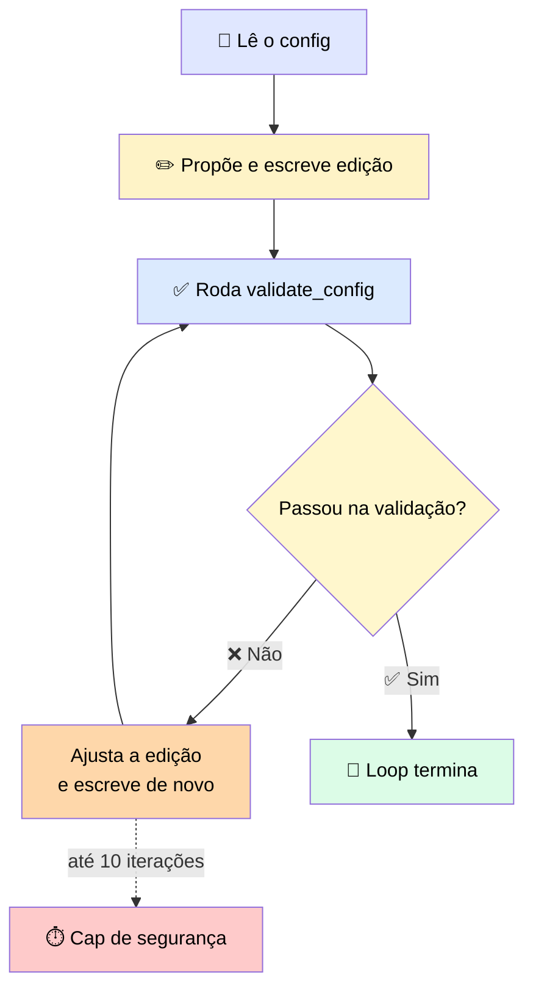
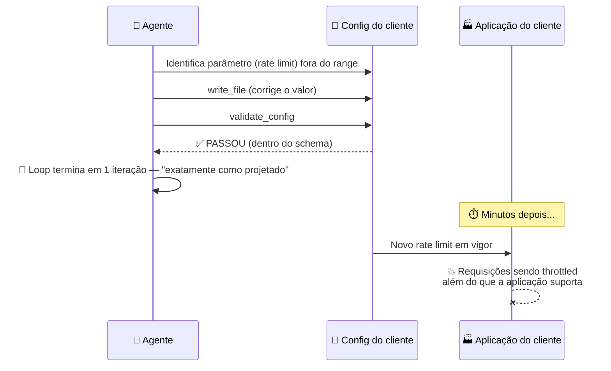
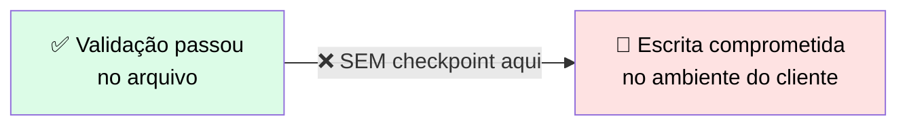

# 🔬 Post-mortem: o Agente que Editou um Arquivo de Produção

> 🎯 **Ideia central:** o agente funciona de ponta a ponta em testes porque o ambiente de teste é tolerante — a produção não é. O agente tinha as **mesmas tools**, o **mesmo loop**, o **mesmo system prompt**, mas o checkpoint de HITL estava faltando porque os testes nunca expuseram um caso de uso onde ele fosse necessário.

---

## 🎬 Setup: um agente de edição de arquivos, testado num diretório de rascunho, implantado num ambiente de cliente

Um desenvolvedor construiu um agente capaz de **ler, modificar e escrever** arquivos de configuração, com três tools:

| Tool | Papel |
|---|---|
| 📖 `read_file` | Lê o arquivo de configuração |
| ✏️ `write_file` | Escreve a alteração proposta |
| ✅ `validate_config` | Valida se o config resultante está dentro do schema |

### 🔄 O loop do agente

Testado num **diretório de rascunho**, com uma cópia do config-alvo, o agente funcionou corretamente em **todo** caso de teste — convergindo para um config válido em 2 ou 3 iterações, tipicamente.

---

## 💥 O que aconteceu em produção

O agente identificou corretamente que um parâmetro de configuração — um **rate limit** do qual a aplicação do cliente dependia — estava fora do range. Propôs uma correção, chamou `write_file`, rodou `validate_config` de novo, e recebeu um "passou". <mark>O loop terminou de forma limpa numa única iteração, exatamente como projetado.</mark> O cap de 10 iterações nunca foi atingido, porque nunca foi necessário.

> ⚠️ **O design do loop estava correto. O problema era a condição de saída.**

### 🕳️ A lacuna exata

| O que `validate_config` checava | O que `validate_config` **não** checava |
|---|---|
| ✅ O valor está dentro do range permitido pelo schema | ❌ Se sistemas downstream dependiam do valor antigo |

<mark>O agente fez exatamente o que o desenvolvedor pediu: editou, validou, e saiu quando a validação passou.</mark> A falha não estava no loop — estava no fato de que a **condição de saída** (`validate_config` retorna "passou") era escopada apenas ao arquivo sendo editado, e **não havia checkpoint** entre "a validação passou neste arquivo" e "a escrita foi comprometida no ambiente do cliente".

> 🎯 **A peça que faltava:** um checkpoint no design do loop — antes da **primeira** chamada de `write_file` atingir o config ao vivo do cliente, pausar e apresentar a mudança proposta para revisão humana. Na prática, isso significa que o loop precisa de um branch explícito entre **"mudança proposta pronta"** e **"escrita comprometida"** — um estado que o desenvolvedor nunca adicionou porque os testes nunca produziram um caso que o exigisse.

---

## 🚨 O que observar

> 💬 O padrão que esse incidente ilustra é uma **pergunta de permissões que nunca foi feita durante o design.** O agente tinha acesso de escrita porque a tarefa envolvia edição de arquivos, e a tarefa em si era legítima. <mark>O que a equipe perdeu de vista foi a lacuna entre um agente que propõe uma mudança e um que a comete.</mark>

Num ambiente de teste descartável, essa lacuna **nunca aparece**, porque nada que uma "escrita errada" toca importa em teste — a produção é diferente.

### ❓ A pergunta de design que nunca foi feita

> **"Qual é o pior resultado possível se `write_file` rodar sem checagem humana?"**

A resposta a essa pergunta determina se um checkpoint de human-in-the-loop é necessário **antes** da tool poder executar.

---

## ✅ Regra de ouro

> <mark>Se uma tool pode tomar uma ação irreversível em produção, ela precisa de um checkpoint antes de rodar.</mark> Registre essa restrição durante o **design** — quando você está escopando a superfície de tools — não depois do primeiro incidente acontecer.

### 📋 Checklist de prevenção

- [ ] Para cada tool com poder de escrita/exclusão/envio, já perguntei: *"qual o pior resultado possível se ela rodar sem checagem humana?"*
- [ ] A condição de saída do meu loop está escopada corretamente — ela valida só o arquivo/artefato, ou também considera o impacto de **comprometer** a mudança no ambiente real?
- [ ] Existe um branch explícito entre "mudança proposta" e "mudança comprometida" para toda tool destrutiva?
- [ ] Meu ambiente de teste consegue expor cenários onde uma escrita "correta" ainda causa dano — ou ele é forgiving demais para revelar esse tipo de falha?
