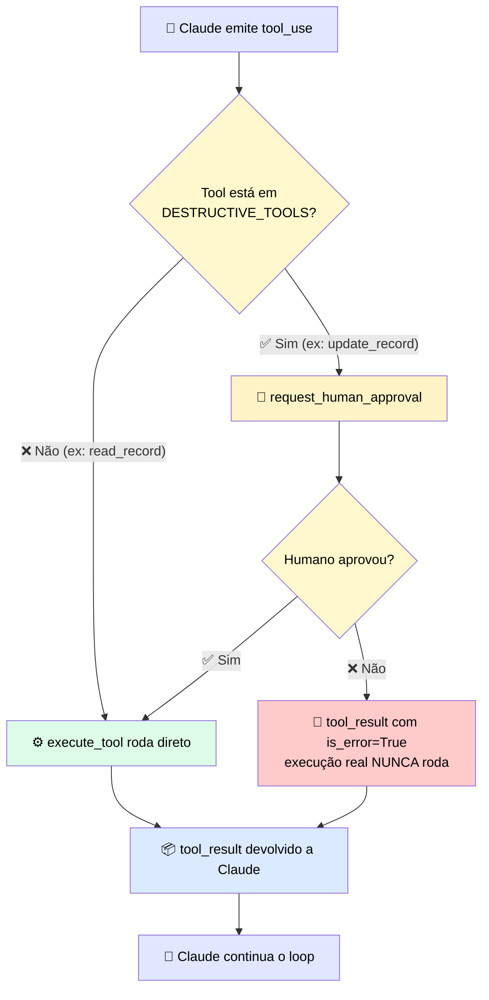

# 🧪 Checkpoint · Preenchendo os Gaps de um Agente Parcial

> 🎯 **Desafio:** a implementação abaixo tem duas lacunas. **Gap 1:** a descrição da tool `update_record`. **Gap 2:** o código do checkpoint de HITL antes de executar `update_record`.

---

## 🕳️ Gap 1 — Descrição da tool `update_record`

> <mark>Uma descrição fraca ("use isto para atualizar um registro") não dá a Claude nenhum critério de quando usar/não usar. A boa descrição precisa dizer o que a tool faz, quando usar, e — crucialmente — sinalizar que é uma ação com peso (dado que ela **modifica** dados de cliente).</mark>

```python
"description": (
    "Use this to update a single field on an existing customer record, "
    "identified by customer_id. This performs a write operation that "
    "overwrites the current value of the specified field — it is not "
    "reversible through this tool. Only use this after confirming with "
    "read_record that the customer_id exists and the field name is valid. "
    "Do not use this to create a new record or to read data; use "
    "read_record for lookups."
),
```

| Elemento da descrição | Por quê |
|---|---|
| 📝 O que faz | "Atualiza um único campo de um registro existente" — específico, não genérico |
| ⚠️ Natureza da ação | Sinaliza explicitamente que é uma **escrita irreversível por essa tool** — importante para o Claude entender o peso da chamada |
| ✅ Quando usar | Só depois de confirmar `customer_id` e `field` via `read_record` |
| 🚫 Quando não usar | Não usar para criar registro novo, nem para leitura — evita sobreposição com `read_record` |

---

## 🕳️ Gap 2 — Checkpoint de HITL

> <mark>`update_record` é uma tool destrutiva — ela escreve. Segundo a regra de ouro do design de HITL: se uma tool pode tomar uma ação irreversível, ela precisa de um checkpoint antes de rodar.</mark> O checkpoint intercepta a chamada **antes** de `execute_tool`, e só deixa passar se for aprovada.

```python
DESTRUCTIVE_TOOLS = {"update_record"}

for block in response.content:
    if block.type == "tool_use":

        # --- Checkpoint de HITL ---
        if block.name in DESTRUCTIVE_TOOLS:
            approved = request_human_approval(block.name, block.input)
            if not approved:
                result = {
                    "error": "Action rejected by human reviewer.",
                    "is_error": True
                }
                tool_results.append({
                    "type": "tool_result",
                    "tool_use_id": block.id,
                    "content": str(result),
                    "is_error": True
                })
                continue  # pula a execução real, vai para o próximo bloco
        # --- Fim do checkpoint ---

        result = execute_tool(block.name, block.input)
        tool_results.append({
            "type": "tool_result",
            "tool_use_id": block.id,
            "content": result
        })


def request_human_approval(tool_name: str, tool_input: dict) -> bool:
    print(f"\n⚠️  Claude quer executar: {tool_name}")
    print(f"    Argumentos: {tool_input}")
    resposta = input("Aprovar essa ação? (s/n): ")
    return resposta.strip().lower() == "s"
```

### 🔍 Por que o checkpoint é estruturado assim

| Elemento do código | Por quê |
|---|---|
| `DESTRUCTIVE_TOOLS = {"update_record"}` | Define explicitamente **quais** tools exigem checagem — `read_record` fica de fora, pois é só leitura |
| Checkpoint roda **antes** de `execute_tool` | O ponto de interceptação precisa ficar antes da execução real, nunca depois |
| Rejeição gera um `tool_result` com `is_error: True` | Claude **precisa** receber uma resposta para o `tool_use` — sem isso, a API rejeita a próxima requisição por falta de pareamento `tool_use` ↔ `tool_result` |
| `continue` pula a execução real | Garante que, se rejeitado, `execute_tool` nunca é chamado |
| Aprovação síncrona (`input()`) | Versão simples para exemplo/teste — em produção, isso normalmente vira uma fila assíncrona (ex.: aprovação via Slack/painel) que retoma a sessão depois |

---

## 🧩 3. Implementação completa (os dois gaps preenchidos)

```python
tools = [
    {
        "name": "read_record",
        "description": "Use this to read a customer record by customer_id.",
        "input_schema": {
            "type": "object",
            "properties": {
                "customer_id": {"type": "string"}
            },
            "required": ["customer_id"]
        }
    },
    {
        "name": "update_record",
        "description": (
            "Use this to update a single field on an existing customer record, "
            "identified by customer_id. This performs a write operation that "
            "overwrites the current value of the specified field — it is not "
            "reversible through this tool. Only use this after confirming with "
            "read_record that the customer_id exists and the field name is valid. "
            "Do not use this to create a new record or to read data; use "
            "read_record for lookups."
        ),
        "input_schema": {
            "type": "object",
            "properties": {
                "customer_id": {"type": "string"},
                "field": {"type": "string"},
                "new_value": {"type": "string"}
            },
            "required": ["customer_id", "field", "new_value"]
        }
    }
]

DESTRUCTIVE_TOOLS = {"update_record"}


def run_agent_loop(user_request):
    messages = [{"role": "user", "content": user_request}]

    while True:
        response = client.messages.create(
            model=model, max_tokens=4096,
            tools=tools,
            messages=messages
        )

        if response.stop_reason == "end_turn":
            return response

        if response.stop_reason == "tool_use":
            messages.append({"role": "assistant", "content": response.content})

            tool_results = []
            for block in response.content:
                if block.type == "tool_use":

                    if block.name in DESTRUCTIVE_TOOLS:
                        approved = request_human_approval(block.name, block.input)
                        if not approved:
                            result = {
                                "error": "Action rejected by human reviewer.",
                                "is_error": True
                            }
                            tool_results.append({
                                "type": "tool_result",
                                "tool_use_id": block.id,
                                "content": str(result),
                                "is_error": True
                            })
                            continue

                    result = execute_tool(block.name, block.input)
                    tool_results.append({
                        "type": "tool_result",
                        "tool_use_id": block.id,
                        "content": result
                    })

            messages.append({"role": "user", "content": tool_results})


def request_human_approval(tool_name: str, tool_input: dict) -> bool:
    print(f"\n⚠️  Claude quer executar: {tool_name}")
    print(f"    Argumentos: {tool_input}")
    resposta = input("Aprovar essa ação? (s/n): ")
    return resposta.strip().lower() == "s"
```

---

## 🗺️ 4. Diagrama do fluxo com o checkpoint



---

## ✅ Checklist de validação dos dois gaps

- [ ] A descrição de `update_record` diz **quando usar** e **quando não usar**?
- [ ] A descrição sinaliza que é uma ação de **escrita**, distinguindo-a de `read_record`?
- [ ] O checkpoint de HITL intercepta **antes** de `execute_tool`?
- [ ] Uma rejeição ainda gera um `tool_result` válido (com `tool_use_id` correspondente), em vez de deixar o `tool_use` sem resposta?
- [ ] `read_record` (não-destrutiva) segue fluindo sem passar pelo checkpoint?
