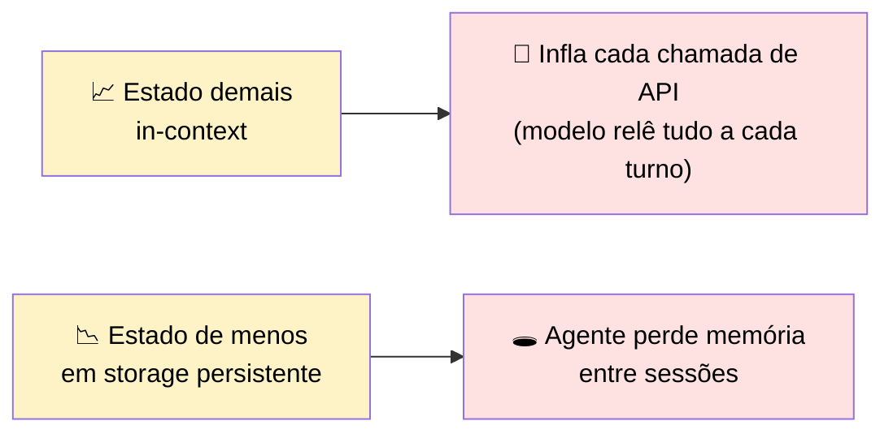
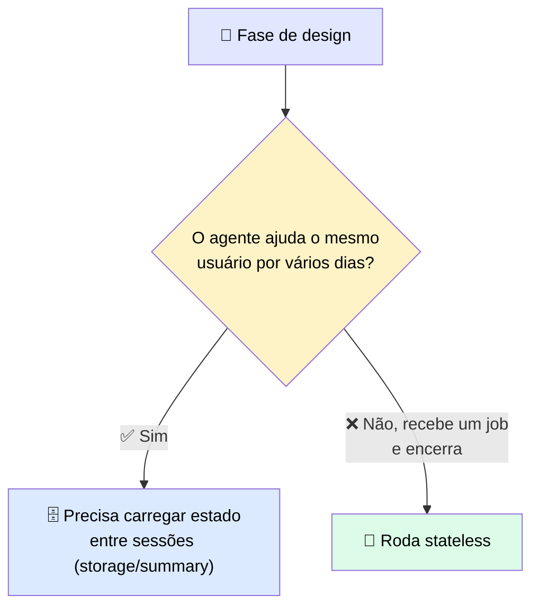
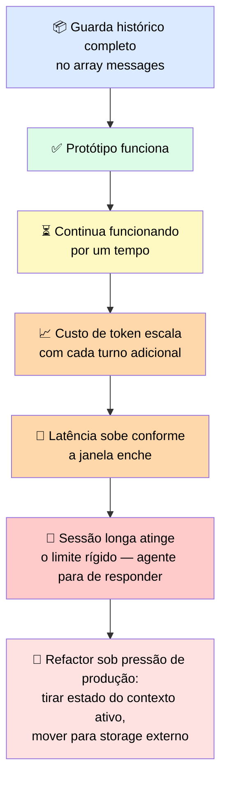
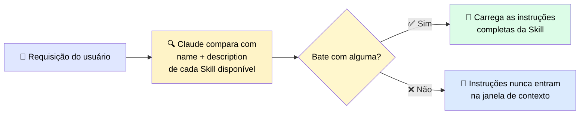
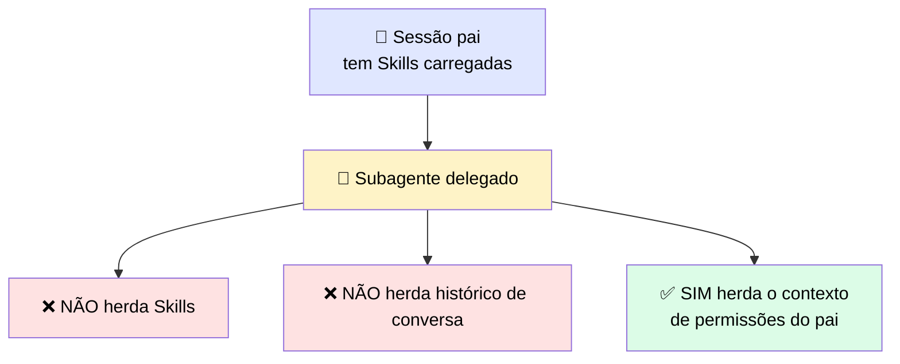

# 🧠 Escolhendo o Escopo Certo para Estado que Sobrevive entre Sessões

> 🎯 **Ideia central:** o agente da seção anterior roda corretamente **dentro** de uma sessão. O que ele não consegue fazer é lembrar de nada quando a sessão termina. **Memory scope** (escopo de memória) é como você decide o que o agente deve saber no início da próxima sessão — e quanto custa carregar esse conhecimento adiante.

---

## 🧩 1. Padrões de design de agentes já vistos neste módulo

| Padrão | O que faz |
|---|---|
| 🔁 **Tool-use loop** | O modelo chama uma tool, lê o resultado, e continua |
| 🪜 **Decomposição multi-etapa** | Quebra um objetivo em subtarefas ordenadas |
| 🗺️ **Planning-and-execution** | Separa **decidir** o plano de **executá-lo** — o mesmo split que o checkpoint de HITL pós-planejamento protege |
| 🧠 **Memory scope** | Decide **qual estado sobrevive** depois que o loop termina |

---

## ⚖️ 2. Os dois modos de falha — e eles puxam em direções opostas

> <mark>Escolher o escopo errado tem dois modos de falha, e eles puxam em direções opostas:</mark> estado demais no contexto ativo infla o custo de token conforme a conversa cresce; estado de menos em storage persistente apaga tudo que não foi escrito assim que a conversa termina.

---

## 📋 3. As quatro abordagens de memória

| Escopo | 💾 O que persiste | 💰 Custo | ✅ Quando usar | ❌ O que você perde |
|---|---|---|---|---|
| 💬 **In-context memory** | Estado vive na conversa ativa, sobrevive entre turnos dentro de **uma** sessão | Zero overhead de retrieval; infla custo de token conforme a conversa cresce | Sessões curtas onde todo o estado necessário cabe na janela e nada precisa sobreviver a um restart | **Tudo**, assim que a sessão termina. Um `/clear` ou nova sessão apaga o estado |
| 🗄️ **External storage** | Estado é escrito num banco de dados e lido de volta no início da sessão ou sob demanda | Cada chamada ao banco adiciona latência de retrieval; você assume o trabalho de engenharia de leitura/escrita | Estado que precisa sobreviver entre sessões, migrar entre usuários, ou ser compartilhado entre múltiplas instâncias de agente | Nada do lado da persistência — o custo aparece como latência em cada chamada e complexidade de implementação contínua |
| 📝 **Summarized memory** | Uma versão condensada da conversa anterior é gerada e injetada no início da próxima sessão | Custo de token por sessão menor que reproduzir o histórico completo, mas a sumarização descarta detalhe | Agentes conversacionais de longa duração, onde o histórico completo ultrapassaria o orçamento de contexto antes da conversa acabar | Qualquer detalhe que o summarizer não preservou — o agente só vê o que o prompt de sumarização escolheu manter |
| 🚫 **No persistent memory (stateless)** | Nada. Cada sessão é independente | Nenhum overhead — não há nada para recuperar ou armazenar | Agentes de execução de tarefa que terminam e encerram, ou pipelines onde cada sessão é totalmente independente por design | Todo o contexto anterior — se um follow-up depende de algo de uma sessão anterior, o agente não tem como alcançar |

---

## 🏗️ 4. Escolha o escopo de memória na fase de design — não no refactor de produção

### 🕳️ O caminho padrão que parece razoável no início

> <mark>O refactor em si é mecânico — algumas centenas de linhas de código e um banco de dados que o time já tem. O que ele custa é o timing.</mark> O trabalho acontece sob pressão de produção, geralmente com um prazo já em andamento, e cada hora gasta reestruturando memória é uma hora não gasta no que o agente deveria estar fazendo. Decidir na fase de design é barato; decidir na hora do refactor é caro.

| ✅ Funciona bem | ⚠️ Adiciona custo/complexidade | 🔄 Considere outra abordagem |
|---|---|---|
| O escopo de memória bate com a tarefa desde o design: external storage para threads entre sessões, stateless para jobs autocontidos, in-context para sessões curtas que não precisam sobreviver a um restart | External storage adiciona latência de retrieval + lógica de leitura/escrita. Summarized memory depende de um prompt de summarizer bem especificado — sem isso, estado crítico é descartado a cada compressão | Manter todo o estado in-context assumindo que a janela "vai ser grande o suficiente" — meça o uso real de tokens contra o limite antes de se comprometer |

---

## 🛠️ 5. Skills: instruções reutilizáveis que carregam sob demanda

> 💬 Há um problema relacionado, mas distinto, ao escopo de memória: como carregar **instruções repetíveis** entre tarefas sem pagar para injetá-las em toda sessão. O padrão para isso é uma **Skill** — um arquivo markdown reutilizável que ensina Claude a lidar com um tipo específico de tarefa, uma vez. Claude carrega a Skill automaticamente quando a requisição bate com a descrição dela.

Uma Skill vive num arquivo `SKILL.md`, com duas partes:

| Parte | Papel |
|---|---|
| 📋 **Frontmatter** | `name` + `description` — o **critério de correspondência** |
| 📖 **Instruções** | O conteúdo completo, carregado **só** quando há match |

> ⚠️ **Comportamento do `CLAUDE.md` varia por ambiente:** na Claude Code CLI, um `CLAUDE.md` carrega em **toda** sessão, não importa a tarefa. No Agent SDK, se ele carrega ou não é controlado pela configuração `settingSources` — <mark>não confie num default, configure explicitamente</mark> e confirme o comportamento atual na referência do Agent SDK na hora de construir.
>
> Uma **Skill**, em contraste, carrega só quando a tarefa exige — nos **dois** ambientes.

---

## 🆚 6. Skills vs. CLAUDE.md vs. instruções in-context

| Padrão | ⏰ Quando carrega | 💰 Custo de contexto | 🎯 Melhor para |
|---|---|---|---|
| 🛠️ **Skill (`SKILL.md`)** | Sob demanda, quando a requisição bate com a descrição da skill | Baixo — só `name` + `description` carregam no início; conteúdo completo só no match | Expertise específica de tarefa que não deveria inflar sessões onde não é necessária: formatos de output de domínio específico, checklists de revisão especializados, workflows aplicáveis a um subconjunto de tarefas |
| 📄 **CLAUDE.md** | Toda sessão, incondicionalmente | Overhead fixo por sessão, independente da tarefa | Padrões de projeto sempre ativos, aplicáveis a tudo: convenções de código padronizadas pelo time, regras de formato de output exigidas pelo projeto, restrições que valem em todas as tarefas do codebase |
| 💬 **In-context instructions** | Presentes em cada turno, dentro daquela sessão | Cresce com o comprimento da sessão; não sobrevive ao fim dela | Sessões curtas onde o histórico completo cabe na janela e nada precisa persistir: trabalho exploratório pontual, tarefas escopadas a uma única conversa |

---

## 🔌 7. Disponibilidade atual: Skills na Messages API

> ⚠️ Skills estão disponíveis na Messages API hoje, mas a integração está em **beta**, e a configuração é diferente dos caminhos do Claude Code ou Agent SDK.

**Dois headers beta obrigatórios na requisição:**
- `code-execution-2025-08-25`
- `skills-2025-10-02`

> ℹ️ Skills invocadas dessa forma rodam **dentro do container de execução de código**, não no ambiente da aplicação que está chamando — o que tem implicações sobre quais tools e acesso a filesystem a Skill pode usar.

> 🔄 Headers beta são versionados e mudam conforme os recursos avançam para disponibilidade geral. Antes de construir contra essa configuração em produção, confira a documentação atual da API da Anthropic para confirmar os valores dos headers, se o recurso já atingiu GA, e se o container de execução de código ainda é o caminho de runtime.

### 🚧 Restrição importante: subagents não herdam Skills automaticamente

> <mark>Quando você delega uma tarefa a um subagente, ele começa com contexto limpo. Skills e histórico de conversa não são herdados — mas o escopo de permissões, sim, não é resetado na delegação.</mark> Se o subagente precisa de uma Skill, você deve **listá-la explicitamente** na configuração dele. Isso importa na fase de design do agente: se você está conectando um subagente a uma tarefa que depende de instruções específicas, essas instruções precisam ser registradas contra o subagente — não presumidas como herdadas do pai.

---

## ✅ Checklist de decisão

- [ ] O agente precisa lembrar de algo entre sessões, ou cada job é autocontido?
- [ ] Se precisa lembrar: o volume de estado justifica storage externo, ou um resumo condensado basta?
- [ ] O prompt do summarizer (se usado) preserva explicitamente o que é crítico para a tarefa?
- [ ] Alguma instrução recorrente de tarefa deveria virar uma Skill em vez de inflar o contexto de toda sessão?
- [ ] Se uso subagentes: as Skills que eles precisam foram listadas explicitamente na configuração deles?
- [ ] Medi o uso real de tokens por sessão contra o limite da janela, em vez de assumir que "vai caber"?
