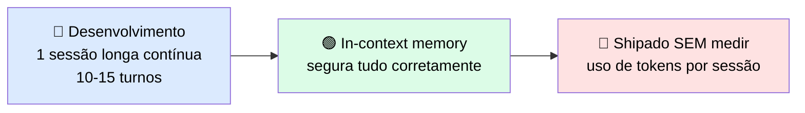
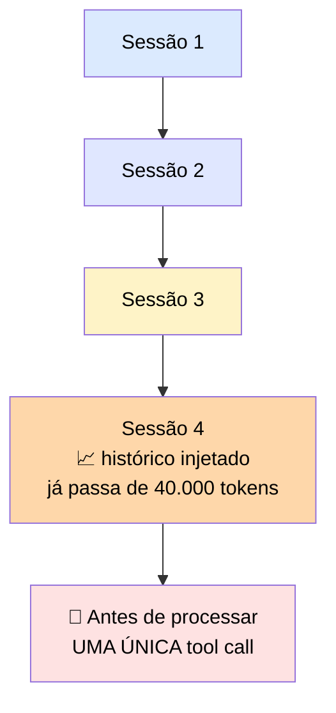
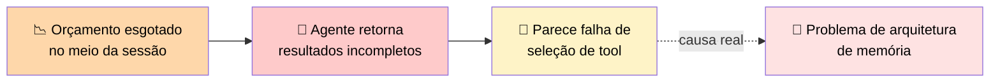
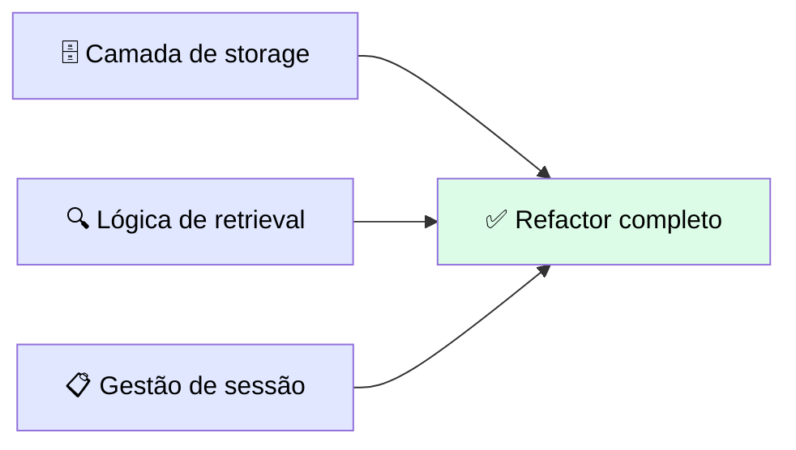

# 🔬 Post-mortem: o Agente que Encheu a Janela na Sessão Quatro

> 🎯 **Ideia central:** o agente roda perfeitamente em desenvolvimento porque você o executa numa **única sessão longa e contínua** — a janela nunca enche, e a memória in-context segura tudo. Mas produção roda **múltiplas sessões mais curtas**, com mais turnos ao longo de mais dias — e a janela enche na **sessão quatro**.

---

## 🎬 Setup

Um agente foi construído para ajudar um engenheiro de suporte com casos de escalação contínuos.

> <mark>O desenvolvedor shipou sem medir o uso de tokens por sessão.</mark> Em dev, o estado in-context guardava o histórico completo sem problema nenhum — porque nunca havia mais de uma sessão em jogo.

---

## 🧾 Post-mortem: estado in-context infla até fechar a janela

### 🏭 Em produção

Cada sessão era **mais curta**, mas o **estado acumulava entre sessões**.

### 📊 A conta que estourou

| Componente | Tokens consumidos |
|---|---|
| 📜 Histórico in-context injetado (sessão 4) | **> 40.000** |
| ➕ System prompt + schemas de tools registradas | soma total **> 45.000** |
| ⏰ Momento em que isso já foi gasto | **antes** do primeiro turno produtivo da sessão |

> <mark>Mais de 45.000 tokens do orçamento de contexto foram consumidos antes do primeiro turno produtivo da sessão.</mark> Conforme as tool calls se acumulavam ao longo da sessão, o orçamento restante se esgotava antes do agente conseguir completar a análise.

### 🎭 O sintoma enganoso

> ⚠️ O agente começou a retornar resultados incompletos — um sintoma que, à primeira vista, <mark>parecia falha de seleção de tool, não um problema de arquitetura de memória.</mark>

---

## 🛠️ A correção

| Antes ❌ | Depois ✅ |
|---|---|
| Histórico acumulado de sessão vivendo no contexto ativo | Puxado para **storage externo** (banco de dados) |
| Toda a história injetada a cada sessão | Só o **subconjunto relevante** injetado no início da sessão |

> 💬 A correção em si foi um refactor de **uma hora** — mas <mark>sob pressão de produção, levou significativamente mais tempo do que levaria na fase de design.</mark> A camada de storage, a lógica de retrieval e a gestão de sessão exigiam decisões que deveriam ter sido tomadas **antes** do primeiro deploy.

---

## 🚨 O que observar

> <mark>Desenvolvimento usou uma única sessão longa. Produção usou muitas sessões curtas com estado acumulado. Essas são formas diferentes — e a memória in-context lida com cada uma de um jeito diferente.</mark>

✅ **Regra prática:** meça o tamanho esperado do estado por sessão (histórico + system prompt + schemas de tools) contra o limite de contexto **antes** de escolher in-context como o padrão.

### 📋 Checklist de prevenção

- [ ] O formato dos testes de desenvolvimento reflete o formato real de uso em produção (sessões curtas e numerosas vs. uma sessão longa)?
- [ ] Medi o tamanho do histórico acumulado **entre sessões**, não só dentro de uma sessão?
- [ ] Somei system prompt + schemas de tools + histórico injetado para saber o custo real **antes** do primeiro turno produtivo?
- [ ] Se notar resultados incompletos ao longo de várias sessões, minha primeira suspeita é a janela de contexto — antes de investigar seleção de tool?
- [ ] A decisão de escopo de memória (in-context vs. external storage vs. summarized) foi tomada na fase de **design**, não vai virar um refactor de emergência depois?
