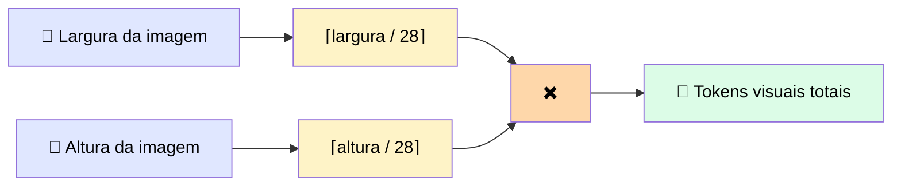
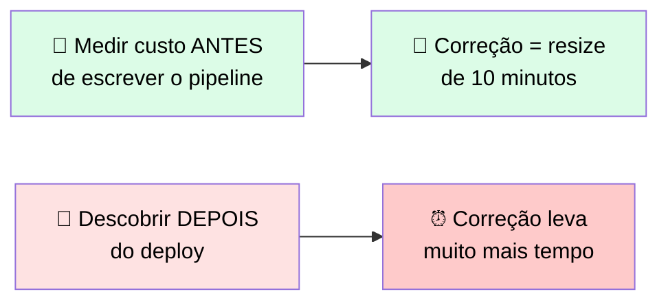
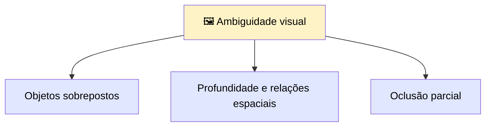
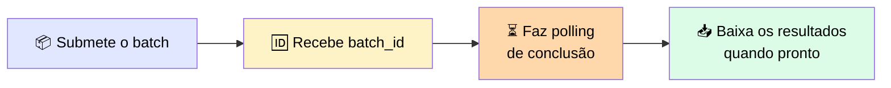
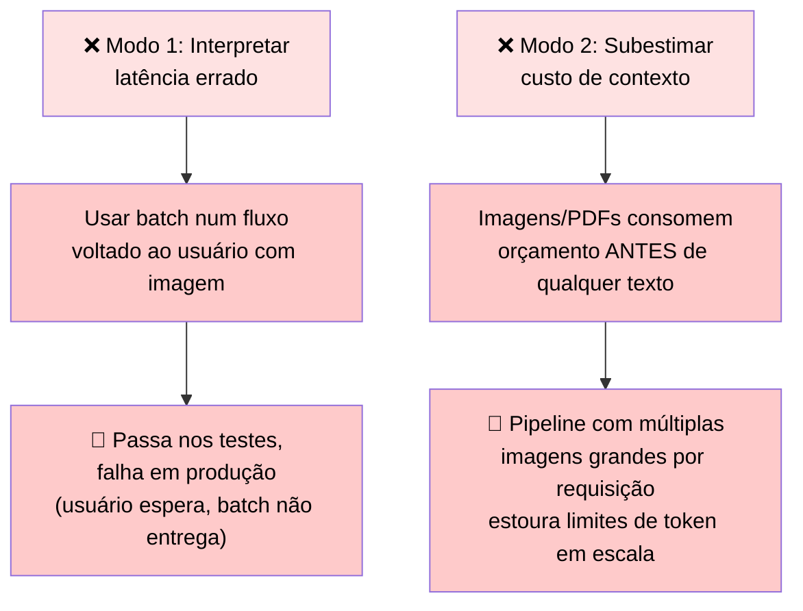

# 🖼️ Imagens, PDFs e Processamento de Alto Volume

> 🎯 **Mudança de perspectiva:** até agora, o foco era **o que Claude lembra** entre turnos. A ingestão multimodal muda a pergunta para **o que você está enviando** — toda imagem e PDF consome orçamento de contexto **antes** de Claude ler um único caractere do seu prompt.

---

## 🧮 1. Custo de token de imagem: calcule antes de se comprometer

> 💬 Imagens **não são de graça** em termos de orçamento de contexto. Claude vê imagens em **patches**: cada bloco de 28×28 pixels é **um token visual**.

### 📐 A fórmula



**Exemplo prático:** uma imagem de 1.000 × 1.000 pixels →
`⌈1000/28⌉ × ⌈1000/28⌉ = 36 × 36 = ~1.296 tokens visuais`

> <mark>Nessa proporção, dez screenshots em alta resolução consomem tanto contexto quanto um system prompt detalhado.</mark>

### ⚠️ Limites por modelo

| Aspecto | Detalhe |
|---|---|
| 📏 Limite de resolução nativa | Expresso como limite de **borda longa** + limite de **tokens visuais** — varia por tier de modelo |
| 🆕 Modelos mais novos | Aceitam imagens substancialmente maiores que o tier padrão |
| 📉 Imagem acima do limite | É **redimensionada** antes do processamento — a fórmula roda sobre as dimensões já escaladas |

> ℹ️ Confirme os limites atuais por tier contra a página de Vision (Resolution and token cost) na hora de construir — <mark>esses limites já mudaram entre gerações de modelo e vão mudar de novo.</mark>

### ✅ Regra prática

> O cálculo importa na **fase de design**. Se você está construindo um pipeline que processa imagens, **meça o custo de token de uma imagem típica de produção contra o limite de contexto do modelo antes de escrever o código de ingestão.**



---

## 📤 2. Diferentes formas de enviar uma imagem

| Método | 🔧 Como funciona | 💰 Overhead | ✅ Quando usar |
|---|---|---|---|
| 🔡 **Inline base64** | Bytes da imagem codificados em string base64, direto no bloco da mensagem | O payload completo viaja em **cada** requisição — infla tamanho e latência em imagens grandes | Imagens pontuais, onde adicionar um passo de upload não compensaria. **Reenviar a mesma imagem multiplica o custo** — se há reuso provável, use outro método |
| 🔗 **URL reference** | *(mesmo padrão de source, referenciando uma URL)* | — | — |
| 📁 **Files API** | *(mesmo padrão de source, referenciando um `file_id`)* | — | Ideal para reuso — evita reenviar os mesmos bytes repetidamente |

---

## 📄 3. Enviando PDFs: o bloco `document`

Para PDFs, o tipo de bloco é `document`, não `image`. A estrutura de `source` segue o mesmo padrão das imagens — pode ser **base64**, **URL**, ou um **`file_id` da Files API**.

| Campo | Obrigatório? |
|---|---|
| `source` | ✅ Sim |
| `title` | ❌ Opcional — nome legível do documento |
| `context` | ❌ Opcional — metadados adicionais |

```json
{
  "type": "document",
  "source": {
    "type": "base64",
    "media_type": "application/pdf",
    "data": "<base64-encoded-pdf-bytes>"
  },
  "title": "contract_review.pdf"
}
```

> ℹ️ Todas as outras mecânicas — custo de token, reuso via Files API — se aplicam do mesmo jeito que para imagens.

---

## 🎯 4. Aplicando técnicas de prompting a inputs multimodais

> 💬 As mesmas técnicas de prompting da primeira seção do módulo se aplicam à análise de imagem e PDF. Um prompt vazio tipo *"descreva esta imagem"* produz output raso — pela mesma razão que um prompt de texto vazio produz: Claude não tem uma estrutura-alvo para mirar.

### 🌫️ A diferença: imagens carregam ambiguidade que texto não carrega



> ✅ **Um prompt de análise visual deve nomear como Claude deve lidar com cada tipo de ambiguidade.** Exemplo: *"Se objetos se sobrepõem, descreva cada um separadamente e note a sobreposição"* — uma restrição concreta que um prompt só-de-texto nunca precisaria ter.

---

## 📦 5. Message Batches API: processamento assíncrono de alto volume

> ❓ Quando você precisa rodar o mesmo padrão de prompt contra centenas ou milhares de inputs, a **API síncrona é o modelo errado**. Cada chamada síncrona bloqueia até completar — em escala, isso significa sua aplicação queimando threads ou rodando milhares de conexões concorrentes contra rate limits.



| Aspecto | Detalhe |
|---|---|
| 📊 Capacidade | Até **100.000 requisições** ou **256 MB** por chamada de batch (o que vier primeiro) |
| 💰 Custo por token | **Menor** que requisições síncronas |
| ⏱️ Tradeoff | Latência **não-determinística** — pode levar até 24h (geralmente bem mais rápido) |
| 🎯 Serve para | Pipelines offline, rodadas de avaliação, jobs de processamento de dados — **não** interações em tempo real |

### 🗂️ Quando usar cada padrão

| Caso de uso | 🎯 Padrão correto | 💬 Por quê |
|---|---|---|
| 📸 Usuário sobe uma foto e espera classificação imediata | ⚡ **API síncrona** | Resposta em tempo real é exigida — latência de batch é inaceitável |
| 🌙 Pipeline noturno classifica 5.000 registros de clientes | 📦 **Message Batches API** | Latência não é uma restrição — redução de custo e processamento assíncrono valem a pena |
| 🧪 Rodada de avaliação testa um novo prompt contra 2.000 exemplos | 📦 **Message Batches API** | Tarefa offline, sem exigência de tempo real |
| 💬 Chatbot gera resposta à mensagem de um usuário | ⚡ **API síncrona** | Usuário está esperando — batch introduziria atraso inaceitável |

---

## 🤝 6. Quando multimodal e batch se encaixam — e quando não

> ✅ A combinação funciona para **workloads offline** que reutilizam os mesmos assets e precisam de output estruturado em milhares de inputs. **Caso de livro-texto:** um pipeline noturno classificando imagens contra uma taxonomia fixa — Files API remove uploads redundantes, Batches API absorve a latência, técnicas de output estruturado mantêm os resultados machine-readable.

### 🚫 Dois modos de falha que quebram esse encaixe



> <mark>Meça o custo de token em inputs de escala de produção antes de construir.</mark>

---

## ✅ Checklist de decisão

- [ ] Calculei o custo em tokens visuais de uma imagem típica de produção **antes** de escrever o código de ingestão?
- [ ] Confirmei os limites de resolução/token do meu tier de modelo na documentação atual (não confiei em números antigos)?
- [ ] Se a mesma imagem será reutilizada, estou usando Files API em vez de reenviar base64 repetidamente?
- [ ] Meu prompt de análise visual nomeia explicitamente como lidar com sobreposição, profundidade e oclusão?
- [ ] Estou usando a **API síncrona** só quando há um usuário esperando em tempo real — e **Batches API** para tudo o que é offline?
- [ ] Meu pipeline multimodal + batch mede o custo de contexto contra inputs de **escala real**, não só exemplos pequenos de teste?
