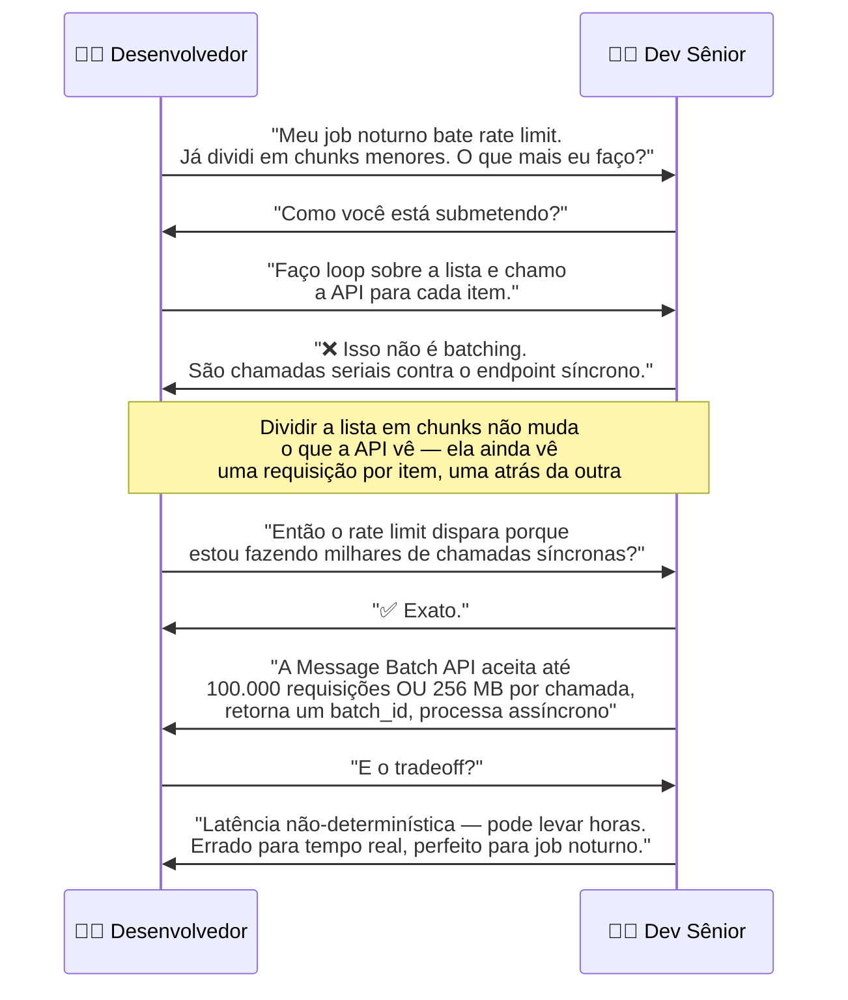
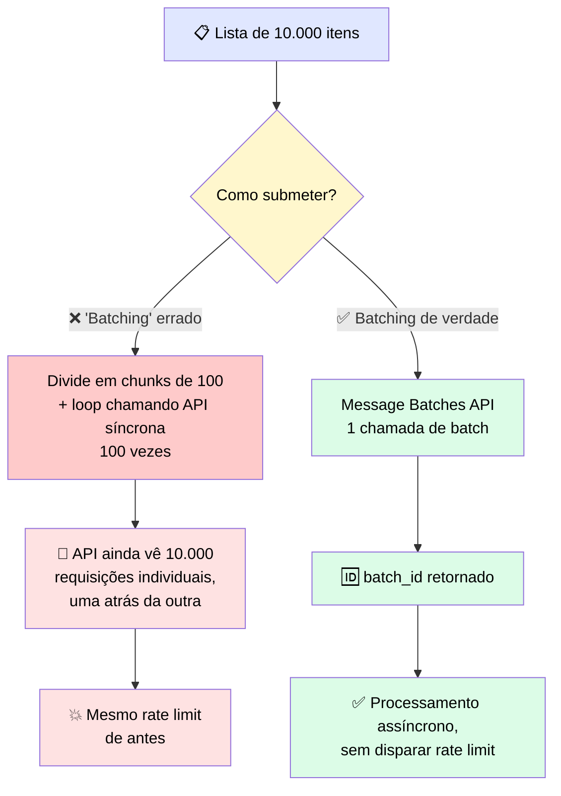

# 🔬 Post-mortem: o Batch Job que Não Era um Batch de Verdade

> 🎯 **Ideia central:** dividir um job em pedaços e processá-los um depois do outro **não é batching** — é serialização com passos extras. A Message Batches API existe justamente porque fazer loop sobre inputs contra a API síncrona esbarra em rate limits assim que o volume fica real, **não importa como você fatie a lista de input.**

---

## 💬 A conversa que revelou o problema de verdade

Um desenvolvedor vinha re-executando o mesmo job noturno de classificação havia três noites, sempre batendo em erros de rate limit no mesmo ponto. A pergunta certa do dev sênior expôs a causa raiz.

---

## 🕵️ Onde estava o erro de raciocínio

> <mark>Dividir uma lista em chunks e fazer loop contra a API síncrona não é batching, mesmo que pareça que deveria ser.</mark> Isso produz **exatamente o mesmo número** de chamadas de API que a versão sem chunks, e esbarra nos **mesmos rate limits**.

> <mark>A Message Batches API é um modelo de submissão diferente — não um "batch size" menor.</mark> Fatiar a lista não muda o modelo de submissão; só muda o tamanho de cada fatia que ainda é enviada uma por uma.

---

## ⚖️ Comparativo: "batching" falso vs. batching de verdade

| | ❌ Loop + chunks contra API síncrona | ✅ Message Batches API |
|---|---|---|
| 🔢 Número de chamadas que a API vê | Uma por item — igual à versão sem chunks | Uma única chamada de batch |
| 🚦 Risco de rate limit | Alto — dispara do mesmo jeito | Não dispara — não são requisições individuais |
| 💰 Custo por token | Preço padrão (síncrono) | Menor |
| ⏱️ Latência | Imediata por chamada, mas serializada | Não-determinística — pode levar horas |
| 🎯 Adequado para | Interação em tempo real com usuário esperando | Workload offline, alto volume |

---

## 🧾 Como funciona a Message Batches API

| Passo | O que acontece |
|---|---|
| 1️⃣ Submissão | Você envia até **100.000 requisições ou 256 MB** por chamada de batch (o que vier primeiro) |
| 2️⃣ Retorno | A API devolve um **`batch_id`** |
| 3️⃣ Polling | Seu código checa o status do batch periodicamente, num cronograma, até a API informar que terminou |
| 4️⃣ Resultado | Você baixa os resultados quando prontos |

> ⚠️ <mark>Os resultados retornam em ordem arbitrária — não na ordem em que as requisições foram submetidas.</mark> Use o campo `custom_id` em cada requisição para casar os resultados de volta com os inputs correspondentes.

---

## 🚨 O que observar

> ✅ **Regra prática:** use a Message Batches API sempre que o workload for de **alto volume e offline**. Recorra à API síncrona **só** quando houver um usuário esperando do outro lado.

### 📋 Checklist de prevenção

- [ ] Estou usando a **Message Batches API de verdade**, ou só fatiando uma lista e fazendo loop contra o endpoint síncrono?
- [ ] Meu job é realmente offline (sem usuário esperando em tempo real)?
- [ ] Estou usando `custom_id` em cada requisição do batch para reconciliar os resultados, já que eles voltam fora de ordem?
- [ ] Se estou batendo rate limit repetidamente com "chunks", já verifiquei se ainda são chamadas individuais contra a API síncrona por trás?
