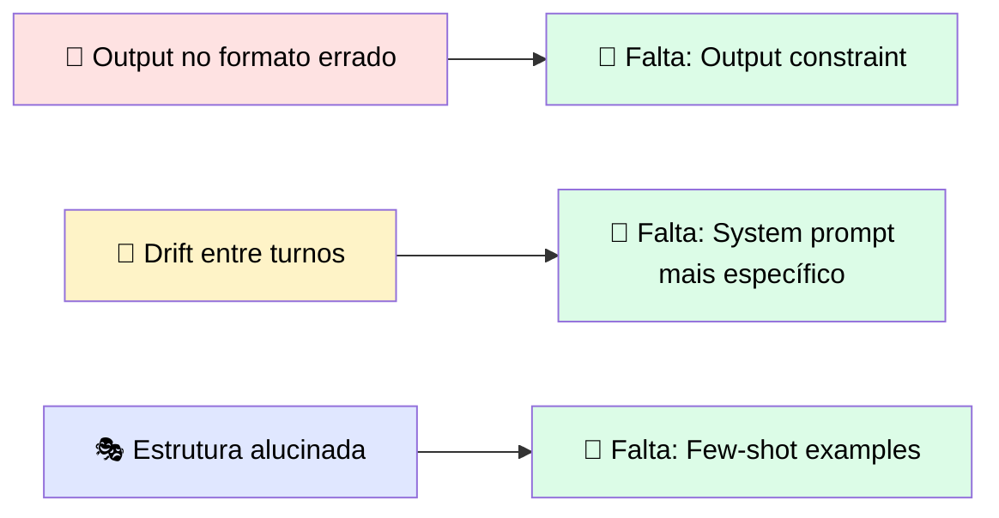
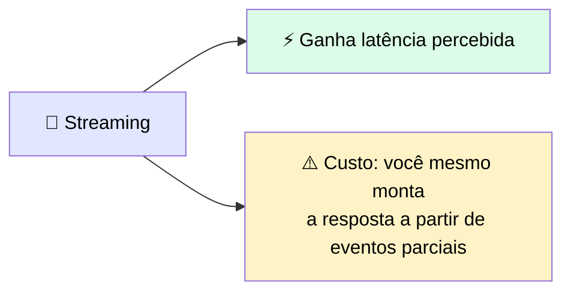
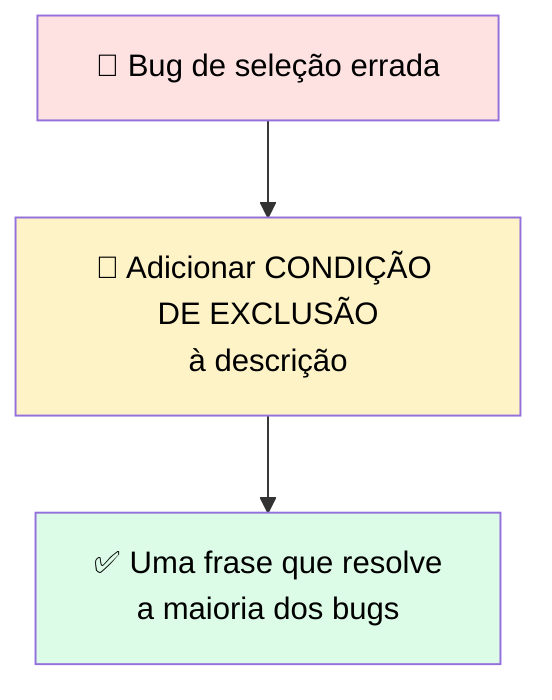
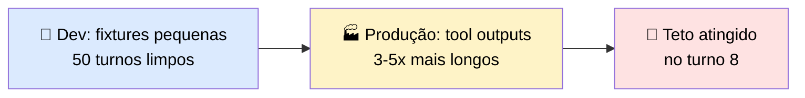
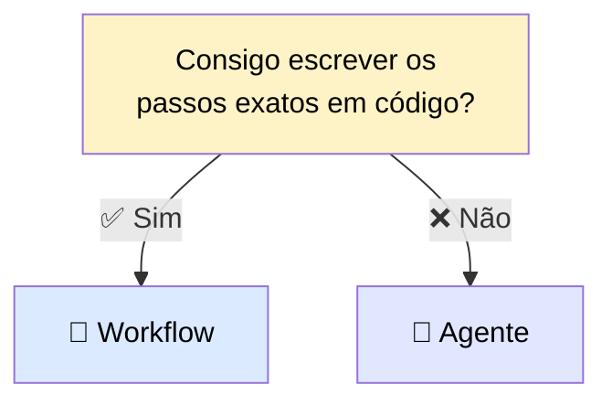
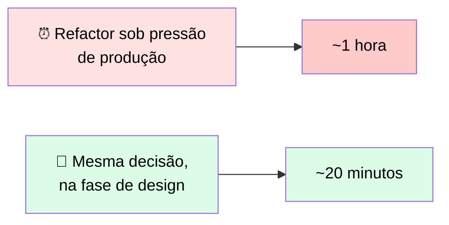
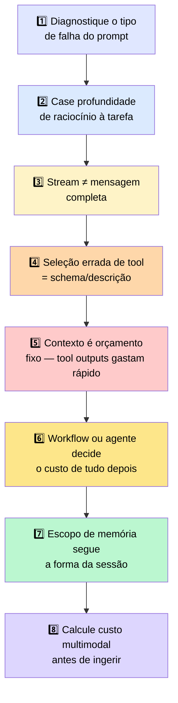

# 🏁 Oito Conclusões — Uma por Objetivo de Aprendizagem

> 🎯 Este módulo estabeleceu a **biblioteca de primitivos do Developer**, com cinco tipos de interação que sustentam todos os módulos seguintes. As oito conclusões abaixo amarram tudo que vimos: prompting, schemas de tools, engenharia de contexto, construção de agentes, escopo de memória e ingestão multimodal.

---

## 1️⃣ Quando um prompt falha, o tipo de falha diz qual técnica está faltando

> <mark>O instinto de reescrever a instrução e tentar de novo raramente funciona, porque nenhuma dessas falhas é um problema de fraseado.</mark> Diagnostique o tipo de falha primeiro, depois adicione a técnica correspondente.

📌 Quando instruções no nível do prompt não bastam — porque inputs não testados ainda quebram o parser — mova o controle de output para a **API** com **structured outputs**:
- 🧾 **JSON outputs** restringem a resposta final contra um schema
- 🔗 **Strict tool use** valida os argumentos que Claude passa às suas tools

⚠️ Custo: latência de compilação na primeira chamada + tokens de input adicionais.

---

## 2️⃣ Ajuste a profundidade de raciocínio à tarefa antes de ajustar o prompt

> ✅ Ative extended thinking **só** onde uma passada de raciocínio muda a resposta, e calibre o nível de esforço ao problema — em vez de aumentar em toda chamada por padrão.

> <mark>Blocos `thinking` precisam voltar à API sem alterações, ou a próxima requisição falha.</mark>

> ℹ️ Escolher **qual modelo** rodar é uma decisão distinta de **se** habilitar reasoning — isso é ensinado no módulo de MSO Foundations, anterior a este.

---

## 3️⃣ Um stream terminar não é o mesmo que uma mensagem estar completa

**Regras de ouro:**
- ✅ Aja sobre um bloco **só depois** que ele fecha
- ✅ Só commite um turno ao histórico **depois** do `message_stop`
- ✅ Num stream interrompido: **descarte** o turno parcial e refaça a requisição

> <mark>O modo de falha a reconhecer: um erro de tool-use num retry que remonta a um bloco pela metade de um stream que caiu — não ao schema.</mark>

---

## 4️⃣ Toda seleção de tool errada remonta ao schema — e na maioria das vezes, à descrição

> 💬 Claude escolhe uma tool lendo o campo `description` e comparando com o pedido do usuário — o que significa que **duas tools que dizem "use isto para encontrar informação" são indistinguíveis do ponto de vista de Claude**, mesmo que os input schemas sejam completamente diferentes.

> <mark>A frase que resolve a maioria dos bugs de tool errada é a condição de exclusão: uma linha em toda descrição nomeando quando NÃO chamar a tool</mark> — escrita no design, não depois que a primeira chamada errada aparece num log.

🌐 Quando alguém já escreveu as tools por você, **MCP** permite conectar a um servidor mantido em vez de autorar cada schema à mão — mas cada servidor conectado adiciona suas definições de tools à janela de contexto, **usadas ou não**. Conecte deliberadamente e controle o custo de carregamento.

---

## 5️⃣ Contexto é um orçamento fixo, e tool outputs o gastam mais rápido que qualquer outra coisa no loop

| Estratégia | O que compra de volta |
|---|---|
| ✂️ **Pruning** | Headroom, descartando o que veio depois de um ponto |
| 🗜️ **Compaction** | Headroom, condensando o que já foi aprendido |
| 🤖 **Subagent handoffs** | Headroom, isolando exploração num contexto separado |

> ✅ Qual aplicar depende de **se você ainda precisa do estado anterior**.

> <mark>Quando a seleção de tool começa a degradar depois de um número fixo de turnos, a janela é o primeiro lugar a olhar — não o schema.</mark>

---

## 6️⃣ A decisão workflow-ou-agente define o custo de tudo que vem depois, e checkpoints humanos pertencem ao design

| Escolha errada | O que acontece |
|---|---|
| 🤖 Agente onde workflow bastaria | Custo de contexto extra + comportamento que vive só em transcripts |
| 🔧 Workflow onde agente é necessário | Quebra na **primeira vez** que um input foge do caminho previsto |

> <mark>Se uma tool pode tomar uma ação irreversível, o checkpoint de human-in-the-loop entra ANTES do loop ser montado — não depois que a primeira escrita chega a um ambiente de cliente.</mark>

---

## 7️⃣ O escopo de memória é decidido pela forma da sessão, não pelo que é mais fácil de implementar

> 💬 In-context memory é o padrão mais simples de escrever — <mark>é também o que falha mais cedo, quando sessões de produção acabam sendo mais curtas e numerosas do que as sessões longas e contínuas usadas em desenvolvimento.</mark>

| Padrão | Trade-off |
|---|---|
| 💬 In-context | Simples, mas falha cedo em sessões curtas/numerosas |
| 🗄️ External storage | Adiciona latência, mas o estado sobrevive entre sessões |
| 📝 Summarized | Reduz custo, mas perde o que o summarizer não preservou |
| 🚫 Stateless | Correto para jobs que completam e encerram |

> ℹ️ Carregar **instruções repetíveis** entre tarefas é um problema separado de carregar **estado** — o padrão para isso é uma **Skill**: um arquivo markdown que Claude carrega sob demanda, comparando sua descrição, em vez de instruções injetadas em toda sessão.

---

## 8️⃣ Calcule o custo de um input multimodal antes de escrever o código de ingestão, e case a API com o workload

**Fórmula:** `⌈largura / 28⌉ × ⌈altura / 28⌉` tokens visuais — o teto por imagem varia por tier de modelo.

> <mark>Um original em alta resolução nos modelos mais novos pode custar muitas vezes o que um thumbnail custa no seu conjunto de teste</mark> — a fórmula precisa rodar contra o **maior input esperado em produção**, não os inputs que você tem à mão.

| Método de envio | Melhor para |
|---|---|
| 🔡 Inline base64 | Imagens pontuais |
| 📁 Files API | Assets reutilizados entre requisições |
| 📦 Message Batches API | Trabalho offline, custo por token menor, latência não-determinística |

> ⚠️ <mark>O erro que vale a pena evitar: chamar a API síncrona dentro de um loop e tratar isso como batching.</mark>

---

## 🗺️ Mapa geral das oito conclusões

---

> 🔮 **O que vem a seguir:** este módulo estabeleceu a **biblioteca de primitivos do Developer**, com cinco tipos de interação que todos os módulos Developer seguintes vão usar. Os padrões vistos aqui — arte de prompting, schemas de tools, engenharia de contexto, construção de agentes, escopo de memória e ingestão multimodal — formam a fundação para todo módulo que vem depois.
