# 📚 Guia de Engenharia de Prompts, Tools e Streaming com Claude

> Guia consolidado cobrindo técnicas de prompt, design de tools, o protocolo MCP e o funcionamento interno do streaming de respostas.

---

## 🧩 1. System Prompts, XML, Few-shot e Output Constraints

### 💡 Ideia central

> Um prompt que funciona em uso interativo muitas vezes quebra em produção com inputs não testados. A solução **não é** adicionar mais palavras ao prompt — é <mark>diagnosticar qual peça estrutural está faltando</mark> e adicioná-la.

### 🔍 As quatro técnicas e quando usá-las

| 🩺 O que você observa | 🔧 O que falta no prompt | 💬 Por quê |
|---|---|---|
| Resultado no formato errado (frase em vez de label, prosa em vez de JSON) | **Output constraint** | Controla a forma da resposta independentemente do conteúdo |
| Conteúdo errado: escopo derrapa, tom muda, Claude responde além do pedido | **System prompt** mais específico | Define regras que valem para todos os turnos; se vago, nada segura papel/escopo/formato |
| Tarefa certa, mas estrutura inventada | **Few-shot examples** | Claude não infere uma estrutura exata só pela descrição; exemplos mostram o padrão |
| Funciona nos casos testados, quebra em variantes/edge cases | **Constraint cobrindo a variante** | O prompt só cobre o caminho feliz; falta nomear o caso excepcional |

> ✅ **Regra prática:** nomeie a falha → adicione a técnica correspondente → rode de novo. Se continuar falhando, diagnostique de novo.
>
> ⚠️ Prompt crescendo a cada iteração sem melhorar é sinal de que a diagnose está sendo pulada.

### 🧪 Exemplo prático: classificador de tickets

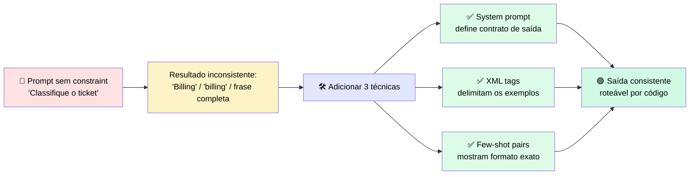

### 📏 Quando aplicar cada abordagem

| Abordagem | Quando usar |
|---|---|
| 🧱 **Empilhar as quatro técnicas** | Tarefas com contrato de saída bem definido e edge cases cobertos por exemplos |
| ✂️ **Simplificar o prompt** | Tarefas simples (ex.: "resuma este parágrafo") não precisam de few-shot nem schema |
| 🔎 **Diagnosticar antes de adicionar mais** | Prompt já reescrito várias vezes e ainda falha — pare e diagnostique antes de continuar |

### 🔒 Output constraints

Última linha de defesa antes da resposta chegar ao parser. Devem especificar:
- ✔️ nomes de campos e tipos
- ✔️ limites de tamanho
- ✔️ se deve haver preâmbulo
- ✔️ o que fazer quando faltam dados

> Use recursos de saída estruturada quando o formato precisa ser **machine-readable**.

### ⚙️ Structured Outputs na API

Em vez de pedir um formato por instrução (que pode falhar em casos não testados), você fornece um **JSON schema** e o modelo é restringido na geração (*constrained decoding*) para só produzir tokens válidos contra esse schema.

| Mecanismo | O que restringe | Configuração | Melhor uso |
|---|---|---|---|
| 🧾 **JSON outputs** | A resposta final | `output_config.format` com `type: json_schema` | Extração de campos, payloads estruturados |
| 🔗 **Strict tool use** | Argumentos passados a tools | `strict: true` na definição da tool | Loops agênticos, evita args malformados |

**⚠️ Custos a considerar:**
- 🐢 Latência na primeira chamada (compilação do schema; cache de 24h)
- 📈 Aumento de tokens de input (system prompt injetado)
- ❌ Schema garantido ≠ sucesso garantido — cheque sempre `stop_reason` (`refusal` / `max_tokens`)
- 🚫 Incompatível com *message prefilling*

---

## 🧠 2. Quando usar Extended Thinking (raciocínio estendido)

| 🎯 Formato da tarefa | Usar extended thinking? | 💬 Motivo |
|---|---|---|
| Raciocínio em várias etapas: derivação matemática, lógica multi-hop, planejamento de ações dependentes | ✅ **Ativar**, ajustando o esforço à profundidade do problema | É na etapa de raciocínio que o modelo trabalha dependências que passariam despercebidas |
| Tarefas mecânicas: classificação, conversão de formato, extração de campo, respostas factuais curtas | ❌ **Deixar desativado** | Não melhora a resposta e custa mais tokens à toa — um output constraint simples resolve |
| Loops agênticos com planejamento em várias chamadas de tools | ✅ **Ativar** e reservar orçamento para o planejamento (não por chamada individual) | Raciocinar antes de planejar reduz escolha errada de ferramenta |

---

## 🛠️ 3. Tool Schemas, Loop de Tool-Use e MCP

### 💡 Ideia central

Ao usar tools, você não está mais moldando texto — está entregando a Claude um conjunto de ações e confiando que ele escolherá a certa. Essa escolha depende quase inteiramente de como o **schema** foi escrito.

### 🔁 Como funciona o loop de tool-use

> ❗ Erro comum: achar que **Claude executa** as tools. Na verdade, quem executa é a sua aplicação.

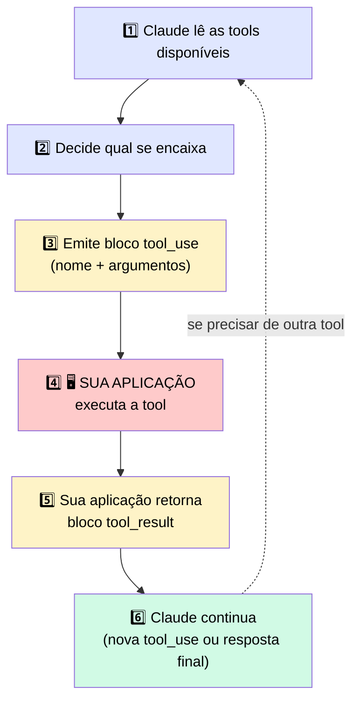

> ⚠️ **O passo 4 não é automático** — é responsabilidade do seu código. Se a aplicação não devolver o resultado corretamente, o loop quebra.

### 🧱 Estrutura dos blocos em uma conversa com tools

| Bloco | Quem gera | Contém | 🚨 Regra crítica |
|---|---|---|---|
| 📝 `text` | Claude | Resposta em prosa | Se aparecer junto de `tool_use`, preserve o array completo ao salvar no histórico |
| 🔧 `tool_use` | Claude | Nome, ID único, argumentos | Precisa de `tool_result` correspondente no turno **imediatamente seguinte** |
| 📦 `tool_result` | Sua aplicação | ID correspondente, resultado, `is_error` opcional | O `tool_use_id` deve bater exatamente com o `tool_use` original |
| 🧵 `thinking` | Claude (extended thinking) | Raciocínio interno | Deve voltar **sem alterações** — qualquer edição quebra a validação |

> 🔒 **Invariante crítico:** todo `tool_use` precisa de um `tool_result` correspondente no turno seguinte, ou a API rejeita a requisição.

### 🧬 Anatomia de um schema de tool

| Parte | Papel |
|---|---|
| **name** | Identificador curto e específico (`get_account_balance` > `get_data`) |
| **description** | 🎯 A parte mais crítica — diz **quando usar e quando não usar** |
| **input_schema** | Define parâmetros via JSON Schema (`required` vs. opcionais) |

### 📋 Decisões de design de schema

| Decisão | Como tratar | Por quê |
|---|---|---|
| 🔗 Dependência entre subtarefas | Sequencial se depende de outra; paralelo (`tool_use` múltiplo) se independente | Modelos chamam em paralelo por padrão — use `disable_parallel_tool_use` para forçar sequência |
| ✅ Campos obrigatórios | Só marcar `required` se a tool não funciona sem o campo | Evita que Claude invente valores |
| ➖ Campos opcionais | Usar quando há default sensato | Evita que Claude "chute" informação |
| 📝 Tamanho da descrição | 3–4 frases: o que faz, quando usar, o que retorna | Curta demais = Claude chuta; longa demais = sinal escondido em ruído |
| 🪞 Parâmetros sobrepostos | Adicionar linguagem que desambigua o domínio de cada tool | Claude roteia por nome + descrição — se params são iguais, tudo cai na descrição |

### 🧪 Exemplo prático: desambiguação de tools

Duas tools com descrições que começavam iguais (`search_knowledge_base` e `get_cached_result`) causavam seleções erradas. A correção: adicionar **condições de exclusão** explícitas.

> 💬 *"Use isto para buscar... **não use isso se** uma busca anterior já cobriu a pergunta."*

⚠️ Essas condições dependem do **histórico completo** ser enviado a cada requisição — se turnos forem truncados, a lógica falha silenciosamente.

| ✅ Funciona bem | ⚠️ Não é a melhor solução |
|---|---|
| Descrições específicas com condições de exclusão claras | Duas tools muito parecidas com descrições cada vez mais longas → funda as duas em uma só, com parâmetro de tipo |

### 🌐 MCP como alternativa a escrever schemas manualmente

O MCP move a definição e execução de tools para **servidores dedicados**, fora do seu código.

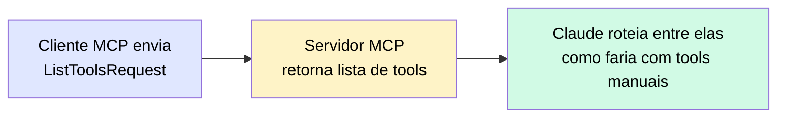

> 💰 **Custo de contexto:** tools de servidores MCP consomem o context window mesmo sem uso no turno atual. Conectar vários servidores de uma vez pode pesar bastante.

**Controlando o custo via `mcp_toolset`:**
| Opção | Função |
|---|---|
| `defer_loading` | Adia o carregamento da definição até ser necessária |
| `enabled` | Liga/desliga tools individuais |
| Header `mcp-client-2025-11-20` | Obrigatório para essas configurações funcionarem |

**Transportes MCP:**
| Transporte | Uso |
|---|---|
| 🖥️ `stdio` | Servidores locais (subprocesso) |
| 🌐 `Streamable HTTP` | Servidores remotos (POST + SSE opcional) — padrão atual |

> ℹ️ O API MCP Connector da Anthropic só suporta servidores **remotos** (HTTP); servidores `stdio` precisam do Claude Desktop, Claude Code, ou SDK direto.

### 🤔 Quando usar cada abordagem

| Abordagem | Quando |
|---|---|
| 🌐 **MCP** | Já existe servidor bem mantido cobrindo o serviço necessário |
| ✍️ **Schemas manuais** | Sem servidor MCP disponível, ou controle fino de escopo/descrição necessário |
| 🤝 **Ambos** | Conectar MCP para cobertura ampla + ajuste de descrições nas tools mais usadas |

---

## 🌊 4. Streaming de Respostas

### 💡 Ideia central

Em requisições **não-streamed**, a API entrega uma mensagem completa de uma vez. No **streaming**, ela envia uma série de eventos descrevendo a mensagem sendo construída — e cabe ao seu código **remontar** os blocos e decidir o que fazer se a série parar antes do fim.

> ℹ️ O modelo não mantém nenhum objeto "vivo" aberto para você. Cada evento descreve uma mudança pontual; seu handler aplica cada evento ao estado parcial que está construindo.

### 🔄 Diagrama do fluxo completo

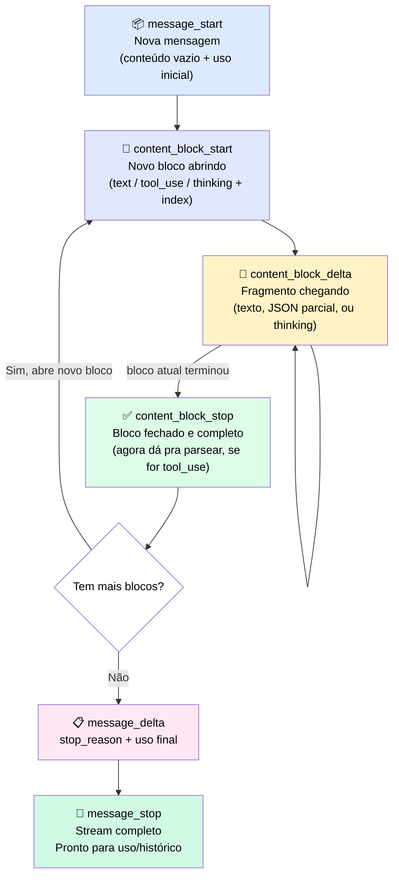

> 📝 **Nota:** o loop `content_block_start` → `content_block_delta` (repetido) → `content_block_stop` pode se repetir **várias vezes** por mensagem — uma vez para cada bloco de conteúdo.

### 📖 O que acontece em cada passo

| # | Evento | O que significa | O que o código deve fazer |
|---|---|---|---|
| 1️⃣ | `message_start` | Nova mensagem começando | Criar array vazio para coletar blocos |
| 2️⃣ | `content_block_start` | Bloco novo se abrindo, com índice | Criar "slot" para aquele índice |
| 3️⃣ | `content_block_delta` 🔁 | Pedaço do conteúdo chegando | **Concatenar** ao bloco — ⚠️ não usar ainda, está incompleto |
| 4️⃣ | `content_block_stop` | Bloco terminou de chegar | Finalizar bloco — **só agora** é seguro parsear JSON de `tool_use` |
| 5️⃣ | `message_delta` | Info de nível da mensagem inteira | Guardar `stop_reason` |
| 6️⃣ | `message_stop` | Stream inteiro terminou | Mensagem **completa e segura** para uso/histórico |

### 🚨 A regra de ouro: não agir sobre um bloco parcial

O bloco `tool_use` é o que exige mais cuidado. Seu input chega como string JSON parcial, espalhada por vários `content_block_delta` — e essa string **só é JSON válido depois do `content_block_stop`**.

> ❌ Se o código tentar parsear/executar antes do bloco fechar: quebra com JSON malformado **ou** roda com metade dos argumentos faltando.

✅ **Regra simples:** colete os deltas, aja **só depois** do `content_block_stop`.

A mesma disciplina vale para o histórico: <mark>só adicione o turno ao histórico depois do `message_stop`</mark>, com todos os blocos completamente montados.

### ⚡ Quando o stream para no meio do caminho

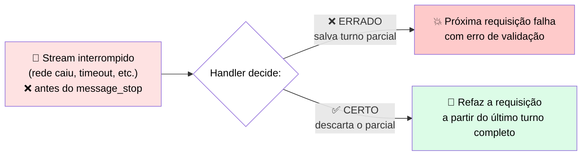

<mark>O erro mais grave é tratar o que foi coletado até ali como se estivesse completo.</mark>

| Tipo de bloco parcial | Impacto |
|---|---|
| 📝 Texto parcial mostrado ao usuário | Cosmético — só um glitch visual |
| 🔧 `tool_use` parcial salvo no histórico | 💥 **Estrutural** — corrompe o próximo turno |

**✅ Boas práticas:**
- 🎯 Rastreie a conclusão intencionalmente: turno só é utilizável depois de `message_stop`
- 🗑️ Se o stream for interrompido, **descarte** o turno parcial e refaça a requisição
- 🔍 Confira o `stop_reason` do `message_delta` antes de continuar um loop

### ⚖️ Quando usar streaming

| ✅ Funciona bem | ⚠️ Adiciona custo/complexidade | 🔄 Considere outra abordagem |
|---|---|---|
| Respostas longas e interfaces com usuário esperando — elimina a tela em branco | Você monta os blocos, não pode agir sobre parciais, precisa tratar interrupção | Respostas curtas / jobs de backend sem ninguém esperando → chamada não-streamed é mais simples |

---

## 🔬 5. Post-mortem: o stream que deixou uma tool call pela metade no histórico

### 📌 Contexto

Uma resposta em streaming pode <mark>parecer correta na tela e mesmo assim corromper a próxima requisição</mark>. O texto foi renderizado, o usuário viu uma resposta, o handler adicionou o turno ao histórico — mas o stream tinha caído no meio de um bloco `tool_use`, deixando **metade do input faltando**.

### 🧾 O que aconteceu

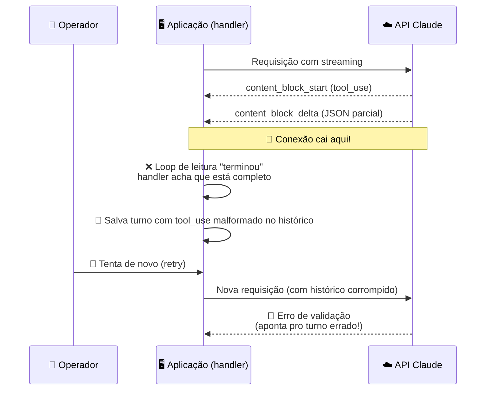

> 🕵️ **Em testes:** conexão local rápida → streams sempre completos → nunca reproduziu o bug.
> 🔥 **Em produção:** instabilidade de rede → stream cortado **depois** do `content_block_start` mas **antes** do `content_block_stop` → JSON truncado salvo no histórico.

⚠️ A equipe passou uma tarde investigando o **schema** e a **lógica de retry**, porque o erro aparecia na requisição de retry. Mas a causa real estava antes disso:

> <mark>O handler tratava "o loop de leitura terminou" como equivalente a "a mensagem está completa"</mark> — e essas duas coisas **não são a mesma coisa**.

### 🎯 O que observar

- <mark>Um stream terminar não é o mesmo que uma mensagem estar completa.</mark> Só `message_stop` significa mensagem inteira.
- Se o handler commita sempre que o loop termina, uma interrupção escreve um bloco pela metade — e a **falha aparece na próxima requisição**, não na que causou o problema.

**🛡️ Como evitar:**

| ✔️ Ação | Por quê |
|---|---|
| Condicionar o append ao histórico à ocorrência do `message_stop` | Garante que só turnos completos entram no histórico |
| Descartar o turno parcial em caso de interrupção | Evita corromper a próxima requisição |
| Refazer a requisição a partir do último turno completo | Mantém o histórico consistente |
| Ao ver erro de tool-use num retry, checar primeiro se o turno anterior veio de um stream | Evita perder tempo investigando o schema à toa |

---

> 💡 **Resumo do resumo:** prompts precisam de estrutura explícita (system prompt + XML + few-shot + constraints); tools precisam de descrições claras com condições de exclusão; e streaming exige tratar `message_stop` como o único ponto seguro para confiar no que foi recebido.

# 🧪 Checkpoint 4 · Conserte o Handler de Stream Quebrado

> 🎯 **Desafio:** o handler abaixo faz streaming de uma resposta e adiciona o turno do assistant ao histórico da conversa. Ele tem **um defeito** que só aparece quando o stream é interrompido no meio. Identifique o defeito e escreva a versão corrigida.

---

## 🐛 1. O handler quebrado

```python
blocks = {}
stop_seen = False

with client.messages.stream(model=model, max_tokens=4096, messages=messages, tools=tools) as stream:
    for event in stream:
        if event.type == "content_block_start":
            blocks[event.index] = init_block(event)
        elif event.type == "content_block_delta":
            apply_delta(blocks[event.index], event.delta)
        elif event.type == "message_stop":
            stop_seen = True

messages.append({"role": "assistant", "content": assemble(blocks)})
```

---

## 🔍 2. Onde está o defeito

| Linha do código | O que faz | 🚨 Problema |
|---|---|---|
| `stop_seen = True` | Marca que o `message_stop` chegou | A variável é **calculada mas nunca usada** para decidir algo |
| `messages.append(...)` | Roda **fora do `with`**, incondicionalmente | Executa **mesmo que o stream tenha caído antes do `message_stop`** |

> <mark>O handler trata "o loop de eventos terminou" (por qualquer motivo) como equivalente a "a mensagem está completa".</mark> Isso é exatamente o antipadrão do post-mortem anterior: se a conexão cair no meio de um bloco `content_block_delta`, o `for event in stream` simplesmente para de iterar — sem lançar nenhum sinal especial — e o código segue reto até o `append`, salvando um turno com blocos pela metade (por exemplo, um `tool_use` com JSON truncado).

### 🔄 Diagrama do bug

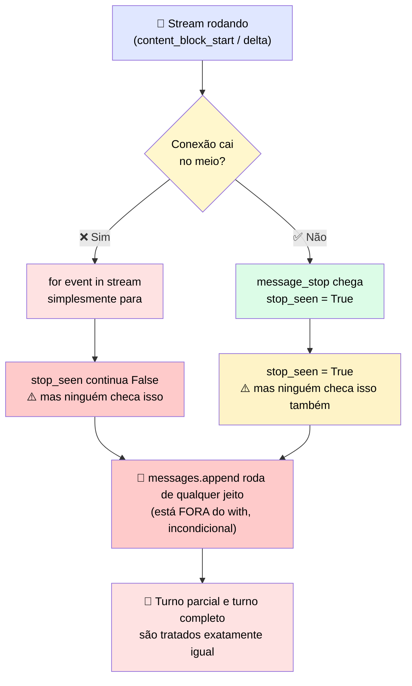

---

## ✅ 3. A correção

```python
blocks = {}
stop_seen = False

with client.messages.stream(model=model, max_tokens=4096, messages=messages, tools=tools) as stream:
    for event in stream:
        if event.type == "content_block_start":
            blocks[event.index] = init_block(event)
        elif event.type == "content_block_delta":
            apply_delta(blocks[event.index], event.delta)
        elif event.type == "message_stop":
            stop_seen = True

if stop_seen:
    messages.append({"role": "assistant", "content": assemble(blocks)})
else:
    raise StreamInterruptedError(
        "Stream ended before message_stop; discarding partial turn. Retry from the last complete turn."
    )
```

### 🛠️ O que mudou

| Antes ❌ | Depois ✅ | Por quê |
|---|---|---|
| `append` roda sempre, sem checar `stop_seen` | `append` só roda **se `stop_seen` for `True`** | Garante que só turnos completos entram no histórico |
| Stream interrompido → turno parcial salvo silenciosamente | Stream interrompido → `StreamInterruptedError` explícito | Torna o erro visível **no ponto onde ele aconteceu**, não numa requisição futura |
| Nenhuma orientação de retry | Mensagem de erro diz para **refazer a partir do último turno completo** | Evita que quem trata a exceção "adivinhe" o que fazer |

---

## 🎯 4. Regra de ouro por trás da correção

> <mark>`stop_seen` já existia no código original — o bug não era falta de informação, era falta de usá-la para decidir algo.</mark> A variável era calculada e depois ignorada, o que é um padrão perigoso: dá a falsa sensação de que o estado está sendo rastreado quando na verdade não está influenciando nenhum comportamento.

✅ **Checklist para qualquer handler de streaming:**
- [ ] O `append` ao histórico está **condicionado** a `message_stop` ter chegado?
- [ ] Existe um caminho de erro explícito para stream interrompido (em vez de silêncio)?
- [ ] A mensagem de erro orienta o retry a partir do **último turno completo**?


# 💰 Seleção de Modelo e Gestão de Orçamento em Sessões Multi-turno

> 🎯 **Ideia central:** a escolha do modelo define o piso de custo e velocidade de tudo que vem depois. E o *context window* (janela de contexto) **não é um recurso gratuito** — cada tool result que Claude devolve fica anexado à janela pelo resto da sessão. Decidir com antecedência o que entra, o que sai como resumo, e o que nunca entra, é o que se chama de **context engineering**.

---

## 🧭 1. Seleção de modelo: comece com Sonnet, avance com critério

A família Claude tem 4 níveis, cada um com um tradeoff diferente de custo, latência e capacidade:

| 🏷️ Modelo | 🎯 Perfil |
|---|---|
| ⚡ **Haiku** | Velocidade e custo-benefício, para tarefas dentro da sua capacidade |
| ⚖️ **Sonnet** | **Padrão balanceado** para a maioria das cargas de produção |
| 💪 **Opus** | Trabalho exigente acima do que o Sonnet dá conta |
| 🌟 **Fable** | Modelo mais capaz da Anthropic — raciocínio complexo, coding avançado, síntese de pesquisa, workflows agênticos sofisticados |

> ℹ️ Confirme o lineup atual e os identificadores de modelo em `platform.claude.com/docs` na hora de construir — essa informação muda com o tempo.

### 📏 Regra de decisão

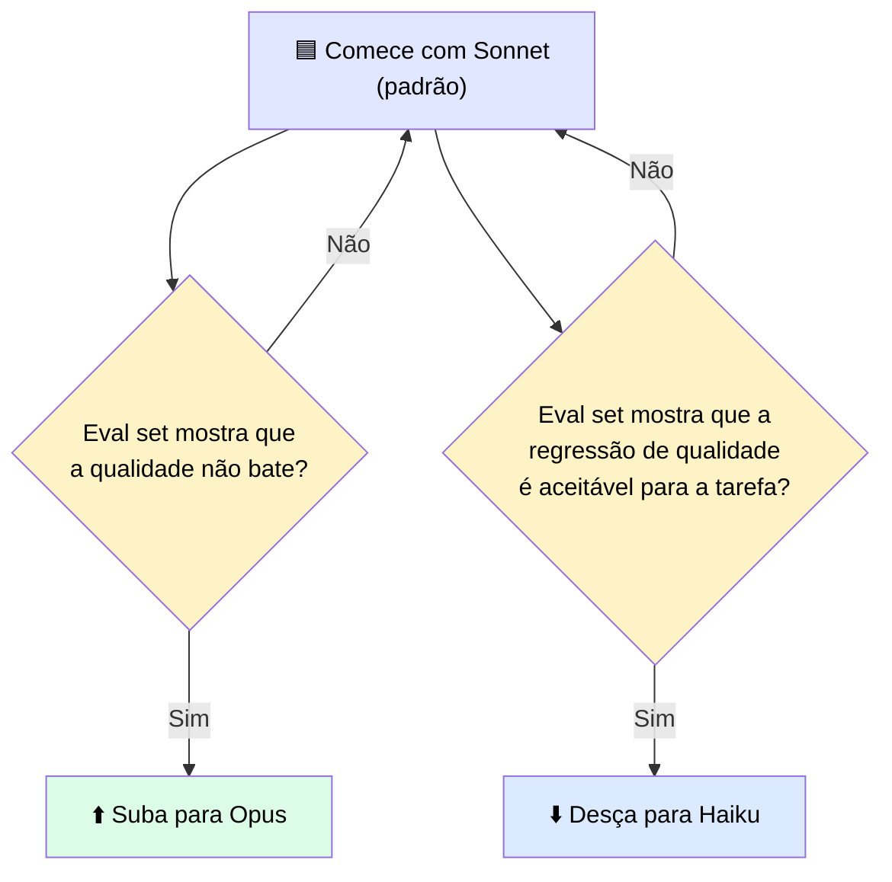

> <mark>Mover de modelo deve sempre ser uma decisão medida (baseada em eval), nunca um chute — nem para cima (achismo de qualidade) nem para baixo (só para economizar).</mark>

---

## 🪟 2. O context window não é um recurso gratuito

Pense na janela de contexto como a **memória de trabalho** de Claude. Toda mensagem, todo tool result, todo documento injetado e toda resposta gerada ocupa espaço nela.

### ⚠️ O que acontece quando estoura

| Situação | O que a API faz |
|---|---|
| 🚫 Requisição **já maior** que a janela | Rejeitada com erro de validação **antes** de gerar qualquer coisa |
| 📏 Requisição cabe, mas a geração **atinge o teto no meio** | Retorna o que já foi gerado, com `stop_reason: model_context_window_exceeded` |

> <mark>Nenhum dos dois caminhos trunca silenciosamente o conteúdo mais antigo.</mark> Se você quer que a sessão continue além do limite, **sua aplicação** precisa gerenciar isso (aparar ou resumir histórico) antes da próxima requisição.

### 🕳️ A armadilha dev → produção

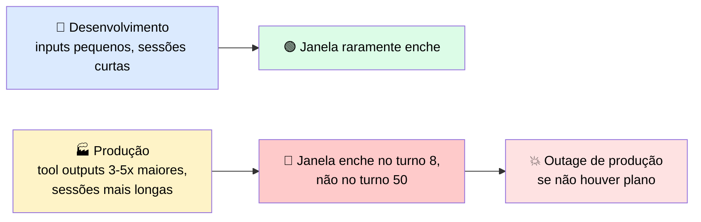

---

## 🧰 3. Quatro estratégias para manter o orçamento

> 💬 Cada token na janela custa dinheiro no input e adiciona latência na resposta — e uma sessão longa acumula os dois. As quatro estratégias abaixo servem a formatos diferentes de conversa.

| Estratégia | 🔧 O que faz | ⏰ Quando aplicar | 📉 O que você perde |
|---|---|---|---|
| ✂️ **Pruning** | Volta a uma mensagem anterior e continua dali, removendo tudo que veio depois | Depois que Claude entrou num caminho improdutivo ou acumulou debug irrelevante | O trabalho feito após o ponto de rewind — se aprendeu algo útil ali, tem que reaprender |
| 🗜️ **Compaction** (`/compact` no Claude Code; server-side no API, beta) | Resume o histórico numa versão condensada, mantendo o essencial. O resumo custa menos tokens que o original | Sessão se aproximando do teto, mas quer continuar na mesma feature com o conhecimento já acumulado | Detalhes podem se perder na sumarização — o que não está no resumo, não existe mais |
| 🧹 **Clearing** (`/clear` no Claude Code; nova sessão na API) | Começa uma conversa nova, contexto zerado | Próxima tarefa é completamente diferente — contexto anterior só atrapalharia | Todo o contexto da sessão — o que precisa persistir tem que ir para algum lugar externo (ex.: `CLAUDE.md`) |
| 🤖 **Subagent Handoffs** | Gera um subagente com janela isolada, só com a descrição da tarefa e o system prompt necessário. Devolve um resumo | Subtarefa autocontida, especialmente exploração onde o "caminho" polui o contexto principal mas a resposta é curta | Visibilidade de como o subagente chegou à conclusão — os passos intermediários são descartados |

---

## 🎚️ 4. Duas alavancas extras: prompt caching e token counting

As quatro estratégias acima controlam **o que entra** na janela. Estas duas reduzem **quanto você paga** pelo que já está lá.

### 💾 Prompt caching

Armazena o processamento feito num **prefixo estável** da requisição, para requisições seguintes reaproveitarem em vez de reprocessar.

| Passo | O que acontece |
|---|---|
| 1️⃣ Primeira requisição | Escreve o prefixo no cache |
| 2️⃣ Requisições seguintes | Se enviarem conteúdo idêntico até aquele ponto, pagam **uma fração** do custo original |

> 🎯 **Melhores candidatos:** system prompt longo, grande conjunto de definições de tools, documento de referência consultado repetidamente.

**Como habilitar:** marque um *cache breakpoint* com `cache_control: {type: "ephemeral"}` no último bloco que você quer em cache. Até **4 breakpoints** por requisição.

> <mark>Para sessões multi-turno com system prompt e schemas de tools estáveis, cachear esses prefixos uma vez e reutilizá-los é a redução de custo de maior alavancagem disponível.</mark>

### 🔢 Token counting

O endpoint `count_tokens` recebe o mesmo corpo de requisição de uma chamada `messages` e retorna a contagem de tokens **sem rodar inferência**.

| Uso | Quando |
|---|---|
| 🧪 Desenvolvimento | Verificar se as premissas de orçamento de contexto se sustentam contra tool outputs reais (não só fixtures de teste) |
| 🏭 Produção | Bloquear requisições que estourariam a janela **antes** de darem erro |

---

## 🔍 5. Os três pontos onde um caminho RAG pode quebrar

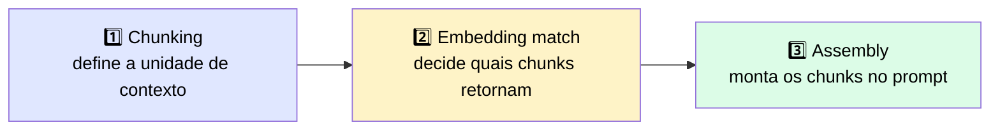

| Ponto | ⚠️ Risco | 💡 Mitigação |
|---|---|---|
| **1. Chunking** | Muito pequeno → falta contexto ao redor; muito grande → dilui o match com texto irrelevante | Chunking por sentença/seção com um pouco de overlap (evita que fatos na fronteira fiquem cortados) |
| **2. Embedding match** | Busca por similaridade semântica — pode não achar um identificador exato se algo "parecido" tiver rank maior | Rodar uma busca **lexical** em paralelo à semântica |
| **3. Assembly** | Se os chunks não chegam na estrutura que o prompt espera, o modelo responde **da memória**, não do texto recuperado | Garantir que a estrutura de entrega bate com o que o prompt espera |

### 🆚 Índice fixo (fetch-once) vs. busca iterativa (search-across-rounds)

| Abordagem | ✅ Vantagem | ⚠️ Custo |
|---|---|---|
| 📇 **Índice (fetch-once)** | Sistema inspecionável — dá pra ver quais chunks foram retornados e testar a recuperação isoladamente | Precisa construir, armazenar, manter sincronizado e proteger o índice |
| 🔄 **Busca iterativa (search-across-rounds)** | Sem infraestrutura de índice, sem staleness — lê os arquivos atuais na hora da query | Mais tokens e tempo por query, processo menos inspecionável |

> 📌 **Regra prática:** corpus estável + buscas simples → vale ter índice. Corpus mutável ou perguntas multi-etapa → busca iterativa costuma ser o sistema mais simples, mesmo custando mais por query.

> ⚠️ O ganho de performance de agentic search de agente único sobre um índice de recuperação é uma **figura fixada por versão** — confirme contra a camada de referência no momento de construir, em vez de confiar no número deste módulo.

---

## 🗜️ 6. Aplicando compaction: o que é preservado depende de como você escreve o summarizer

| Contexto | Quem decide o que entra no resumo |
|---|---|
| `/compact` no Claude Code | A própria ferramenta decide |
| Server-side compaction (API, beta) | A plataforma resume para você, quando configurado |
| Compaction manual na API | **Você** escreve o prompt do summarizer — e esse prompt define o que o agente vai "saber" nos próximos turnos |

**Comparação de prompts de summarizer:**

| ❌ Prompt fraco | ✅ Prompt forte |
|---|---|
| *"Resuma a conversa até agora"* | *"Resuma a conversa, preservando todos os caminhos de arquivo modificados, todas as decisões tomadas, e quaisquer erros encontrados e suas resoluções"* |

> <mark>Isso não é um caso extremo: perda de estado crítico para a tarefa por causa de um summarizer subespecificado é uma das causas mais comuns de falha em agentes multi-sessão.</mark>

---

## 🤖 7. Subagent handoffs: gerenciando tarefas de longo horizonte

Quando uma tarefa é grande demais para uma única janela de contexto, **aumentar a janela não é a solução** — a solução é **decompor** a tarefa e passar só o contexto relevante para cada subagente.

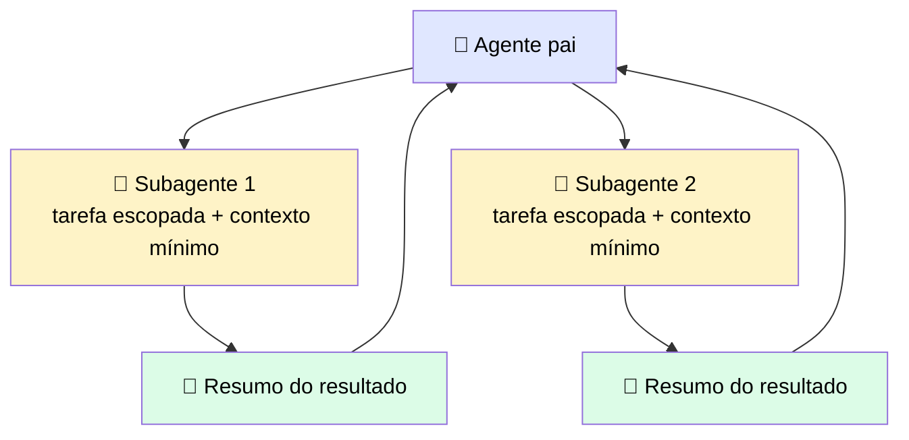

Cada subagente recebe:
- ✅ Tarefa escopada e o contexto mínimo necessário
- ✅ Resultados de passos anteriores diretamente relevantes
- ✅ As tools que precisa para completar a tarefa
- ✅ Condições claras de saída

> ⚠️ Assim como compaction e pruning, subagent handoffs **adicionam overhead de implementação** — use apenas onde o custo de contexto é uma restrição real. Um prompt simples de turno único ou um workflow curto não precisa disso.

---

## ⚖️ 8. Quando usar essas estratégias

| ✅ Funciona bem | 🔄 Considere outra abordagem |
|---|---|
| Sessões de agente multi-etapa que excedem o orçamento de tokens e precisam de decomposição — melhor projetado na fase de arquitetura do que remendado depois em produção | Pipelines que nunca chegam perto do limite da janela — **meça o uso real de tokens** contra o limite do modelo antes de adicionar overhead de gestão |

---

> 🔮 **Aviso do que vem a seguir:** as estratégias aqui assumem que você já sabe que o orçamento de contexto está sob pressão. O ponto crítico é que, muitas vezes, **você só descobre a pressão quando a sessão quebra** — um workload passa em todos os testes de desenvolvimento e falha em produção porque o tool output ficou maior e as sessões ficaram mais longas: a janela que aguentava 20 turnos limpos agora enche no turno 8.

## 🧪 Exemplo prático: agente de suporte técnico que investiga bugs em um repositório

> 🎯 **Cenário:** um agente recebe um ticket como *"o endpoint de checkout está retornando 500 às vezes"* e precisa investigar sozinho, usando tools como `search_codebase`, `read_file`, `run_tests` e `query_logs`.

### 📊 Como a janela enche na prática

| Turno | Ação | 🔢 Tokens aproximados adicionados |
|---|---|---|
| 1️⃣ | Ticket original + system prompt + tool definitions | ~2.000 |
| 2️⃣ | `search_codebase("checkout")` → retorna 15 arquivos com trechos | ~3.000 |
| 3️⃣ | `read_file("checkout_service.py")` → arquivo inteiro, 800 linhas | ~6.000 |
| 4️⃣ | `read_file("payment_gateway.py")` → outro arquivo grande | ~5.500 |
| 5️⃣ | `query_logs(...)` → 200 linhas de log de erro em produção | ~4.000 |
| 6️⃣ | `run_tests(...)` → output completo da suíte, incluindo testes que passaram | ~7.000 |
| 7️⃣ | `read_file("checkout_service_test.py")` | ~4.500 |
| 8️⃣ | Mais uma busca + leitura de arquivo relacionado | ~5.000 |

> <mark>Total até o turno 8: ~37.000 tokens só de contexto acumulado</mark> — e o agente ainda não terminou de investigar.

### 🚩 Os três padrões de desperdício

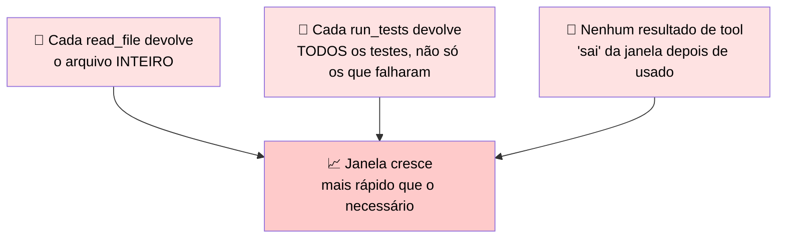

> <mark>Tool outputs em produção costumam ser 3–5x maiores que nos fixtures de teste</mark> — um log de produção real é muito maior que o log sintético de 5 linhas usado para validar o agente em dev.

### 🕳️ Por que isso pega o time de surpresa

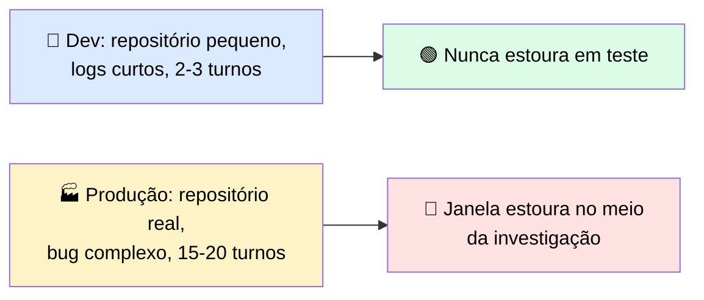

### 🛠️ Como resolver, aplicando as estratégias de context engineering

| Estratégia | 💡 Como se aplicaria aqui |
|---|---|
| ✂️ **Tool design melhor** (retornar só o high-signal) | `read_file` aceitar um range de linhas ou retornar só o trecho relevante, em vez do arquivo inteiro |
| 🗜️ **Compaction** | Depois de investigar um arquivo, resumir "o que foi aprendido" e descartar o conteúdo bruto |
| 🤖 **Subagent handoff** | Um subagente dedicado só para "vasculhar logs de produção", devolvendo um resumo de ~200 tokens em vez dos ~4.000 tokens brutos |
| 🔢 **Token counting** | Checar o orçamento antes de cada `read_file`, alertando/recusando antes de estourar |


# 🔬 Post-mortem: a Sessão que Rodou Bem em Dev e Bateu no Teto em Produção

> 🎯 **Ideia central:** tool outputs consomem contexto do mesmo jeito que prompts e leituras de arquivo. A janela de contexto é um **orçamento fixo** que precisa segurar tudo que Claude vê num turno: system prompt, histórico da conversa, e cada chamada/resultado de tool acumulado até ali.

---

## 📉 A física do problema

> <mark>A janela não mudou de tamanho — o que mudou é quanto cada turno gasta dela.</mark>

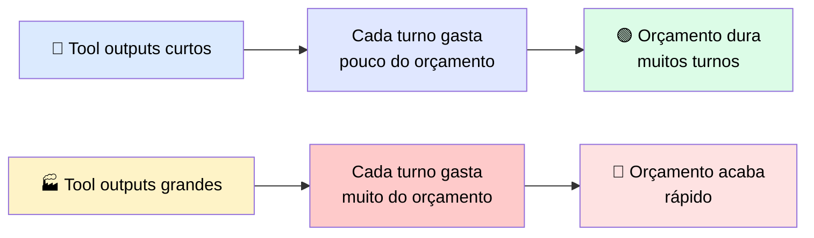

> Uma sessão que roda 20 turnos limpo em desenvolvimento pode começar a falhar no turno 8 em produção — **exatamente por isso**.

---

## 🧾 Post-mortem: orçamento de contexto nunca medido contra tool outputs de produção

### 🎬 Setup

Um agente foi construído para processar recibos de venda sob um **orçamento de 40k tokens de contexto** — um teto de **custo** que o time impôs, não um limite imposto pelo modelo.

> ℹ️ Os modelos atuais da API Claude carregam pelo menos **200k tokens** de janela, e os modelos flagship mais recentes (incluindo Fable) servem **1M tokens** por padrão. Ou seja: o teto de 40k foi uma escolha deliberada de orçamento, não uma limitação técnica.

### 🧪 Em desenvolvimento

| Item | Valor |
|---|---|
| Fixture de teste | 20 recibos |
| Tool result médio | ~800 tokens |
| Sessão completa (20 turnos) | ~18.000 tokens |
| Resultado | ✅ Bem dentro do teto de 40k |

### 🏭 Em produção

Os recibos reais vinham com **documentação de suporte** — registros de transação e correspondência anexa.

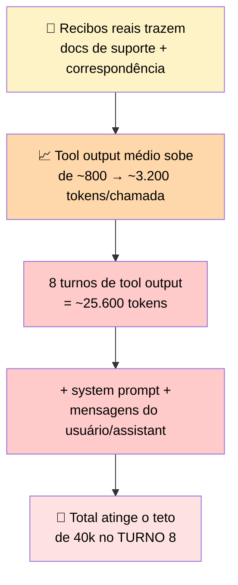

### 🎭 O sintoma enganoso

> <mark>A falha parecia seleção de tool degradada — o agente começou a escolher as tools erradas e retornar análises incompletas.</mark> Mas a causa real era outra.

O system prompt e as instruções iniciais foram **expulsos da janela** pelos tool outputs acumulados que nunca foram removidos após o uso — o agente estava tomando decisões numa janela que **já não continha mais** a orientação com que tinha começado.

### 📊 Comparativo dev vs. produção

| | 🧪 Desenvolvimento | 🏭 Produção |
|---|---|---|
| Janela de contexto disponível | 200k padrão / 1M no Opus e Sonnet atuais | 200k padrão / 1M no Opus e Sonnet atuais |
| Teto de orçamento do time | 40k tokens | 40k tokens |
| Tool output médio | ~800 tokens/chamada | ~3.200 tokens/chamada |
| Turnos até a janela encher | Sessões completavam sem atingir o teto | Teto atingido no **turno 8** |
| Sintoma observado | Nenhum — sessões terminavam limpas | Seleção de tool errada + outputs incompletos a partir do turno 8 |
| Causa raiz identificada por | N/A | Auditoria de uso de tokens, **2 dias após o deploy** |
| Correção | N/A | Podar tool outputs após o uso + aplicar compaction proativamente antes do teto |

---

## 🚨 O que observar

| ⚠️ Alerta | 💡 O que fazer |
|---|---|
| Fixtures de teste são quase sempre **menores** que dados de produção | Medir o custo real em tokens de um tool result contra o **maior input que você conseguir encontrar** nos dados-alvo, antes do agente ir pra produção |
| Sintoma de context overflow **parece** falha de seleção de tool, porque o output visual é parecido | Se a seleção de tool degradar depois de um número fixo de turnos, **verifique primeiro se a janela está enchendo** antes de sair depurando o schema |

> <mark>Isso vale como regra geral: quase todo agente construído contra um conjunto de fixtures vai subestimar o custo real de tokens em produção.</mark> A auditoria que descobriu esse bug só aconteceu 2 dias **depois** do deploy — o ideal é medir isso **antes** de lançar, não depois que já quebrou.

---

## ✅ Checklist de prevenção

- [ ] Medi o tamanho real dos tool outputs contra os **maiores** dados de produção disponíveis, não só as fixtures de teste?
- [ ] Tenho um teto de orçamento de contexto explícito, e ele foi validado contra dados reais?
- [ ] Implementei alguma forma de podar (prune) ou compactar tool outputs **depois de usados**?
- [ ] Se notar seleção de tool degradando ao longo da sessão, minha primeira suspeita é a janela de contexto — **antes** de mexer no schema das tools?

# 🤖 Construindo um Agente de Produção: Loop, Wiring Paths, Orquestração e Human-in-the-Loop

> 🎯 **Definição:** um agente é um **loop de tool-use multi-etapas**, com contexto gerenciado e um objetivo definido. Este guia conecta as peças (schemas de tools + gestão de contexto) num sistema funcionando, e adiciona a camada que nenhum dos dois tópicos cobre sozinho.

> ⚠️ Quando componentes rodam juntos ao longo de vários turnos, surgem **novos modos de falha** que testes isolados não capturam: decisões de roteamento que funcionavam em teste single-turn começam a se acumular, o contexto enche mais rápido que o esperado, um passo que depende de um resultado anterior recebe o input errado porque uma chamada de tool anterior foi mal estruturada.

> ❓ **A pergunta que deve preceder qualquer construção de agente:** *este problema realmente precisa de um agente?* Agentes carregam overhead de coordenação, custo de contexto expandido e mais superfície de falha do que padrões mais simples.

---

## 🧭 1. Workflow ou Agente? Decida antes da primeira linha de código

> <mark>O erro mais crítico no desenvolvimento de agentes é escolher o padrão errado logo no início.</mark> Usar um agente quando um workflow basta adiciona complexidade comportamental sem adicionar capacidade. Usar um workflow quando um agente é necessário produz um sistema que quebra sempre que o input do usuário foge do caminho predeterminado.

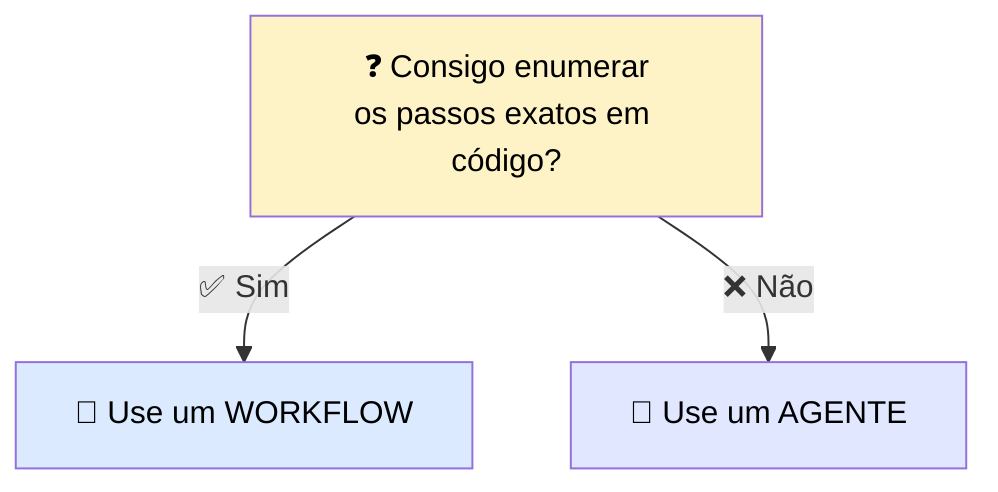

| ✅ Escolha um **workflow** quando... | 🤖 Escolha um **agente** quando... |
|---|---|
| Você consegue enumerar os passos exatos em código | Você consegue especificar o objetivo e as tools, mas não o caminho exato |
| O custo de erro é real e guardrails por etapa importam | O caminho pelo trabalho não pode ser enumerado com antecedência |
| Observabilidade com ferramentas padrão é necessária | Não-determinismo é aceitável e as ações possíveis são restritas pelo toolset registrado |
| Os inputs são bem restritos a um conjunto conhecido | Inputs do usuário variam de forma imprevisível em conteúdo e estrutura |
| Toda execução da tarefa segue a mesma sequência | A tarefa exige sequenciamento criativo das tools disponíveis |

> 📈 **Progressão recomendada:** comece com o padrão mais simples que resolve o problema — uma chamada de API única, depois um workflow, depois um agente. Suba de nível **só** quando o padrão mais simples não der conta da variabilidade exigida.

---

## 🛤️ 2. O agente é o padrão. O "wiring path" é a escolha de implementação

Uma vez decidido que a tarefa precisa de um agente, você também decidiu o **padrão**: um loop que chama tools, gerencia contexto e roda até o objetivo ser atingido. Esse padrão **não muda** conforme o caminho de implementação escolhido — o que muda é **quanto do loop você escreve** versus **quanto você delega**.

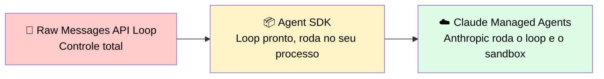

> 📊 Os três caminhos estão num **espectro de quanta infraestrutura você possui**. Escolha com base nas suas restrições de deployment e compliance — <mark>não caia na tentação de escolher o caminho só porque é mais rápido de prototipar.</mark>

### 🔧 Caminho 1 — Raw Messages API Loop

| Aspecto | Detalhe |
|---|---|
| 🔄 Quem roda o loop | **Seu código** — a cada iteração, você envia a requisição, lê os blocos `tool_use`, executa as tools e anexa os resultados |
| 📦 O que você possui | Loop completo, execução de tools, gestão de contexto, retries e condições de saída — **nada é fornecido** |
| ✅ Escolha quando | Precisa de controle total sobre cada passo, tem restrições que uma lib não acomoda, ou está aprendendo como o loop funciona antes de adicionar abstração |
| ⚠️ Checar antes | O custo de manutenção é **todo seu** — cada comportamento que um SDK daria de graça (gestão de contexto, tool calls paralelas) vira código que você escreve e testa |

### 📦 Caminho 2 — Agent SDK

| Aspecto | Detalhe |
|---|---|
| 🔄 Quem roda o loop | O **SDK**, dentro do seu próprio processo — ele itera e gerencia contexto; seu código ainda executa as tools chamadas pelo agente |
| 📦 O que você possui | Execução de tools + a aplicação ao redor. O SDK fornece a estrutura do loop, gestão de contexto e registro de tools |
| ✅ Escolha quando | Você quer o loop, a gestão de contexto e o scaffolding de tools que dão poder ao Claude Code, sem reconstruir tudo — e quer o agente rodando no seu ambiente, em Python ou TypeScript |
| ⚠️ Checar antes | Se recursos baseados em filesystem (como `CLAUDE.md` e skills) carregam ou não é controlado pela configuração `settingSources`. <mark>Nunca confie num default — sempre configure `settingSources` explicitamente</mark> (ex.: `["user", "project", "local"]` para imitar o Claude Code CLI, ou `[]` para rodar totalmente isolado). Confirme o comportamento padrão atual na referência do Agent SDK na hora de construir |

### ☁️ Caminho 3 — Claude Managed Agents (beta pública)

| Aspecto | Detalhe |
|---|---|
| 🔄 Quem roda o loop | **Anthropic** roda o loop e o sandbox. Sua aplicação envia eventos de usuário e recebe os resultados via server-sent events |
| 📦 O que você possui | A camada de aplicação e a **definição do agente** (modelo, system prompt, tools, servidores MCP, skills) — definida uma vez e referenciada por ID entre sessões |
| ✅ Escolha quando | A tarefa é longa (minutos a horas), você quer um sandbox gerenciado, ou você prefere não construir loop + sandbox + camada de execução de tools |
| ⚠️ Checar antes | Sessões são **stateful e armazenadas server-side** — <mark>não são elegíveis para Zero Data Retention ou um BAA de HIPAA</mark>. Também disponível no Claude Platform na AWS, com diferenças de recursos — verifique paridade de capacidade contra sua superfície de deployment. Requer o header beta `managed-agents-2026-04-01`; comportamentos podem mudar entre releases — construa com um plano de migração |

### 🔍 Managed Agents: o que você deixa de possuir, e o que passa a assumir

| Categoria | ❌ O que você deixa de possuir | ✅ O que você passa a assumir |
|---|---|---|
| ⚙️ Execução e infraestrutura | O loop de iteração, o sandbox de execução, os retries internos, o runtime de execução de tools | Uma definição de agente gerenciada como recurso de API versionado + uma camada de aplicação que envia eventos e consome resultados |
| ⏱️ Duração de sessão e estado | Gestão de execução longa — sessões podem rodar minutos ou horas sem seu processo segurar o loop aberto | Estado de sessão server-side. Sessões são armazenadas pela Anthropic, sujeitas às políticas de dados dela |
| 📦 Ciclo de vida do sandbox | Provisionamento e desligamento do sandbox para execução de tools | Dependência das tools disponíveis no sandbox gerenciado e no modelo de execução dele |

### 🚧 A restrição que decide para trabalho regulado

> <mark>Sessões de Managed Agents são armazenadas server-side, e por isso não são elegíveis para <abbr title="Zero Data Retention — modo de operação em que o provedor não guarda nenhuma cópia dos prompts/respostas após processar a requisição">Zero Data Retention</abbr> nem para um <abbr title="Business Associate Agreement — contrato exigido pela HIPAA para quem processa dados de saúde em nome de outra organização">BAA</abbr> de <abbr title="Health Insurance Portability and Accountability Act — lei americana de privacidade e segurança de dados de saúde">HIPAA</abbr>.</mark> Se sua carga envolve <abbr title="Protected Health Information — informações de saúde protegidas, como prontuários e diagnósticos">PHI</abbr> ou tem exigência de <abbr title="Zero Data Retention — modo de operação em que o provedor não guarda nenhuma cópia dos prompts/respostas após processar a requisição">ZDR</abbr>, esse caminho fica **descartado**, não importa o quão bem ele encaixe operacionalmente — você vai para o Agent SDK ou um raw loop numa configuração coberta. A restrição regulatória decide o caminho antes da conveniência ter voz.

> 🔄 **Progressão comum:** prototipar no Agent SDK localmente, depois migrar para Managed Agents em produção. A definição do agente é conceitualmente a mesma, mas o **formato muda** — espere um passo de "reexpressão", não uma exportação direta.

| ✅ Funciona bem | ⚠️ Adiciona custo/complexidade | 🔄 Considere outra abordagem |
|---|---|---|
| Agentes de longa duração, e cargas onde você prefere não construir/proteger um sandbox e loop sozinho | Sessões stateful server-side, formato de definição "agente como recurso", superfície beta que pode mudar entre releases | Para PHI, ZDR, ou quando precisa de controle total in-process — fique no Agent SDK ou num raw loop numa config coberta |

---

## 🔩 3. Conectando o loop: os quatro passos que valem para qualquer caminho

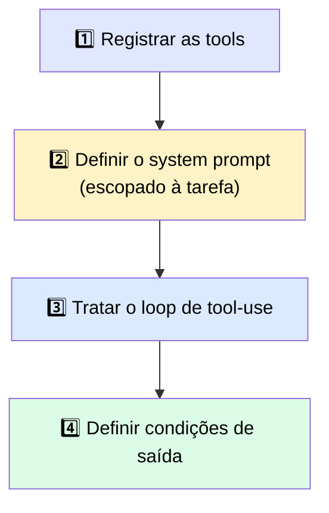

| Passo | O que fazer |
|---|---|
| 1️⃣ **Registrar tools** | Cada tool segue a mesma estrutura de schema. O SDK as registra contra o agente, para Claude saber o que está disponível |
| 2️⃣ **Definir o system prompt** | Escopar para a tarefa do agente. Um system prompt amplo produz roteamento de tool mais amplo e menos confiável. Nomear a tarefa específica e as tools disponíveis produz comportamento mais consistente |
| 3️⃣ **Tratar o loop de tool-use** | Seja você iterando ou o SDK fazendo isso, seu código lida com a execução. <mark>Toda chamada de tool que Claude emite precisa ser executada pelo seu código e retornada num bloco `tool_result`</mark> |
| 4️⃣ **Definir condições de saída** | O loop roda até receber uma condição de parada. Sem condições explícitas, <mark>o agente vai continuar pedindo tool calls além do que a tarefa exige</mark> |

### ✅ Checklist de wiring do loop (vale para qualquer caminho)

| # | Item | O que verificar |
|---|---|---|
| 1️⃣ | Tools registradas | Toda tool que o agente pode precisar está na lista de registro. Nenhuma tool não registrada é referenciada no system prompt |
| 2️⃣ | System prompt escopado | Nomeia a tarefa e as tools disponíveis. Não descreve tools que o agente não tem. Não omite tools que o agente tem e que exigem orientação de escopo |
| 3️⃣ | Loop de tool-use implementado | Seu código trata todo bloco `tool_use` emitido por Claude e retorna um `tool_result` para cada um **antes** do próximo turno do assistant. Todos os `tool_use` de um mesmo turno devem ser resolvidos juntos |
| 4️⃣ | Ponto de inserção de HITL definido | Ao menos um ponto do loop tem uma checagem humana |
| 5️⃣ | Condições de saída definidas | O loop tem um critério de parada claro que **não depende** de Claude se oferecer para parar |

---

## 🙋 4. Human-in-the-Loop (HITL): onde inserir e quando

> ❓ **A pergunta que determina onde inserir um checkpoint:** *qual é o pior resultado possível se este passo rodar sem checagem humana?*

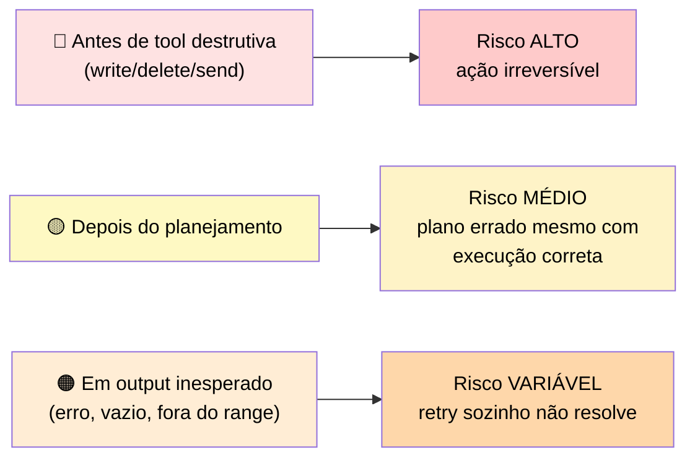

| Ponto de inserção | O que dispara a checagem | Nível de risco |
|---|---|---|
| 🔴 **Antes de uma tool destrutiva** | O agente está prestes a executar write, delete ou send | **Alto** — ações irreversíveis onde uma chamada errada não pode ser desfeita |
| 🟡 **Depois de um passo de planejamento** | O agente gerou um plano e está prestes a começar a executá-lo | **Médio** — planos incorretos que produziriam o resultado errado mesmo com todos os passos executando corretamente |
| 🟠 **Em output inesperado** | O tool result tem flag de erro, resultado vazio, ou valor fora dos limites esperados | **Variável** — captura modos de falha que a lógica de retry sozinha não resolve |

---

## ⚖️ 5. Orquestração de tools: over-tooling e under-tooling

> 💬 O comportamento de roteamento do agente é moldado por duas coisas: **como as tools são descritas** e **quantas tools estão registradas**.

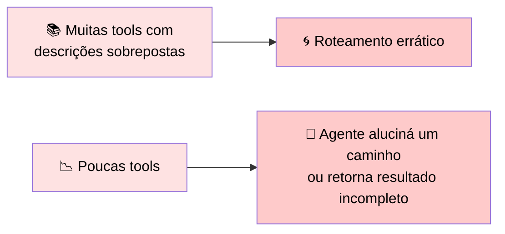

> <mark>Over-tooling é o problema mais comum em agentes de produção.</mark> Times registram toda tool que "pode precisar" e descobrem que a qualidade de seleção do Claude degrada conforme a superfície de tools cresce.

✅ **Regra prática:** comece com o conjunto mínimo necessário para a tarefa, e adicione tools só quando uma lacuna específica de capacidade for confirmada.

| Quando agentes são a escolha certa | O que você assume ao usar um Agente | Quando escolher um workflow em vez disso |
|---|---|---|
| Tarefas orientadas a objetivo onde o caminho exato não pode ser enumerado com antecedência. Lidar com inputs variáveis que exigiriam dezenas de branches condicionais num workflow | Agentes adicionam complexidade comportamental: o caminho pela tarefa emerge do raciocínio do modelo sobre o contexto acumulado, não de lógica de branching explícita. Observabilidade exige ferramental de nível transcript, não logging operacional padrão | Quando você consegue enumerar os passos em código, use um workflow. Agentes são o último passo da progressão — suba de nível só quando o padrão mais simples não der conta |

---

## 🏛️ 6. Restrições regulatórias definem sua rota de entrega antes do wiring

> ⚠️ Se seus dados precisam ser tratados sob restrições específicas (sigilo advogado-cliente, <abbr title="Health Insurance Portability and Accountability Act — lei americana de privacidade e segurança de dados de saúde">HIPAA</abbr>, <abbr title="General Data Protection Regulation — regulamento europeu de proteção de dados pessoais">GDPR</abbr>, <abbr title="Federal Risk and Authorization Management Program — programa de certificação de segurança em nuvem do governo dos EUA">FedRAMP</abbr>, ou política interna de residência de dados), <mark>essa restrição decide qual endpoint seu código chama, quais credenciais ele carrega e onde seus logs vão parar — antes de qualquer decisão de design sobre prompts, tools ou memória.</mark>

```mermaid
flowchart TD
    A["🏛️ Restrição regulatória<br/>identificada"] --> B{"Qual tipo?"}
    B -->|"Sigilo advogado-cliente"| C1["API/SDK direto,<br/>via gateway aprovado + logging completo"]
    B -->|"HIPAA / PHI"| C2["Config coberta por BAA<br/>ou Bedrock/Vertex HIPAA-eligible"]
    B -->|"GDPR / residência de dados"| C3["Rota via Bedrock/Vertex<br/>com região fixada"]
    B -->|"FedRAMP / governo"| C4["C4G, Bedrock GovCloud,<br/>ou Vertex Assured Workloads"]
    B -->|"Residência interna"| C5["Rota no vendor de nuvem<br/>já aprovado pelo CIO"]

    style A fill:#fef3c7,color:#000000
    style B fill:#e0e7ff,color:#000000
    style C1 fill:#dcfce7,color:#000000
    style C2 fill:#dcfce7,color:#000000
    style C3 fill:#dcfce7,color:#000000
    style C4 fill:#dcfce7,color:#000000
    style C5 fill:#dcfce7,color:#000000
```

| Restrição | 🚫 O que costuma ficar de fora | ✅ O que costuma sobreviver a uma revisão de código |
|---|---|---|
| ⚖️ **Sigilo advogado-cliente** | Chamadas de uma superfície consumer-grade do Claude.ai que a firma não consegue auditar ponta a ponta | Chamadas de API/SDK diretas dentro da aplicação da firma, autenticadas via SSO, roteadas por um gateway de LLM aprovado com logging completo de request/response |
| 🏥 **<abbr title="Health Insurance Portability and Accountability Act — lei americana de privacidade e segurança de dados de saúde">HIPAA</abbr> (dados de saúde/<abbr title="Protected Health Information — informações de saúde protegidas, como prontuários e diagnósticos">PHI</abbr>)** | Código que envia <abbr title="Protected Health Information — informações de saúde protegidas, como prontuários e diagnósticos">PHI</abbr> a qualquer endpoint/rota não coberto por um <abbr title="Business Associate Agreement — contrato exigido pela HIPAA para quem processa dados de saúde em nome de outra organização">BAA</abbr> para a configuração específica em uso | Chamadas de API/SDK diretas numa configuração coberta por <abbr title="Business Associate Agreement — contrato exigido pela HIPAA para quem processa dados de saúde em nome de outra organização">BAA</abbr> (organização HIPAA-enabled dedicada), ou rota via AWS Bedrock/GCP Vertex numa conta cloud já HIPAA-eligible. ⚠️ O <abbr title="Business Associate Agreement — contrato exigido pela HIPAA para quem processa dados de saúde em nome de outra organização">BAA</abbr> **não cobre** Console, Workbench, betas ou planos consumer |
| 🇪🇺 **<abbr title="General Data Protection Regulation — regulamento europeu de proteção de dados pessoais">GDPR</abbr> e residência de dados** | Rotas onde a região de execução do modelo não pode ser fixada em código, ou onde a requisição pode ser servida fora da fronteira geográfica aprovada | Rota via Bedrock ou Vertex, com a região fixada na configuração do cliente. A API direta da Anthropic **não** oferece residência de dados na UE atualmente |
| 🏛️ **<abbr title="Federal Risk and Authorization Management Program — programa de certificação de segurança em nuvem do governo dos EUA">FedRAMP</abbr> e governo** | Qualquer caminho de código que chame um endpoint fora de um ambiente cloud autorizado no nível de impacto exigido | Três rotas autorizadas: Claude for Government (C4G, FedRAMP High via PFCS-SS), Claude via Amazon Bedrock GovCloud (FedRAMP High, DoD IL4/5), Claude via Vertex AI Assured Workloads. Claude Enterprise na AWS Marketplace **não** é <abbr title="Federal Risk and Authorization Management Program — programa de certificação de segurança em nuvem do governo dos EUA">FedRAMP</abbr> autorizado |
| 🏢 **Política interna de residência de dados** | Chamadas de qualquer cliente SDK configurado contra um vendor de nuvem fora da lista aprovada pela empresa | A rota de entrega no vendor de nuvem já aprovado — construa contra essa opção, sem trocar no meio do projeto |

> ℹ️ <abbr title="Service Organization Control 2 — auditoria de segurança e controles operacionais de um provedor de serviços">SOC 2</abbr> não entra nessa tabela — ele governa **como** seus sistemas são construídos e operados, não **qual endpoint** seu código chama.

---

> 🔮 **Próximo passo:** o Módulo 4 (Engenharia de Produção, Evals & Segurança) aprofunda em padrões secure-by-design para IAM e privacidade, defesas contra prompt injection de inputs não confiáveis, guardrails de runtime e hardening de agentes. O papel desta seção foi mais estreito: trazer a restrição à tona no ponto da construção onde ela realmente elimina opções — a escolha do endpoint, da configuração do cliente SDK, e das credenciais que seu agente carrega para produção.

# 🔬 Post-mortem: o Agente que Editou um Arquivo de Produção

> 🎯 **Ideia central:** o agente funciona de ponta a ponta em testes porque o ambiente de teste é tolerante — a produção não é. O agente tinha as **mesmas tools**, o **mesmo loop**, o **mesmo system prompt**, mas o checkpoint de HITL estava faltando porque os testes nunca expuseram um caso de uso onde ele fosse necessário.

---

## 🎬 Setup: um agente de edição de arquivos, testado num diretório de rascunho, implantado num ambiente de cliente

Um desenvolvedor construiu um agente capaz de **ler, modificar e escrever** arquivos de configuração, com três tools:

| Tool | Papel |
|---|---|
| 📖 `read_file` | Lê o arquivo de configuração |
| ✏️ `write_file` | Escreve a alteração proposta |
| ✅ `validate_config` | Valida se o config resultante está dentro do schema |

### 🔄 O loop do agente

```mermaid
flowchart TD
    A["📖 Lê o config"] --> B["✏️ Propõe e escreve edição"]
    B --> C["✅ Roda validate_config"]
    C --> D{"Passou na validação?"}
    D -->|"❌ Não"| E["Ajusta a edição<br/>e escreve de novo"]
    E --> C
    D -->|"✅ Sim"| F["🏁 Loop termina"]
    E -.->|"até 10 iterações"| G["⏱️ Cap de segurança"]

    style A fill:#e0e7ff,color:#000000
    style B fill:#fef3c7,color:#000000
    style C fill:#dbeafe,color:#000000
    style D fill:#fff7cd,color:#000000
    style E fill:#fed7aa,color:#000000
    style F fill:#dcfce7,color:#000000
    style G fill:#fecaca,color:#000000
```

Testado num **diretório de rascunho**, com uma cópia do config-alvo, o agente funcionou corretamente em **todo** caso de teste — convergindo para um config válido em 2 ou 3 iterações, tipicamente.

---

## 💥 O que aconteceu em produção

```mermaid
sequenceDiagram
    participant Ag as 🤖 Agente
    participant Cfg as 📄 Config do cliente
    participant App as 🏭 Aplicação do cliente

    Ag->>Cfg: Identifica parâmetro (rate limit) fora do range
    Ag->>Cfg: write_file (corrige o valor)
    Ag->>Cfg: validate_config
    Cfg-->>Ag: ✅ PASSOU (dentro do schema)
    Ag->>Ag: 🏁 Loop termina em 1 iteração — "exatamente como projetado"
    Note over App: ⏱️ Minutos depois...
    Cfg->>App: Novo rate limit em vigor
    App--xApp: 💥 Requisições sendo throttled<br/>além do que a aplicação suporta
```

O agente identificou corretamente que um parâmetro de configuração — um **rate limit** do qual a aplicação do cliente dependia — estava fora do range. Propôs uma correção, chamou `write_file`, rodou `validate_config` de novo, e recebeu um "passou". <mark>O loop terminou de forma limpa numa única iteração, exatamente como projetado.</mark> O cap de 10 iterações nunca foi atingido, porque nunca foi necessário.

> ⚠️ **O design do loop estava correto. O problema era a condição de saída.**

### 🕳️ A lacuna exata

| O que `validate_config` checava | O que `validate_config` **não** checava |
|---|---|
| ✅ O valor está dentro do range permitido pelo schema | ❌ Se sistemas downstream dependiam do valor antigo |

<mark>O agente fez exatamente o que o desenvolvedor pediu: editou, validou, e saiu quando a validação passou.</mark> A falha não estava no loop — estava no fato de que a **condição de saída** (`validate_config` retorna "passou") era escopada apenas ao arquivo sendo editado, e **não havia checkpoint** entre "a validação passou neste arquivo" e "a escrita foi comprometida no ambiente do cliente".

```mermaid
flowchart LR
    A["✅ Validação passou<br/>no arquivo"] -->|"❌ SEM checkpoint aqui"| B["💾 Escrita comprometida<br/>no ambiente do cliente"]

    style A fill:#dcfce7,color:#000000
    style B fill:#fee2e2,color:#000000
```

> 🎯 **A peça que faltava:** um checkpoint no design do loop — antes da **primeira** chamada de `write_file` atingir o config ao vivo do cliente, pausar e apresentar a mudança proposta para revisão humana. Na prática, isso significa que o loop precisa de um branch explícito entre **"mudança proposta pronta"** e **"escrita comprometida"** — um estado que o desenvolvedor nunca adicionou porque os testes nunca produziram um caso que o exigisse.

---

## 🚨 O que observar

> 💬 O padrão que esse incidente ilustra é uma **pergunta de permissões que nunca foi feita durante o design.** O agente tinha acesso de escrita porque a tarefa envolvia edição de arquivos, e a tarefa em si era legítima. <mark>O que a equipe perdeu de vista foi a lacuna entre um agente que propõe uma mudança e um que a comete.</mark>

Num ambiente de teste descartável, essa lacuna **nunca aparece**, porque nada que uma "escrita errada" toca importa em teste — a produção é diferente.

### ❓ A pergunta de design que nunca foi feita

> **"Qual é o pior resultado possível se `write_file` rodar sem checagem humana?"**

A resposta a essa pergunta determina se um checkpoint de human-in-the-loop é necessário **antes** da tool poder executar.

---

## ✅ Regra de ouro

> <mark>Se uma tool pode tomar uma ação irreversível em produção, ela precisa de um checkpoint antes de rodar.</mark> Registre essa restrição durante o **design** — quando você está escopando a superfície de tools — não depois do primeiro incidente acontecer.

### 📋 Checklist de prevenção

- [ ] Para cada tool com poder de escrita/exclusão/envio, já perguntei: *"qual o pior resultado possível se ela rodar sem checagem humana?"*
- [ ] A condição de saída do meu loop está escopada corretamente — ela valida só o arquivo/artefato, ou também considera o impacto de **comprometer** a mudança no ambiente real?
- [ ] Existe um branch explícito entre "mudança proposta" e "mudança comprometida" para toda tool destrutiva?
- [ ] Meu ambiente de teste consegue expor cenários onde uma escrita "correta" ainda causa dano — ou ele é forgiving demais para revelar esse tipo de falha?

# 🧪 Checkpoint · Preenchendo os Gaps de um Agente Parcial

> 🎯 **Desafio:** a implementação abaixo tem duas lacunas. **Gap 1:** a descrição da tool `update_record`. **Gap 2:** o código do checkpoint de HITL antes de executar `update_record`.

---

## 🕳️ Gap 1 — Descrição da tool `update_record`

> <mark>Uma descrição fraca ("use isto para atualizar um registro") não dá a Claude nenhum critério de quando usar/não usar. A boa descrição precisa dizer o que a tool faz, quando usar, e — crucialmente — sinalizar que é uma ação com peso (dado que ela **modifica** dados de cliente).</mark>

```python
"description": (
    "Use this to update a single field on an existing customer record, "
    "identified by customer_id. This performs a write operation that "
    "overwrites the current value of the specified field — it is not "
    "reversible through this tool. Only use this after confirming with "
    "read_record that the customer_id exists and the field name is valid. "
    "Do not use this to create a new record or to read data; use "
    "read_record for lookups."
),
```

| Elemento da descrição | Por quê |
|---|---|
| 📝 O que faz | "Atualiza um único campo de um registro existente" — específico, não genérico |
| ⚠️ Natureza da ação | Sinaliza explicitamente que é uma **escrita irreversível por essa tool** — importante para o Claude entender o peso da chamada |
| ✅ Quando usar | Só depois de confirmar `customer_id` e `field` via `read_record` |
| 🚫 Quando não usar | Não usar para criar registro novo, nem para leitura — evita sobreposição com `read_record` |

---

## 🕳️ Gap 2 — Checkpoint de HITL

> <mark>`update_record` é uma tool destrutiva — ela escreve. Segundo a regra de ouro do design de HITL: se uma tool pode tomar uma ação irreversível, ela precisa de um checkpoint antes de rodar.</mark> O checkpoint intercepta a chamada **antes** de `execute_tool`, e só deixa passar se for aprovada.

```python
DESTRUCTIVE_TOOLS = {"update_record"}

for block in response.content:
    if block.type == "tool_use":

        # --- Checkpoint de HITL ---
        if block.name in DESTRUCTIVE_TOOLS:
            approved = request_human_approval(block.name, block.input)
            if not approved:
                result = {
                    "error": "Action rejected by human reviewer.",
                    "is_error": True
                }
                tool_results.append({
                    "type": "tool_result",
                    "tool_use_id": block.id,
                    "content": str(result),
                    "is_error": True
                })
                continue  # pula a execução real, vai para o próximo bloco
        # --- Fim do checkpoint ---

        result = execute_tool(block.name, block.input)
        tool_results.append({
            "type": "tool_result",
            "tool_use_id": block.id,
            "content": result
        })


def request_human_approval(tool_name: str, tool_input: dict) -> bool:
    print(f"\n⚠️  Claude quer executar: {tool_name}")
    print(f"    Argumentos: {tool_input}")
    resposta = input("Aprovar essa ação? (s/n): ")
    return resposta.strip().lower() == "s"
```

### 🔍 Por que o checkpoint é estruturado assim

| Elemento do código | Por quê |
|---|---|
| `DESTRUCTIVE_TOOLS = {"update_record"}` | Define explicitamente **quais** tools exigem checagem — `read_record` fica de fora, pois é só leitura |
| Checkpoint roda **antes** de `execute_tool` | O ponto de interceptação precisa ficar antes da execução real, nunca depois |
| Rejeição gera um `tool_result` com `is_error: True` | Claude **precisa** receber uma resposta para o `tool_use` — sem isso, a API rejeita a próxima requisição por falta de pareamento `tool_use` ↔ `tool_result` |
| `continue` pula a execução real | Garante que, se rejeitado, `execute_tool` nunca é chamado |
| Aprovação síncrona (`input()`) | Versão simples para exemplo/teste — em produção, isso normalmente vira uma fila assíncrona (ex.: aprovação via Slack/painel) que retoma a sessão depois |

---

## 🧩 3. Implementação completa (os dois gaps preenchidos)

```python
tools = [
    {
        "name": "read_record",
        "description": "Use this to read a customer record by customer_id.",
        "input_schema": {
            "type": "object",
            "properties": {
                "customer_id": {"type": "string"}
            },
            "required": ["customer_id"]
        }
    },
    {
        "name": "update_record",
        "description": (
            "Use this to update a single field on an existing customer record, "
            "identified by customer_id. This performs a write operation that "
            "overwrites the current value of the specified field — it is not "
            "reversible through this tool. Only use this after confirming with "
            "read_record that the customer_id exists and the field name is valid. "
            "Do not use this to create a new record or to read data; use "
            "read_record for lookups."
        ),
        "input_schema": {
            "type": "object",
            "properties": {
                "customer_id": {"type": "string"},
                "field": {"type": "string"},
                "new_value": {"type": "string"}
            },
            "required": ["customer_id", "field", "new_value"]
        }
    }
]

DESTRUCTIVE_TOOLS = {"update_record"}


def run_agent_loop(user_request):
    messages = [{"role": "user", "content": user_request}]

    while True:
        response = client.messages.create(
            model=model, max_tokens=4096,
            tools=tools,
            messages=messages
        )

        if response.stop_reason == "end_turn":
            return response

        if response.stop_reason == "tool_use":
            messages.append({"role": "assistant", "content": response.content})

            tool_results = []
            for block in response.content:
                if block.type == "tool_use":

                    if block.name in DESTRUCTIVE_TOOLS:
                        approved = request_human_approval(block.name, block.input)
                        if not approved:
                            result = {
                                "error": "Action rejected by human reviewer.",
                                "is_error": True
                            }
                            tool_results.append({
                                "type": "tool_result",
                                "tool_use_id": block.id,
                                "content": str(result),
                                "is_error": True
                            })
                            continue

                    result = execute_tool(block.name, block.input)
                    tool_results.append({
                        "type": "tool_result",
                        "tool_use_id": block.id,
                        "content": result
                    })

            messages.append({"role": "user", "content": tool_results})


def request_human_approval(tool_name: str, tool_input: dict) -> bool:
    print(f"\n⚠️  Claude quer executar: {tool_name}")
    print(f"    Argumentos: {tool_input}")
    resposta = input("Aprovar essa ação? (s/n): ")
    return resposta.strip().lower() == "s"
```

---

## 🗺️ 4. Diagrama do fluxo com o checkpoint

```mermaid
flowchart TD
    A["🧠 Claude emite tool_use"] --> B{"Tool está em<br/>DESTRUCTIVE_TOOLS?"}
    B -->|"❌ Não (ex: read_record)"| C["⚙️ execute_tool roda direto"]
    B -->|"✅ Sim (ex: update_record)"| D["🙋 request_human_approval"]
    D --> E{"Humano aprovou?"}
    E -->|"✅ Sim"| C
    E -->|"❌ Não"| F["🚫 tool_result com is_error=True<br/>execução real NUNCA roda"]
    C --> G["📦 tool_result devolvido a Claude"]
    F --> G
    G --> H["🔁 Claude continua o loop"]

    style A fill:#e0e7ff,color:#000000
    style B fill:#fff7cd,color:#000000
    style C fill:#dcfce7,color:#000000
    style D fill:#fef3c7,color:#000000
    style E fill:#fff7cd,color:#000000
    style F fill:#fecaca,color:#000000
    style G fill:#dbeafe,color:#000000
    style H fill:#e0e7ff,color:#000000
```

---

## ✅ Checklist de validação dos dois gaps

- [ ] A descrição de `update_record` diz **quando usar** e **quando não usar**?
- [ ] A descrição sinaliza que é uma ação de **escrita**, distinguindo-a de `read_record`?
- [ ] O checkpoint de HITL intercepta **antes** de `execute_tool`?
- [ ] Uma rejeição ainda gera um `tool_result` válido (com `tool_use_id` correspondente), em vez de deixar o `tool_use` sem resposta?
- [ ] `read_record` (não-destrutiva) segue fluindo sem passar pelo checkpoint?

# 🧠 Escolhendo o Escopo Certo para Estado que Sobrevive entre Sessões

> 🎯 **Ideia central:** o agente da seção anterior roda corretamente **dentro** de uma sessão. O que ele não consegue fazer é lembrar de nada quando a sessão termina. **Memory scope** (escopo de memória) é como você decide o que o agente deve saber no início da próxima sessão — e quanto custa carregar esse conhecimento adiante.

---

## 🧩 1. Padrões de design de agentes já vistos neste módulo

| Padrão | O que faz |
|---|---|
| 🔁 **Tool-use loop** | O modelo chama uma tool, lê o resultado, e continua |
| 🪜 **Decomposição multi-etapa** | Quebra um objetivo em subtarefas ordenadas |
| 🗺️ **Planning-and-execution** | Separa **decidir** o plano de **executá-lo** — o mesmo split que o checkpoint de HITL pós-planejamento protege |
| 🧠 **Memory scope** | Decide **qual estado sobrevive** depois que o loop termina |

---

## ⚖️ 2. Os dois modos de falha — e eles puxam em direções opostas

```mermaid
flowchart LR
    A["📈 Estado demais<br/>in-context"] --> B["💸 Infla cada chamada de API<br/>(modelo relê tudo a cada turno)"]
    C["📉 Estado de menos<br/>em storage persistente"] --> D["🕳️ Agente perde memória<br/>entre sessões"]

    style A fill:#fef3c7,color:#000000
    style B fill:#fee2e2,color:#000000
    style C fill:#fef3c7,color:#000000
    style D fill:#fee2e2,color:#000000
```

> <mark>Escolher o escopo errado tem dois modos de falha, e eles puxam em direções opostas:</mark> estado demais no contexto ativo infla o custo de token conforme a conversa cresce; estado de menos em storage persistente apaga tudo que não foi escrito assim que a conversa termina.

---

## 📋 3. As quatro abordagens de memória

| Escopo | 💾 O que persiste | 💰 Custo | ✅ Quando usar | ❌ O que você perde |
|---|---|---|---|---|
| 💬 **In-context memory** | Estado vive na conversa ativa, sobrevive entre turnos dentro de **uma** sessão | Zero overhead de retrieval; infla custo de token conforme a conversa cresce | Sessões curtas onde todo o estado necessário cabe na janela e nada precisa sobreviver a um restart | **Tudo**, assim que a sessão termina. Um `/clear` ou nova sessão apaga o estado |
| 🗄️ **External storage** | Estado é escrito num banco de dados e lido de volta no início da sessão ou sob demanda | Cada chamada ao banco adiciona latência de retrieval; você assume o trabalho de engenharia de leitura/escrita | Estado que precisa sobreviver entre sessões, migrar entre usuários, ou ser compartilhado entre múltiplas instâncias de agente | Nada do lado da persistência — o custo aparece como latência em cada chamada e complexidade de implementação contínua |
| 📝 **Summarized memory** | Uma versão condensada da conversa anterior é gerada e injetada no início da próxima sessão | Custo de token por sessão menor que reproduzir o histórico completo, mas a sumarização descarta detalhe | Agentes conversacionais de longa duração, onde o histórico completo ultrapassaria o orçamento de contexto antes da conversa acabar | Qualquer detalhe que o summarizer não preservou — o agente só vê o que o prompt de sumarização escolheu manter |
| 🚫 **No persistent memory (stateless)** | Nada. Cada sessão é independente | Nenhum overhead — não há nada para recuperar ou armazenar | Agentes de execução de tarefa que terminam e encerram, ou pipelines onde cada sessão é totalmente independente por design | Todo o contexto anterior — se um follow-up depende de algo de uma sessão anterior, o agente não tem como alcançar |

---

## 🏗️ 4. Escolha o escopo de memória na fase de design — não no refactor de produção

```mermaid
flowchart TD
    A["🎯 Fase de design"] --> B{"O agente ajuda o mesmo<br/>usuário por vários dias?"}
    B -->|"✅ Sim"| C["🗄️ Precisa carregar estado<br/>entre sessões (storage/summary)"]
    B -->|"❌ Não, recebe um job<br/>e encerra"| D["🚫 Roda stateless"]

    style A fill:#e0e7ff,color:#000000
    style B fill:#fef3c7,color:#000000
    style C fill:#dbeafe,color:#000000
    style D fill:#dcfce7,color:#000000
```

### 🕳️ O caminho padrão que parece razoável no início

```mermaid
flowchart TD
    A["📦 Guarda histórico completo<br/>no array messages"] --> B["✅ Protótipo funciona"]
    B --> C["⏳ Continua funcionando<br/>por um tempo"]
    C --> D["📈 Custo de token escala<br/>com cada turno adicional"]
    D --> E["🐢 Latência sobe conforme<br/>a janela enche"]
    E --> F["🛑 Sessão longa atinge<br/>o limite rígido — agente para de responder"]
    F --> G["🔧 Refactor sob pressão de produção:<br/>tirar estado do contexto ativo,<br/>mover para storage externo"]

    style A fill:#dbeafe,color:#000000
    style B fill:#dcfce7,color:#000000
    style C fill:#fef9c3,color:#000000
    style D fill:#fed7aa,color:#000000
    style E fill:#fed7aa,color:#000000
    style F fill:#fecaca,color:#000000
    style G fill:#fee2e2,color:#000000
```

> <mark>O refactor em si é mecânico — algumas centenas de linhas de código e um banco de dados que o time já tem. O que ele custa é o timing.</mark> O trabalho acontece sob pressão de produção, geralmente com um prazo já em andamento, e cada hora gasta reestruturando memória é uma hora não gasta no que o agente deveria estar fazendo. Decidir na fase de design é barato; decidir na hora do refactor é caro.

| ✅ Funciona bem | ⚠️ Adiciona custo/complexidade | 🔄 Considere outra abordagem |
|---|---|---|
| O escopo de memória bate com a tarefa desde o design: external storage para threads entre sessões, stateless para jobs autocontidos, in-context para sessões curtas que não precisam sobreviver a um restart | External storage adiciona latência de retrieval + lógica de leitura/escrita. Summarized memory depende de um prompt de summarizer bem especificado — sem isso, estado crítico é descartado a cada compressão | Manter todo o estado in-context assumindo que a janela "vai ser grande o suficiente" — meça o uso real de tokens contra o limite antes de se comprometer |

---

## 🛠️ 5. Skills: instruções reutilizáveis que carregam sob demanda

> 💬 Há um problema relacionado, mas distinto, ao escopo de memória: como carregar **instruções repetíveis** entre tarefas sem pagar para injetá-las em toda sessão. O padrão para isso é uma **Skill** — um arquivo markdown reutilizável que ensina Claude a lidar com um tipo específico de tarefa, uma vez. Claude carrega a Skill automaticamente quando a requisição bate com a descrição dela.

```mermaid
flowchart LR
    A["📩 Requisição do usuário"] --> B["🔍 Claude compara com<br/>name + description<br/>de cada Skill disponível"]
    B --> C{"Bate com alguma?"}
    C -->|"✅ Sim"| D["📖 Carrega as instruções<br/>completas da Skill"]
    C -->|"❌ Não"| E["🚫 Instruções nunca entram<br/>na janela de contexto"]

    style A fill:#e0e7ff,color:#000000
    style B fill:#fef3c7,color:#000000
    style C fill:#fff7cd,color:#000000
    style D fill:#dcfce7,color:#000000
    style E fill:#dbeafe,color:#000000
```

Uma Skill vive num arquivo `SKILL.md`, com duas partes:

| Parte | Papel |
|---|---|
| 📋 **Frontmatter** | `name` + `description` — o **critério de correspondência** |
| 📖 **Instruções** | O conteúdo completo, carregado **só** quando há match |

> ⚠️ **Comportamento do `CLAUDE.md` varia por ambiente:** na Claude Code CLI, um `CLAUDE.md` carrega em **toda** sessão, não importa a tarefa. No Agent SDK, se ele carrega ou não é controlado pela configuração `settingSources` — <mark>não confie num default, configure explicitamente</mark> e confirme o comportamento atual na referência do Agent SDK na hora de construir.
>
> Uma **Skill**, em contraste, carrega só quando a tarefa exige — nos **dois** ambientes.

---

## 🆚 6. Skills vs. CLAUDE.md vs. instruções in-context

| Padrão | ⏰ Quando carrega | 💰 Custo de contexto | 🎯 Melhor para |
|---|---|---|---|
| 🛠️ **Skill (`SKILL.md`)** | Sob demanda, quando a requisição bate com a descrição da skill | Baixo — só `name` + `description` carregam no início; conteúdo completo só no match | Expertise específica de tarefa que não deveria inflar sessões onde não é necessária: formatos de output de domínio específico, checklists de revisão especializados, workflows aplicáveis a um subconjunto de tarefas |
| 📄 **CLAUDE.md** | Toda sessão, incondicionalmente | Overhead fixo por sessão, independente da tarefa | Padrões de projeto sempre ativos, aplicáveis a tudo: convenções de código padronizadas pelo time, regras de formato de output exigidas pelo projeto, restrições que valem em todas as tarefas do codebase |
| 💬 **In-context instructions** | Presentes em cada turno, dentro daquela sessão | Cresce com o comprimento da sessão; não sobrevive ao fim dela | Sessões curtas onde o histórico completo cabe na janela e nada precisa persistir: trabalho exploratório pontual, tarefas escopadas a uma única conversa |

---

## 🔌 7. Disponibilidade atual: Skills na Messages API

> ⚠️ Skills estão disponíveis na Messages API hoje, mas a integração está em **beta**, e a configuração é diferente dos caminhos do Claude Code ou Agent SDK.

**Dois headers beta obrigatórios na requisição:**
- `code-execution-2025-08-25`
- `skills-2025-10-02`

> ℹ️ Skills invocadas dessa forma rodam **dentro do container de execução de código**, não no ambiente da aplicação que está chamando — o que tem implicações sobre quais tools e acesso a filesystem a Skill pode usar.

> 🔄 Headers beta são versionados e mudam conforme os recursos avançam para disponibilidade geral. Antes de construir contra essa configuração em produção, confira a documentação atual da API da Anthropic para confirmar os valores dos headers, se o recurso já atingiu GA, e se o container de execução de código ainda é o caminho de runtime.

### 🚧 Restrição importante: subagents não herdam Skills automaticamente

```mermaid
flowchart TD
    P["🧠 Sessão pai<br/>tem Skills carregadas"] --> S["🤖 Subagente delegado"]
    S --> C1["❌ NÃO herda Skills"]
    S --> C2["❌ NÃO herda histórico de conversa"]
    S --> C3["✅ SIM herda o contexto<br/>de permissões do pai"]

    style P fill:#e0e7ff,color:#000000
    style S fill:#fef3c7,color:#000000
    style C1 fill:#fee2e2,color:#000000
    style C2 fill:#fee2e2,color:#000000
    style C3 fill:#dcfce7,color:#000000
```

> <mark>Quando você delega uma tarefa a um subagente, ele começa com contexto limpo. Skills e histórico de conversa não são herdados — mas o escopo de permissões, sim, não é resetado na delegação.</mark> Se o subagente precisa de uma Skill, você deve **listá-la explicitamente** na configuração dele. Isso importa na fase de design do agente: se você está conectando um subagente a uma tarefa que depende de instruções específicas, essas instruções precisam ser registradas contra o subagente — não presumidas como herdadas do pai.

---

## ✅ Checklist de decisão

- [ ] O agente precisa lembrar de algo entre sessões, ou cada job é autocontido?
- [ ] Se precisa lembrar: o volume de estado justifica storage externo, ou um resumo condensado basta?
- [ ] O prompt do summarizer (se usado) preserva explicitamente o que é crítico para a tarefa?
- [ ] Alguma instrução recorrente de tarefa deveria virar uma Skill em vez de inflar o contexto de toda sessão?
- [ ] Se uso subagentes: as Skills que eles precisam foram listadas explicitamente na configuração deles?
- [ ] Medi o uso real de tokens por sessão contra o limite da janela, em vez de assumir que "vai caber"?


# 🔬 Post-mortem: o Agente que Encheu a Janela na Sessão Quatro

> 🎯 **Ideia central:** o agente roda perfeitamente em desenvolvimento porque você o executa numa **única sessão longa e contínua** — a janela nunca enche, e a memória in-context segura tudo. Mas produção roda **múltiplas sessões mais curtas**, com mais turnos ao longo de mais dias — e a janela enche na **sessão quatro**.

---

## 🎬 Setup

Um agente foi construído para ajudar um engenheiro de suporte com casos de escalação contínuos.

```mermaid
flowchart LR
    A["🧪 Desenvolvimento<br/>1 sessão longa contínua<br/>10-15 turnos"] --> B["🟢 In-context memory<br/>segura tudo corretamente"]
    B --> C["🚢 Shipado SEM medir<br/>uso de tokens por sessão"]

    style A fill:#dbeafe,color:#000000
    style B fill:#dcfce7,color:#000000
    style C fill:#fee2e2,color:#000000
```

> <mark>O desenvolvedor shipou sem medir o uso de tokens por sessão.</mark> Em dev, o estado in-context guardava o histórico completo sem problema nenhum — porque nunca havia mais de uma sessão em jogo.

---

## 🧾 Post-mortem: estado in-context infla até fechar a janela

### 🏭 Em produção

Cada sessão era **mais curta**, mas o **estado acumulava entre sessões**.

```mermaid
flowchart TD
    S1["Sessão 1"] --> S2["Sessão 2"]
    S2 --> S3["Sessão 3"]
    S3 --> S4["Sessão 4<br/>📈 histórico injetado<br/>já passa de 40.000 tokens"]
    S4 --> X["🔴 Antes de processar<br/>UMA ÚNICA tool call"]

    style S1 fill:#dbeafe,color:#000000
    style S2 fill:#e0e7ff,color:#000000
    style S3 fill:#fef3c7,color:#000000
    style S4 fill:#fed7aa,color:#000000
    style X fill:#fee2e2,color:#000000
```

### 📊 A conta que estourou

| Componente | Tokens consumidos |
|---|---|
| 📜 Histórico in-context injetado (sessão 4) | **> 40.000** |
| ➕ System prompt + schemas de tools registradas | soma total **> 45.000** |
| ⏰ Momento em que isso já foi gasto | **antes** do primeiro turno produtivo da sessão |

> <mark>Mais de 45.000 tokens do orçamento de contexto foram consumidos antes do primeiro turno produtivo da sessão.</mark> Conforme as tool calls se acumulavam ao longo da sessão, o orçamento restante se esgotava antes do agente conseguir completar a análise.

### 🎭 O sintoma enganoso

```mermaid
flowchart LR
    A["📉 Orçamento esgotado<br/>no meio da sessão"] --> B["🔴 Agente retorna<br/>resultados incompletos"]
    B --> C["🤔 Parece falha de<br/>seleção de tool"]
    C -.->|"causa real"| D["🧠 Problema de arquitetura<br/>de memória"]

    style A fill:#fed7aa,color:#000000
    style B fill:#fecaca,color:#000000
    style C fill:#fef3c7,color:#000000
    style D fill:#fee2e2,color:#000000
```

> ⚠️ O agente começou a retornar resultados incompletos — um sintoma que, à primeira vista, <mark>parecia falha de seleção de tool, não um problema de arquitetura de memória.</mark>

---

## 🛠️ A correção

| Antes ❌ | Depois ✅ |
|---|---|
| Histórico acumulado de sessão vivendo no contexto ativo | Puxado para **storage externo** (banco de dados) |
| Toda a história injetada a cada sessão | Só o **subconjunto relevante** injetado no início da sessão |

> 💬 A correção em si foi um refactor de **uma hora** — mas <mark>sob pressão de produção, levou significativamente mais tempo do que levaria na fase de design.</mark> A camada de storage, a lógica de retrieval e a gestão de sessão exigiam decisões que deveriam ter sido tomadas **antes** do primeiro deploy.

```mermaid
flowchart LR
    A["🗄️ Camada de storage"] --> D["✅ Refactor completo"]
    B["🔍 Lógica de retrieval"] --> D
    C["📋 Gestão de sessão"] --> D

    style A fill:#e0e7ff,color:#000000
    style B fill:#e0e7ff,color:#000000
    style C fill:#e0e7ff,color:#000000
    style D fill:#dcfce7,color:#000000
```

---

## 🚨 O que observar

> <mark>Desenvolvimento usou uma única sessão longa. Produção usou muitas sessões curtas com estado acumulado. Essas são formas diferentes — e a memória in-context lida com cada uma de um jeito diferente.</mark>

✅ **Regra prática:** meça o tamanho esperado do estado por sessão (histórico + system prompt + schemas de tools) contra o limite de contexto **antes** de escolher in-context como o padrão.

### 📋 Checklist de prevenção

- [ ] O formato dos testes de desenvolvimento reflete o formato real de uso em produção (sessões curtas e numerosas vs. uma sessão longa)?
- [ ] Medi o tamanho do histórico acumulado **entre sessões**, não só dentro de uma sessão?
- [ ] Somei system prompt + schemas de tools + histórico injetado para saber o custo real **antes** do primeiro turno produtivo?
- [ ] Se notar resultados incompletos ao longo de várias sessões, minha primeira suspeita é a janela de contexto — antes de investigar seleção de tool?
- [ ] A decisão de escopo de memória (in-context vs. external storage vs. summarized) foi tomada na fase de **design**, não vai virar um refactor de emergência depois?

# 🖼️ Imagens, PDFs e Processamento de Alto Volume

> 🎯 **Mudança de perspectiva:** até agora, o foco era **o que Claude lembra** entre turnos. A ingestão multimodal muda a pergunta para **o que você está enviando** — toda imagem e PDF consome orçamento de contexto **antes** de Claude ler um único caractere do seu prompt.

---

## 🧮 1. Custo de token de imagem: calcule antes de se comprometer

> 💬 Imagens **não são de graça** em termos de orçamento de contexto. Claude vê imagens em **patches**: cada bloco de 28×28 pixels é **um token visual**.

### 📐 A fórmula

```mermaid
flowchart LR
    A["📏 Largura da imagem"] --> C["⌈largura / 28⌉"]
    B["📏 Altura da imagem"] --> D["⌈altura / 28⌉"]
    C --> E["✖️"]
    D --> E
    E --> F["🎯 Tokens visuais totais"]

    style A fill:#e0e7ff,color:#000000
    style B fill:#e0e7ff,color:#000000
    style C fill:#fef3c7,color:#000000
    style D fill:#fef3c7,color:#000000
    style E fill:#fed7aa,color:#000000
    style F fill:#dcfce7,color:#000000
```

**Exemplo prático:** uma imagem de 1.000 × 1.000 pixels →
`⌈1000/28⌉ × ⌈1000/28⌉ = 36 × 36 = ~1.296 tokens visuais`

> <mark>Nessa proporção, dez screenshots em alta resolução consomem tanto contexto quanto um system prompt detalhado.</mark>

### ⚠️ Limites por modelo

| Aspecto | Detalhe |
|---|---|
| 📏 Limite de resolução nativa | Expresso como limite de **borda longa** + limite de **tokens visuais** — varia por tier de modelo |
| 🆕 Modelos mais novos | Aceitam imagens substancialmente maiores que o tier padrão |
| 📉 Imagem acima do limite | É **redimensionada** antes do processamento — a fórmula roda sobre as dimensões já escaladas |

> ℹ️ Confirme os limites atuais por tier contra a página de Vision (Resolution and token cost) na hora de construir — <mark>esses limites já mudaram entre gerações de modelo e vão mudar de novo.</mark>

### ✅ Regra prática

> O cálculo importa na **fase de design**. Se você está construindo um pipeline que processa imagens, **meça o custo de token de uma imagem típica de produção contra o limite de contexto do modelo antes de escrever o código de ingestão.**

```mermaid
flowchart LR
    A["🧮 Medir custo ANTES<br/>de escrever o pipeline"] --> B["🔧 Correção = resize<br/>de 10 minutos"]
    C["🚫 Descobrir DEPOIS<br/>do deploy"] --> D["⏰ Correção leva<br/>muito mais tempo"]

    style A fill:#dcfce7,color:#000000
    style B fill:#dcfce7,color:#000000
    style C fill:#fee2e2,color:#000000
    style D fill:#fecaca,color:#000000
```

---

## 📤 2. Diferentes formas de enviar uma imagem

| Método | 🔧 Como funciona | 💰 Overhead | ✅ Quando usar |
|---|---|---|---|
| 🔡 **Inline base64** | Bytes da imagem codificados em string base64, direto no bloco da mensagem | O payload completo viaja em **cada** requisição — infla tamanho e latência em imagens grandes | Imagens pontuais, onde adicionar um passo de upload não compensaria. **Reenviar a mesma imagem multiplica o custo** — se há reuso provável, use outro método |
| 🔗 **URL reference** | *(mesmo padrão de source, referenciando uma URL)* | — | — |
| 📁 **Files API** | *(mesmo padrão de source, referenciando um `file_id`)* | — | Ideal para reuso — evita reenviar os mesmos bytes repetidamente |

---

## 📄 3. Enviando PDFs: o bloco `document`

Para PDFs, o tipo de bloco é `document`, não `image`. A estrutura de `source` segue o mesmo padrão das imagens — pode ser **base64**, **URL**, ou um **`file_id` da Files API**.

| Campo | Obrigatório? |
|---|---|
| `source` | ✅ Sim |
| `title` | ❌ Opcional — nome legível do documento |
| `context` | ❌ Opcional — metadados adicionais |

```json
{
  "type": "document",
  "source": {
    "type": "base64",
    "media_type": "application/pdf",
    "data": "<base64-encoded-pdf-bytes>"
  },
  "title": "contract_review.pdf"
}
```

> ℹ️ Todas as outras mecânicas — custo de token, reuso via Files API — se aplicam do mesmo jeito que para imagens.

---

## 🎯 4. Aplicando técnicas de prompting a inputs multimodais

> 💬 As mesmas técnicas de prompting da primeira seção do módulo se aplicam à análise de imagem e PDF. Um prompt vazio tipo *"descreva esta imagem"* produz output raso — pela mesma razão que um prompt de texto vazio produz: Claude não tem uma estrutura-alvo para mirar.

### 🌫️ A diferença: imagens carregam ambiguidade que texto não carrega

```mermaid
flowchart TD
    A["🖼️ Ambiguidade visual"] --> B["Objetos sobrepostos"]
    A --> C["Profundidade e relações espaciais"]
    A --> D["Oclusão parcial"]

    style A fill:#fef3c7,color:#000000
    style B fill:#e0e7ff,color:#000000
    style C fill:#e0e7ff,color:#000000
    style D fill:#e0e7ff,color:#000000
```

> ✅ **Um prompt de análise visual deve nomear como Claude deve lidar com cada tipo de ambiguidade.** Exemplo: *"Se objetos se sobrepõem, descreva cada um separadamente e note a sobreposição"* — uma restrição concreta que um prompt só-de-texto nunca precisaria ter.

---

## 📦 5. Message Batches API: processamento assíncrono de alto volume

> ❓ Quando você precisa rodar o mesmo padrão de prompt contra centenas ou milhares de inputs, a **API síncrona é o modelo errado**. Cada chamada síncrona bloqueia até completar — em escala, isso significa sua aplicação queimando threads ou rodando milhares de conexões concorrentes contra rate limits.

```mermaid
flowchart LR
    A["📦 Submete o batch"] --> B["🆔 Recebe batch_id"]
    B --> C["⏳ Faz polling<br/>de conclusão"]
    C --> D["📥 Baixa os resultados<br/>quando pronto"]

    style A fill:#e0e7ff,color:#000000
    style B fill:#fef3c7,color:#000000
    style C fill:#fed7aa,color:#000000
    style D fill:#dcfce7,color:#000000
```

| Aspecto | Detalhe |
|---|---|
| 📊 Capacidade | Até **100.000 requisições** ou **256 MB** por chamada de batch (o que vier primeiro) |
| 💰 Custo por token | **Menor** que requisições síncronas |
| ⏱️ Tradeoff | Latência **não-determinística** — pode levar até 24h (geralmente bem mais rápido) |
| 🎯 Serve para | Pipelines offline, rodadas de avaliação, jobs de processamento de dados — **não** interações em tempo real |

### 🗂️ Quando usar cada padrão

| Caso de uso | 🎯 Padrão correto | 💬 Por quê |
|---|---|---|
| 📸 Usuário sobe uma foto e espera classificação imediata | ⚡ **API síncrona** | Resposta em tempo real é exigida — latência de batch é inaceitável |
| 🌙 Pipeline noturno classifica 5.000 registros de clientes | 📦 **Message Batches API** | Latência não é uma restrição — redução de custo e processamento assíncrono valem a pena |
| 🧪 Rodada de avaliação testa um novo prompt contra 2.000 exemplos | 📦 **Message Batches API** | Tarefa offline, sem exigência de tempo real |
| 💬 Chatbot gera resposta à mensagem de um usuário | ⚡ **API síncrona** | Usuário está esperando — batch introduziria atraso inaceitável |

---

## 🤝 6. Quando multimodal e batch se encaixam — e quando não

> ✅ A combinação funciona para **workloads offline** que reutilizam os mesmos assets e precisam de output estruturado em milhares de inputs. **Caso de livro-texto:** um pipeline noturno classificando imagens contra uma taxonomia fixa — Files API remove uploads redundantes, Batches API absorve a latência, técnicas de output estruturado mantêm os resultados machine-readable.

### 🚫 Dois modos de falha que quebram esse encaixe

```mermaid
flowchart TD
    A["❌ Modo 1: Interpretar<br/>latência errado"] --> B["Usar batch num fluxo<br/>voltado ao usuário com imagem"]
    B --> C["🔴 Passa nos testes,<br/>falha em produção<br/>(usuário espera, batch não entrega)"]

    D["❌ Modo 2: Subestimar<br/>custo de contexto"] --> E["Imagens/PDFs consomem<br/>orçamento ANTES de qualquer texto"]
    E --> F["🔴 Pipeline com múltiplas<br/>imagens grandes por requisição<br/>estoura limites de token em escala"]

    style A fill:#fee2e2,color:#000000
    style B fill:#fecaca,color:#000000
    style C fill:#fecaca,color:#000000
    style D fill:#fee2e2,color:#000000
    style E fill:#fecaca,color:#000000
    style F fill:#fecaca,color:#000000
```

> <mark>Meça o custo de token em inputs de escala de produção antes de construir.</mark>

---

## ✅ Checklist de decisão

- [ ] Calculei o custo em tokens visuais de uma imagem típica de produção **antes** de escrever o código de ingestão?
- [ ] Confirmei os limites de resolução/token do meu tier de modelo na documentação atual (não confiei em números antigos)?
- [ ] Se a mesma imagem será reutilizada, estou usando Files API em vez de reenviar base64 repetidamente?
- [ ] Meu prompt de análise visual nomeia explicitamente como lidar com sobreposição, profundidade e oclusão?
- [ ] Estou usando a **API síncrona** só quando há um usuário esperando em tempo real — e **Batches API** para tudo o que é offline?
- [ ] Meu pipeline multimodal + batch mede o custo de contexto contra inputs de **escala real**, não só exemplos pequenos de teste?

# 🔬 Post-mortem: o Batch Job que Não Era um Batch de Verdade

> 🎯 **Ideia central:** dividir um job em pedaços e processá-los um depois do outro **não é batching** — é serialização com passos extras. A Message Batches API existe justamente porque fazer loop sobre inputs contra a API síncrona esbarra em rate limits assim que o volume fica real, **não importa como você fatie a lista de input.**

---

## 💬 A conversa que revelou o problema de verdade

Um desenvolvedor vinha re-executando o mesmo job noturno de classificação havia três noites, sempre batendo em erros de rate limit no mesmo ponto. A pergunta certa do dev sênior expôs a causa raiz.

```mermaid
sequenceDiagram
    participant Dev as 👨‍💻 Desenvolvedor
    participant Sr as 🧑‍🏫 Dev Sênior

    Dev->>Sr: "Meu job noturno bate rate limit.<br/>Já dividi em chunks menores. O que mais eu faço?"
    Sr->>Dev: "Como você está submetendo?"
    Dev->>Sr: "Faço loop sobre a lista e chamo<br/>a API para cada item."
    Sr->>Dev: "❌ Isso não é batching.<br/>São chamadas seriais contra o endpoint síncrono."
    Note over Sr,Dev: Dividir a lista em chunks não muda<br/>o que a API vê — ela ainda vê<br/>uma requisição por item, uma atrás da outra
    Dev->>Sr: "Então o rate limit dispara porque<br/>estou fazendo milhares de chamadas síncronas?"
    Sr->>Dev: "✅ Exato."
    Sr->>Dev: "A Message Batch API aceita até<br/>100.000 requisições OU 256 MB por chamada,<br/>retorna um batch_id, processa assíncrono"
    Dev->>Sr: "E o tradeoff?"
    Sr->>Dev: "Latência não-determinística — pode levar horas.<br/>Errado para tempo real, perfeito para job noturno."
```

---

## 🕵️ Onde estava o erro de raciocínio

> <mark>Dividir uma lista em chunks e fazer loop contra a API síncrona não é batching, mesmo que pareça que deveria ser.</mark> Isso produz **exatamente o mesmo número** de chamadas de API que a versão sem chunks, e esbarra nos **mesmos rate limits**.

```mermaid
flowchart TD
    A["📋 Lista de 10.000 itens"] --> B{"Como submeter?"}
    B -->|"❌ 'Batching' errado"| C["Divide em chunks de 100<br/>+ loop chamando API síncrona<br/>100 vezes"]
    C --> D["🔴 API ainda vê 10.000<br/>requisições individuais,<br/>uma atrás da outra"]
    D --> E["💥 Mesmo rate limit<br/>de antes"]

    B -->|"✅ Batching de verdade"| F["Message Batches API<br/>1 chamada de batch"]
    F --> G["🆔 batch_id retornado"]
    G --> H["✅ Processamento assíncrono,<br/>sem disparar rate limit"]

    style A fill:#e0e7ff,color:#000000
    style B fill:#fff7cd,color:#000000
    style C fill:#fecaca,color:#000000
    style D fill:#fee2e2,color:#000000
    style E fill:#fee2e2,color:#000000
    style F fill:#dcfce7,color:#000000
    style G fill:#dcfce7,color:#000000
    style H fill:#dcfce7,color:#000000
```

> <mark>A Message Batches API é um modelo de submissão diferente — não um "batch size" menor.</mark> Fatiar a lista não muda o modelo de submissão; só muda o tamanho de cada fatia que ainda é enviada uma por uma.

---

## ⚖️ Comparativo: "batching" falso vs. batching de verdade

| | ❌ Loop + chunks contra API síncrona | ✅ Message Batches API |
|---|---|---|
| 🔢 Número de chamadas que a API vê | Uma por item — igual à versão sem chunks | Uma única chamada de batch |
| 🚦 Risco de rate limit | Alto — dispara do mesmo jeito | Não dispara — não são requisições individuais |
| 💰 Custo por token | Preço padrão (síncrono) | Menor |
| ⏱️ Latência | Imediata por chamada, mas serializada | Não-determinística — pode levar horas |
| 🎯 Adequado para | Interação em tempo real com usuário esperando | Workload offline, alto volume |

---

## 🧾 Como funciona a Message Batches API

| Passo | O que acontece |
|---|---|
| 1️⃣ Submissão | Você envia até **100.000 requisições ou 256 MB** por chamada de batch (o que vier primeiro) |
| 2️⃣ Retorno | A API devolve um **`batch_id`** |
| 3️⃣ Polling | Seu código checa o status do batch periodicamente, num cronograma, até a API informar que terminou |
| 4️⃣ Resultado | Você baixa os resultados quando prontos |

> ⚠️ <mark>Os resultados retornam em ordem arbitrária — não na ordem em que as requisições foram submetidas.</mark> Use o campo `custom_id` em cada requisição para casar os resultados de volta com os inputs correspondentes.

---

## 🚨 O que observar

> ✅ **Regra prática:** use a Message Batches API sempre que o workload for de **alto volume e offline**. Recorra à API síncrona **só** quando houver um usuário esperando do outro lado.

### 📋 Checklist de prevenção

- [ ] Estou usando a **Message Batches API de verdade**, ou só fatiando uma lista e fazendo loop contra o endpoint síncrono?
- [ ] Meu job é realmente offline (sem usuário esperando em tempo real)?
- [ ] Estou usando `custom_id` em cada requisição do batch para reconciliar os resultados, já que eles voltam fora de ordem?
- [ ] Se estou batendo rate limit repetidamente com "chunks", já verifiquei se ainda são chamadas individuais contra a API síncrona por trás?

# 🏁 Oito Conclusões — Uma por Objetivo de Aprendizagem

> 🎯 Este módulo estabeleceu a **biblioteca de primitivos do Developer**, com cinco tipos de interação que sustentam todos os módulos seguintes. As oito conclusões abaixo amarram tudo que vimos: prompting, schemas de tools, engenharia de contexto, construção de agentes, escopo de memória e ingestão multimodal.

---

## 1️⃣ Quando um prompt falha, o tipo de falha diz qual técnica está faltando

```mermaid
flowchart LR
    A["📐 Output no formato errado"] --> A1["🔧 Falta: Output constraint"]
    B["🌊 Drift entre turnos"] --> B1["🔧 Falta: System prompt<br/>mais específico"]
    C["🎭 Estrutura alucinada"] --> C1["🔧 Falta: Few-shot examples"]

    style A fill:#fee2e2,color:#000000
    style A1 fill:#dcfce7,color:#000000
    style B fill:#fef3c7,color:#000000
    style B1 fill:#dcfce7,color:#000000
    style C fill:#e0e7ff,color:#000000
    style C1 fill:#dcfce7,color:#000000
```

> <mark>O instinto de reescrever a instrução e tentar de novo raramente funciona, porque nenhuma dessas falhas é um problema de fraseado.</mark> Diagnostique o tipo de falha primeiro, depois adicione a técnica correspondente.

📌 Quando instruções no nível do prompt não bastam — porque inputs não testados ainda quebram o parser — mova o controle de output para a **API** com **structured outputs**:
- 🧾 **JSON outputs** restringem a resposta final contra um schema
- 🔗 **Strict tool use** valida os argumentos que Claude passa às suas tools

⚠️ Custo: latência de compilação na primeira chamada + tokens de input adicionais.

---

## 2️⃣ Ajuste a profundidade de raciocínio à tarefa antes de ajustar o prompt

> ✅ Ative extended thinking **só** onde uma passada de raciocínio muda a resposta, e calibre o nível de esforço ao problema — em vez de aumentar em toda chamada por padrão.

> <mark>Blocos `thinking` precisam voltar à API sem alterações, ou a próxima requisição falha.</mark>

> ℹ️ Escolher **qual modelo** rodar é uma decisão distinta de **se** habilitar reasoning — isso é ensinado no módulo de MSO Foundations, anterior a este.

---

## 3️⃣ Um stream terminar não é o mesmo que uma mensagem estar completa

```mermaid
flowchart LR
    A["🌊 Streaming"] --> B["⚡ Ganha latência percebida"]
    A --> C["⚠️ Custo: você mesmo monta<br/>a resposta a partir de eventos parciais"]

    style A fill:#e0e7ff,color:#000000
    style B fill:#dcfce7,color:#000000
    style C fill:#fef3c7,color:#000000
```

**Regras de ouro:**
- ✅ Aja sobre um bloco **só depois** que ele fecha
- ✅ Só commite um turno ao histórico **depois** do `message_stop`
- ✅ Num stream interrompido: **descarte** o turno parcial e refaça a requisição

> <mark>O modo de falha a reconhecer: um erro de tool-use num retry que remonta a um bloco pela metade de um stream que caiu — não ao schema.</mark>

---

## 4️⃣ Toda seleção de tool errada remonta ao schema — e na maioria das vezes, à descrição

> 💬 Claude escolhe uma tool lendo o campo `description` e comparando com o pedido do usuário — o que significa que **duas tools que dizem "use isto para encontrar informação" são indistinguíveis do ponto de vista de Claude**, mesmo que os input schemas sejam completamente diferentes.

```mermaid
flowchart TD
    A["🐛 Bug de seleção errada"] --> B["📝 Adicionar CONDIÇÃO DE EXCLUSÃO<br/>à descrição"]
    B --> C["✅ Uma frase que resolve<br/>a maioria dos bugs"]

    style A fill:#fee2e2,color:#000000
    style B fill:#fef3c7,color:#000000
    style C fill:#dcfce7,color:#000000
```

> <mark>A frase que resolve a maioria dos bugs de tool errada é a condição de exclusão: uma linha em toda descrição nomeando quando NÃO chamar a tool</mark> — escrita no design, não depois que a primeira chamada errada aparece num log.

🌐 Quando alguém já escreveu as tools por você, **MCP** permite conectar a um servidor mantido em vez de autorar cada schema à mão — mas cada servidor conectado adiciona suas definições de tools à janela de contexto, **usadas ou não**. Conecte deliberadamente e controle o custo de carregamento.

---

## 5️⃣ Contexto é um orçamento fixo, e tool outputs o gastam mais rápido que qualquer outra coisa no loop

```mermaid
flowchart LR
    A["🧪 Dev: fixtures pequenas<br/>50 turnos limpos"] --> B["🏭 Produção: tool outputs<br/>3-5x mais longos"]
    B --> C["🔴 Teto atingido<br/>no turno 8"]

    style A fill:#dbeafe,color:#000000
    style B fill:#fef3c7,color:#000000
    style C fill:#fee2e2,color:#000000
```

| Estratégia | O que compra de volta |
|---|---|
| ✂️ **Pruning** | Headroom, descartando o que veio depois de um ponto |
| 🗜️ **Compaction** | Headroom, condensando o que já foi aprendido |
| 🤖 **Subagent handoffs** | Headroom, isolando exploração num contexto separado |

> ✅ Qual aplicar depende de **se você ainda precisa do estado anterior**.

> <mark>Quando a seleção de tool começa a degradar depois de um número fixo de turnos, a janela é o primeiro lugar a olhar — não o schema.</mark>

---

## 6️⃣ A decisão workflow-ou-agente define o custo de tudo que vem depois, e checkpoints humanos pertencem ao design

```mermaid
flowchart TD
    Q["Consigo escrever os<br/>passos exatos em código?"] -->|"✅ Sim"| W["🔧 Workflow"]
    Q -->|"❌ Não"| A["🤖 Agente"]

    style Q fill:#fef3c7,color:#000000
    style W fill:#dbeafe,color:#000000
    style A fill:#e0e7ff,color:#000000
```

| Escolha errada | O que acontece |
|---|---|
| 🤖 Agente onde workflow bastaria | Custo de contexto extra + comportamento que vive só em transcripts |
| 🔧 Workflow onde agente é necessário | Quebra na **primeira vez** que um input foge do caminho previsto |

> <mark>Se uma tool pode tomar uma ação irreversível, o checkpoint de human-in-the-loop entra ANTES do loop ser montado — não depois que a primeira escrita chega a um ambiente de cliente.</mark>

---

## 7️⃣ O escopo de memória é decidido pela forma da sessão, não pelo que é mais fácil de implementar

> 💬 In-context memory é o padrão mais simples de escrever — <mark>é também o que falha mais cedo, quando sessões de produção acabam sendo mais curtas e numerosas do que as sessões longas e contínuas usadas em desenvolvimento.</mark>

| Padrão | Trade-off |
|---|---|
| 💬 In-context | Simples, mas falha cedo em sessões curtas/numerosas |
| 🗄️ External storage | Adiciona latência, mas o estado sobrevive entre sessões |
| 📝 Summarized | Reduz custo, mas perde o que o summarizer não preservou |
| 🚫 Stateless | Correto para jobs que completam e encerram |

```mermaid
flowchart LR
    A["⏰ Refactor sob pressão<br/>de produção"] --> A1["~1 hora"]
    B["🎯 Mesma decisão,<br/>na fase de design"] --> B1["~20 minutos"]

    style A fill:#fee2e2,color:#000000
    style A1 fill:#fecaca,color:#000000
    style B fill:#dcfce7,color:#000000
    style B1 fill:#dcfce7,color:#000000
```

> ℹ️ Carregar **instruções repetíveis** entre tarefas é um problema separado de carregar **estado** — o padrão para isso é uma **Skill**: um arquivo markdown que Claude carrega sob demanda, comparando sua descrição, em vez de instruções injetadas em toda sessão.

---

## 8️⃣ Calcule o custo de um input multimodal antes de escrever o código de ingestão, e case a API com o workload

**Fórmula:** `⌈largura / 28⌉ × ⌈altura / 28⌉` tokens visuais — o teto por imagem varia por tier de modelo.

> <mark>Um original em alta resolução nos modelos mais novos pode custar muitas vezes o que um thumbnail custa no seu conjunto de teste</mark> — a fórmula precisa rodar contra o **maior input esperado em produção**, não os inputs que você tem à mão.

| Método de envio | Melhor para |
|---|---|
| 🔡 Inline base64 | Imagens pontuais |
| 📁 Files API | Assets reutilizados entre requisições |
| 📦 Message Batches API | Trabalho offline, custo por token menor, latência não-determinística |

> ⚠️ <mark>O erro que vale a pena evitar: chamar a API síncrona dentro de um loop e tratar isso como batching.</mark>

---

## 🗺️ Mapa geral das oito conclusões

```mermaid
flowchart TD
    T1["1️⃣ Diagnostique o tipo<br/>de falha do prompt"] --> T2["2️⃣ Case profundidade<br/>de raciocínio à tarefa"]
    T2 --> T3["3️⃣ Stream ≠ mensagem<br/>completa"]
    T3 --> T4["4️⃣ Seleção errada de tool<br/>= schema/descrição"]
    T4 --> T5["5️⃣ Contexto é orçamento<br/>fixo — tool outputs gastam rápido"]
    T5 --> T6["6️⃣ Workflow ou agente decide<br/>o custo de tudo depois"]
    T6 --> T7["7️⃣ Escopo de memória segue<br/>a forma da sessão"]
    T7 --> T8["8️⃣ Calcule custo multimodal<br/>antes de ingerir"]

    style T1 fill:#e0e7ff,color:#000000
    style T2 fill:#dbeafe,color:#000000
    style T3 fill:#fef3c7,color:#000000
    style T4 fill:#fed7aa,color:#000000
    style T5 fill:#fecaca,color:#000000
    style T6 fill:#fde68a,color:#000000
    style T7 fill:#bbf7d0,color:#000000
    style T8 fill:#ddd6fe,color:#000000
```

---

> 🔮 **O que vem a seguir:** este módulo estabeleceu a **biblioteca de primitivos do Developer**, com cinco tipos de interação que todos os módulos Developer seguintes vão usar. Os padrões vistos aqui — arte de prompting, schemas de tools, engenharia de contexto, construção de agentes, escopo de memória e ingestão multimodal — formam a fundação para todo módulo que vem depois.