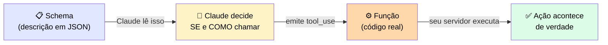
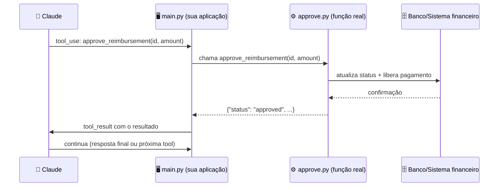

# 📘 Module Concepts — Schema vs. Código de uma Tool

> 🎯 **Pergunta central:** as tools são criadas só com a descrição do que eu quero que façam, ou precisam ser codadas? E onde elas ficam (em que arquivo)?
>
> **Resposta curta:** as duas coisas — e vivem em lugares diferentes do projeto.

---

## 🧩 1. Duas metades de uma tool

Toda tool tem duas partes que vivem em lugares diferentes, com responsabilidades distintas:



| Parte | O que é | Quem lê/executa |
|---|---|---|
| 📋 **Schema (descrição)** | JSON dizendo nome, descrição e formato dos parâmetros | O **Claude** lê isso para decidir *se* e *como* chamar a tool |
| ⚙️ **Função (código)** | Código Python/TypeScript que executa a ação de verdade | O **seu servidor/aplicação** roda isso quando Claude pede |

> <mark>Claude nunca executa código.</mark> Ele só devolve "quero chamar `approve_reimbursement` com esses argumentos" — quem faz a ação acontecer (chamar o banco, mandar o dinheiro, etc.) é **o seu código**.

---

## 📁 2. Onde isso fica, na prática

Estrutura típica de um projeto com **Agent SDK** (Python):

```
meu-agente-reembolsos/
├── main.py                  ← ponto de entrada, roda o agente
├── tools/
│   ├── __init__.py
│   ├── schemas.py           ← os JSON schemas (o que Claude "lê")
│   ├── read_receipt.py      ← função real de OCR
│   ├── check_policy.py      ← função real de consulta à política
│   ├── check_budget.py      ← função real de consulta ao orçamento
│   ├── approve.py           ← função real que libera o pagamento
│   └── flag_review.py       ← função real que escala pro humano
└── prompts/
    └── system_prompt.txt
```

| Arquivo/pasta | Papel |
|---|---|
| `main.py` | Roda o loop do agente — envia requisição, lê `tool_use`, chama a função certa, devolve `tool_result` |
| `tools/schemas.py` | Só descrições em JSON — o que Claude enxerga |
| `tools/*.py` (cada tool) | O código de execução de verdade — o que o **seu servidor** roda |
| `prompts/system_prompt.txt` | O system prompt escopado à tarefa do agente |

---

## 🔗 3. Como as duas metades se conectam

### 📋 `tools/schemas.py` — o que Claude vê

```python
approve_reimbursement_schema = {
    "name": "approve_reimbursement",
    "description": "Aprova e libera o pagamento de um reembolso já validado. "
                    "Use apenas depois que check_expense_policy confirmou "
                    "que o valor está dentro da política. Não use para "
                    "valores acima do limite sem aprovação humana prévia.",
    "input_schema": {
        "type": "object",
        "properties": {
            "reimbursement_id": {"type": "string"},
            "amount": {"type": "number"}
        },
        "required": ["reimbursement_id", "amount"]
    }
}
```

### ⚙️ `tools/approve.py` — o código que roda de verdade

```python
def approve_reimbursement(reimbursement_id: str, amount: float):
    # lógica real: chamar o sistema financeiro,
    # atualizar o banco de dados, notificar o funcionário, etc.
    db.update_status(reimbursement_id, "approved")
    payment_system.release(reimbursement_id, amount)
    return {"status": "approved", "id": reimbursement_id}
```

### 🔄 `main.py` — onde as duas se encontram, no loop

```python
if event.type == "tool_use" and event.name == "approve_reimbursement":
    result = approve_reimbursement(**event.input)  # roda o código real
    # devolve o resultado pra Claude continuar
```



---

## 🔑 4. O ponto-chave

> 📋 **A descrição (schema)** é o que faz Claude *escolher* a tool certa na hora certa — não tem lógica nenhuma, só texto explicando quando usar/não usar.
>
> ⚙️ **A função** é o que faz a ação *acontecer de verdade* no mundo real — sem ela, Claude fica só "pedindo" coisas que nunca são executadas.

---

## 🌐 5. E se eu estiver usando Managed Agents em vez do Agent SDK?

A estrutura muda um pouco:

| Com Agent SDK | Com Managed Agents |
|---|---|
| Você escreve `main.py` com o loop inteiro | Você define o agente (modelo + system prompt + tools) como um **recurso via API** |
| Tools rodam no seu próprio processo | O código de execução das tools ainda precisa existir em algum lugar — normalmente um **endpoint HTTP** que a Anthropic chama de volta, ou tools de **servidores MCP** que já têm essa lógica pronta |
| Você possui o loop inteiro | Anthropic roda o loop; você só possui a definição do agente e a camada de aplicação |

> ℹ️ Em qualquer um dos caminhos, a regra não muda: **schema é o que Claude lê, função é o que roda de verdade**. O que muda é só onde essa função vive fisicamente.

---

## ✅ Checklist rápido

- [ ] Cada tool tem um schema com `name`, `description` (dizendo quando usar/não usar) e `input_schema`?
- [ ] Cada tool tem uma função real correspondente, que executa a ação de verdade?
- [ ] O loop principal (seu ou do SDK) sabe mapear `tool_use.name` → função real a executar?
- [ ] Tools destrutivas (`approve_reimbursement`, por exemplo) têm um checkpoint de HITL antes de rodar?

---

## 📚 6. Termos-chave deste módulo

> 🔤 Em ordem alfabética. Passe o mouse sobre as siglas para ver o significado.

### 🤖 Claude Agent SDK

Um runtime de agente gerenciado, distribuído como `@anthropic-ai/claude-agent-sdk` (TypeScript) / `claude-agent-sdk` (Python). Dá acesso programático ao **mesmo loop de agente** que move o Claude Code: iteração, execução de tools, observação, encerramento — permitindo embutir um agente dentro do próprio produto, em vez de rodar o Claude Code num terminal.

> ⚠️ Distinto do **Anthropic SDK**, que é um wrapper fino de conveniência sobre a API e **não** roda um loop de agente.

### 🪟 Context Window

O número total de tokens que um modelo pode processar numa única requisição — incluindo system prompt, histórico da conversa, definições de tools, resultados de tools, e o próprio output do modelo. Quando o total corrente atinge o limite, conteúdo anterior precisa ser removido ou resumido antes de novo conteúdo entrar.

### ✍️ Function signature (assinatura de função)

Termo de programação que significa a **declaração de uma função**: seu nome mais a lista de parâmetros que ela aceita, incluindo nomes, tipos e quaisquer valores padrão.

### 🙋 <abbr title="Human-in-the-Loop">HITL</abbr>

*Human-in-the-loop* se refere a inserir um passo de revisão ou aprovação humana num processo automatizado, **antes** de uma ação consequente ser tomada.

### 🔧 Refactor

Mudar a **estrutura interna** do código sem mudar o que ele faz visto de fora. Você reorganiza, renomeia, ou reescreve a implementação para deixá-la mais limpa, rápida, fácil de testar ou de estender — mas o comportamento que o resto do sistema enxerga permanece o mesmo.

### 🛡️ <abbr title="Service Organization Control 2">SOC 2</abbr>

*Service Organization Control 2* é um framework de auditoria desenvolvido pelo <abbr title="American Institute of Certified Public Accountants — instituto americano de contadores públicos certificados">AICPA</abbr> para avaliar como uma organização de serviço lida com dados de clientes. É o padrão mais comumente citado quando um fornecedor SaaS ou provedor de nuvem precisa demonstrar que suas práticas de segurança atendem a uma barra reconhecida.

### 🧠 State (estado)

A informação que um agente carrega **entre turnos**: a conversa até ali, o que o usuário pediu, resultados de chamadas de tools anteriores.

### 🛑 Stop_reason

Campo na resposta da API que diz ao seu código **por que** o modelo parou de gerar. Os dois valores mais relevantes em loops agênticos:

| Valor | Significado |
|---|---|
| `end_turn` | Claude terminou e não está pedindo nenhuma ação adicional |
| `tool_use` | Claude emitiu um ou mais blocos `tool_use` e está esperando os resultados antes de continuar |

### 🤖 Subagent

Uma instância separada de agente, criada por um agente orquestrador para lidar com uma subtarefa discreta. <mark>Subagentes não herdam histórico de conversa, skills, nem contexto da sessão pai</mark> — cada um começa limpo e precisa ser configurado explicitamente com as instruções e tools que precisa. Os resultados voltam para o orquestrador, que os incorpora à tarefa mais ampla.

### 🔢 Token

A unidade que Claude usa para medir e processar texto. A média de caracteres por token depende do tokenizador do modelo em questão e difere entre gerações de modelo — <mark>trate qualquer regra prática de "caracteres por token" como dependente do modelo</mark>, e confirme o comportamento atual do tokenizador na hora de construir. Tokens são consumidos por tudo na janela de contexto: prompts, respostas, schemas de tools e resultados de tools. São a base tanto para precificação quanto para cálculos de orçamento de contexto.

### 🔧 Tool_use_block

Um bloco de conteúdo retornado pelo assistant quando Claude quer chamar uma função. Contém o nome da tool, um ID único, e os argumentos de input que Claude quer passar ao seu código. <mark>Todo bloco `tool_use` precisa ser respondido por um bloco `tool_result` correspondente no turno de usuário imediatamente seguinte, com o mesmo ID preservado exatamente.</mark>