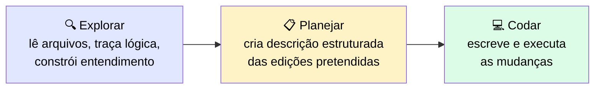
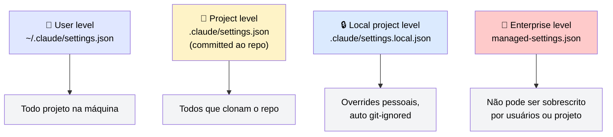
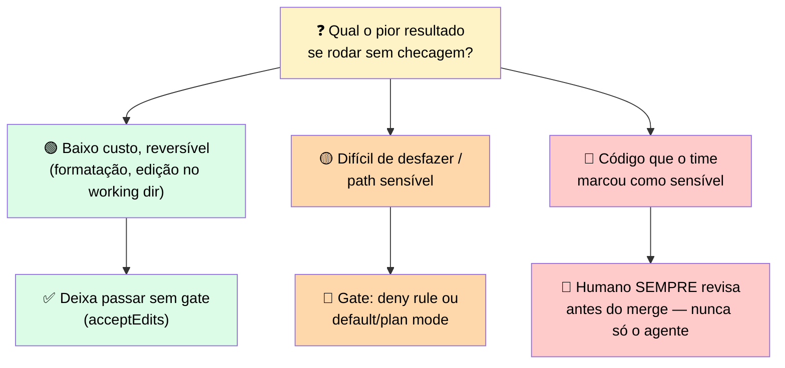

# 🔐 Permission Modes & Human Gates

> 🎯 **Ideia central:** o Módulo 2 estabeleceu como o loop de agente funciona no nível da API. O Claude Code roda esse **mesmo loop** no seu terminal, mas adiciona uma camada extra: um **sistema de permissões** que controla cada ação que o agente quer tomar.

---

## 🧭 1. Como o Claude Code trabalha uma tarefa: explorar, planejar, codar

> <mark>Claude Code não começa a escrever imediatamente.</mark> Essa sequência importa por dois motivos: produz output melhor (menos suposições, mais efeitos colaterais capturados), e é onde os **modos de permissão** se encaixam — o modo `plan` mantém Claude Code na fase de exploração, bloqueando toda edição de arquivo e comando de shell até você liberar.

---

## 🎚️ 2. Modos de permissão: aprovações, gates e restrições

> 💬 Cada modo faz um tradeoff diferente entre **velocidade** e **supervisão**. A escolha certa depende de quão bem você conhece o codebase e quão reversíveis são as mudanças.

| Modo | ✅ Auto-aprova | 🚧 Ainda trava | ⚠️ Limitações |
|---|---|---|---|
| **default** | Só leituras | Toda edição de arquivo e comando de shell | Seguro mas lento em trabalho confiável — baseline para projeto novo ou codebase desconhecido |
| **acceptEdits** | Leituras, edições de arquivo, comandos comuns de filesystem (`mkdir`, `touch`, `rm`, `rmdir`, `mv`, `cp`, `sed`) **dentro do diretório de trabalho** | Todo outro comando de shell; escritas fora do diretório de trabalho; escritas em paths protegidos | Trabalho local confiável onde execução de shell ainda precisa de olho humano. Não apropriado se o agente precisa rodar scripts |
| **plan** | Só leituras — pesquisa e propõe, não edita | Toda edição de arquivo e comando de shell, até você aprovar um plano | Exploração e planejamento em codebases sensíveis/desconhecidos. Não apropriado para tarefas que precisam escrever output |
| **auto** | Tudo, mas um classificador separado revisa cada ação antes | Deploys de produção, migrações, deletes em massa, exfiltração de credenciais, force-push para main (bloqueados por padrão) | Reduz prompts mas não garante segurança — é um research preview, não substitui revisão de operações sensíveis. Disponibilidade depende de plano, versão do modelo e configurações de admin |
| **dontAsk** | Só tools pré-aprovadas numa regra allow + comandos read-only. **Auto-NEGA** todo o resto | Toda tool call fora da allow list é negada — sem fila de confirmação | Feito para CI travado e scripts. Restringe bem, mas não é forma de reduzir fricção em trabalho interativo local |
| **bypassPermissions** | Todas as tool calls, sem prompts nem checagens de segurança | Nada em operação normal — só comandos catastróficos como `rm -rf /` e `rm -rf ~` ainda disparam um prompt de último recurso | Só dentro de um container ou VM isolado e descartável. **Nunca** numa workstation de desenvolvedor contra um codebase ao vivo |

---

## 📍 3. Onde a configuração mora, e a quem se aplica

> <mark>Uma regra `deny` sempre vence uma regra `allow`, independente do modo em vigor.</mark> O controle de governança mais durável é uma regra `deny` no nível **enterprise**: nenhum desenvolvedor individual pode removê-la, e ela se aplica mesmo quando um modo bypass está configurado.

---

## 🙋 4. Onde um humano ainda precisa olhar: posicionando o gate pelo pior custo possível

> ❓ **A pergunta central:** *qual é o pior resultado possível se essa ação rodar sem checagem humana?* Quanto menor o custo de estar errado, mais você pode deixar passar. Quanto maior o custo — e quanto mais difícil de desfazer — mais o passo precisa de um gate humano antes de executar.

> <mark>O posicionamento do gate e a escolha do modo de permissão são a mesma decisão vista de dois lados.</mark> O modo define o padrão para toda a sessão; o gate é onde você sobrescreve esse padrão para a única ação cujo custo é alto demais para deixar no automático.

---

## 💰 5. Custo · Complexidade · Risco

| Dimensão | Detalhe |
|---|---|
| 💸 **Custo** | Rodar em modo `default` em trabalho confiável adiciona latência de prompt a cada tool call — acumula num refactor longo |
| 🧩 **Complexidade** | Múltiplos níveis de settings com hierarquia de override exigem cuidado consistente. Uma regra `deny` enterprise que contradiz uma `allow` de projeto precisa ser entendida por todo mundo que mantém a config |
| ⚠️ **Risco** | Usar o modo errado para o contexto. Um modo bypass ativado por impaciência numa máquina não isolada remove **todo** prompt de segurança entre o agente e seus arquivos ao vivo — e, diferente dos outros modos, também remove a proteção de paths protegidos |

---

## ✅ Checklist de decisão

- [ ] O modo escolhido bate com o risco real da tarefa, não só com a preferência por menos prompts?
- [ ] Existe uma regra `deny` no nível certo (projeto ou enterprise) cobrindo paths sensíveis, independente do modo?
- [ ] Estou usando `bypassPermissions` **só** dentro de um container/VM isolado e descartável?
- [ ] Para cada ação de alto custo/difícil de reverter, existe um gate humano explícito antes de executar?
- [ ] Código marcado como sensível pelo time sempre passa por revisão humana antes do merge, independente da confiança no agente?
