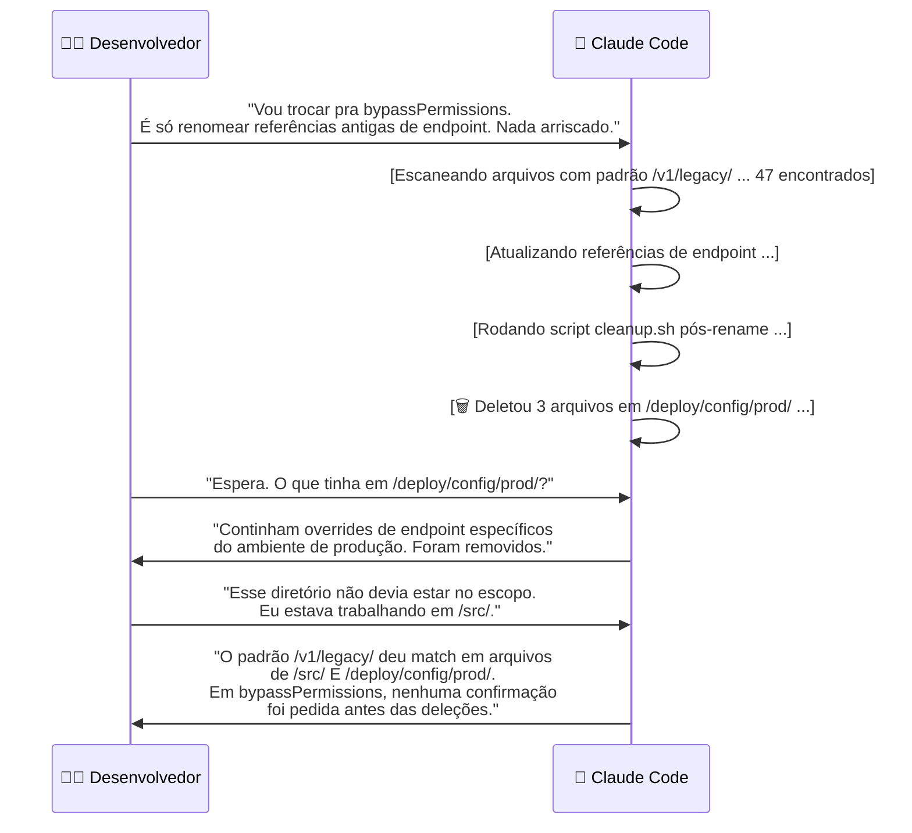
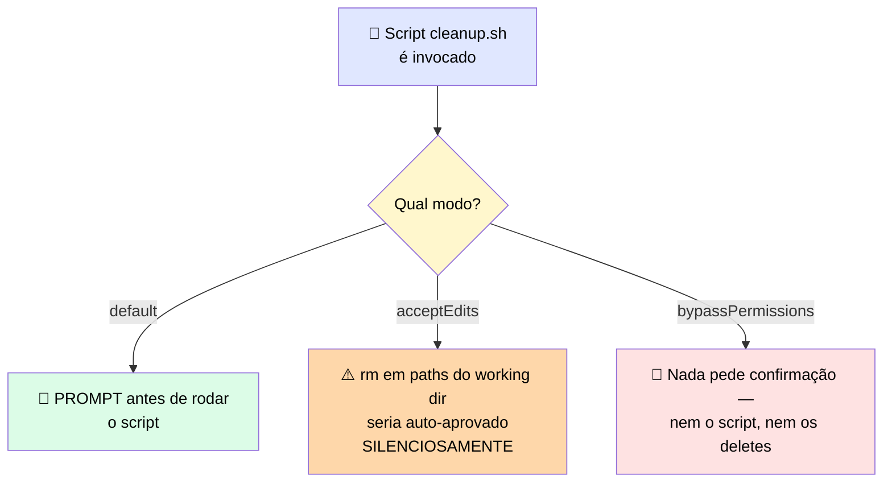

# 🔬 Post-mortem: o Bypass Mode que Removeu o Único Prompt que Importava

> 🎯 **Setup:** você trocou para `bypassPermissions` para parar os prompts constantes porque o trabalho parecia rotineiro. O agente vinha se comportando bem havia dias, a tarefa de limpeza era simples, e o comportamento de prompt-antes-de-cada-tool-call parecia fricção desnecessária.

---

## 💬 A transcrição

Sessão de pareamento numa limpeza de codebase que rodava sem incidentes havia três dias.

---

## 🕳️ Onde estava a falha

> <mark>O prompt que teria capturado esse erro estava desligado quando `bypassPermissions` foi ligado.</mark> Em modo `default` ou `acceptEdits`, o script de limpeza não teria rodado sem confirmação, e o usuário poderia ter parado a deleção antes de atingir os arquivos de configuração de produção.

### 🎯 A localização precisa do gate

> ⚠️ Note a localização exata do gate: era a **invocação do script** que teria disparado o prompt, não os comandos de deleção `rm` isoladamente. `acceptEdits` auto-aprova comandos comuns de filesystem, incluindo `rm` em paths **dentro** do diretório de trabalho. <mark>Se Claude tivesse emitido as deleções diretamente como comandos `rm`, `acceptEdits` as teria deixado passar silenciosamente — só o modo `default` pede confirmação para isso.</mark>

---

## 🚨 O que observar

| ⚠️ Risco | 💡 Mitigação |
|---|---|
| Um modo bypass silencia **todos** os prompts de confirmação, incluindo os que você não previu | Definir uma regra `deny` em diretórios sensíveis **antes** de trocar de modo |
| O padrão de falha aqui foi o agente casando um conjunto de arquivos **mais amplo** do que o pretendido, rodando num modo sem checkpoints | Se quer menos prompts sem perder a rede de segurança, use um modo com classificador (ex.: `auto`) em vez de um bypass completo |
| `bypassPermissions` também pula a proteção de path protegido que os outros modos mantêm — até o estado do repo e a própria configuração do Claude perdem o prompt automático | Nunca usar bypass fora de um ambiente isolado e descartável |

---

# 🧪 Checkpoint 1: monte o arquivo de settings e posicione o gate humano

> 🎯 **Cenário:** você está configurando o Claude Code para um refactor local confiável do módulo de pagamentos. O refactor deve auto-aprovar edições de arquivo, mas **nunca** deve rodar comandos de shell destrutivos, e o arquivo `.env.production` **nunca** deve ser lido pelo agente.

## 📦 Parte 1 — Peças corretas do `settings.json`

| Peça | Conteúdo | ✅ Selecionada? |
|---|---|---|
| A | `{ "permissions": { "defaultMode": "default"} }` | ❌ Não |
| B | `{ "permissions": { "defaultMode": "bypassPermissions" } }` | ❌ Não |
| **C** | `{ "permissions": { "allow": ["Bash(npm run:*)"], "deny": ["Bash(rm:*)", "Bash(git push:*)"] } }` | ✅ **Sim** |
| **D** | `{ "permissions": { "deny": ["Read(.env.production)"] } }` | ✅ **Sim** |
| E | `{ "permissions": { "allow": ["Bash(*)", "Edit(*)"] } }` | ❌ Não |

> 💬 **Por quê C + D:** a Peça C dá `allow` explícito para o comando confiável (`npm run`) e nega comandos destrutivos (`rm`, `git push`) — sem precisar de `bypassPermissions`. A Peça D bloqueia a leitura do `.env.production`, cumprindo o requisito de "nunca deve ser lido".

## 🙋 Parte 2 — Onde colocar o gate humano

> ❓ Suas configurações auto-aprovam edições. Durante o refactor, o agente propõe uma mudança num arquivo de configuração de deployment que vários serviços de produção leem. Onde deve ficar o gate?

| Opção | Resposta |
|---|---|
| a) Em lugar nenhum — as settings já auto-aprovam edições | ❌ |
| **b) Um humano revisa e aprova a mudança antes da escrita executar, porque um valor errado ali é difícil de desfazer e alcança sistemas fora do arquivo** | ✅ **Correta** |
| c) Adicionar `bypassPermissions` para o agente nunca pausar | ❌ |
| d) Revisar a mudança só depois da escrita, no próximo pull request | ❌ |

> <mark>A pergunta que decide isso é sempre a mesma: qual o pior resultado se essa ação específica rodar sem checagem humana?</mark> Um arquivo de config que vários serviços de produção leem é exatamente o caso de "difícil de desfazer, alcança sistemas fora do arquivo" — merece gate antes da execução, não depois.
