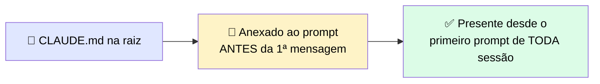
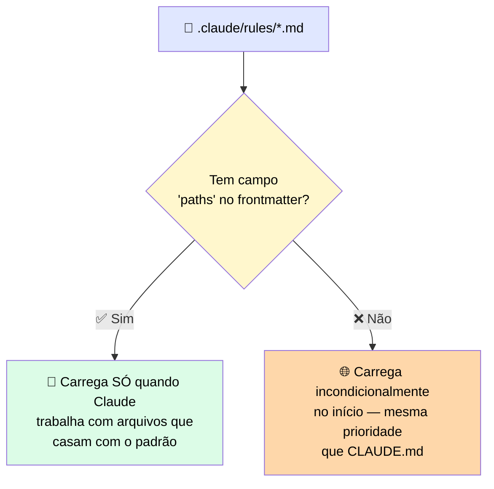
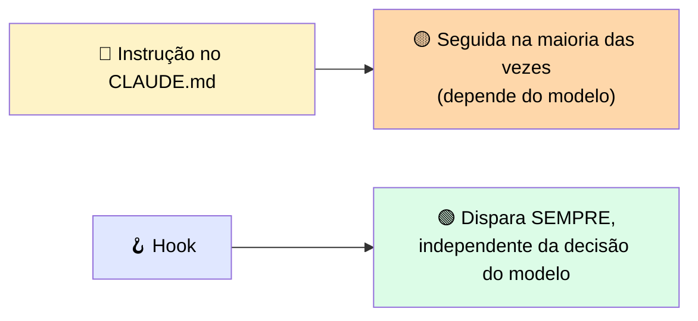
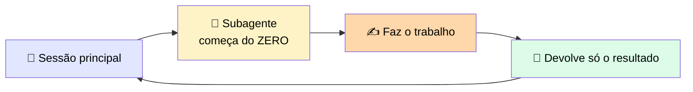

# 🗂️ Contexto Durável de Projeto: CLAUDE.md, Rules, Hooks e Subagents

> 🎯 **Ideia central:** a camada de permissões controla **o que** o agente pode fazer. Este cluster cobre uma camada diferente: **o que o agente sabe e como se comporta**, de forma que as regras e o contexto de projeto definidos numa sessão ainda estejam em vigor no início da próxima.

---

## 📄 1. CLAUDE.md: o arquivo de projeto que carrega em toda sessão

> 💬 Toda vez que o Claude Code inicia num diretório de projeto, ele procura um arquivo `CLAUDE.md` na raiz e o lê. O conteúdo é anexado ao seu prompt **antes** de qualquer mensagem sua chegar.



- 🚀 O comando `/init` escaneia seu codebase e gera um `CLAUDE.md` inicial — **bom baseline, mas deve ser validado** antes de usar
- ✍️ Refine para conter: comandos de teste, convenções de framework, paths que o agente não deve tocar, decisões de estilo que diferem dos defaults

> ⚠️ <mark>Tamanho é o principal modo de falha.</mark> Um `CLAUDE.md` que só cresce a cada nova instrução dilui as regras mais importantes. Um arquivo maior consome mais da janela de contexto, o que torna qualquer instrução individual uma fração menor do que carrega — reduzindo a chance de o agente seguir a **uma** regra que evitaria um erro real.

✅ **Regra prática:** mantenha o `CLAUDE.md` só nas restrições que mudam comportamento, e mova o resto para **Skills** que carregam sob demanda.

---

## 🎯 2. Rules instruction files: escopando orientação a onde ela se aplica

> 💬 `CLAUDE.md` carrega sempre; rules files adicionam uma camada mais estreita por cima — vivem em `.claude/rules/` e podem ser escopadas a paths específicos via um glob no YAML frontmatter.



> ⚠️ <mark>O escopo vem do frontmatter, não da localização do arquivo.</mark> Rules files podem estar organizados em subdiretórios (ex.: `.claude/rules/database/`), mas isso é só organizacional — um arquivo sem campo `paths` carrega incondicionalmente, não importa onde esteja dentro de `.claude/rules/`.

### 📋 Onde colocar cada tipo de regra

| Regra | Onde vive | Exemplo |
|---|---|---|
| 🌐 Aplica-se em **todo lugar** | `CLAUDE.md` | *"Nunca modifique o schema do banco de dados"* |
| 🎯 Aplica-se só a **uma parte** do codebase | `.claude/rules/database.md` com `paths` | *"Todo SQL no módulo de database deve incluir boundary de transação explícito"* |

```yaml
---
paths:
  - "src/db/**/*.sql"
---
```

---

## 🪝 3. Hooks: rodando seus próprios scripts em pontos fixos do ciclo de vida

> 💬 Um Hook intercepta e controla tool calls antes ou depois de executarem. Uma regra escrita no `CLAUDE.md` é seguida na **maioria** das vezes; um hook faz acontecer **toda vez, sem exceção**, porque dispara independente do que o modelo decide.



### 📅 Eventos de ciclo de vida principais

| Evento | Quando roda | Uso |
|---|---|---|
| 🚦 **PreToolUse** | Antes da tool call executar | Pode examinar a chamada e sair com código 2 para **bloquear**, escrevendo o motivo em stderr — feedback que o agente vê |
| ✅ **PostToolUse** | Depois da tool call completar | Não pode bloquear (já aconteceu) — lugar certo para efeitos colaterais automatizados: formatador de código, testes, log de auditoria |
| 💬 **UserPromptSubmit** | Ao submeter um prompt, antes do modelo processar | Injetar contexto ou validar a requisição antes do trabalho começar |
| 🏁 **Stop** | Quando o modelo termina de responder | Ações de follow-up no fim do turno: notificações, limpeza, commit do log de auditoria |
| 🔔 **Notification** | Quando Claude Code envia uma notificação (precisa de permissão, ou ficou 60s ocioso) | Rotear esses sinais para um canal externo ou sistema de log |
| ▶️ **SessionStart** | Início/retomada de sessão | Inicializar estado, validar variáveis de ambiente, confirmar serviços necessários acessíveis |
| ⏹️ **SessionEnd** | Fim de sessão | Tarefas de teardown, escritas finais de auditoria, notificações de encerramento |

> <mark>Um hook que bloqueia edições a um path de configuração de produção usando `PreToolUse` aplica essa restrição em **toda** tool call, em **toda** sessão, independente do modo de permissão.</mark> Essa é a diferença entre um guardrail e uma convenção.

---

## 🤖 4. Subagents: delegando trabalho para um contexto isolado

> 💬 Um subagente roda uma tarefa no seu **próprio contexto separado** e retorna só seu output. Não herda seu histórico de conversa principal, os arquivos acumulados no seu contexto, nem o estado da sua sessão atual.



### 🔍 O split que afeta suas regras de projeto

| Subagente built-in | Carrega CLAUDE.md + git status? |
|---|---|
| 🔎 **Explore** | ❌ Não — otimizado para pesquisa rápida e barata |
| 📋 **Plan** | ❌ Não — mesmo motivo |
| 🛠️ **general-purpose** | ✅ Sim, carrega ambos |

> ⚠️ <mark>Se você delega uma tarefa a Explore ou Plan e uma regra do seu CLAUDE.md deveria se aplicar, é porque esse contexto não foi carregado.</mark> Para tarefas onde suas restrições de projeto precisam ser respeitadas, use o subagente `general-purpose` ou um subagente customizado que carregue explicitamente as regras necessárias.

> ⚠️ Subagentes customizados também **não** veem suas skills automaticamente. Se você define um subagente em `.claude/agents` e ele precisa de uma skill específica, precisa listá-la explicitamente no frontmatter do agente.

---

## 🗺️ 5. Mapa dos quatro mecanismos

| Mecanismo | 📥 O que carrega | ⏰ Quando roda | 💰 Custo de contexto | 🎯 Pertence aqui |
|---|---|---|---|---|
| 📄 **CLAUDE.md** | Conteúdo completo do arquivo, prependado no início da sessão | Toda sessão, incondicionalmente | Persistente por sessão. Dilui com o tamanho | Restrições universais de projeto, comandos, decisões de framework |
| 🎯 **Rules file** | Conteúdo do arquivo. Escopado via glob `paths` no frontmatter; sem `paths`, carrega como CLAUDE.md | Quando Claude lê um arquivo que casa com o padrão. Sem escopo, carrega no início | Escopado: só adiciona quando disparado. Sem escopo: mesmo custo persistente do CLAUDE.md | Orientação específica de path que seria ruído em todo o resto |
| 🪝 **Hook** | Roda seu script no evento de ciclo de vida. Nenhum conteúdo entra no contexto | No evento configurado | Mínimo — só o output do script, se roteado de volta para Claude | Guardrails aplicados, efeitos colaterais automatizados, log de auditoria |
| 🤖 **Subagent** | Só o contexto da tarefa. Isolado da sessão principal | Quando despachado pela sessão principal para uma tarefa delegada | Retorna um resumo, não o histórico completo da tarefa | Exploração, investigação, tarefas cujo output entupiria o contexto principal |

---

## ⚖️ 6. Quando usar

| ✅ Funciona bem | 🔄 Considere outra abordagem |
|---|---|
| Projetos aos quais você vai voltar em muitas sessões, onde um conjunto estável de regras, variação por diretório, ou guardrails incondicionais compensam o setup | Tarefas pontuais que você não vai revisitar — para uma exploração rápida de um codebase desconhecido, o overhead de configuração não se justifica |

---

## ✅ Checklist de decisão

- [ ] Meu `CLAUDE.md` tem só as restrições que **mudam comportamento**, não um log histórico crescente?
- [ ] Orientação específica de um path está numa rules file escopada, não poluindo o `CLAUDE.md`?
- [ ] Guardrails que **precisam** valer sempre estão implementados como hook, não só como instrução em texto?
- [ ] Se delego a Explore/Plan, sei que CLAUDE.md e git status não estão no contexto deles?
- [ ] Subagentes customizados que precisam de uma skill específica a têm listada explicitamente no frontmatter?
