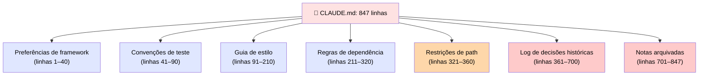
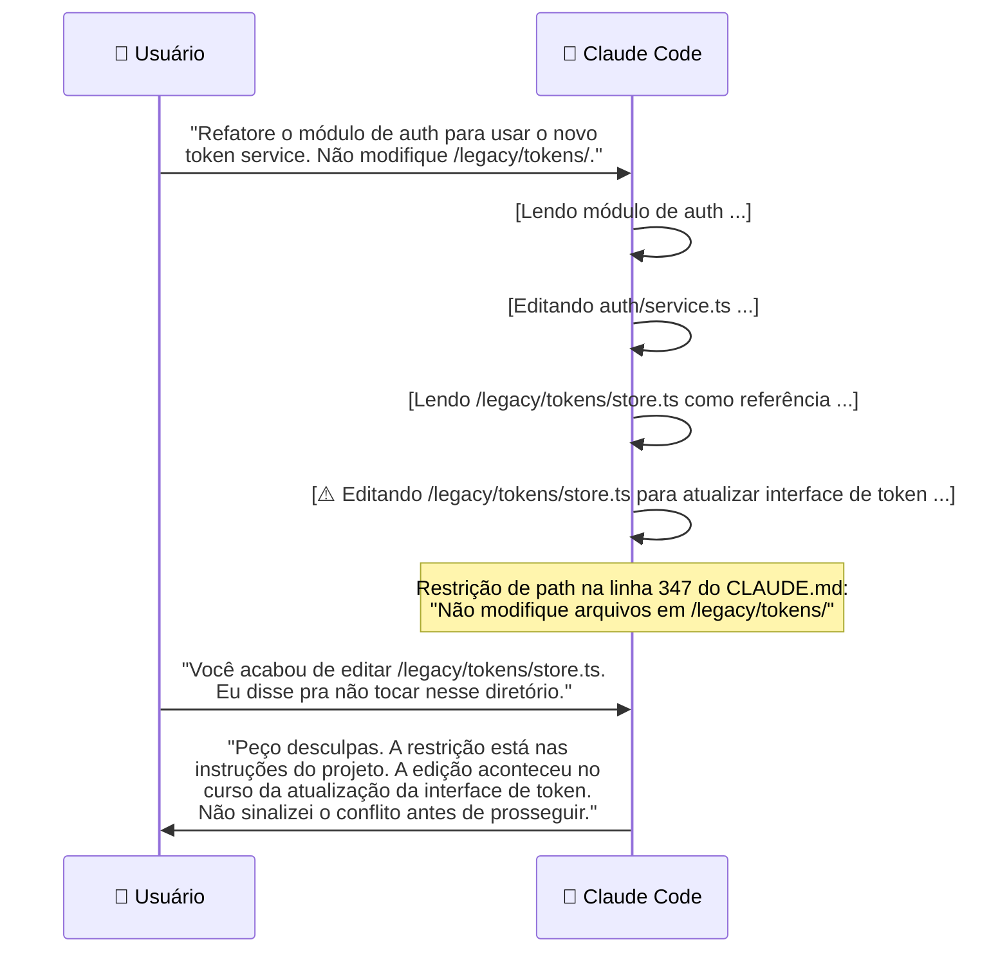
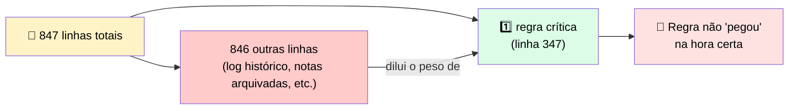

# 🔬 Post-mortem: o CLAUDE.md que Cresceu até as Regras Pararem de "Pegar"

> 🎯 **Setup:** seu `CLAUDE.md` foi crescendo porque toda nova regra parecia valer a pena adicionar. Cada adição era individualmente razoável, e o arquivo parecia o lugar certo para cada regra. Mas ao longo de algumas semanas, o arquivo cresceu para **mais de 800 linhas**.

---

## 📊 O trace da sessão

Excerto de um projeto com `CLAUDE.md` acumulado ao longo de dois meses de adições do time.



### 💬 O que aconteceu



---

## 🕳️ Onde estava a falha

> <mark>A regra estava no arquivo; o agente tinha acesso a ela. Mas a falha foi diluição: as outras 846 linhas reduziram o peso efetivo da única instrução que importava.</mark>



> ⚠️ O log de decisões históricas e as notas arquivadas deveriam estar anotados em algum lugar — mas **não** no `CLAUDE.md`.

---

## 🚨 O que observar

> ✅ **Regra prática:** `CLAUDE.md` é um conjunto de trabalho de regras que mudam comportamento na sessão atual — **não** um log de append que só cresce.

| Tipo de regra | Onde deveria estar |
|---|---|
| 🎯 Específica de path | Rules file |
| 📜 Contexto histórico | Documento de referência separado, lido sob demanda |
| 🔒 A regra que você **não pode** se dar ao luxo de diluir | O caminho mais curto até virar um **hook** |

> <mark>Quando seu CLAUDE.md passar de algumas centenas de linhas, audite: identifique quais regras são de fato críticas para a sessão e mova o resto.</mark>

---

# 🧪 Checkpoint 2: arraste o valor correto

> 🎯 **Cenário:** você está configurando um hook que aplica uma restrição de path. A configuração abaixo tem duas lacunas.

```json
{ "hooks": {
    "________": [
      {
        "matcher": "Read",
        "hooks": [{ "type": "command", "command": "________" }]
      }
    ]
  }
}
```

## 🕳️ Blank 1 — o evento de ciclo de vida

| Opção | Correta? |
|---|---|
| **PreToolUse** | ✅ **Sim** |
| PostToolUse | ❌ |
| UserPromptSubmit | ❌ |
| SessionStart | ❌ |

> 💬 Precisa ser `PreToolUse` porque é o **único** evento que roda **antes** da tool call executar — e portanto o único capaz de **bloquear** a leitura antes que ela aconteça.

## 🕳️ Blank 2 — o comando

| Opção | Correta? |
|---|---|
| **Um script que lê a tool call do stdin, checa o path do arquivo, e sai com código 2 quando o path é `.env.production` (escrevendo o motivo em stderr)** | ✅ **Sim** |
| Um script que loga a tool call num arquivo de auditoria e sai com 0 | ❌ |
| Um script que imprime um aviso e sai com 0 incondicionalmente | ❌ |

> <mark>Só sair com código 2 efetivamente bloqueia a operação — sair com 0 deixa a leitura passar, não importa o que o script imprima.</mark>
