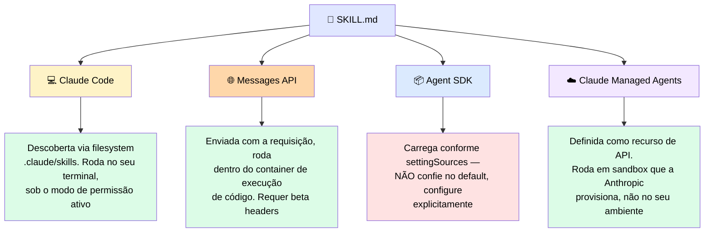
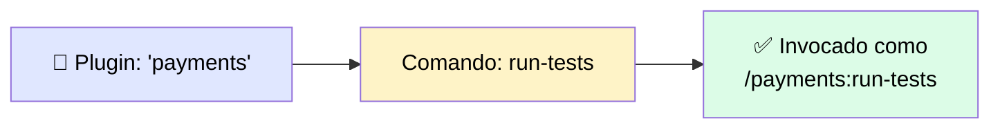
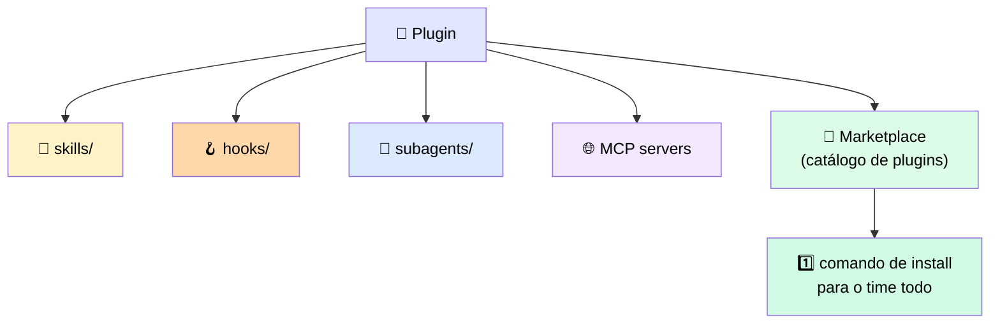

# 📦 Empacotando um Workflow: Skills, Custom Commands e Plugins

> 🎯 **Ideia central:** os mecanismos anteriores (CLAUDE.md, rules, hooks, subagents) vivem no seu diretório `.claude` e são versionados com o projeto. Agora: como empacotar esse setup para um colega instalar num único passo, em vez de repetir sua configuração manual à mão?

---

## 🛠️ 1. Skills são workflows reutilizáveis que o agente carrega sob demanda

Uma skill é um arquivo Markdown portátil (`SKILL.md`) em `.claude/skills`. O frontmatter identifica a skill e descreve quando ela se aplica; o corpo guarda os passos.

> <mark>A mesma skill pode rodar no Claude Code, ser invocada via Messages API, ou ser carregada pelo Agent SDK. O que muda entre os três não é o arquivo em si — é onde a skill roda, como é carregada, e o que ela tem permissão de tocar.</mark>

### 🔀 Como a skill carrega e roda em cada ambiente

| Ambiente | 📥 Como carrega | 🏃 Onde os passos rodam | ⚠️ O que você precisa saber |
|---|---|---|---|
| 💻 **Claude Code** | Descoberta em `.claude/skills`, por match de descrição ou invocação por nome | No seu terminal, contra seus arquivos locais, sob o modo de permissão e regras deny ativos | Baseado em filesystem, governado pela camada de settings |
| 🌐 **Messages API** | Enviada junto com a requisição, roda dentro do **container de execução de código** — não no ambiente da sua aplicação. Requer os headers beta `code-execution` e `skills` | Dentro do container da Anthropic, não na sua máquina | Uma skill que assume arquivos ou tools locais **não** vai se comportar do mesmo jeito, porque não está rodando onde esses arquivos estão |
| 📦 **Agent SDK** | Carregada pelo agente que o SDK roda, mas se `CLAUDE.md`/skills carregam é controlado pela config `settingSources` | No processo que o SDK roda — seu ambiente, uma vez que você diz para carregar fontes de filesystem | O surpresa comum: uma skill que funcionava no Claude Code não faz nada no SDK porque `settingSources` nunca foi configurado |
| ☁️ **Claude Managed Agents** | Definida uma vez como recurso de API que nomeia modelo, system prompt, tools, servidores MCP e skills. Anthropic carrega server-side | Dentro de um sandbox que a Anthropic provisiona e roda — não seu ambiente | Beta pública, requer header `managed-agents-2026-04-01`. Sessões armazenadas server-side → **não elegível para ZDR ou HIPAA BAA**. Skills são anexadas na definição do agente, não em tempo de sessão |

### 📜 Três regras de portabilidade

1. **✍️ Escreva a descrição como o critério de match.** O modelo carrega uma skill comparando seu pedido com a descrição — uma descrição que identifica quando a skill se aplica funciona em todo runtime; uma vaga falha em carregar em todos eles.
2. **🚫 Não presuma que existe um filesystem ou tools locais dentro do corpo da skill.** Uma skill que executa um comando local funciona no Claude Code mas quebra na Messages API, onde roda num container sem esse comando.
3. **🤖 Lembre-se que subagentes não herdam skills.** Isso era verdade no Módulo 2 e continua aqui: um subagente começa limpo, então uma skill de que o pai dependia precisa ser listada explicitamente para o subagente, em todo runtime que suporta subagentes.

| ✅ Funciona bem | ⚠️ Adiciona complexidade | 🔄 Considere outra abordagem |
|---|---|---|
| Um procedimento específico de tarefa, autorado uma vez e reusado no terminal interativo, numa integração de API, e num job headless de SDK | Cada runtime carrega e sandboxa a skill diferente — é preciso contar com beta headers na API e `settingSources` no SDK | Para instruções que devem valer em toda sessão de um projeto, `CLAUDE.md` continua sendo a ferramenta certa. Skills são para procedimentos portáteis sob demanda |

---

## ⌨️ 2. Dando um ponto de entrada explícito a um workflow

> 💬 Um custom command é um atalho para um procedimento definido. No Claude Code atual, **skills são o formato recomendado** tanto para invocação explícita quanto automática: você invoca uma skill diretamente com `/skill-name`, ou Claude a carrega automaticamente quando relevante.

- 📁 O formato antigo `.claude/commands/` ainda funciona, mas é um processo legado
- 🔒 Use skills com `disable-model-invocation: true` no frontmatter quando quiser um workflow que só roda quando você o chama explicitamente

### 🏷️ Namespacing automático de comandos de plugin

> ℹ️ É por isso que dois plugins podem ter um comando `run-tests` sem colidir. <mark>O nome do plugin é parte da interface</mark> — renomear o plugin renomeia todos os comandos junto.

---

## 🔗 3. A camada de empacotamento que torna um setup instalável

Um **plugin** empacota skills, hooks, subagents e servidores MCP numa única unidade instalável.

- 🏪 O marketplace oficial da Anthropic está disponível automaticamente ao iniciar o Claude Code
- ➕ Você pode adicionar marketplaces de terceiros hospedados num repo GitHub: `/plugin marketplace add <owner/repo>`
- 👥 Colegas rodam **um** comando de install para ter o mesmo setup — o plugin substitui uma página de passos manuais por um install versionado e auditável

### 🏢 Deploy em nível enterprise

> 💬 Administradores podem implantar plugins em toda a organização via managed settings. Uma **allowlist de marketplace gerenciada** controla quais fontes de marketplace os usuários podem adicionar — mas <mark>a allowlist restringe o que os usuários podem adicionar, ela não registra marketplaces automaticamente.</mark>

✅ Para empurrar um marketplace a todos os usuários sem exigir que rodem o comando `add` manualmente, combine a allowlist com `extraKnownMarketplaces` nas managed settings.

> ⚙️ Um plugin implantado em escopo **managed** tem prioridade e não pode ser sobrescrito por usuários ou arquivos de projeto — porque managed settings ficam **acima** de user e project settings na hierarquia de configuração.

---

## 📋 4. Tabela de decisão de empacotamento

| Camada | O que é | Para quem | Quando usar |
|---|---|---|---|
| 🛠️ **Skill** | Arquivo Markdown em `.claude/skills` que carrega por match de descrição ou invocação por nome | Um desenvolvedor ou time usando Claude Code interativamente | Quando um procedimento específico deve ficar fora do contexto até ser necessário — ex.: um checklist de revisão de PR que só carrega quando o trabalho pede |
| ⌨️ **Custom command** | Atalho nomeado que roda um procedimento definido quando invocado explicitamente | Devenvolvedores que querem um ponto de entrada previsível para procedimentos de alta frequência | Quando o procedimento tem um nome claro e você quer disparar diretamente em vez de confiar no match de descrição |
| 🔌 **Plugin** | Bundle versionado de skills, hooks, subagents e servidores MCP, distribuído via marketplace | Um time que quer instalação em um passo de um setup compartilhado e versionado | Quando um setup que funciona hoje numa máquina precisa ser compartilhado, versionado e mantido consistente entre o time |

---

## 💰 5. Custo · Complexidade · Risco

| Dimensão | Detalhe |
|---|---|
| 💸 **Custo** | Skills adicionam custo de contexto na ativação; um plugin adiciona overhead de instalação e manutenção. A pergunta é: pagar o custo de setup **uma vez** (plugin) ou **repetidamente** (cada dev rodando os mesmos passos manuais)? |
| 🧩 **Complexidade** | Um plugin com paths absolutos hard-coded instala corretamente para o autor e falha para todo mundo — qualquer suposição de path ou ambiente embutida numa skill/hook é o mais provável de quebrar entre máquinas |
| ⚠️ **Risco** | <mark>Um plugin carrega os componentes que empacota, mas não a proteção que o autor tinha localmente, a menos que ela esteja explicitamente listada como parte do bundle.</mark> Se skills/hooks dependem de um guardrail não incluído, a proteção não se transfere para a máquina do colega |

---

## ✅ Checklist de decisão

- [ ] A descrição de cada skill identifica claramente **quando** ela se aplica?
- [ ] Nenhuma skill assume filesystem ou tools locais sem documentar essa dependência?
- [ ] Subagentes que precisam de uma skill a têm listada explicitamente?
- [ ] Todo path referenciado em skills/hooks/plugin é relativo ao projeto ou usa variável de ambiente — nunca um path absoluto da máquina do autor?
- [ ] Se empacotei um plugin, os guardrails (deny rules, hooks) que ele depende estão **incluídos** no bundle, não só presentes localmente na minha máquina?
