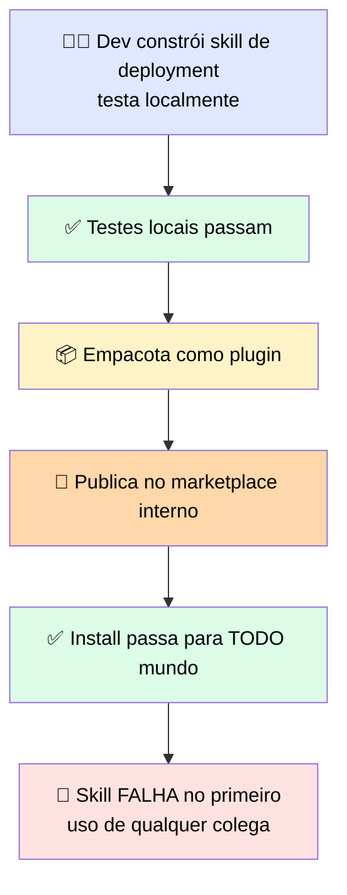
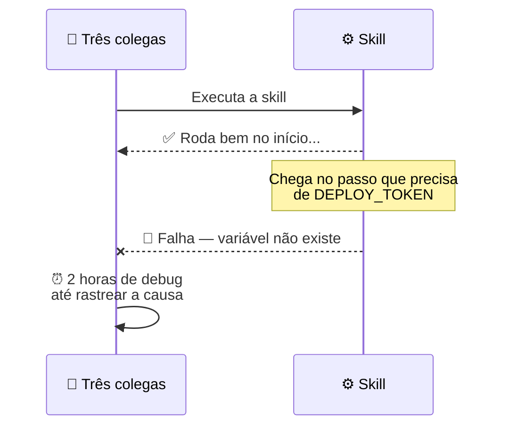

# 🧪 Checkpoint 3: coloque a skill no runtime certo

> 🎯 **Cenário:** três times querem reusar a mesma skill `review-checklist` em lugares diferentes.

| Cenário | ✅ O que precisa ser configurado |
|---|---|
| 👨‍💻 Um dev quer a skill carregando ao pedir uma revisão **no terminal do Claude Code** | Colocar `SKILL.md` em `.claude/skills` com uma descrição que casa com pedidos de revisão |
| 🌐 Um serviço chama a **Messages API** e quer a skill rodando como parte da requisição | Enviar os headers beta `code-execution` e `skills`, e escrever a skill sem depender de arquivos/tools locais |
| ⏰ Um job headless agendado usa **Agent SDK** e espera a skill do repo carregar | Habilitar fontes de filesystem definindo `settingSources` explicitamente — não confiar no default |
| ☁️ Um time de produto quer a mesma skill rodando dentro de um **agente de longa duração hospedado pela Anthropic**, alcançável por um ID entre sessões | Definir o agente como recurso de API que lista a skill, e configurar o header beta `managed-agents-2026-04-01` |

> <mark>Cada ambiente tem exatamente uma combinação certa — usar a config de um ambiente em outro é a causa mais comum de "a skill não carregou".</mark>

---

# 🔬 Post-mortem: o Plugin que Instalou na Sua Máquina e Falhou na de Todo Mundo

> 🎯 **Setup:** um plugin que instala corretamente confirma que o pacote foi montado direito — mas **não** confirma que ele vai rodar, porque instalação e execução são coisas diferentes. O install copia arquivos. A execução resolve os paths e variáveis que esses arquivos apontam, **contra a máquina onde estão rodando**.

---

## 🕵️ O que aconteceu



### 🐛 Bug 1 — o path absoluto

A causa raiz estava no `SKILL.md`, num comando que apontava para:
```
/Users/alexmorgan/projects/deploy-utils/validate.sh
```

> <mark>Esse diretório existia só na máquina do autor — em nenhum outro lugar.</mark> A skill carregava um path absoluto para o home do autor, então toda execução de colega procurava um arquivo que não existia no sistema deles.

### 🐛 Bug 2 — a variável de ambiente silenciosa

Uma segunda skill no mesmo plugin dependia de uma variável de ambiente, `DEPLOY_TOKEN`, que o autor tinha definido no próprio shell profile — e o README do plugin **nunca mencionava isso**.



> ⚠️ <mark>Nada no pacote anunciava essa dependência — a skill roda bem até o passo que precisa da variável, e só então falha.</mark> É por isso que pode custar duas horas de três pessoas para consertar.

---

## 🚨 O que observar

| ✅ Prática | 💬 Por quê |
|---|---|
| Todo path em skill/hook/plugin deve ser relativo ao **project root**, ou usar variável de ambiente para o base path | `$CLAUDE_PROJECT_DIR` para scripts no projeto; `${CLAUDE_PLUGIN_ROOT}` para scripts empacotados **dentro** do plugin — assim o path resolve não importa a máquina ou diretório de início da sessão |
| Todo script/config/asset que o plugin depende está **empacotado dentro dele ou** numa localização de projeto compartilhada | Garante que todo colega acessa os mesmos arquivos após o install |
| Toda variável de ambiente exigida pelo plugin está **documentada e validada no install** | Uma variável faltando surge imediatamente, não no meio da execução |
| Testar o install numa **máquina limpa** antes de distribuir | Captura issues que a máquina de build pode estar escondendo |

---

# 🧪 Checkpoint 4: conserte a definição de plugin quebrada

> 🎯 O `SKILL.md` abaixo funciona na máquina do autor mas vai falhar quando um colega clonar o projeto e instalar o plugin.

```yaml
---
name: deploy-validate
description: Validates a deployment configuration before release.
---
## Steps
1. Run the validation script: /Users/alexmorgan/projects/deploy-utils/validate.sh
2. If the script exits with a non-zero code, report the error to the developer.
3. If validation passes, confirm the deployment configuration is safe to proceed.
```

## 🕳️ Parte 1 — Qual é o defeito?

| Opção | Correta? |
|---|---|
| A) O nome da skill não bate com o nome do plugin | ❌ |
| B) A descrição é curta demais para o modelo dar match | ❌ |
| **C) O path absoluto `/Users/alexmorgan/projects/deploy-utils/validate.sh` no passo 1** | ✅ **Sim** |
| D) O passo 2 deveria reportar ao usuário, não ao desenvolvedor | ❌ |

## 🛠️ Parte 2 — Qual é a correção certa?

| Opção | Correta? |
|---|---|
| **A) Referenciar o script a partir da raiz do projeto usando `CLAUDE_PROJECT_DIR`, para resolver não importa onde o projeto foi clonado** | ✅ **Sim** |
| B) Substituir por outro path absoluto apontando para um drive de rede compartilhado | ❌ |
| C) Substituir por um atalho de home directory: `~/projects/deploy-utils/validate.sh` | ❌ |
| D) Remover o passo 1 para a skill não chamar mais um script externo | ❌ |

> <mark>B e C ainda são paths específicos de uma máquina/setup — só `CLAUDE_PROJECT_DIR` resolve corretamente em qualquer clone.</mark>
