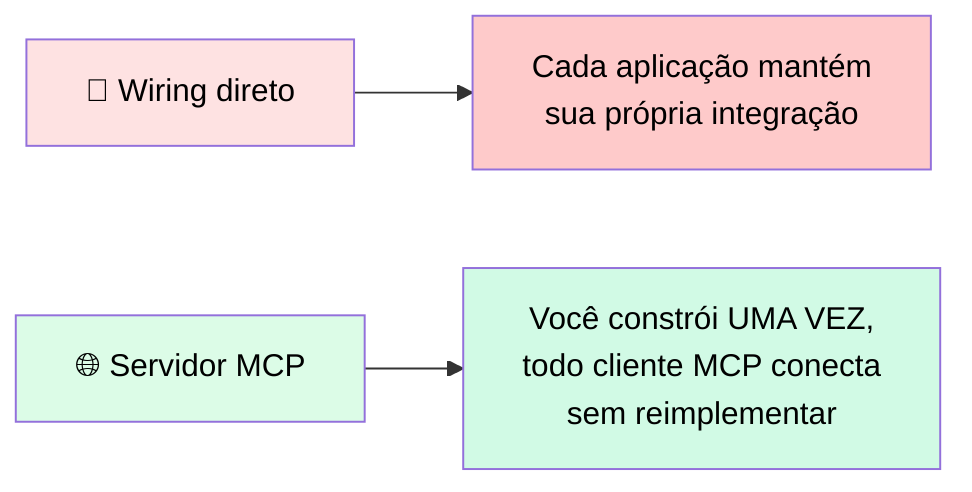
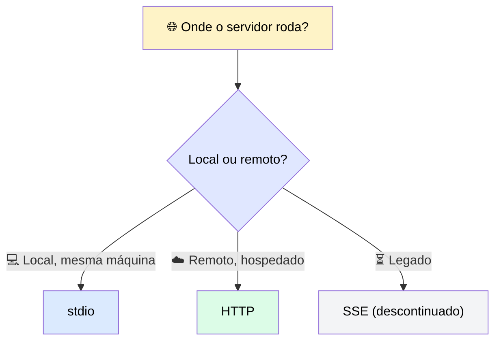
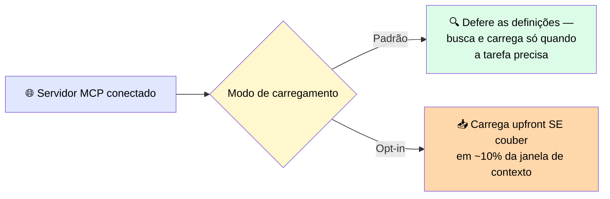
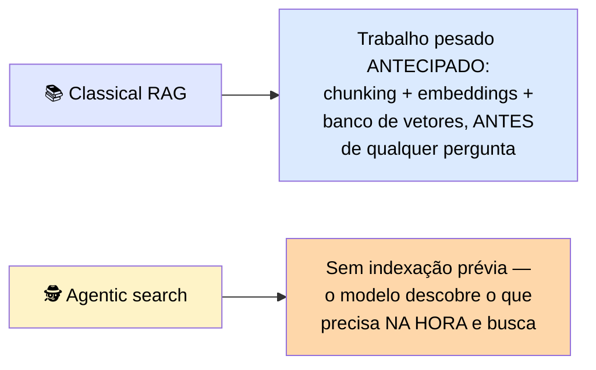
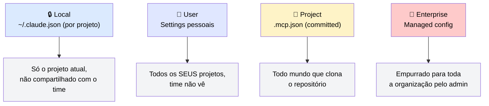

# 🌐 Construindo e Configurando um Servidor MCP

> 🎯 **Ideia central:** um servidor MCP é a camada que expõe tools a Claude **de fora do seu codebase**. Ao construir um, uma das primeiras decisões é o mecanismo de transporte e o escopo do servidor.

---

## 🆚 1. O que é um servidor MCP, e por que é diferente de conectar uma tool diretamente

> 💬 O Model Context Protocol (MCP) separa definições de tools de aplicações individuais e as transforma num processo chamado **servidor**. Claude Code tem um cliente MCP embutido — ao conectar a um servidor, ele descobre as tools que o servidor oferece e pode invocá-las durante a sessão.

---

## 🧰 2. Servidores MCP também expõem resources e prompts

| Tipo | O que é | Quando usar |
|---|---|---|
| 🔧 **Tools** | Ações que o modelo pode chamar | *(já coberto no Módulo 2)* |
| 📄 **Resource** | Dado **read-only** que o servidor expõe para o cliente buscar e colocar direto no contexto — sem o modelo precisar chamar uma tool | Quando dado conhecido deve estar no contexto desde o início do turno, e puxá-lo direto é mais barato/previsível que usar uma tool call. ⚠️ Suporte a resources varia por cliente MCP — verifique se o seu tem esse mecanismo |
| 💬 **Prompt** | Template de instrução pré-escrito que o servidor expõe, para um cliente invocar um prompt já validado por nome, em vez de cada usuário escrever o próprio | Quando uma redação cuidadosamente construída produz resultados materialmente melhores do que o que um usuário digitaria, e você quer que todo cliente tenha a mesma qualidade |

> 💡 Resources vêm em duas formas: **direto** (endereço fixo, sem parâmetros — ex.: lista de documentos disponíveis) e **templated** (endereço com parâmetro — ex.: um documento por ID).

---

## 🚄 3. Transporte: como o Claude Code fala com o servidor

| Transporte | O que é | Quando usar |
|---|---|---|
| 🖥️ **stdio** | Roda o servidor como processo local na mesma máquina do cliente — comunicação via stdin/stdout | Ferramenta local, script pessoal, servidor de desenvolvimento na sua própria máquina. **Não** funciona para compartilhar com o time ou hospedar remotamente |
| 🌐 **HTTP** | Conexão sobre rede padrão, suporta servidores hospedados em outra máquina — o **transporte recomendado** para tudo que não roda localmente | Servidores compartilhados do time, integrações hospedadas |
| ⏳ **SSE** | Forma mais antiga, superada pelo HTTP transport atual | Legado — se encontrar em configuração/documentação existente, trate como opção antiga, não recomendação atual |

---

## 💰 4. Custo de contexto e prompt caching

> 💬 Cada servidor MCP conectado contribui definições de tools que ocupariam a janela de contexto se carregadas de antemão.

> ✅ **Regra prática:** conecte só os servidores que você precisa — cada um adiciona ao pool de definições que o modelo tem que considerar.

### 💾 Prompt caching

Armazena o processamento de um **prefixo estável** para requisições seguintes reaproveitarem, em vez de reprocessar.

| Aspecto | Detalhe |
|---|---|
| 🎯 Melhores candidatos | System prompt longo, grande conjunto de definições de tools, documento de referência consultado repetidamente |
| ⚙️ Como habilitar | `cache_control: {type: "ephemeral"}` no último bloco a cachear — até **4 breakpoints** por requisição |
| 📐 Ordem processada | Tools → system prompt → messages. Um breakpoint depois das tools cacheia as definições mantendo as mensagens dinâmicas |
| ⏱️ Tempo de vida | Padrão: **5 minutos** desde a última leitura (reseta a cada leitura). Opt-in: **1 hora**, via `ttl: "1h"` no breakpoint |
| 📏 Limite mínimo | Só cacheia acima de **1.024 tokens** (na maioria dos modelos atuais) — prompts curtos não são cacheados mesmo com breakpoint |

> ⚠️ <mark>O conteúdo precisa bater exatamente: um único caractere alterado antes do ponto de cache invalida o cache e força uma escrita nova.</mark>

> 💬 O padrão de 5 minutos serve um modelo de vai-e-vem, onde requisições chegam a cada poucos minutos. A opção de 1 hora serve workloads com gaps maiores entre requisições — como um agente que pausa entre passos — onde a janela de 5 minutos expiraria antes da próxima requisição.

---

## 🔍 5. Retrieval-Augmented Generation (RAG)

> 💬 Mesmo problema de custo de contexto que os servidores MCP apresentam, só que aplicado a um corpo grande de material de referência. RAG resolve isso: em vez de carregar todo documento no contexto, o sistema armazena o material **fora** da janela, encontra as partes mais relevantes para a requisição atual, e supre só essas partes ao modelo.

| Abordagem | Analogia | Timing |
|---|---|---|
| 📚 **Classical RAG** | Bibliotecário que, antes da biblioteca abrir, já leu todo livro e escreveu um cartão-resumo preciso para cada capítulo — quando você chega com uma pergunta, ele puxa os cartões certos instantaneamente | Encontra a fatia comparando contra um **índice construído antecipadamente** |
| 🕵️ **Agentic search** | Pesquisador que, quando você pergunta, vai buscar a resposta ele mesmo, em vez de consultar cartões pré-preparados | Encontra a fatia **buscando no momento da necessidade** |

> ℹ️ Você já pode ter encontrado agentic search sem saber o nome: no Claude Code, quando conectado a muitos servidores MCP, Claude não carrega toda definição de tool antecipadamente — descobre e carrega só as tools necessárias para a tarefa atual. O Claude.ai Projects funciona igual para documentos enviados.

### 📐 Duas propriedades do retrieval

| Propriedade | O que significa |
|---|---|
| 📈 **Escala** | O custo de cada requisição fica estável conforme o material cresce — o modelo só recebe a fatia relevante, não a biblioteca inteira |
| 🎯 **Só é tão bom quanto o que encontra** | Se o passo de retrieval perde o documento que você precisava, o modelo nunca o vê. Nomes de arquivo vagos ("notes_final_v3.pdf") são mais difíceis de recuperar que nomes descritivos ("Política de reembolso Q3, atualizada agosto 2024") |

---

## 🎯 6. Escopo de configuração: quem carrega o servidor

| Escopo | Quando usar |
|---|---|
| 🔒 **Local** | Servidor ligado a um contexto de projeto específico que você não está pronto para commitar, ou tooling que só faz sentido num projeto |
| 👤 **User** | Utilitário pessoal que você usa em todo projeto — uma ferramenta de banco de dados local, um script que você usa não importa o codebase |
| 📁 **Project** | Servidor que o time todo pode acessar — a config viaja com o código. ⚠️ Um servidor `stdio` com escopo de projeto roda a partir da máquina de **cada** colega — cada clone gera seu próprio subprocesso local, então cada um precisa do runtime instalado (ex.: Node para um servidor lançado via `npx`) |
| 🏢 **Enterprise** | Serviços internos compartilhados, tooling de segurança, ou qualquer servidor que precisa estar presente em toda a organização sem depender de configuração individual |

---

## 🎛️ 7. Regras de permissão que miram uma tool MCP específica, não o servidor todo

> 💬 Conectar um servidor expõe sua lista completa de tools, mas raramente você quer que o agente alcance todas sem checagem. A camada de permissão se estende às tools MCP, nomeando uma tool individual em vez do servidor inteiro.

- 🏷️ Identificação: `mcp__server__tool` (ex.: `mcp__github__create_issue`)
- ✅ Uma regra `allow` numa tool específica deixa **só ela** rodar sem prompt, enquanto todo o resto do servidor continua pedindo
- 🚫 Uma regra `deny` numa tool de escrita a bloqueia, enquanto tools read-only do mesmo servidor continuam disponíveis
- ⚖️ <mark>Um deny numa tool sobrescreve um allow no servidor</mark>

> ℹ️ **API MCP Connector:** um objeto `mcp_toolset` permite setar um flag `enabled` por tool — registra o servidor mas expõe só as tools específicas que você quer que o modelo veja. A regra de permissão decide **se** uma tool exposta pode rodar; o flag `enabled` decide **se o modelo a vê**. A primeira é um controle de governança; a segunda, de custo de contexto e escopo.

---

## 🐙 8. Exemplo concreto: o servidor MCP do GitHub

O servidor GitHub, mantido pela própria GitHub, ilustra transport + scope + auth trabalhando juntos:

| Decisão | Escolha |
|---|---|
| 🚄 Transporte | **HTTP** — servidor remoto, hospedado pela GitHub |
| 🎯 Escopo | **Project** se o time todo precisa acessar o mesmo repositório; **Local** se só você precisa |
| 🔑 Autenticação | **Personal Access Token**, gerado no GitHub, passado como Bearer token no header |

> ⚠️ <mark>O token deve ser fornecido via variável de ambiente e referenciado na configuração — nunca committed inline no `.mcp.json`, porque um token escrito direto num arquivo committed entra no histórico do repositório e não pode ser removido sobrescrevendo o arquivo num commit posterior.</mark>

### 🆚 GitHub (token de serviço) vs. Linear (OAuth)

| Servidor | Padrão de autenticação |
|---|---|
| 🐙 **GitHub** | Você gera e armazena um token de serviço |
| 📋 **Linear** | Fluxo de sign-in via navegador — token emitido e armazenado automaticamente, ninguém copia credencial à mão |

> 💬 OAuth é o padrão certo para qualquer integração onde o modelo de autorização do serviço está ligado à **identidade do usuário**.

---

## 📋 9. Referência de setup MCP

| Contexto | Transporte | Escopo | Localização da config | Manuseio de secrets |
|---|---|---|---|---|
| 🖥️ Ferramenta pessoal local | stdio | Local | `~/.claude.json` (entrada por projeto) | Só variáveis de ambiente. Nunca no arquivo de config |
| 👥 Servidor de time compartilhado | HTTP | Project | `.mcp.json` committed na raiz | OAuth ou variáveis de ambiente. API keys nunca committed |
| 🧪 Experimento pessoal | stdio ou HTTP | Local | Settings pessoais do Claude | Só variáveis de ambiente |
| 🏢 Deploy organization-wide | HTTP | Enterprise | Managed settings (admin) | Secrets gerenciados pelo admin. Config travada contra override |

---

## 💰 10. Custo · Complexidade · Risco

| Dimensão | Detalhe |
|---|---|
| 💸 **Custo** | Cada servidor MCP conectado adiciona suas definições de tools à janela de contexto — carregue só os servidores que a tarefa precisa |
| 🧩 **Complexidade** | Transporte e escopo são decisões independentes que interagem: um servidor `stdio` **não pode** ser project-scoped para compartilhar, porque roda só numa máquina |
| ⚠️ **Risco** | <mark>Committar uma API key dentro do `.mcp.json` no controle de versão é o erro mais comum desta seção.</mark> A chave viaja para o histórico do repositório, onde rotacionar depois não é suficiente para remover a exposição |

---

## ✅ Checklist de decisão

- [ ] Estou conectando só os servidores MCP que a tarefa atual realmente precisa?
- [ ] Transporte e escopo combinam com onde o servidor roda (stdio nunca project-scoped)?
- [ ] Toda credencial está em variável de ambiente, nunca inline no `.mcp.json`?
- [ ] Usei regras de permissão por tool específica (`mcp__server__tool`), não só liberação do servidor inteiro?
- [ ] Se uso RAG, meus arquivos/documentos têm nomes descritivos que facilitam o retrieval?
- [ ] Configurei breakpoints de prompt caching nas partes estáveis da requisição (system prompt, tool definitions)?
