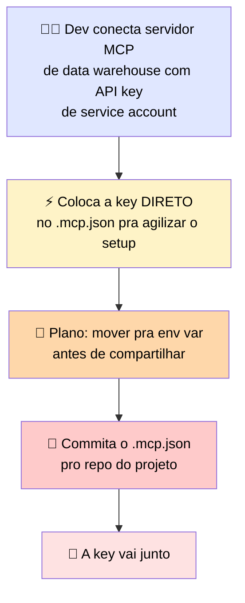
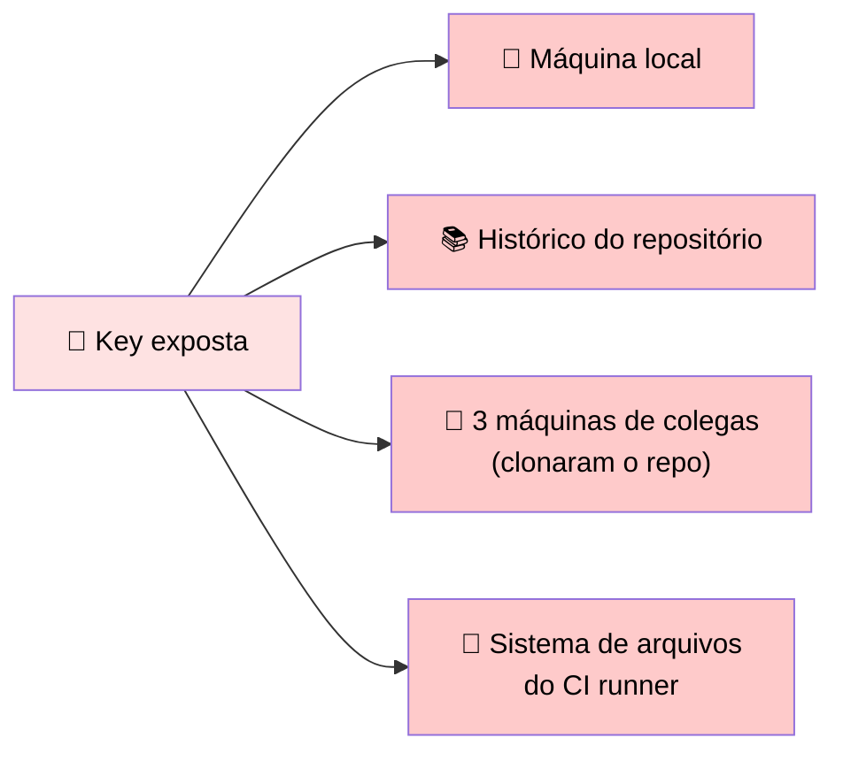
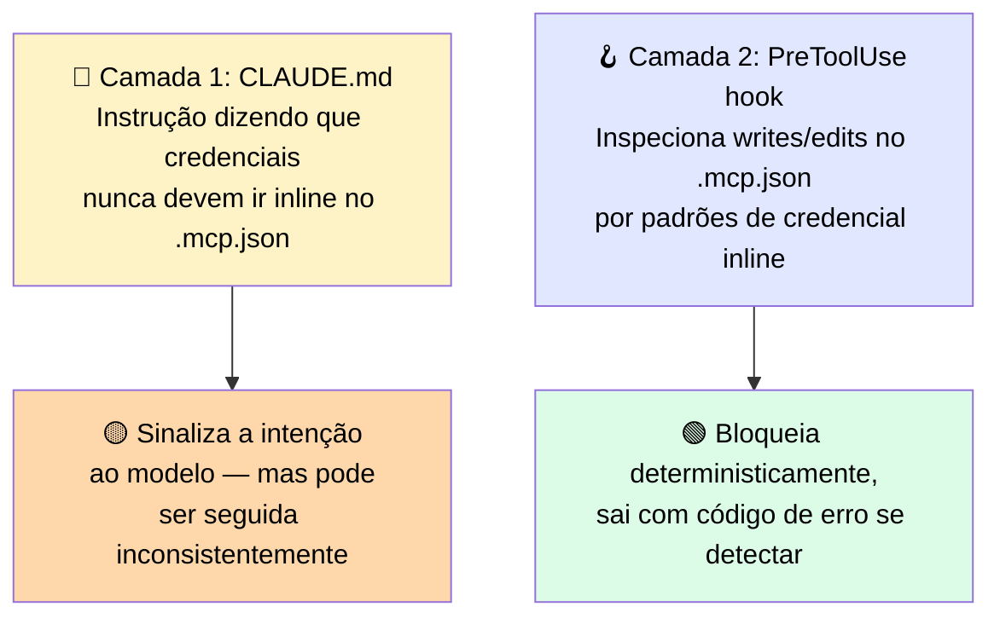

# 🔬 Post-mortem: a API Key que Viajou com o Arquivo de Configuração para o Repositório

> 🎯 **Setup:** o servidor estava funcionando, o time precisava de um setup compartilhado, e limpar o método de autenticação parecia algo para fazer depois do handoff. Esse atalho transformou uma API key hardcoded temporária numa exposição de credencial compartilhada no momento em que o arquivo de config foi committed.

---

## 🕵️ O que aconteceu



### ⏱️ 48 horas depois



> <mark>Dentro de 48 horas, a key estava em quatro lugares diferentes.</mark>

### 🔧 A "correção" que não resolveu

O desenvolvedor moveu a key para uma variável de ambiente, atualizou o `.mcp.json`, e committou o arquivo corrigido. Mas:

> ⚠️ <mark>A key ainda estava no histórico de commits, e a service account precisou ser rotacionada.</mark> A rotação quebrou dois serviços externos que estavam configurados com a mesma key — 3 horas de trabalho para consertar.

### 📝 Antes vs. Depois

```json
// ❌ Antes (não usar)
{
  "type": "http",
  "url": "https://warehouse.internal/mcp",
  "headers": {
    "Authorization": "Bearer sk-abc123..."
  }
}
```

```json
// ✅ Depois (correto)
{
  "type": "http",
  "url": "https://warehouse.internal/mcp",
  "headers": {
    "Authorization": "Bearer ${WAREHOUSE_MCP_TOKEN}"
  }
}
```

---

## 🚨 O que observar

> <mark>API keys committed num arquivo de configuração são committed no histórico do repositório. Sobrescrever o arquivo num commit posterior não remove a chave do histórico — só a remove da versão atual.</mark> Qualquer credencial escrita inline num arquivo committed deve ser tratada como comprometida e rotacionada.

### 🛡️ Duas camadas de prevenção



> 💬 A instrução no `CLAUDE.md` comunica a intenção; o hook aplica de forma determinística, independente do que o modelo decide — a mesma distinção instrução-vs-hook coberta na seção de contexto durável.

---

# 🧪 Checkpoint 5: combine transporte e escopo a cada cenário de deployment

| Cenário | 🚄 Transporte + 🎯 Escopo corretos |
|---|---|
| 🖥️ Uma ferramenta local de consulta SQLite, usada só na sua máquina de desenvolvimento | **stdio + Local** |
| 🏢 Um serviço de busca de código hospedado na infraestrutura da empresa, que todo o time de engenharia deve acessar | **HTTP + Enterprise (managed settings)** |
| 🧪 Um servidor experimental de web-scraping que você está testando essa semana contra um repositório específico, não pronto para compartilhar | **stdio ou HTTP + Local** |
| 🔒 Um servidor de security-scanning que o time de TI da sua organização precisa implantado em toda instalação do Claude Code dos devs | **HTTP + Enterprise (managed settings)** |

> 💡 Repare que "código de busca hospedado na infra da empresa, todo o time acessa" e "security-scanning que a TI precisa implantar em toda instalação" **ambos** apontam para HTTP + Enterprise — a diferença é: se é um serviço opcional que o time usa (poderia ser Project scope também dependendo do caso), vs. um requisito de segurança que TI precisa **garantir presença em todo mundo** (aí é Enterprise, controlado centralmente, sem depender de configuração individual).
