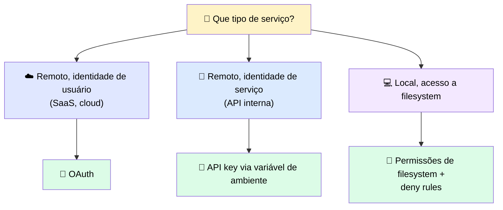
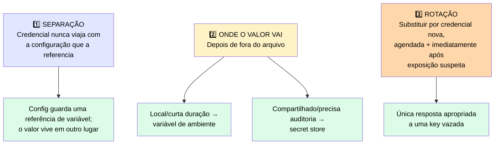
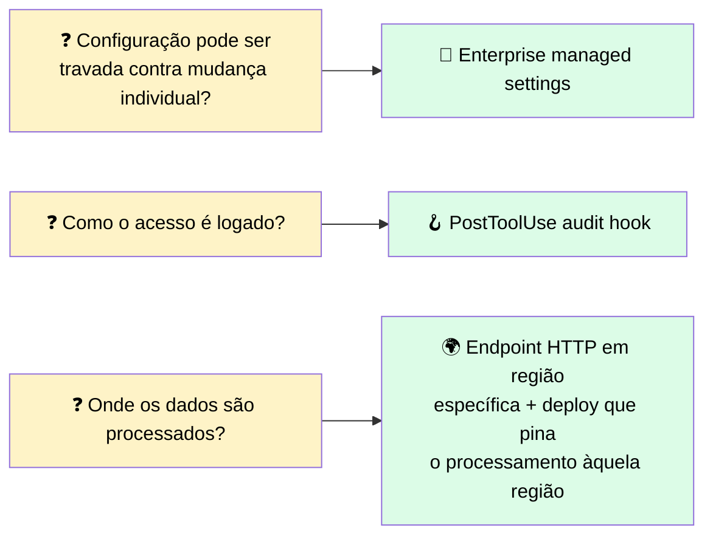
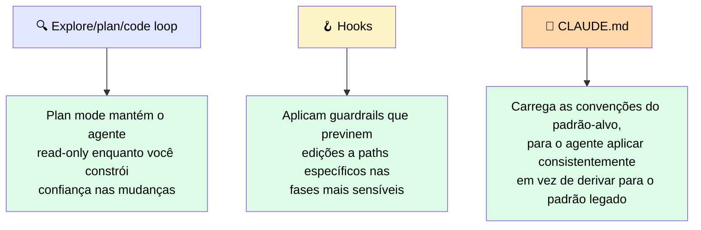

# 🏛️ Conectando Claude a Sistemas Enterprise e Autenticando com Segurança

> 🎯 **Ideia central:** um protótipo que conecta Claude a um serviço interno responde uma pergunta: *a conexão funciona?* Uma integração enterprise de produção precisa responder várias outras: quem o modelo está representando, e essa identidade é auditável? Que dados ele pode acessar, e para onde esses dados saem da organização? Um admin pode travar a configuração para nenhum dev individual mudar o setup de auth? O acesso pode ser logado de forma que satisfaça uma auditoria de compliance?

> <mark>Tratar essas perguntas como parte do design da integração é o que separa uma demo de algo pronto para deploy.</mark>

---

## 🔑 1. Padrões de autenticação por tipo de serviço

| Tipo | Padrão | Como funciona |
|---|---|---|
| ☁️ **Remoto com identidade de usuário** | **OAuth** | O servidor MCP retorna `401 Unauthorized` para sinalizar que autenticação é necessária. O cliente inicia um fluxo de sign-in via navegador. Depois que o usuário aprova, um token é emitido e armazenado — ninguém copia um secret à mão. Exemplo: Linear MCP |
| 🔧 **Remoto com identidade de serviço** | **API key via variável de ambiente** | A key identifica a service account. Nunca deve ser committed num arquivo de config — vive no ambiente no momento da execução. Numa pipeline de CI usando Agent SDK, a key é injetada como secret pelo runner da pipeline, não hard-coded no código |
| 💻 **Local com acesso a filesystem** | **stdio, sem autenticação de rede** | A fronteira de segurança é o modelo de permissão do filesystem. Uma regra `deny` nos arquivos de settings é a camada de governança |

> ℹ️ O servidor Linear usa OAuth (fluxo de sign-in); o servidor GitHub, por contraste, autentica com um personal access token passado como header.

---

## 🗝️ 2. Gerenciando o secret depois da autenticação: armazenamento, rotação, separação

> 💬 A falha de vazamento de key mencionada anteriormente não foi má escolha de método de auth — foi uma credencial que morou no lugar errado e não pôde ser limpa depois de se espalhar.

### 🛡️ Três práticas

| Prática | Por quê importa |
|---|---|
| 🔀 **Separação** | Arquivos de config são committed, compartilhados, clonados. Um valor inline viaja com toda cópia, e um valor committed entra no histórico de forma que sobrescrever não remove |
| 📍 **Onde o valor vai** | **Variável de ambiente**: secret local, de vida curta — CI runner define, config lê pelo nome, nada escrito em disco. **Secret store**: serviço gerenciado que guarda credenciais, devolve a chamadores autorizados em runtime, registra quem leu o quê. Centraliza — uma rotação atualiza todo consumidor de uma vez |
| 🔄 **Rotação** | <mark>Um key exposta não pode ser "tornada secreta" de novo — você precisa emitir uma nova.</mark> Um valor hard-coded em código committed não pode ser rotacionado limpo, porque o valor antigo permanece no histórico e todo consumidor hard-coded quebra na troca. Uma credencial lida de um secret store/env var rotaciona sem tocar no código, porque o código referencia o valor pelo nome |

✅ **Dois hábitos que barateiam a rotação:**
- Escopar cada credencial ao acesso mais estreito que sua tarefa precisa (uma key vazada alcança só o que aquela integração exigia)
- Manter registro de quais serviços usam cada credencial, para a rotação não surpreender consumidores

---

## 🏦 3. O que indústrias reguladas adicionam por cima da autenticação funcionando

Um cliente de serviços financeiros ou saúde pergunta mais do que "a autenticação funciona?" — pergunta **onde os dados são processados**, **como o acesso é logado**, e **se um admin pode travar a configuração**.

> ℹ️ Um hook `PostToolUse` que loga toda tool call e seus parâmetros para um audit store fornece o registro que uma revisão de compliance exige — dispara deterministicamente para toda chamada, independente do que o modelo decide, e o log **não é algo que o modelo pode pular**.

---

## 🏗️ 4. Modernização de código: aplicando o módulo inteiro a mudanças legadas

> 💬 Modernização de código concentra os riscos que cada ferramenta deste módulo foi projetada para gerenciar: blast radius alto, dependências imprevisíveis, reversibilidade limitada.

### ❓ Três perguntas antes de qualquer sessão de trabalho de alto risco

1. **💥 Qual é o blast radius se algo der errado?** Que sistemas dependem do código sendo mudado, e o que quebra downstream se uma edição estiver errada?
2. **📋 Como as mudanças são auditadas?** Existe um hook `PostToolUse` logando toda tool call, e esse log satisfaz quem precisa revisar o que o agente tocou?
3. **✅ Quem aprova cada fase antes da próxima começar?** Plan mode aplica a fronteira entre exploração e execução, mas a decisão de aprovação em si é sua para definir e documentar antes do trabalho começar.

---

## 📋 5. Checklist de autenticação e integração

| Tipo de serviço | Método de auth | Onde secrets vivem | O que é logado | Quem pode travar a config |
|---|---|---|---|---|
| ☁️ Remoto com identidade de usuário (SaaS, cloud) | OAuth | Token emitido pelo provedor OAuth, armazenado pelo cliente | Hook `PostToolUse` para audit log | Administrador via enterprise managed settings |
| 🔧 Remoto com identidade de serviço (API interna) | API key em variável de ambiente | Só ambiente. Nunca na config committed | Hook `PostToolUse` para audit log | Administrador via enterprise managed settings |
| 💻 Local (filesystem, DB local) | Permissões de filesystem | Nenhuma credencial necessária. Deny rules aplicam acesso a paths | Hook `PostToolUse` para audit log | Deny rules em enterprise managed settings |

---

## 💰 6. Custo · Complexidade · Risco

| Dimensão | Detalhe |
|---|---|
| 💸 **Custo** | Fluxos OAuth adicionam um passo de setup único por usuário por serviço. Gestão de API key exige processo de rotação. Audit logging via `PostToolUse` adiciona pequeno overhead a toda tool call |
| 🧩 **Complexidade** | Ambientes regulados adicionam requisitos que não aparecem num protótipo. Identificá-los durante o scoping é a disciplina que mantém integrações no cronograma |
| ⚠️ **Risco** | <mark>Um sistema com credenciais hard-coded, sem audit log, e que não pode ser travado centralmente não vai passar numa revisão de segurança de um cliente regulado.</mark> As correções não são difíceis, mas exigem atenção antes da revisão |

---

## ✅ Checklist de decisão

- [ ] O método de autenticação bate com o tipo de serviço (OAuth para identidade de usuário, API key em env var para identidade de serviço)?
- [ ] Nenhuma credencial viaja com o arquivo de configuração que a referencia?
- [ ] Existe um plano de rotação, e ele foi testado — sabemos quais consumidores dependem de cada credencial?
- [ ] Se o cliente é regulado: onde os dados são processados, como o acesso é logado, e quem pode travar a config estão todos respondidos **antes** do deploy?
- [ ] Para trabalho de modernização de código de alto risco: blast radius, auditoria e aprovação por fase foram definidos **antes** da sessão começar?
