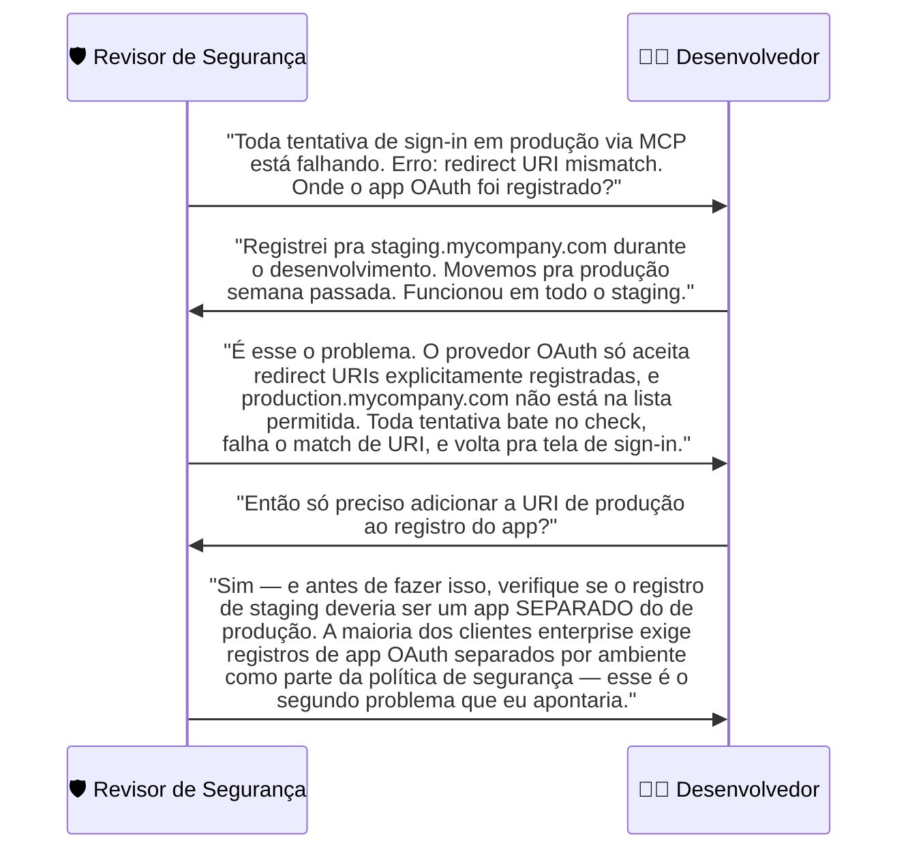
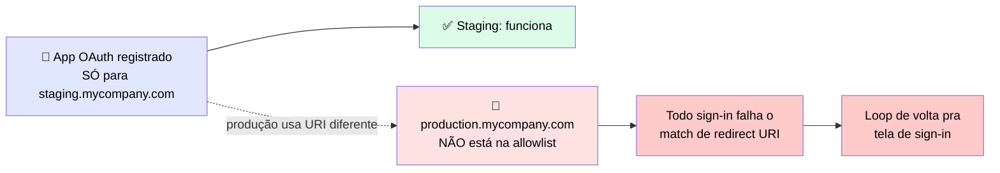

# 🔬 Post-mortem: a Conexão OAuth que Funcionou em Staging e Falhou em Produção

> 🎯 **Setup:** a conexão OAuth funcionou de ponta a ponta em staging, então mover para produção pareceu um cutover de rotina. O que o time perdeu de vista: <mark>redirect URIs de OAuth são registrados por host e frequentemente governados por ambiente — funcionar em staging não significava que o host de produção estava autorizado a completar o fluxo de sign-in.</mark>

---

## 💬 A conversa que revelou o passo faltando

Troca ocorrida numa revisão pós-deployment, depois que a integração MCP falhou em produção — a integração tinha passado em **todos** os testes de staging.



---

## 🕳️ Onde estava a falha

> ✅ O desenvolvedor tinha testado o fluxo OAuth de ponta a ponta em staging e confirmado que funcionava — <mark>a falha de produção não era um defeito de código.</mark> Era um passo de configuração que se aplica **por host e por ambiente**, e o desenvolvedor não sabia que precisava fazer isso para produção também.



---

## 🚨 O que observar

| ⚠️ Risco | 💡 Mitigação |
|---|---|
| Redirect URIs de OAuth são registradas **por host** — uma conexão OAuth de staging funcionando não significa que a de produção está configurada | Antes de mover qualquer integração MCP autenticada por OAuth para um novo ambiente, adicionar o redirect URI do novo host ao registro do app OAuth |
| Clientes enterprise regulados costumam exigir **registros de app OAuth separados** por ambiente | Verificar essa exigência explicitamente antes do cutover |
| A descoberta acontece na **primeira tentativa de sign-in em produção**, geralmente depois do deploy | Incluir o passo de registro no checklist de deployment |

---

# 🧪 Checkpoint 6: diagnostique a falha de autenticação a partir de um trace

> 🎯 Leia o trace de conexão abaixo. Nomeie o mecanismo de falha de autenticação, e selecione a correção certa.

```
[MCP Client] Connecting to https://data-api.internal/mcp ...
[MCP Client] GET /auth/token, 401 Unauthorized
[MCP Client] Reading credential from: /home/jenkins/.config/mcp-credentials.json
[MCP Client] Credential value: WAREHOUSE_TOKEN= sk-****[redacted]
[MCP Client] Retrying with credential, 401 Unauthorized
[MCP Client] Connection failed after 3 attempts
```

## 🕵️ Diagnóstico

> <mark>O mecanismo de falha aqui não é redirect URI (esse é o post-mortem anterior) — é uma credencial armazenada num arquivo de config local (`/home/jenkins/.config/mcp-credentials.json`) que está sendo rejeitada com 401, mesmo após retry.</mark> O padrão de "credencial lida de um arquivo local no runner de CI, retornando 401 mesmo após retry" indica uma key inválida/rotacionada incorretamente, guardada no lugar errado.

## 🛠️ Qual a correção certa?

| Opção | Correta? |
|---|---|
| A) Rotacionar a API key e atualizar `/home/jenkins/.config/mcp-credentials.json` com o novo valor | ❌ Mantém o problema de fundo — a credencial continua num arquivo local, não numa fonte gerenciada |
| **B) Rotacionar a key rejeitada, então mover a credencial para fora do arquivo e injetá-la como variável de ambiente na configuração do runner da pipeline de CI. Atualizar a config MCP para referenciar a variável** | ✅ **Correta** |
| C) Trocar de autenticação por API key para OAuth nesse serviço | ❌ Não é o problema — é um serviço com identidade de serviço (CI runner), não identidade de usuário. OAuth não é o padrão certo aqui |

> <mark>A correção certa ataca a causa raiz: a credencial não deveria estar armazenada num arquivo local do Jenkins — deveria vir de uma variável de ambiente injetada pelo próprio runner da pipeline no momento da execução.</mark>
