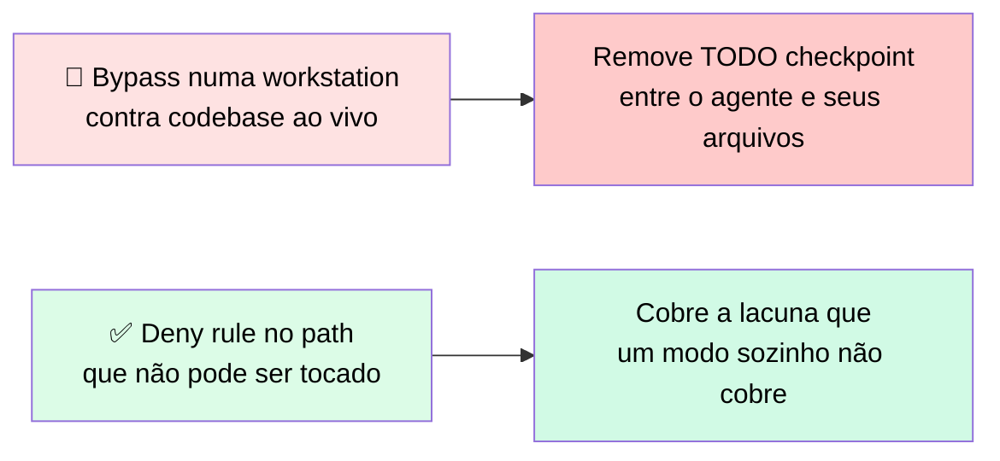
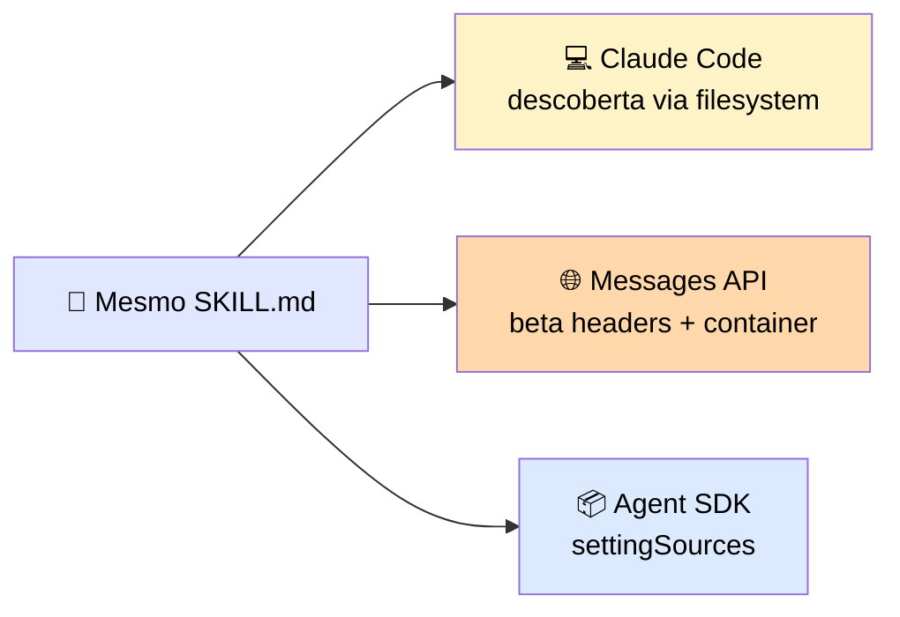
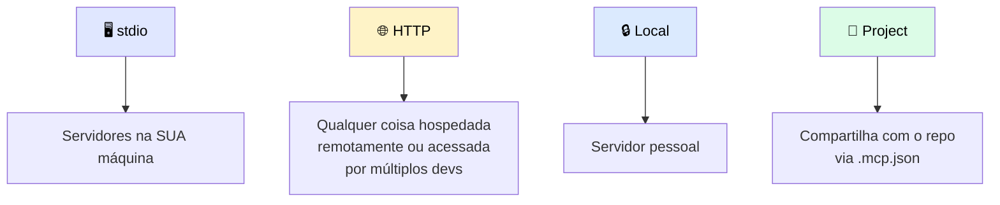
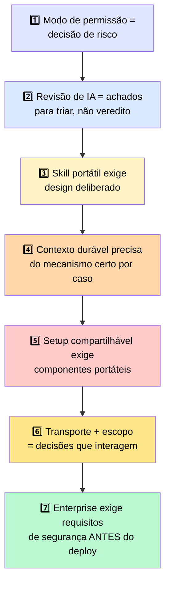

# 🏁 Sete Conclusões-Chave — Uma por Seção

> 🎯 Uma conclusão por seção, amarrando o módulo inteiro.

---

## 1️⃣ Modo de permissão é uma decisão de risco, não de velocidade

> 💬 O Claude Code oferece modos de "prompt-antes-de-tudo" a "prompt-para-nada". O modo de permissão deve bater com o **perfil de risco** do trabalho e do ambiente, não com a preferência por menos prompts.

---

## 2️⃣ Uma revisão de código de IA te dá um conjunto de achados para triar, não um veredito para aplicar

> ✅ Confie nos achados que o revisor consegue **provar a partir do diff** na sua frente, como uma checagem null faltando ou um recurso não fechado — e confirme nas linhas citadas. <mark>Trate qualquer alegação sobre comportamento em runtime ou outro sistema como uma hipótese a testar</mark>, porque o revisor fez essa alegação sem a evidência que a provaria.

> 🙋 Coloque o gate humano no ponto onde um achado vira uma ação difícil de reverter, e aumente a precisão do revisor dando a ele as convenções que, do contrário, teria que adivinhar.

---

## 3️⃣ Uma skill é portátil, mas "roda em todo lugar" é algo que você precisa projetar

> <mark>Uma skill escopada a uma descrição clara e livre de suposições de ambiente local porta de forma limpa; uma que assume o terminal onde foi escrita, não.</mark> Em todo runtime, subagentes começam limpos — não pré-carregam skills automaticamente.

---

## 4️⃣ Contexto durável exige o mecanismo certo para cada preocupação

| Mecanismo | Papel |
|---|---|
| 📄 **CLAUDE.md** | Memória de projeto persistente por sessão, mas **dilui com tamanho** |
| 🎯 **Rules files** | Escopam orientação a onde ela se aplica |
| 🪝 **Hooks** | Aplicam guardrails **deterministicamente**, não probabilisticamente |
| 🤖 **Subagents** | Mantêm trabalho de exploração fora do contexto principal |

> ⚠️ <mark>Esses quatro mecanismos resolvem problemas diferentes — forçar todos dentro do CLAUDE.md produz um único arquivo mais difícil de manter e mais fácil de ignorar.</mark>

---

## 5️⃣ Um setup compartilhável exige componentes portáteis

> 💬 Um plugin que referencia um path absoluto para o diretório home do autor vai instalar numa máquina e falhar em todas as outras.

✅ **Regra prática:** skills, hooks e componentes de plugin que serão compartilhados devem referenciar paths **relativos à raiz do projeto**, e toda exigência de variável de ambiente deve ser documentada ou validada no install. <mark>Teste o install numa máquina limpa antes de distribuir.</mark>

---

## 6️⃣ Transporte e escopo são decisões independentes com consequências dependentes

> <mark>A combinação precisa bater com a intenção de deployment: um servidor de time compartilhado exige transporte HTTP e escopo project ou enterprise. Um servidor stdio no `.mcp.json` é uma configuração que parece compartilhável mas não é.</mark>

---

## 7️⃣ Integração enterprise exige identificar os requisitos de segurança antes do deployment

> 💬 Um cliente regulado pergunta sobre identidade, residência de dados, logging de acesso e controle de configuração. As respostas vêm de:

| Requisito | Resposta |
|---|---|
| 🔐 Identidade de usuário | OAuth |
| 🔑 Identidade de serviço | Variáveis de ambiente |
| 📋 Logging de acesso | Hooks `PostToolUse` |
| 🔒 Trava de configuração | Enterprise managed settings |

> <mark>Nenhum desses é difícil de implementar, mas todos são difíceis de retrofit depois que um deployment de produção falhou numa revisão de segurança.</mark>

---

## 🗺️ Mapa geral das sete conclusões

---

> 🔮 **O que vem a seguir:** o Módulo 4 cobre engenharia de produção, avaliações e segurança — como medir se suas integrações Claude Code funcionam corretamente em escala, como construir harnesses de avaliação, e como projetar guardrails de segurança de nível de produção. Os modos de permissão, hooks e padrões de autenticação deste módulo são a fundação contra a qual essas avaliações testam.
