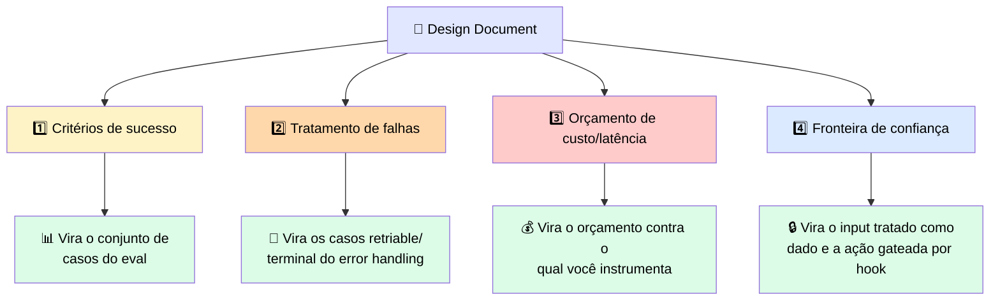
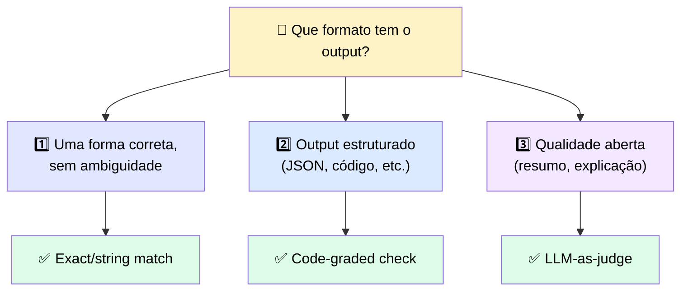
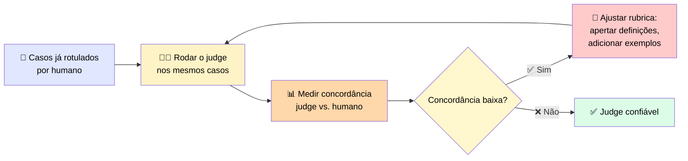
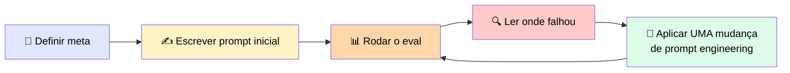

# 📊 Definindo "Pronto" Antes de Lançar: Evals e um Judge Calibrado

> 🎯 **Ideia central:** "Testei umas vezes e pareceu certo" não é um sinal rastreável. Um eval transforma essa intuição num **número mensurável** que você acompanha conforme prompt, tools ou modelo mudam.

---

## 📝 1. O design document: o que declarar antes de escrever qualquer código de produção

> 💬 Um documento de design é um registro escrito curto — geralmente uma página markdown — que declara os critérios de sucesso, as falhas que o sistema deve sobreviver, o custo/latência que deve respeitar, e a fronteira de confiança que deve defender.



> <mark>Escrever essas quatro decisões uma vez, antes de construir, é o que mantém as camadas consistentes entre si — em vez de cada uma resolver um problema diferente.</mark>

| # | Decisão | O que precisa declarar |
|---|---|---|
| 1️⃣ | **Critérios de sucesso** | O output para casos representativos, específico o suficiente para ser avaliado. *"Resuma a thread"* é vago; *"um resumo de duas frases listando cada action item e seu responsável"* pode ser checado |
| 2️⃣ | **Tratamento de falhas** | Liste os erros que a produção vai lançar, marque cada um como retriable ou terminal, e diga o que o usuário recebe quando uma falha não pode ser recuperada |
| 3️⃣ | **Orçamento de custo e latência** | O orçamento por requisição, o teto mensal de custo, o alvo de latência, e a confiabilidade mínima que o design precisa sustentar |
| 4️⃣ | **Fronteira de confiança** | Que conteúdo o agente lê que outra pessoa pode escrever, e o menor conjunto de ações/acesso que a feature precisa para funcionar |

> 💡 Se você constrói uma ferramenta de coding agêntica, esse documento é também o que você entrega **antes** dela escrever qualquer coisa — planeje primeiro, capture como artefato escrito, depois implemente contra ele.

---

## 🌡️ 2. Um eval é o conjunto de teste que define o que uma feature deve fazer antes de lançar

> 💬 Um eval funciona como um termômetro: não deixa o paciente mais saudável, só te dá um número em que confiar. Antes de ter um, "pronto" é uma sensação. Depois, é um score num conjunto fixo de casos.

```python
def run_test_case(test_case):
    """Roda um caso, depois avalia o resultado."""
    output = run_prompt(test_case)
    score = grade(test_case, output)
    return {"output": output, "test_case": test_case, "score": score}

def run_eval(dataset):
    """Roda todo caso e reporta o score médio."""
    results = [run_test_case(c) for c in dataset]
    average = sum(r["score"] for r in results) / len(results)
    print(f"Average score: {average}")
    return results
```

> ⚠️ <mark>O score em si não é bom ou ruim inerentemente. A primeira tentativa marcando 2 ou 3 de 10 é normal.</mark> O que importa é se o número aumenta conforme você muda o prompt, as tools ou o modelo.

✅ **Regra prática:** mude **um componente por vez**, para saber qual causou a melhora. O detalhamento por caso importa tanto quanto a média — um score médio estável pode esconder uma mudança que corrigiu três casos e quebrou outros três.

---

## ⚖️ 3. Combinando o método de grading com o formato do output



| Método | ✅ Funciona quando | ⚠️ Falha em |
|---|---|---|
| 🎯 **Exact/string match** | Output tem **uma** forma correta — um classificador que retorna um label, uma função com valor conhecido | Qualquer paráfrase aceitável de uma resposta aberta — o mais barato e o mais frágil |
| 💻 **Code-graded check** | Uma função consegue validar o output: JSON válido, código parseável, número dentro de um range, campo obrigatório presente | Não diz nada sobre se o **conteúdo** é bom, só que está bem-formado |
| 🧑‍⚖️ **LLM-as-judge** | Outputs abertos onde qualidade importa mas não pode ser pattern-matched: "esse resumo é fiel?", "essa resposta seguiu as instruções?" | Mais caro e mais ruidoso — usar quando um code check bastaria adiciona custo e variância à toa |

### 🧪 Exemplo: mesmo output, métodos diferentes

> 💬 Uma feature deve retornar as três capitais de uma região como array JSON. Uma execução retorna o array em ordem diferente da string de referência.

| Método | Resultado |
|---|---|
| Exact match | ❌ Score zero — os caracteres não batem, mesmo a resposta estando correta |
| Code grader (parse + checa membership) | ✅ Score alto — as três cidades estão presentes, estrutura válida |

> 💰 Exact match e code check rodam localmente e custam essencialmente nada por caso — dá pra rodar milhares a cada mudança. <mark>Um judge é uma segunda chamada de modelo por caso — um eval de mil casos avaliado por judge é mil chamadas de API extras toda vez que você roda.</mark> Muitos times avaliam formato/estrutura com código a cada commit e reservam o judge para uma passada de qualidade mais lenta e agendada.

### 📋 Tabela de seleção de grader

| Tipo de tarefa | Método de grading | O que captura | Onde é pouco confiável |
|---|---|---|---|
| Label/valor único correto | Exact/string match | Resposta errada quando há exatamente uma certa, custo quase zero | Falha em toda paráfrase válida |
| Output estruturado/código | Code-graded check | JSON inválido, código não-parseável, números fora do range, campos faltando | Não diz nada sobre se o conteúdo é bom |
| Qualidade aberta | LLM-as-judge | Fidelidade, seguimento de instruções, completude, tom | Ruidoso, custoso, produz um número confiante que só significa algo depois de calibrado |

---

## 🧑‍⚖️ 4. Construindo e calibrando o judge para que seus scores sejam defensáveis

```python
def grade_by_model(task, solution):
    eval_prompt = f"""You are an expert reviewer. Evaluate the solution for the task.
    Task: {task}
    Solution: {solution}
    Return JSON with:
    "strengths": array of 1-3 points
    "weaknesses": array of 1-3 points
    "reasoning": a one to two sentence explanation, 50 words maximum
    "score": a number from 1 to 10
    """
    messages = [{"role": "user", "content": eval_prompt}]
    result = chat(messages)
    return json.loads(result)
```

> <mark>Sem pedir strengths/weaknesses/reasoning junto com o score, modelos derivam para um número seguro do meio — geralmente perto de 6, independente da qualidade real do output.</mark> Pedir o raciocínio primeiro é o que ancora o score a algo específico.

### 🎯 Calibração: a etapa que a maioria pula



> <mark>Um judge que discorda dos labels humanos metade das vezes produz um número que parece rigoroso mas não vale nada.</mark> Medir concordância antes de confiar nos scores é o que transforma o judge de um chute em evidência defensável.

---

## 📈 5. Cobertura importa mais que perfeição

> 💬 Um conjunto de avaliação maior com grading automatizado um pouco mais ruidoso geralmente revela mais do que um conjunto pequeno avaliado à mão. Vinte casos com inputs irregulares e de borda capturam uma quebra que três casos cuidadosamente escolhidos nunca exercitam.

✅ Quando precisar de mais casos, peça a Claude para gerar mais a partir de um conjunto pequeno e rotulado — depois faça spot-check nos casos gerados para manter o conjunto honesto.

### 🔄 O loop completo



> ⚠️ <mark>Se você reescreve o prompt, adiciona dois exemplos, e troca o modelo tudo numa única passada, e o score muda, você não aprendeu nada sobre qual mudança causou aquilo.</mark> Mova uma alavanca, rode de novo, leia os resultados por caso, e mantenha a mudança só se o score subir.

### 🩺 Um score baixo é informação para agir

| Tipo de falha | Aponta para |
|---|---|
| 📐 Falha de formatação | As instruções de output do prompt |
| 📊 Falha factual em conteúdo recuperado | O passo de retrieval |
| 🐛 Falha que só aparece em input longo | O tratamento de contexto |

---

## ⚖️ 6. Quando usar

| ✅ Funciona bem | ⚠️ Adiciona custo/complexidade | 🔄 Considere outra abordagem |
|---|---|---|
| Transforma "parece certo" num score rastreável e defensável, movendo uma mudança deliberada por vez | Autorar casos e calibrar um judge é trabalho real antes de qualquer feature lançar | Para um output de formato fixo único, um code check sozinho basta — pule o judge inteiramente |

---

## ✅ Checklist de decisão

- [ ] Escrevi o design document (4 decisões) **antes** de escrever código de produção?
- [ ] Meus critérios de sucesso são específicos o suficiente para gerar um caso testável?
- [ ] Escolhi o método de grading certo para a forma do output (match/code/judge)?
- [ ] Se uso LLM-as-judge, calibrei contra casos rotulados por humano e medi concordância?
- [ ] Mudo **um componente por vez** ao iterar, e leio o breakdown por caso, não só a média?
