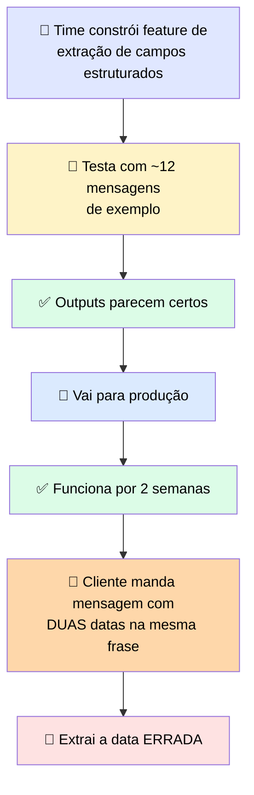
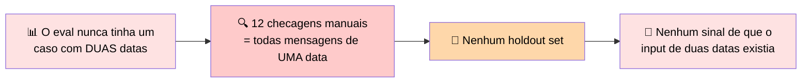

# 🔬 Post-mortem: a Demo que Passou e o Edge Case que Não

> 🎯 **Setup:** você viu o agente responder corretamente uma dúzia de vezes, então concluiu que estava pronto. O problema: todas aquelas dúzia de tentativas usaram inputs parecidos com os que você tinha em mente quando construiu.

---

## 🕵️ O que aconteceu

> 💬 *"Fiz meu pedido no dia 3 de março mas só recebi em 12 de abril."* A feature extraiu **12 de abril** como data do pedido.

### ✅ Por que a validação não pegou

| Validação existente | Passou? |
|---|---|
| Mensagem é texto não-vazio | ✅ Sim |
| Campo de data veio populado | ✅ Sim |
| Data é bem-formada (não malformada/impossível) | ✅ Sim |

> <mark>Validação confirma que um valor tem a forma certa. Não confirma que é o valor certo.</mark> Lógica downstream agiu na data errada e um lote de registros foi atualizado incorretamente.

---

## 🕳️ Onde estava a falha

> ⚠️ A revisão não encontrou bug no modelo nem no prompt. <mark>O conjunto graded faltando foi a causa raiz.</mark> O eval não corrigiu a extração — ele **detectou** a falha, documentou o comportamento esperado como um caso checável, e protegeu contra a mesma regressão em toda mudança futura. A mensagem de duas datas virou o **caso um** desse conjunto.

---

## 🚨 O que observar

> ✅ **Como encontrar esses inputs antes de um cliente encontrar:** peça ao modelo para enumerar edge cases que poderiam quebrar a implementação atual. Duas datas numa frase, nenhuma data, uma data relativa como "próxima terça". Transforme os plausíveis em casos graded com output esperado checado por humano.

> 💬 Sucesso foi julgado por impressão em vez de um conjunto graded. O eval é o que expõe falhas e protege contra regressão. O prompt é o que muda o output. **Escreva o comportamento esperado como casos graded antes de lançar.**

---

# 🧪 Checkpoint: complete um eval parcial para uma feature de sumarização

> 🎯 Este eval tem duas lacunas: identificar o output esperado de cada caso, e casar cada faixa de score com seu significado.

## 📋 `dataset.json`

| Caso | Input | Expected behavior |
|---|---|---|
| 1 | Thread de suporte longa sobre reembolso atrasado, 14 mensagens | *"Um resumo de 2 frases nomeando o problema (reembolso atrasado) e o status atual (escalado)"* |
| 2 | Transcrição de reunião com três action items atribuídos | ✅ **"Um resumo que lista os três action items com seus responsáveis"** |
| 3 | Bug report com passos de repro e uma observação não relacionada | ✅ **"Um resumo do bug e seus passos de repro que omite a observação não relacionada"** |

## ⚖️ `judge_prompt.txt` — faixas de score

| Faixa | Significado |
|---|---|
| **1 a 3** | ✅ **Perde conteúdo obrigatório** |
| **4 a 7** | ✅ **Parcial: algum conteúdo obrigatório presente, algum faltando** |
| **8 a 10** | ✅ **Completo e fiel ao comportamento esperado** |

> <mark>O padrão aqui é o mesmo do post-mortem: a expectativa precisa ser específica o suficiente para ser checada — "lista os três action items com seus responsáveis" é checável; "resuma a reunião" não é.</mark>
