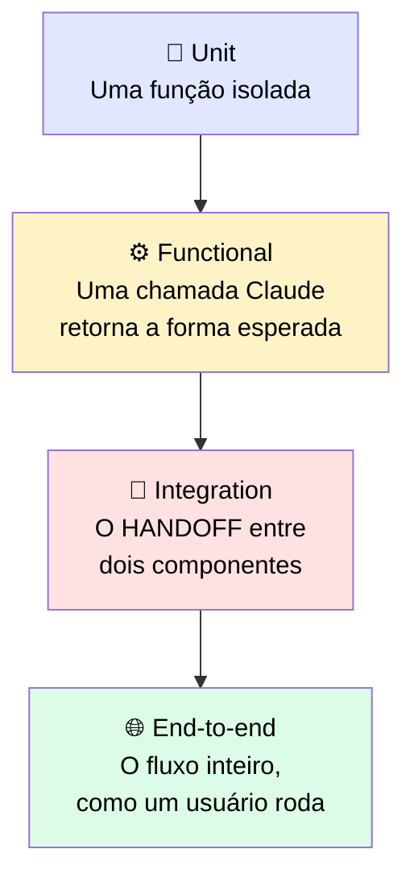

# 🔍 Testing e Tracing

> 🎯 **Ideia central:** o eval te diz o que "bom" parece como número. Não te diz **onde** uma falha aconteceu, nem impede que um eval passando esconda uma quebra em algum lugar do workflow. Um alvo graded precisa de uma camada de teste e tracing por baixo dele.

---

## 🪜 1. Os níveis de teste — cada um capturando uma falha que os outros perdem



| Nível | O que isola | O que **não** captura |
|---|---|---|
| 🧩 **Unit** | Uma função — um parser, um wrapper de tool — sozinha | Nada sobre como as peças se encaixam |
| ⚙️ **Functional** | Se uma chamada Claude retorna a forma esperada para um input: os campos certos, o tipo certo, uma resposta parseável | Falhas no sistema ao redor daquela chamada |
| 🔗 **Integration** | O **handoff** entre dois componentes — ex.: um resultado de retrieval passado para uma chamada de modelo | Comportamento de fluxo inteiro que só emerge end-to-end |
| 🌐 **End-to-end** | O fluxo completo do jeito que um usuário roda, de input a output | Onde exatamente está a quebra — vê só o resultado final |

> <mark>É a Integration que costuma esconder a maioria das falhas silenciosas, porque cada lado pode passar nos próprios testes enquanto o handoff entre eles está quebrado.</mark>

---

## 🧵 2. Tracing: encontrando a origem da falha

> 💬 Testes dizem que uma falha existe, mas não dizem qual passo a causou. É isso que um trace adiciona.

```
[trace run_id=8f21c] case: "Where is my refund?"
  step 1 retrieve(query)        ok    42ms  -> 3 chunks
  step 2 build_prompt(chunks)   ok     1ms  -> prompt 1,240 tok
  step 3 model.call(prompt)     ok   980ms  -> answer "..."
  step 4 parse(answer)          FAIL   2ms  -> KeyError: amount
  final score: 0 (failure localized to step 4, the parser)
```

> <mark>O trace transforma "o caso falhou" em "passo quatro: o parser lançou um KeyError num campo que o modelo não retornou".</mark> É essa a diferença entre uma correção de cinco minutos e um dia inteiro rastreando o workflow à mão.

---

## 🚦 3. Roteando entre fetch-once e busca iterativa

> 💬 Você não precisa escolher uma estratégia para tudo. Um passo de classificação barato pode mandar lookups de um único fato para o caminho fetch-once, e perguntas multi-parte para o caminho search-across-rounds.

```python
def route(query):
    kind = classify(query)  # chamada barata: "lookup" ou "multi_step"
    if kind == "lookup":
        return fetch_once(query)     # retrieval estático, uma passada
    return agentic_search(query)     # busca através de rodadas
```

> ✅ Essa chamada de classificação custa muito menos do que rodar busca iterativa numa query que um único retrieval teria respondido. O roteador se paga sempre que seu tráfego é misto. <mark>Se toda query tem a mesma forma, pule o roteador e fixe o caminho que combina.</mark>

---

## 📋 4. Referência: níveis de teste + escolha de retrieval

| Nível | O que isola | O que não captura |
|---|---|---|
| Unit | Uma função, sozinha | Como componentes se encaixam |
| Functional | Uma chamada Claude retornando a forma esperada | Falhas no sistema ao redor daquela chamada |
| Integration | O seam onde dois componentes fazem handoff | Comportamento de fluxo inteiro que só emerge end-to-end |
| End-to-end | O fluxo completo como o usuário roda | Onde exatamente está a quebra, já que vê só o resultado final |
| Escolha de retrieval | Fetch fixo uma vez para lookups de fato único num corpus estável | Perguntas multi-etapa e corpora mutáveis, que precisam de busca através de rodadas |

---

## ⚖️ 5. Quando usar

| ✅ Funciona bem | ⚠️ Adiciona custo/complexidade | 🔄 Considere outra abordagem |
|---|---|---|
| Localiza uma falha a um passo específico, casando cada teste com a quebra que ele consegue enxergar | Tracing e quatro níveis de teste são infraestrutura que você constrói e mantém | Para um lookup de fato único num corpus estável, retrieval fetch-once vence busca iterativa |

---

## ✅ Checklist de decisão

- [ ] Tenho testes nos quatro níveis, não só unit/end-to-end?
- [ ] Tenho um teste de **integration** especificamente cobrindo o handoff entre retrieval e chamada de modelo (ou equivalente no meu fluxo)?
- [ ] Todo run gera um trace com timing e output intermediário de cada passo?
- [ ] Se meu tráfego é misto (lookups simples + perguntas complexas), tenho um roteador barato decidindo o caminho?
