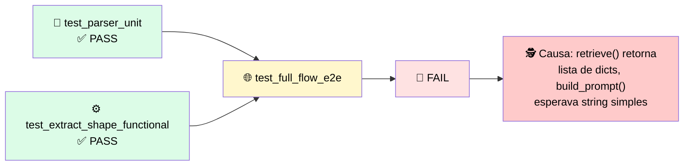

# 🔬 Post-mortem: as Peças Passaram e o Seam Quebrou

> 🎯 **Setup:** você testou o prompt e o parser isoladamente. Ambos passaram, então você confiou no fluxo inteiro.

---

## 🧾 O trace

```
PASS test_parser_unit              parser returns date objects
PASS test_extract_shape_functional model call returns {primary_date, issue}
FAIL test_full_flow_e2e

  [trace] step 1 retrieve(q)        ok  -> 3 chunks (list of dicts)
          step 2 build_prompt(ctx)  ok  -> ctx inserted as raw list
          step 3 model.call(prompt) ok  -> answer ignores the context
          step 4 assert answer...   FAIL -> model answered from memory

  cause: retrieve() returns [{"content": ...}], build_prompt() expected
         a plain string, so the model received malformed context.
```



---

## 🕳️ Onde estava a falha

> <mark>Cada lado estava correto isoladamente.</mark> A função de retrieval retorna uma lista de dicionários de chunk, e o construtor de prompt foi escrito esperando uma string simples. Isso faz o contexto chegar malformado e o modelo responder da própria memória em vez da política recuperada.

| Nível de teste | Consegue capturar isso? |
|---|---|
| 🧩 Unit | ❌ Não — a unidade em si funciona |
| ⚙️ Functional | ❌ Não — a chamada funciona num input bem-formado |
| 🔗 **Integration** | ✅ **Sim — só um teste que exercita o handoff retrieval→modelo com dado real revela a incompatibilidade** |

> ⚠️ O contrato de formato entre o passo de retrieval e o construtor de prompt **nunca foi definido**. Um retornava lista de dicionários, o outro esperava string simples, e nada aplicava a fronteira entre eles.

---

## 🚨 O que observar

> ✅ **Como prevenir:** adicione um teste de integration que exercita os dois componentes juntos com dado real recuperado. Um teste unit não captura isso porque cada componente funciona isoladamente. Só um teste que exercita o handoff revela a incompatibilidade antes de um usuário.

---

# 🧪 Checkpoint: diagnostique a qual nível de teste uma falha pertence

> 🎯 Leia o trace abaixo, onde o teste end-to-end falha enquanto todo teste unit passa.

```
PASS test_retrieve_unit         returns 3 chunks for a known query
PASS test_model_call_functional returns a well-formed answer string
FAIL test_full_flow_e2e

  step 1 retrieve(q)        ok  -> [{"content": "..."}, ...]
  step 2 build_prompt(chunks) ok -> chunks placed without .content
  step 3 model.call(prompt) ok  -> answer unrelated to the documents
  step 4 assert "30 days"   FAIL -> phrase not in answer
```

## 🔍 Diagnóstico

| Opção | Correta? |
|---|---|
| A) Consertar o parser (`dateutil.parse` já passa no unit test) | ❌ Não é o problema — o parser nem está envolvido |
| B) Consertar o texto do prompt (*"Answer carefully and cite the policy"*) | ❌ Reescreve palavras, ignora o seam quebrado |
| **C) Alinhar o handoff e adicionar um teste de integration** | ✅ **Correta** |

## ✅ A correção certa (Opção C)

```python
context = "\n".join(c["content"] for c in chunks)  # extrai .content
prompt = build_prompt(question, context)
# novo teste exercita retrieve() -> build_prompt() juntos, com chunks reais
```

> <mark>O mecanismo é idêntico ao post-mortem anterior: `retrieve()` retorna dicionários, `build_prompt()` esperava strings. A correção extrai `.content` no ponto de handoff, e o teste de integration passa a exercitar os dois componentes juntos — não só cada um isolado.</mark>
