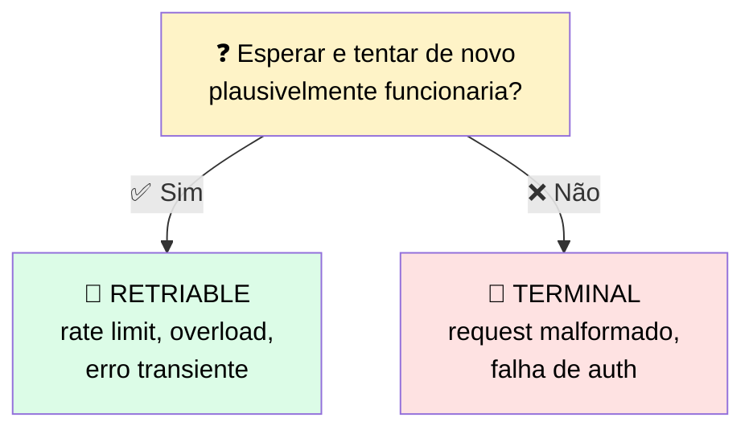
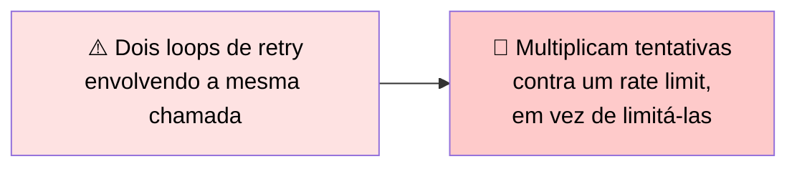

# 🛡️ Sobrevivendo a Falhas de Produção: Erros de Tool

> 🎯 **Ideia central:** seus testes agora dizem que uma falha existe e o trace diz onde acontece. A próxima pergunta: o que o sistema faz no **momento** em que uma falha acontece em tráfego ao vivo?

---

## ❓ 1. Toda falha começa com uma pergunta: retriable ou terminal?

> 💬 O teste é uma única pergunta: **esperar e tentar exatamente a mesma requisição de novo plausivelmente funcionaria?** Se sim, é retriable. Se não, é terminal.



```python
RETRIABLE = {429, 529, 500, 502, 503, 504}  # rate limit, overload, transient
TERMINAL = {400, 401, 403, 404}             # bad request, auth, missing

def is_retriable(status):
    return status in RETRIABLE  # tudo mais falha rápido
```

| Código | Significado | Bucket |
|---|---|---|
| 429 | Rate limit | 🔄 Retriable |
| 529 | Serviço temporariamente sobrecarregado | 🔄 Retriable |
| 500, 502, 503, 504 | Erros de servidor 5xx (falhas Anthropic-side) | 🔄 Retriable |
| 400 | Bad request | 🛑 Terminal |
| 401 | Falha de autenticação | 🛑 Terminal |
| 403 | Permissão negada | 🛑 Terminal |
| 404 | Não encontrado | 🛑 Terminal |

> <mark>Essa distinção carrega tanto peso porque determina se esperar ajuda.</mark> Um erro retriable tem causa transiente — tempo sozinho resolve. Um erro terminal tem causa na própria requisição — tempo não muda nada, porque cada tentativa produzirá um erro idêntico.

> ⚠️ Um timeout costuma ser retriable (o trabalho pode simplesmente ter demorado mais que o cliente estava disposto a esperar) — mas <mark>timeouts repetidos numa requisição cara é sinal de consertar a própria requisição, não de continuar tentando.</mark>

✅ **Quando em dúvida, o padrão seguro é tratar como terminal e levantar o erro.** Uma falha classificada incorretamente como terminal falha alto e é consertada. Uma falha classificada incorretamente como retriable martela um serviço e esconde o problema real atrás de uma parede de retries.

---

## 🔁 2. O SDK já retenta algumas falhas — saiba o que ele cobre antes de escrever o seu

> 💬 As bibliotecas de cliente da Anthropic já retentam falhas transientes automaticamente com delays progressivos, até um número configurável de tentativas.



✅ **Decida onde o retry mora:** deixe o SDK lidar com casos transientes e reserve seu próprio código para fallbacks específicos da aplicação, **ou** diminua os retries do SDK e assuma o caminho inteiro você mesmo. Rodar as duas camadas retentando a mesma falha sem uma saber da outra é o padrão a evitar.

### ⏱️ O header `retry-after`

> 💡 A API retorna headers de rate-limit em cada resposta. O mais útil é `retry-after`, que uma resposta 429 ou 529 inclui para dizer quanto esperar antes de tentar de novo. <mark>Honrar esse valor é mais preciso que adivinhar só com backoff, porque o serviço está te dizendo exatamente quando a capacidade retorna.</mark>

✅ Trate o header como o tempo de espera autoritativo quando presente; trate seu próprio backoff como o fallback quando não está.

---

## 📢 3. Erros de tool precisam voltar a Claude explicitamente, não ser descartados

> 💬 Quando seu código roda uma tool e ela falha, o resultado deve voltar a Claude com `is_error` explicitamente `true` — **não** como um resultado vazio silencioso.

```python
def run_tool(tool_use):
    try:
        result = execute(tool_use)
        return {"type": "tool_result", "tool_use_id": tool_use.id,
                "content": result}
    except Exception as e:
        # sinalize o erro para Claude reagir — NÃO retorne vazio
        return {"type": "tool_result", "tool_use_id": tool_use.id,
                "is_error": True, "content": f"Tool failed: {e}"}
```

> ⚠️ Uma recusa (`refusal`) é um **200** na camada HTTP — o classificador de retriable não vai capturá-la:

```python
if response.stop_reason == "refusal":
    raise ValueError("Model refused the request. Review input before retrying.")
```

> <mark>Com `is_error` setado, o modelo sabe que a tool falhou e pode reagir: tentar outra abordagem, pedir esclarecimento, ou parar.</mark> Uma tool que descarta seu próprio erro e retorna nada produz uma resposta confiante mas errada downstream — o modelo trata o resultado vazio como dado válido e continua raciocinando em cima dele.

---

## 📋 4. Tabela de decisão de tratamento de erro

| Tipo de erro | Retriable ou fail-fast | Estratégia de backoff | Comportamento de fallback |
|---|---|---|---|
| 🚦 Rate limit (429) | Retriable | Exponential backoff com jitter, honrar `retry-after`, tentativas limitadas | Depois do teto, levantar erro limpo ou rotear para resultado cacheado/mais simples |
| 🔥 Overloaded (529) | Retriable | Backoff — 529 reflete carga Anthropic-side, não é sinal de rate-limit | Fallback para um caminho alternativo ou erro gracioso se persistir |
| 🚫 Bad request (400) | Fail fast | Sem retry — a requisição idêntica falhará de novo | Consertar ou rejeitar o input, sinalizar o erro ao chamador |
| 🔧 Erro de resultado de tool | Depende da tool | Retentar só se a causa subjacente é transiente | Retornar a flag de erro a Claude para reagir — nunca silenciar |
| ❌ Refusal (200, stop_reason: "refusal") | Fail fast | Sem retry — o modelo tomou uma decisão de conteúdo, não erro transiente | Levantar a recusa ao chamador. Logar. Nunca retentar silenciosamente ou tratar como output válido |

---

## ⚖️ 5. Quando usar

| ✅ Funciona bem | ⚠️ Adiciona custo/complexidade | 🔄 Considere outra abordagem |
|---|---|---|
| Mantém uma resposta ruim de virar um outage, tratando cada tipo de falha pelo nome | Todo caminho de falha é código que você escreve, testa e mantém em cima do happy path | Não retente um erro terminal — retentar um 400 só desperdiça o orçamento de retry |

---

## ✅ Checklist de decisão

- [ ] Todo erro é classificado como retriable ou terminal **antes** de decidir o que fazer com ele?
- [ ] Sei o que o SDK já retenta automaticamente, e não estou duplicando retries em cima disso?
- [ ] Meu retry honra o header `retry-after` quando presente?
- [ ] Toda falha de tool volta a Claude com `is_error: true`, nunca como resultado vazio?
- [ ] Recusas (`stop_reason: "refusal"`) são tratadas separadamente do fluxo de retry normal?
