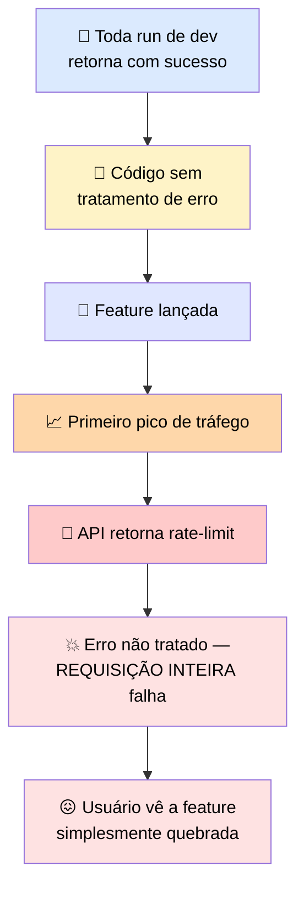

# 🔬 Post-mortem: a Chamada que Nunca Falhou em Desenvolvimento

> 🎯 **Setup:** em desenvolvimento, você chamou o endpoint algumas dezenas de vezes e ele retornou limpo toda vez — então não havia razão óbvia para escrever um caminho de erro. **Essa é a armadilha.** Tráfego de desenvolvimento é baixo volume, roda numa conexão estável, e raramente bate nas condições que causam falha: rate limits, timeouts, quedas transientes de rede, ou resposta malformada sob carga.

---

## 🕵️ O que aconteceu

```python
results = []
for item in batch:
    # versão shipada, sem caminho de erro
    resp = client.messages.create(model=MODEL, max_tokens=MAX_TOKENS,
                                    messages=msg(item))
    results.append(resp.content)  # assume que toda chamada retorna 200
```



### 🔥 O instinto que piorou tudo

> ⚠️ O primeiro instinto do desenvolvedor foi adicionar **retries imediatos num loop apertado.** Isso piorou: <mark>cada retry instantâneo contava como mais uma requisição contra o mesmo limite, aprofundando-o.</mark>


---

## 🚨 A correção real

> ✅ A resposta de rate-limit era **retriable**, então precisava de **exponential backoff** com número de tentativas limitado, e um retry que honrasse o valor `retry-after` quando a resposta o incluía.

> <mark>Desenvolvimento nunca produziu a falha, então o caminho que saberia lidar com uma nunca foi escrito.</mark>

---

# 🧪 Checkpoint: conserte o caminho de erro e retry quebrado

> 🎯 O bloco abaixo tem **um defeito**. Identifique-o e escreva a versão corrigida.

## 🐛 Código quebrado

```python
def call_with_retry(make_call, max_attempts=5):
    for attempt in range(max_attempts):
        try:
            return make_call()
        except Exception:
            time.sleep(0)
    raise RetryBudgetExhausted()
```

## 🔍 O defeito

> <mark>`time.sleep(0)` não espera nada — é um sleep de duração zero.</mark> O loop tenta de novo instantaneamente, exatamente o antipadrão do post-mortem acima: retries imediatos que aprofundam um rate limit em vez de dar tempo para ele se resolver. Além disso, não há distinção entre falha retriable e terminal — **todo** `Exception` é tratado igual, inclusive erros que retry nunca vai consertar (como um 400).

## ✅ Versão corrigida

```python
import random

def call_with_retry(make_call, max_attempts=5, base_delay=1.0):
    for attempt in range(max_attempts):
        try:
            return make_call()
        except RetriableError as e:
            if attempt == max_attempts - 1:
                raise RetryBudgetExhausted() from e
            # honra retry-after se presente, senão exponential backoff + jitter
            wait = getattr(e, "retry_after", None) or (base_delay * (2 ** attempt))
            wait += random.uniform(0, wait * 0.1)  # jitter
            time.sleep(wait)
        except TerminalError:
            raise  # fail fast — retry não vai ajudar
    raise RetryBudgetExhausted()
```

### 🛠️ O que mudou

| Antes ❌ | Depois ✅ |
|---|---|
| `time.sleep(0)` — não espera nada | Exponential backoff real, com jitter |
| Todo `Exception` tratado igual | Distingue `RetriableError` de `TerminalError` |
| Ignora `retry-after` | Honra `retry-after` quando presente, cai para backoff só na ausência |
| Última tentativa ainda dorme antes de desistir | Levanta `RetryBudgetExhausted` imediatamente na última tentativa, sem esperar à toa |
