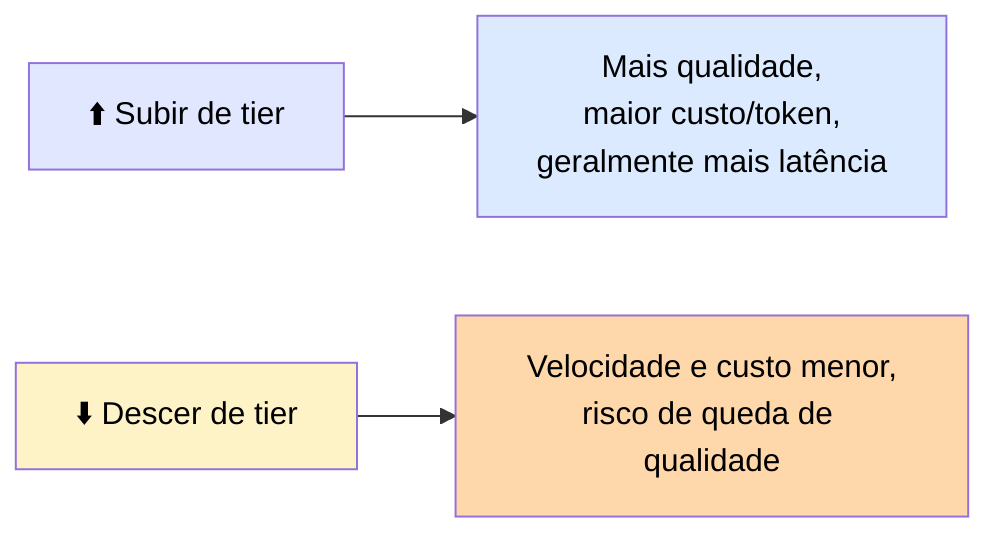
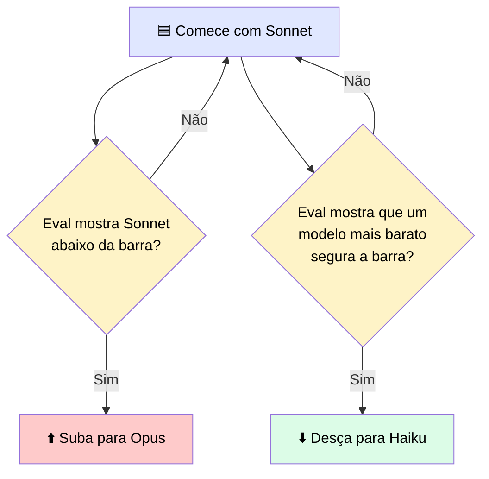

# 🎚️ Seleção de Modelo em Produção

> 🎯 **Ideia central:** as telas anteriores mantiveram um sistema dentro do orçamento de custo **depois** do modelo escolhido. Esta cobre a escolha que define esse orçamento em primeiro lugar: **qual** modelo Claude roda o workload.

> 💬 Gestão de custo otimiza gasto **dentro** de um modelo. Seleção de modelo determina a **baseline** a partir da qual essa otimização trabalha.

---

## 🏷️ 1. A família de modelos e seus tiers de capacidade

| Modelo | Perfil |
|---|---|
| 🌟 **Fable** | Mais capaz — raciocínio, coding e trabalho agêntico mais exigentes |
| 💪 **Opus** | Trabalho exigente acima do envelope do Sonnet |
| ⚖️ **Sonnet** | Padrão balanceado para a maioria das cargas de produção |
| ⚡ **Haiku** | Velocidade e custo-eficiência para tarefas dentro do seu envelope |

> ℹ️ O mesmo prompt roda em qualquer um deles — escolha de modelo é uma alavanca que você seta **por workload**, e pode mudar sem reescrever a aplicação. Confirme o lineup atual e IDs de modelo em `platform.claude.com` na hora de construir.

---

## ⚖️ 2. O trade-off entre latência, custo e qualidade

> ⚠️ <mark>Um modelo de tier mais alto pode processar uma requisição mais rápido e mais barato se ele chega a uma conclusão em menos tokens do que um de tier mais baixo levaria.</mark> O custo de um erro pertence a esse cálculo — economizar alguns dólares por dia num modelo mais barato não é uma boa troca se a queda de qualidade introduz erros com custo downstream significativo.

> <mark>Não existe escolha globalmente correta, só a escolha certa para uma tarefa com um padrão de qualidade. A disciplina é tornar o trade-off mensurável, em vez de sempre pegar o modelo mais capaz por padrão — esse é o erro de seleção de modelo mais comum e mais caro em produção.</mark>

### 📏 A regra padrão

---

## 🔀 3. Roteamento: modelo padrão + override num sinal da tarefa

> 💬 Um sistema não precisa usar um modelo para tudo. Um padrão comum de produção: roteie a maior parte do tráfego para um padrão balanceado, e envie tipos de requisição específicos para um modelo maior ou menor com base num sinal barato lido da requisição — tipo de tarefa, comprimento do input, ou uma classificação de dificuldade.

> ℹ️ Essa é a mesma ideia de roteamento usada para retrieval, aplicada à escolha de modelo — você paga pelo modelo mais capaz **só** nas requisições que precisam. Onde toda requisição tem a mesma forma, pule o roteador e fixe um modelo.

---

## 📈📉 4. Quando subir e quando descer de tier

| Decisão | Condição |
|---|---|
| ⬆️ **Subir um tier** | Um eval mostra o modelo atual falhando nos casos mais difíceis do seu tráfego, **e** o custo de uma resposta errada é alto |
| ⬇️ **Descer um tier** | Um eval mostra um modelo mais barato segurando a barra de qualidade na maior parte do tráfego, liberando orçamento e latência |

> <mark>Em ambas as direções, o eval é o instrumento: uma mudança de modelo é promovida com base num score medido contra seus casos.</mark> É por isso que o eval que você construiu antes também é o gate para uma decisão de modelo.

---

## ⚖️ 5. Quando usar

| ✅ Funciona bem | ⚠️ Adiciona custo/complexidade | 🔄 Considere outra abordagem |
|---|---|---|
| Casar cada workload com o modelo mais barato que atende sua barra de qualidade, medido em eval em vez de assumido | Roteamento adiciona um passo de classificação e um segundo caminho de modelo para manter | Para tráfego uniforme numa única barra de qualidade, fixe um único modelo e pule o roteador |

---

# 🧪 Checkpoint: escolha o modelo e nomeie a restrição decisiva

| Cenário | 🎯 Melhor escolha | 💬 Restrição decisiva |
|---|---|---|
| **1.** Um passo de classificação de alto volume rotula milhões de mensagens curtas por dia; um eval mostra Haiku segurando a barra | **✅ Haiku** | Custo-a-volume, já que o eval confirma que a barra de qualidade ainda se sustenta |
| **2.** Um agente multi-passo planeja um refactor dependente onde um passo inicial errado é caro; um eval mostra Sonnet abaixo da barra nos casos mais difíceis | **✅ Opus** | Qualidade em raciocínio difícil, onde o custo de uma resposta errada é alto |
| **3.** Tráfego misto: a maioria das requisições são lookups simples, algumas são síntese complexa | **✅ Roteamento** — padrão Sonnet (ou Haiku) com override Opus nas requisições complexas | O tráfego é misto — nenhum modelo único serve bem os dois extremos |

> <mark>Repare o padrão: a resposta certa nunca é "o modelo mais capaz por padrão" — é sempre o modelo mais barato que o eval confirma segurar a barra para aquele tráfego específico.</mark>
