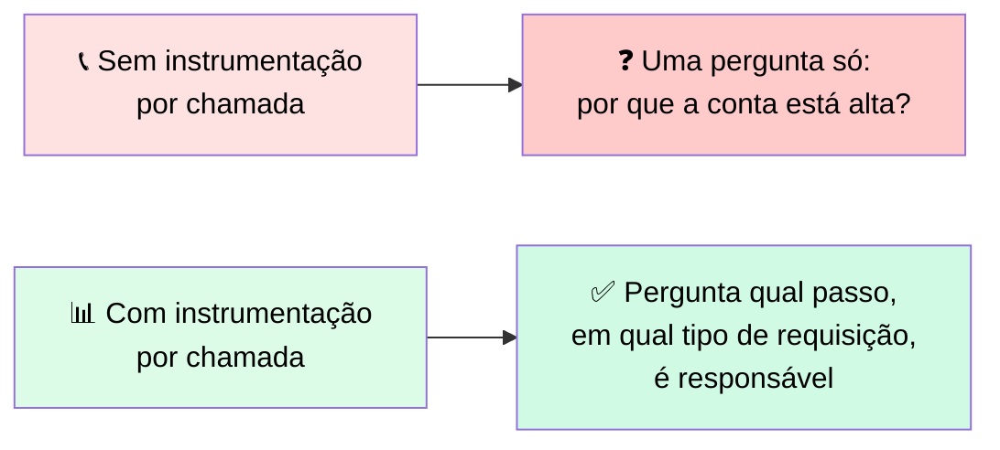
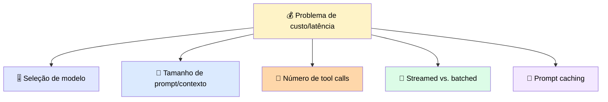
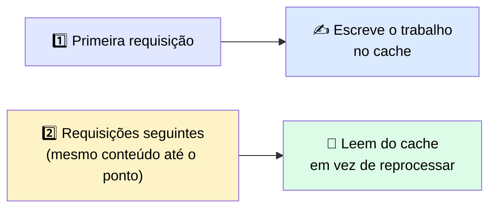
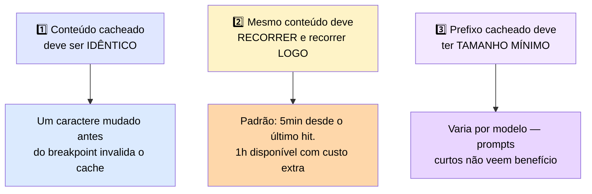
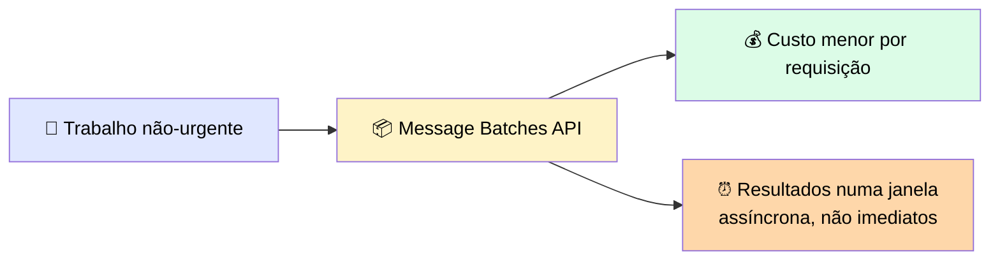
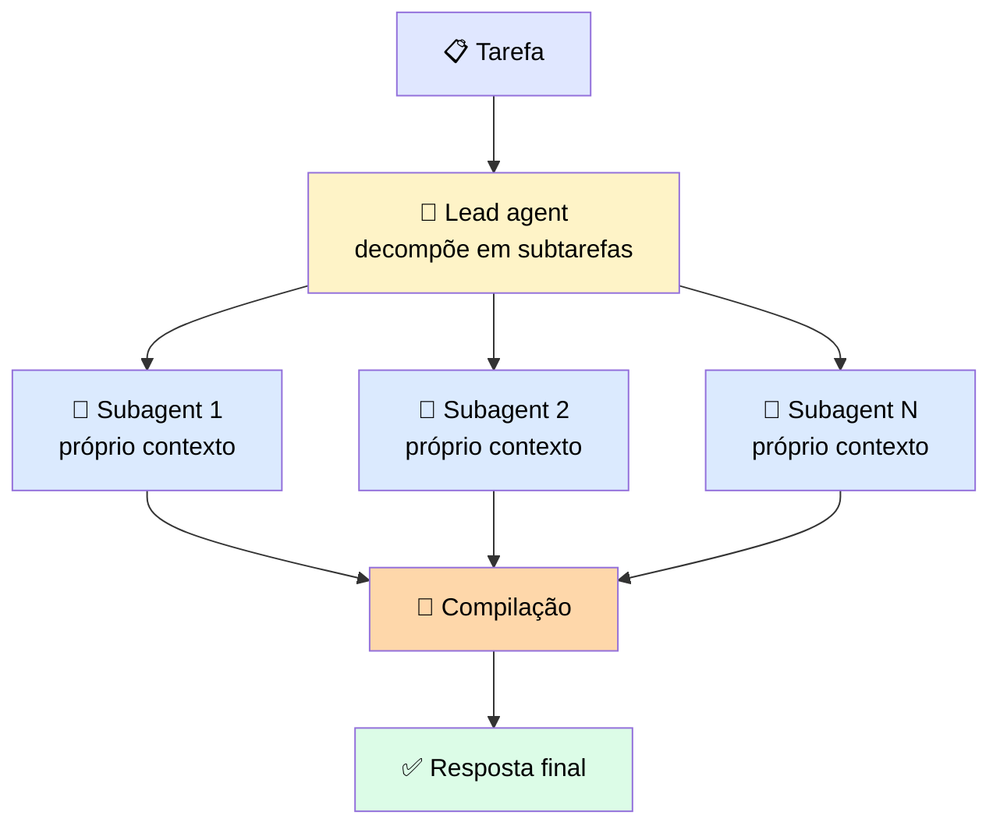
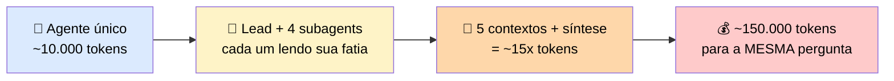
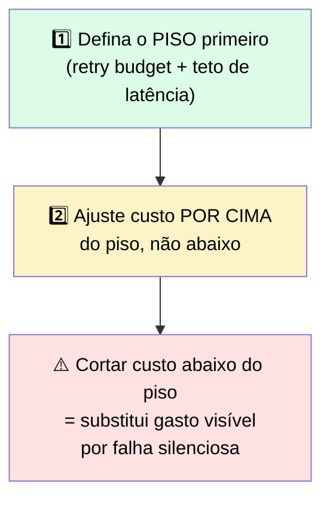

# 💰 Mantendo Custo, Latência e Confiabilidade no Orçamento entre Agentes

> 🎯 **Ideia central:** um sistema que se recupera de falha ainda precisa ser acessível e rápido, ou não sobrevive ao contato com uma conta real. Esta seção instrumenta e orça o sistema, depois trata o padrão que multiplica custo mais rápido: distribuir trabalho entre vários agentes coordenados.

---

## 📊 1. Custo e latência são invisíveis em dev, decisivos em produção

> 💬 Em desenvolvimento, você roda um punhado de chamadas e nunca vê a conta. Em produção, as mesmas chamadas rodam em volume, e custo/latência viram a restrição.

```python
import time

def instrumented_call(make_call, step_name):
    start = time.perf_counter()
    resp = make_call()  # levanta erro em qualquer falha de API
    latency_ms = (time.perf_counter() - start) * 1000
    log_metric(step=step_name,
               input_tokens=resp.usage.input_tokens,
               output_tokens=resp.usage.output_tokens,
               latency_ms=latency_ms)
    return resp
```

> ✅ Observabilidade para um sistema Claude significa instrumentar **três métricas por chamada**: uso de token (input e output), latência, e taxa de erro.



> <mark>Um fluxo que parece uniformemente caro geralmente tem UM passo fazendo 90% do gasto — e é ali que todo dólar de otimização deveria ir.</mark> O mesmo vale para latência: o passo lento raramente é o que você esperava.

---

## 🎛️ 2. As alavancas que afetam o orçamento



| Alavanca | Como move custo/latência |
|---|---|
| 🎚️ **Seleção de modelo** | Escolher um modelo menor e mais rápido corta custo/latência de um mais sofisticado. Reserve o mais capaz para os passos que precisam |
| 📏 **Prompt e tamanho de contexto** | Todo token no prompt contribui para o custo — aparar contexto e remover tool output desnecessário reduz o custo por chamada diretamente (context engineering aplicado ao custo operacional) |
| 🔧 **Número de tool calls** | Cada chamada adiciona custo e latência — um fluxo que faz mais chamadas do que precisa é uma fonte comum e mensurável de gasto desnecessário |
| 🌊 **Streaming** | Muda como a latência é **percebida** — retorna o primeiro token assim que pronto, em vez de esperar a resposta completa. Uma resposta que começa a chegar em 300ms parece mais rápida que uma que entrega o mesmo conteúdo num único bloco depois de dois segundos, mesmo com o tempo total de geração idêntico |

### ⚠️ Streaming com tool use exige tratamento adicional

> 💬 Numa chamada não-streaming, a resposta completa chega como um objeto único e blocos `tool_use` são diretamente acessíveis. Numa chamada streaming, a resposta chega como uma sequência de eventos server-sent, e blocos `tool_use` acumulam através de múltiplos eventos delta antes de estarem completos.

```python
def stream_with_tools(client, **kwargs):
    tool_blocks = {}  # index -> bloco acumulado
    text_chunks = []
    with client.messages.stream(**kwargs) as stream:
        for event in stream:
            if event.type == "content_block_start":
                block = event.content_block
                tool_blocks[event.index] = {
                    "type": block.type,
                    "id": getattr(block, "id", None),
                    "name": getattr(block, "name", None),
                    "input_json": ""
                }
            elif event.type == "content_block_delta":
                delta = event.delta
                if delta.type == "input_json_delta":
                    tool_blocks[event.index]["input_json"] += delta.partial_json
                elif delta.type == "text_delta":
                    text_chunks.append(delta.text)
            elif event.type == "message_stop":
                break

    # reconstrói as tool calls completas SÓ depois do stream fechar
    tool_calls = []
    for block in tool_blocks.values():
        if block["type"] == "tool_use":
            tool_calls.append({
                "id": block["id"],
                "name": block["name"],
                "input": json.loads(block["input_json"])
            })
    return "".join(text_chunks), tool_calls
```

> <mark>Um bloco `tool_use` não é seguro para agir até o stream fechar e o `input_json` completo ter sido acumulado.</mark> A mesma distinção retriable-vs-terminal do módulo de falhas se aplica aqui: um stream que quebra no meio da resposta é uma falha transiente, e a **requisição inteira** deve ser retentada — não o output parcial passado adiante.

---

## 💾 3. Prompt caching: reaproveitando o trabalho já feito num prefixo estável

> 💬 Antes de gerar qualquer coisa, o modelo processa seu input — quebra o prompt em tokens e constrói as representações internas necessárias. Numa requisição comum, esse trabalho é descartado assim que a resposta volta. Quando sua próxima requisição repete o mesmo conteúdo, o mesmo processamento roda de novo do zero.



### 💵 Economia

| Tipo | Custo |
|---|---|
| ✍️ Cache write (TTL 5 min) | **1.25x** do input token base |
| ✍️ Cache write (TTL 1 hora) | **2x** do input token base |
| 📖 Cache read | **0.1x** do input padrão |

> <mark>A economia só funciona quando leituras superam escritas em número — por isso caching serve prefixos estáveis e frequentemente reusados.</mark>

### ⚙️ Automático vs. breakpoints explícitos

| Modo | Como funciona |
|---|---|
| 🤖 **Automático** | Uma flag de cache no topo da requisição — o sistema gerencia breakpoints conforme a conversa cresce. Ponto de partida recomendado para a maioria dos casos |
| 🎯 **Explícito** | Marcador `cache_control` num bloco de conteúdo específico — cacheia todo o trabalho até e incluindo aquele ponto |

> 🎯 Os componentes mais valiosos para cachear são os que **permanecem os mesmos** entre requisições: um system prompt longo e um grande schema de tools são os candidatos usuais.

### 📐 Três propriedades que decidem se caching ajuda



> ⚠️ **Tradeoff a pesar:** caching assume que o conteúdo cacheado ainda está correto na requisição posterior. Se o prefixo precisa refletir dados que podem mudar, o cache guarda uma versão que pode estar stale pelo tempo que viver — uma janela de consistência que seu caso de uso precisa tolerar. Para um system prompt fixo e um schema de tools estável, não há nada para ficar stale — por isso são lugares seguros e de alto valor para cachear.

---

## 📦 4. A Batches API: trocando latência por conta menor

> 💬 Algum trabalho não precisa de resposta imediata: uma classificação noturna, um backfill sobre um dataset grande, um relatório agendado podem esperar.



> <mark>A troca é latência por custo. Um batch é a ferramenta errada para qualquer coisa que um usuário está esperando, e a ferramenta certa para qualquer coisa dirigida por agenda.</mark> A decisão espelha o streaming em reverso: streaming otimiza quão rápido uma **única** resposta parece para um usuário no loop; batching otimiza a conta para trabalho onde nenhum usuário está esperando.

> 💡 **Batching e prompt caching compõem** quando um job não-urgente reusa o mesmo contexto em muitas requisições — o desconto de batch reduz o custo de cada requisição e caching reduz o custo do prefixo repetido dentro de cada uma.

---

## 🤖 5. Orquestração multi-agente como um tradeoff deliberado



```python
async def orchestrate(task):
    plan = await lead.plan(task)                    # lead decompõe
    results = await gather(*[                         # subagents em paralelo
        worker.run(subtask) for subtask in plan.subtasks
    ])                                                 # cada um gasta seus próprios tokens
    return await lead.synthesize(results)              # lead compila a resposta
```

> 💡 **Pense nisso como uma decisão de contratação.** Cinco pesquisadores terminam uma pesquisa ampla mais rápido que um, mas você paga cinco salários. Você só contrata um time quando o trabalho genuinamente se divide em partes que as pessoas podem fazer sem esperar umas pelas outras.

### 📊 O que a Anthropic relatou

> 💬 Num eval interno de pesquisa da Anthropic, uma configuração multi-agente com Claude Opus 4 como lead e subagents Claude Sonnet 4 mostrou uma melhora substancial sobre uma baseline de agente único Opus 4. <mark>O custo é de aproximadamente **15x** os tokens de uma interação de chat normal</mark>, porque cada subagente gasta seus próprios tokens contra seu próprio contexto.

> ⚠️ O padrão é **menos** efetivo para tarefas fortemente acopladas, como coding, onde cada passo depende de partes anteriores e não pode ser explorado em paralelo. A análise da Anthropic encontrou que uso de token é responsável pela maior parte da variância de performance — <mark>a arquitetura funciona principalmente porque compra mais computação paralela.</mark>

### 🧮 Estimativa de custo concreta



> ⚠️ <mark>Se a pergunta era um lookup único disfarçado de pesquisa, você pagou o multiplicador à toa</mark>, porque quatro dos cinco contextos estavam fazendo trabalho que a tarefa nunca precisou.

### 🔧 A dimensão de controle que a estimativa não captura

> 💬 Espalhar trabalho entre agentes multiplica os lugares onde uma falha pode ocorrer — cada subagente precisa do mesmo tratamento retriable-vs-terminal, do mesmo backoff, da mesma disciplina de fallback, aplicados independentemente. <mark>Um único subagente que bate rate limit e não tem backoff pode travar toda a etapa de compilação enquanto o lead espera um retorno que nunca vem.</mark>

> 💡 **Dica de escolha de modelo:** considere usar um modelo mais capaz como lead agent e modelos mais baratos para os subagents — reduz o multiplicador de custo mantendo a qualidade de coordenação onde importa.

---

## 🛡️ 6. Confiabilidade tem um piso — você ajusta custo por cima dele

> 💬 Custo é só metade do orçamento. A outra metade é confiabilidade, e ela estabelece uma **baseline** abaixo da qual o custo não deve ir.



> 💬 **Exemplo concreto:** você decide que uma requisição voltada ao usuário deve completar em 4 segundos e pode retentar uma dependência falha até 3 vezes. Essas restrições definem o piso. Trocar para um modelo menor e mais barato tudo bem, **se** ainda cabe no teto de latência e não aumenta a taxa de erro a ponto de queimar o orçamento de retry. Reduzir a contagem de retry para 2 para economizar numa dependência lenta **não é** aceitável se empurra a taxa de falha além do que o piso permite.

> <mark>A ordem importa, porque custo e confiabilidade criam pressões opostas, e custo costuma ser mais alto (mais "barulhento"). Uma conta alta aparece num dashboard todo dia e gera pressão constante para reduzir gastos. Um problema de confiabilidade aparece como falhas ocasionais fáceis de descartar como ruído até se acumularem num incidente.</mark> Se você otimiza custo primeiro e confiabilidade depois, a pressão mais alta vence, e você descobre o piso de confiabilidade só depois de cruzá-lo.

> ✅ O conjunto de eval é o que torna o piso aplicável: um score baseline fixado define a confiabilidade mínima aceitável de forma checável — qualquer mudança de economia de custo que derrube o score abaixo da baseline falha o gate antes de lançar.

---

## 📋 7. Referência de observabilidade e orquestração

| Métrica | Onde instrumentar | Single-agent vs. orchestrator-worker |
|---|---|---|
| 💰 **Custo de token** | Por chamada, agregado por requisição e por fluxo | Um agente único incorre custo de token uma vez por passo. Um orchestrator-worker multiplica o consumo pelo número de subagents — ~15x no caso relatado |
| ⏱️ **Latência** | Por chamada, com traces identificando o passo mais lento | Subagents paralelos podem reduzir tempo de relógio em trabalho independente, mas adicionam latência de coordenação para planejar e compilar |
| ❌ **Taxa de erro** | Por chamada e por dependência | Mais agentes = mais pontos potenciais de falha; cada subagente precisa do mesmo tratamento de retry/fallback que um agente único |

---

## ⚖️ 8. Quando usar

| ✅ Funciona bem | ⚠️ Adiciona custo/complexidade | 🔄 Considere outra abordagem |
|---|---|---|
| Torna gasto e latência visíveis por chamada, para um problema de custo remontar a uma alavanca nomeada | Subagents paralelos multiplicam custo de token, ~15x no caso relatado, antes de melhorar qualquer resposta | Para trabalho fortemente acoplado, como coding, um agente único com bom contexto vence o fan-out |

---

## ✅ Checklist de decisão

- [ ] Instrumento token cost, latência e taxa de erro em **toda** chamada, desde o início?
- [ ] Sei qual passo específico é responsável pela maior parte do gasto/latência, não só o total mensal?
- [ ] Uso caching nas partes estáveis do prompt (system prompt, schemas de tools)?
- [ ] Uso Batches API para trabalho não-urgente e de alto volume?
- [ ] Antes de usar orchestrator-worker, confirmei que a tarefa **genuinamente** se divide em partes paralelas independentes?
- [ ] Defini o piso de confiabilidade (retry budget, teto de latência) **antes** de otimizar custo?
