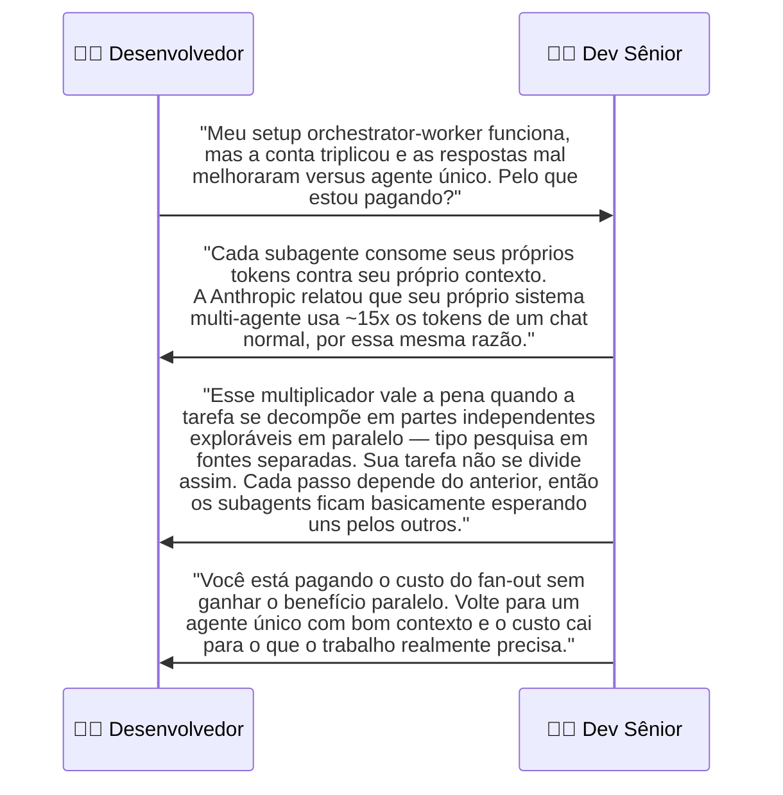
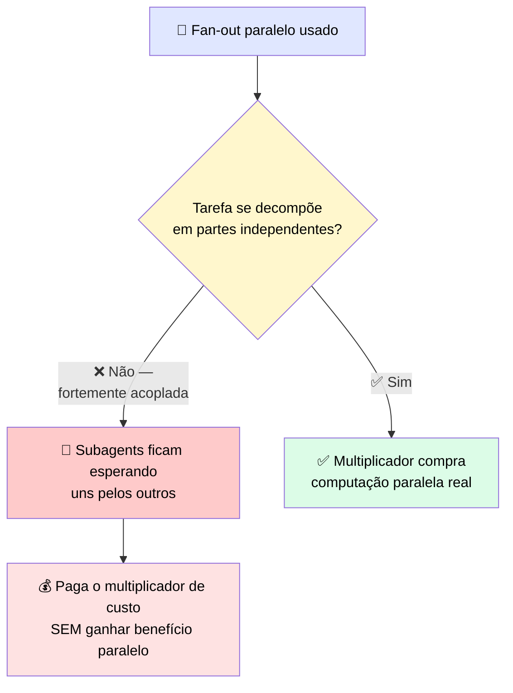

# 🔬 Post-mortem: o Fan-out Paralelo que Triplicou a Conta

> 🎯 **Setup:** você tinha uma tarefa rodando devagar, então dividiu entre vários subagents paralelos, raciocinando que trabalho feito ao mesmo tempo termina mais rápido. A latência caiu um pouco. Depois a conta chegou várias vezes mais alta que a versão de agente único, enquanto a qualidade da resposta mal se moveu.

---

## 💬 A conversa

---

## 🕳️ Onde estava a falha

> ✅ O desenvolvedor moveu a tarefa de volta para um agente único, manteve o mesmo contexto, e <mark>a conta caiu enquanto a qualidade da resposta se manteve.</mark>

---

## 🚨 O que observar

> 💬 A lição **não** foi que orquestração é ruim. Foi que <mark>o multiplicador de token só compra algo quando o trabalho pode genuinamente ser feito em paralelo.</mark>

✅ **Regra prática:** use orchestrator-worker **só** quando a tarefa precisa de exploração paralela — pesquisa em fontes separadas, análise independente de diferentes conjuntos de dados. Para trabalho fortemente acoplado (coding, refactor sequencial), um agente único com bom contexto vence.

---

# 🧪 Checkpoint: combine cada tarefa com seu tipo de agente e alavanca de custo

> 🎯 Para cada cenário, selecione a configuração que melhor se encaixa.

## 📋 Snippets de configuração disponíveis

| Snippet | Configuração | Alavanca |
|---|---|---|
| **A** | `orchestrator_worker(lead=LARGE, workers=SMALL, n=5)` | Split paralelo |
| **B** | `single_agent(model=SMALL, batch=True, cache=True)` | Message Batches API (~50% redução de custo) + prompt caching |
| **C** | `single_agent(model=SMALL, retrieval="fetch_once")` | Escolha de modelo |
| **D** | `single_agent(model=SMALL, stream=True)` | Streaming |

## 🎯 Cenários e respostas

| Cenário | ✅ Configuração correta |
|---|---|
| 🔍 Um lookup de fato único contra um corpus de referência estável | **C** — modelo pequeno + retrieval fetch-once |
| 🌐 Uma pergunta de pesquisa ampla que se divide em partes independentes exploradas de uma vez | **A** — orchestrator-worker, split paralelo |
| ⚡ Uma requisição voltada ao usuário onde a resposta deve parecer instantânea | **D** — streaming |
| 💰 Um job de batch sensível a custo e não-urgente | **B** — Batches API + caching |

> <mark>Repare que cada snippet resolve um problema diferente — o erro mais caro é usar A (orchestrator-worker) quando C, B ou D resolveriam com uma fração do custo.</mark>
