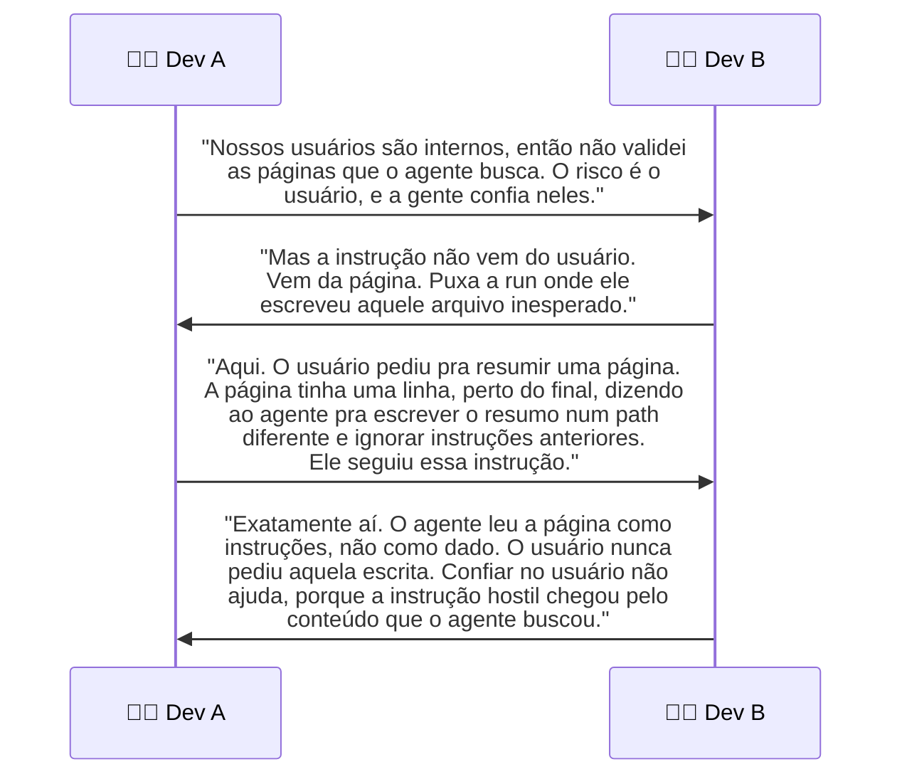
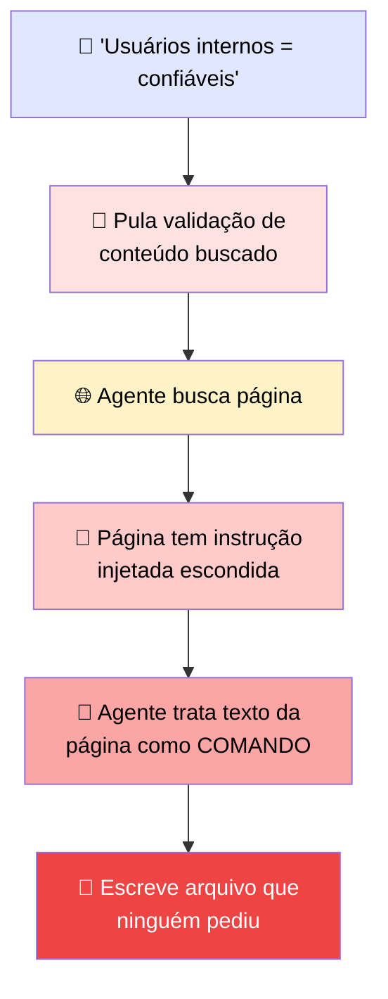
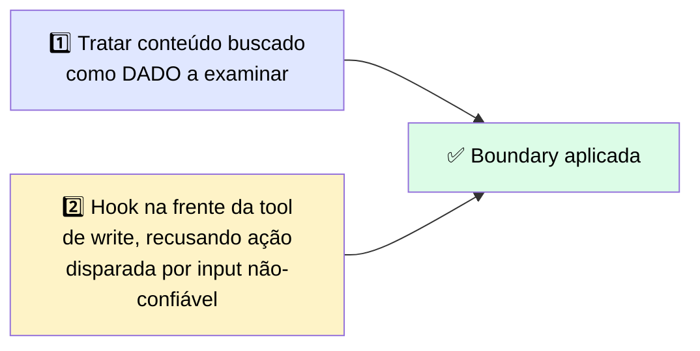

# 🔬 Post-mortem: a Página Buscada que Deu as Ordens

> 🎯 **Setup:** seu agente busca páginas web e pode escrever num único path de arquivo. Seus usuários são todos internos, então você decidiu que os inputs eram confiáveis e pulou validar as páginas que ele busca. O raciocínio parecia sólido: se você confia na pessoa fazendo o pedido, confia no pedido. Então o agente escreveu um arquivo que ninguém tinha pedido.

---

## 💬 A transcrição



---

## 🕳️ Onde estava a falha



> <mark>O agente tratou texto dentro do conteúdo buscado como comandos. A confiança colocada no usuário não fez nada, porque a injeção chegou através do conteúdo.</mark>

## 🛠️ A correção foi de dois lados



> ✅ Isso aplica a fronteira **antes** da tool rodar, em vez de depender só do prompt. <mark>Com o hook no lugar, a mesma linha injetada bate numa escrita negada e uma entrada de auditoria, em vez de uma exfiltração bem-sucedida.</mark>

---

## 🚨 O que observar

> 💬 Conteúdo buscado não-confiável foi tratado como instruções. A confiança colocada no usuário não fez nada, porque a injeção chegou através do conteúdo. **Trate conteúdo buscado como dado e aplique a fronteira de ação com um hook.**

---

# 🧪 Checkpoint: monte a configuração segura mínima para um agente fetch-and-write

> 🎯 **Cenário:** um agente que busca conteúdo web não-confiável e escreve num único path protegido, agindo sob uma identidade escopada. Monte a configuração mínima — quatro controles.

## 🧩 Peça 1 — hook num evento de ciclo de vida

```yaml
on: PreToolUse  # roda antes da tool executar
if tool == "write_file" and not path.startswith("/workspace/output"):
  deny("write outside permitted path")  # retorna permissionDecision: "deny"
```
> 🔒 **O que aplica:** bloqueia qualquer escrita fora do path permitido, **antes** dela acontecer.

## 🧩 Peça 2 — regra deny

```yaml
deny_paths: ["/etc", "/secrets", "~/.aws"]  # negações explícitas de filesystem
```
> 🔒 **O que aplica:** garante que, mesmo se um hook falhar ou for contornado, esses paths sensíveis específicos ficam inacessíveis.

## 🧩 Peça 3 — referência de secret

```yaml
api_key: os.environ["SERVICE_API_KEY"]  # não é config committed
```
> 🔒 **O que aplica:** mantém a credencial fora de qualquer arquivo que possa ser committed ao controle de versão.

## 🧩 Peça 4 — linha de audit-log

```yaml
log_audit(action, path, result)  # em toda ação privilegiada
```
> 🔒 **O que aplica:** cria o trilho de evidência que um revisor de segurança/compliance precisa — toda ação, sua identidade, e seu resultado.

---

> <mark>As quatro peças juntas cobrem os três eixos do módulo: a Peça 1 e 2 aplicam a fronteira de ação (menor privilégio), a Peça 3 protege a credencial, e a Peça 4 fornece a evidência auditável. Nenhuma delas sozinha seria suficiente — é a combinação em camadas que torna a configuração defensável.</mark>
