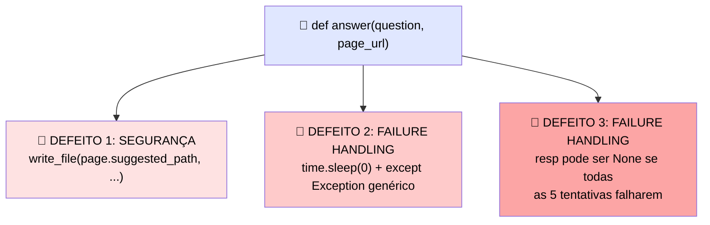

# 🧪 Tarefa Cumulativa de Hardening de Produção: os Três Defeitos

> 🎯 Tudo até aqui reforçou uma camada por vez: o eval, a camada de teste e tracing, os caminhos de falha, o orçamento de custo e orquestração, e a fronteira de segurança. **Falhas reais de produção raramente chegam uma camada de cada vez.** Esta tarefa planta três defeitos numa única aplicação executável, um de cada grupo de camadas.

---

## 🐛 A aplicação com os três defeitos

```python
def answer(question, page_url):
    page = fetch(page_url)                       # conteúdo não-confiável
    notes = read_file("/workspace/input/notes")
    write_file(page.suggested_path, summarize(page))
    resp = None
    for i in range(5):
        try:
            resp = client.messages.create(model=MODEL, max_tokens=MAX_TOKENS,
                                            messages=msg(question))
            break
        except Exception:
            time.sleep(0)
    return resp.content[0].text
```

---

## 🔍 Localizando cada defeito



| # | Defeito | Camada | 💬 O que causa em runtime |
|---|---|---|---|
| 1️⃣ | `write_file(page.suggested_path, summarize(page))` escreve no path **sugerido pela própria página buscada**, sem validação | 🔒 **Segurança** | Conteúdo não-confiável (`page`) controla **onde** o agente escreve — uma instrução injetada na página pode direcionar a escrita para qualquer path, exatamente o padrão do post-mortem de prompt injection |
| 2️⃣ | `time.sleep(0)` dentro do loop de retry, capturando `Exception` genérica | ⚠️ **Failure Handling** | Não espera nada entre tentativas (retry imediato que aprofunda rate limits) e não distingue erro retriable de terminal — retenta até um 400 que nunca vai funcionar |
| 3️⃣ | Se as 5 tentativas falharem, `resp` continua `None`, e `resp.content[0].text` levanta `AttributeError` não tratado | ⚠️ **Failure Handling** | Nenhum fallback nomeado quando o orçamento de retry se esgota — o erro que aparece pro usuário é um `AttributeError` confuso, não uma mensagem de erro clara |

> 💡 Repare que os defeitos 2 e 3 são da **mesma camada** (failure handling) mas são **problemas distintos**: um é sobre a estratégia de retry em si (sem backoff, sem classificação), o outro é sobre o que acontece quando o orçamento de retry se esgota (sem fallback).

---

# ✅ A Montagem: Versão Corrigida

```python
import time
import random

RETRIABLE_STATUS = {429, 529, 500, 502, 503, 504}

ALLOWED_WRITE_PATH = "/workspace/output"

def answer(question, page_url):
    page = fetch(page_url)  # conteúdo não-confiável — tratado como DADO

    notes = read_file("/workspace/input/notes")

    # 🔒 FIX 1: validar o path antes de escrever — nunca confiar
    # num path sugerido pelo próprio conteúdo buscado
    safe_path = f"{ALLOWED_WRITE_PATH}/{sanitize_filename(page_url)}.txt"
    write_file(safe_path, summarize(page))

    resp = None
    max_attempts = 5
    for attempt in range(max_attempts):
        try:
            resp = client.messages.create(model=MODEL, max_tokens=MAX_TOKENS,
                                            messages=msg(question))
            break
        except APIError as e:
            # 🔧 FIX 2: classificar retriable vs terminal, backoff real
            if getattr(e, "status_code", None) not in RETRIABLE_STATUS:
                raise  # erro terminal — fail fast, não desperdiça retry budget
            if attempt == max_attempts - 1:
                break  # última tentativa falhou, sai do loop com resp=None
            wait = getattr(e, "retry_after", None) or (1.0 * (2 ** attempt))
            wait += random.uniform(0, wait * 0.1)  # jitter
            time.sleep(wait)

    # 🛡️ FIX 3: fallback nomeado quando o orçamento de retry se esgota
    if resp is None:
        raise RetryBudgetExhausted(
            "Failed to get a response after all retry attempts. "
            "Check API status or try again later."
        )

    return resp.content[0].text
```

---

## 🎯 O que cada correção muda

| Defeito | 🛠️ Correção | 💬 Por quê |
|---|---|---|
| 1️⃣ Path controlado por conteúdo não-confiável | Path de escrita é **derivado e sanitizado** pelo próprio código, nunca lido diretamente de `page.suggested_path` | Fecha o vetor de prompt injection — a página buscada não tem mais poder de decidir onde o agente escreve |
| 2️⃣ Retry sem backoff, sem classificação | `time.sleep(0)` → backoff exponencial real com jitter; captura `APIError` específico e checa o status code contra `RETRIABLE_STATUS` | Para de martelar rate limits, e para de desperdiçar tentativas em erros terminais |
| 3️⃣ `resp` pode ser `None` sem fallback | Checagem explícita `if resp is None`, levantando um erro nomeado e claro | O usuário/chamador recebe uma mensagem de erro compreensível em vez de um `AttributeError` confuso |

---

## ✅ Checklist de auto-avaliação

- [ ] Identifiquei que o Defeito 1 é de **segurança**, não de failure handling — mesmo aparecendo perto do código de retry no arquivo?
- [ ] Entendi por que `page.suggested_path` é perigoso especificamente porque `page` vem de conteúdo **não-confiável**?
- [ ] Separei os dois defeitos de failure handling (estratégia de retry vs. ausência de fallback) como problemas distintos?
- [ ] Minha correção do retry distingue erro retriable de terminal, em vez de capturar `Exception` genérica?
- [ ] Minha correção tem um fallback nomeado e claro para quando o orçamento de retry se esgota?
