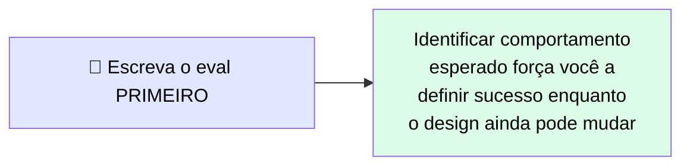
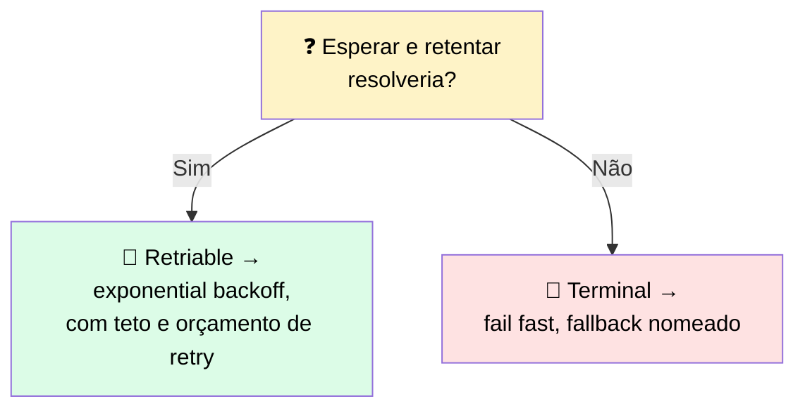
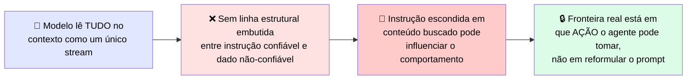
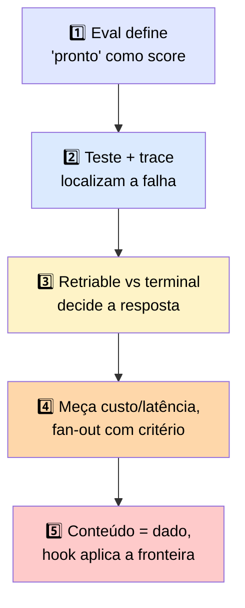

# 🏁 Cinco Conclusões-Chave

> 🎯 Uma conclusão por seção, amarrando o módulo inteiro.

---

## 1️⃣ Defina o padrão antes de construir

> 💬 Um eval transforma "pronto" de uma sensação num score num conjunto fixo de casos. O método de grading precisa bater com o output: exact match quando há uma forma correta, code check para output estruturado, e um judge para qualidade aberta — que você calibra contra casos rotulados por humano antes de confiar nele.

---

## 2️⃣ Case o teste com a falha, e trace para saber onde ela aconteceu

> 💬 Testes unit, functional, integration e end-to-end capturam cada um uma quebra diferente, e a maioria das falhas silenciosas se esconde no **seam de integration**, onde dois componentes que passam sozinhos fazem handoff.

> <mark>Um trace mostra qual passo produziu o resultado ruim, o que transforma um dia de investigação numa correção curta.</mark>

> ℹ️ O mesmo instinto move a escolha de retrieval: fetch uma vez para lookups de fato único, busca através de iterações quando a pergunta é genuinamente multi-etapa.

---

## 3️⃣ Classifique toda falha, depois trate individualmente

> 💬 Falhas de tool voltam ao modelo com a flag de erro setada, nunca escondidas atrás de um resultado vazio que o modelo confunde com dado. <mark>Toda falha que um retry não consegue consertar exige um fallback nomeado — caso contrário, uma exceção não tratada vira o comportamento padrão, e é assim que uma resposta ruim derruba o fluxo inteiro.</mark>

---

## 4️⃣ Meça custo e latência por chamada, e faça fan-out só quando a tarefa genuinamente se divide

> 💬 Você não consegue orçar o que não mede — instrumente custo de token, latência e taxa de erro em toda chamada. Depois ajuste uma alavanca escolhida em vez de adivinhar a partir da fatura.

> <mark>Um padrão orchestrator-worker multiplica o custo de token pelo número de subagents — aproximadamente 15x no caso relatado pela Anthropic. Ele só compensa esse custo em tarefas que se dividem em partes paralelas independentes, não em trabalho fortemente acoplado que um agente único consegue lidar por uma fração do custo.</mark>

---

## 5️⃣ Trate conteúdo buscado como dado e aplique a fronteira com um hook

> <mark>Confiar nos seus próprios usuários não ajuda, porque a injeção chega pelo conteúdo que o agente lê.</mark> Examine input não-confiável como dado, escope a identidade do agente a menor privilégio, mantenha secrets fora de config committed, e aplique a fronteira de ação com um hook que bloqueia e loga **antes** da tool rodar. Essa fronteira é o que uma revisão regulada consegue controlar e inspecionar.

---

## 🗺️ Mapa geral das cinco conclusões

---

> 🔮 **O que vem a seguir:** o próximo módulo transforma os sistemas prontos para produção que você já sabe construir em **acceleradores reusáveis** e propriedade intelectual contribuída. Cobre como empacotar uma build funcionando como template parametrizado, servidor MCP, ou eval suite portátil; contribuir de volta por um canal que um mantenedor aceita; e então escolher, fixar versão, e defender onde ela roda através da API first-party, Amazon Bedrock, e Google Vertex AI — para que uma mudança de modelo ou uma revisão de residência não quebre a produção.
