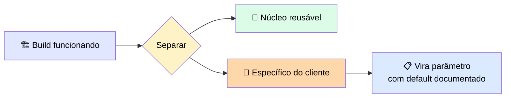
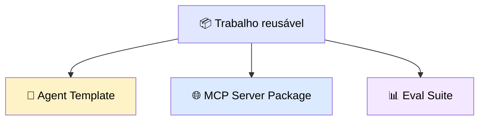

# 📦 Empacotando uma Build para que o Próximo Engagement Comece de um Ativo

> 🎯 **Ideia central:** a coisa mais cara e demorada num time é o tempo de engenharia gasto reconstruindo a mesma coisa para o próximo cliente. Um **accelerator** é uma solução empacotada para que engagements futuros comecem de uma fundação funcionando, em vez de um repositório vazio.

---

## 🧩 1. O que um accelerator faz: mantém as partes reusáveis e separa o resto

> 💬 Pegue uma build funcionando, separe as partes específicas do cliente, e as exponha como **parâmetros com defaults documentados**. O ativo passa a ser **configurado**, em vez de totalmente reescrito.

> <mark>Empacotar para reuso enquanto a build está fresca é mais barato que reconstruir a intenção meses depois, quando a pessoa que sabia por que um valor estava hardcoded já saiu do time.</mark>

---

## 🗂️ 2. Três tipos de ativo reusável, cada um empacotado do seu jeito

| Tipo de ativo | 📦 O que empacota | ✅ O que o empacotamento correto exige |
|---|---|---|
| 🤖 **Agent Template** | O system prompt, os schemas de tools, e a estrutura do loop de um agente funcionando | Puxar os valores específicos de domínio para configuração com defaults documentados — um novo time **seta** valores, não edita o loop |
| 🌐 **MCP Server Package** | As tools que o servidor expõe, com seus inputs e o escopo que o time instalador controla | Documentar cada input de tool e deixar o time instalador setar o escopo, para o servidor instalar num novo ambiente sem edições de código |
| 📊 **Eval Suite** | O conjunto de teste graded e a rubrica do judge que provam que o ativo funciona | Enviar o dataset e a rubrica juntos, para um novo time rodá-los no próprio contexto e confirmar que o ativo ainda funciona ali. <mark>O mesmo eval suite também atua como o gate no deployment</mark> — ao promover uma nova versão de modelo para produção, rode contra um score baseline fixado antes da versão ir ao ar |

> ⚠️ **O erro mais comum:** enviar um agente como um conjunto de scripts soltos em vez de um template. Os scripts rodam, então **parecem** reusáveis — mas todo valor específico de cliente está enterrado num arquivo diferente, e o próximo time copia e diverge em vez de configurar um único ativo.

---

## 📝 3. Documente o código E as suposições

> 💬 Código descreve comportamento. Documentação cobre o que um construtor futuro **não consegue inferir de forma confiável** lendo o código-fonte: as suposições que o ativo faz sobre seu ambiente, os inputs que espera, os modos de falha que já trata, e o eval que define se ainda funciona.

> <mark>Sem isso, o próximo time trata o ativo como caixa-preta e o reconstrói do zero.</mark>

---

## 📋 4. Empacote o audit log como parte do pacote

> 💬 O revisor de um cliente regulado pergunta: que dado o ativo toca, sob que identidade ele age, e que log deixa. <mark>Um accelerator sem essas respostas passa numa demo e trava na primeira revisão de segurança.</mark> Trate o audit log como parte do pacote.

---

## ✅ 5. Checklist de empacotamento

| Tipo de ativo | 🎛️ O que parametrizar | 📝 O que documentar | 🔍 O que empacotar para auditoria |
|---|---|---|---|
| 🤖 **Agent template** | Todo valor que muda por cliente: prompts, paths, escopos, credenciais por referência, thresholds | Suposições de ambiente, inputs esperados, modos de falha tratados, e o eval que define "funcionando" | O dado tocado, a identidade sob a qual age, e o log do que o ativo fez |
| 🌐 **MCP Server** | Escopos, credenciais por referência, paths por cliente | Inputs esperados por tool, fronteiras de escopo, modos de falha tratados | O dado tocado, a identidade sob a qual age, e o log do que o ativo fez |
| 📊 **Eval Suite** | Thresholds e paths de dataset que mudam por cliente/ambiente | A lógica da rubrica, o que os scores significam, e a baseline a que o ativo está fixado | O dado tocado, a identidade sob a qual age, e o log do que o ativo fez |

---

## ⚖️ 6. Quando usar

| ✅ Funciona bem | ⚠️ Adiciona custo/complexidade | 🔄 Considere outra abordagem |
|---|---|---|
| Parametrizar enquanto a build está fresca transforma uma entrega numa asset que o próximo engagement configura em horas | Separar o generalizável do específico e documentar suposições adiciona tempo real à primeira build | Para um one-off que o cliente nunca vai reusar, o overhead de empacotamento não vale a pena — entregue a build e siga em frente |

---

## ✅ Checklist de decisão

- [ ] Identifiquei todo valor específico de cliente e o expus como parâmetro documentado?
- [ ] Escrevi as suposições de ambiente, inputs esperados e modos de falha tratados?
- [ ] Empacotei o eval suite (dataset + rubrica) junto com o ativo?
- [ ] Empacotei o que o ativo toca, sob que identidade age, e que log deixa?
