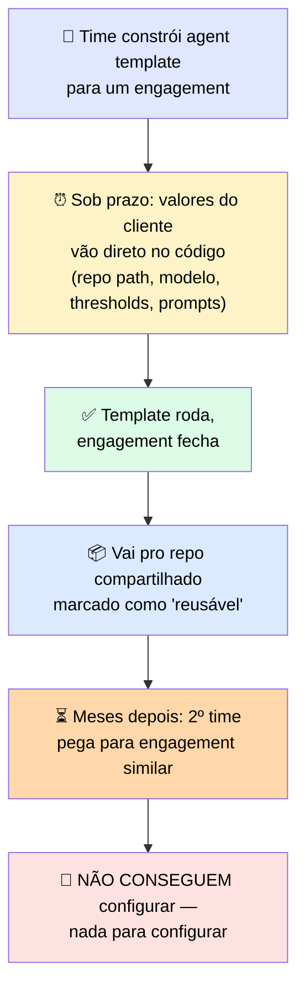

# 🔬 Post-mortem: o Template que Lançou Rápido e Não Pôde ser Reusado

> 🎯 **Setup:** hardcoding lança mais rápido, e você estava sob prazo, então hardcoded os valores que fizeram a demo funcionar. O template rodou. É exatamente por isso que ninguém olhou de novo para ele até o próximo time tentar reusá-lo.

---

## 🕵️ O que aconteceu



> <mark>Todo valor que precisava mudar estava enterrado no loop, onde o segundo time não conseguia ver sem ler o arquivo inteiro.</mark> Não havia documento dizendo quais valores eram específicos do cliente e quais eram estruturais. Também não havia eval empacotado — então mesmo depois de tentar adivinhar as edições, nada confirmava que o template ainda funcionava no novo contexto. **Tiveram que reescrever do zero.**

---

## 🕳️ Onde estava a falha

> <mark>A build foi tratada como terminada no momento em que rodou, não no momento em que poderia ser reusada.</mark> Hardcoding foi a decisão razoável sob prazo, e nunca foi revisitada. Um template funcionando não anuncia que não pode ser reusado — o custo só apareceu quando um segundo time pagou pela reconstrução que o empacotamento deveria ter evitado.

---

## 🚨 O que observar

> ✅ **Sinais de alerta — a ausência de três coisas:**

| Sinal ausente | O que deveria existir |
|---|---|
| 🎛️ Parâmetros | Onde valores específicos de cliente pertencem |
| 📝 Documentação | Descrevendo as suposições |
| 📊 Eval empacotado | Provando que o ativo ainda funciona num contexto diferente |

> <mark>Empacote o ativo enquanto a build está fresca. O conhecimento do que é específico de cliente é mais caro de reconstruir depois que as pessoas que o tinham já saíram.</mark>

---

# 🧪 Checkpoint 1: conserte o template quebrado do accelerator

> 🎯 Abaixo está um agent template que outro time deveria reusar. Tem **um defeito**: um valor específico de cliente está hardcoded onde deveria haver um parâmetro.

## 🐛 O template como foi enviado

```python
# agent_template.py : "reusable" code-review agent

def build_review_agent():
    return Agent(
        model="claude-opus-4-8",
        system_prompt=SYSTEM_PROMPT,
        tools=[read_file, run_linter],
        repo_path="/home/acme/checkout-service",  # customer repo
    )
```

## 🔍 O defeito

> <mark>`repo_path="/home/acme/checkout-service"` está hardcoded — esse é o path do repositório do cliente "acme", que não existe para nenhum outro cliente.</mark>

## ✅ Correção

```python
def build_review_agent(repo_path: str):  # parametrizado
    return Agent(
        model="claude-opus-4-8",
        system_prompt=SYSTEM_PROMPT,
        tools=[read_file, run_linter],
        repo_path=repo_path,  # setado por engagement
    )
```

> ⚠️ Uma versão desse mesmo defeito de hardcoding volta a aparecer, misturada com outros dois, na tarefa cumulativa no final do módulo — mais difícil de identificar sob a carga de múltiplas camadas.
