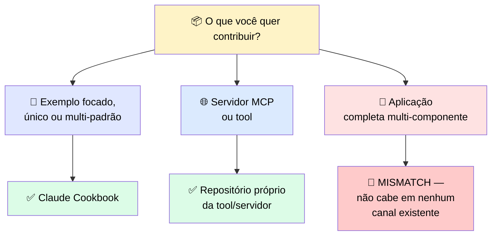
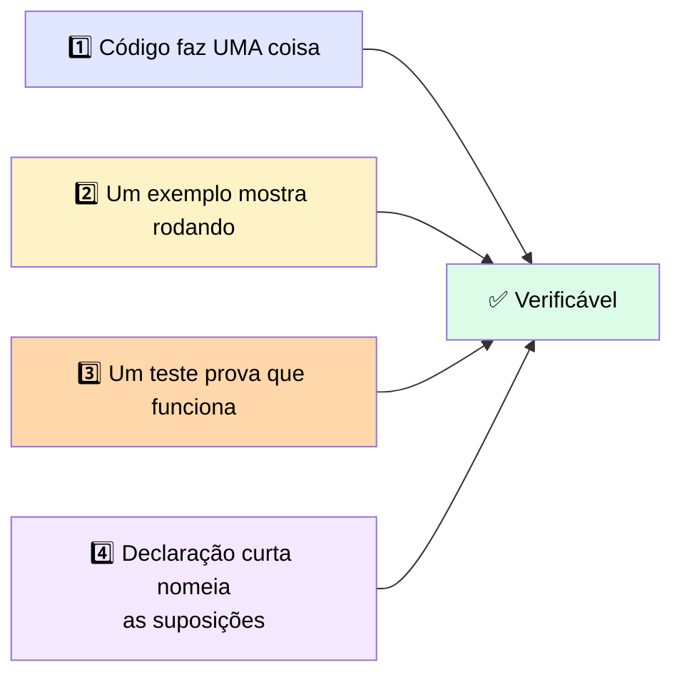

# 🤝 Movendo um Ativo de Reuso Privado para Infraestrutura Compartilhada

> 🎯 **Ideia central:** você já fez a maior parte do trabalho que torna um ativo compartilhável. Ao empacotá-lo para seu próprio time reusar, você já puxou os parâmetros, escreveu as suposições, e empacotou o eval. <mark>Um ativo empacotado para reuso interno já está perto do que um maintainer precisa para aceitá-lo.</mark>

---

## 🎯 1. Combine a contribuição com o canal construído para ela

| Canal | O que é | Serve para |
|---|---|---|
| 📖 **Claude Cookbook** | Repositório GitHub de implementações de referência focadas | Implementações auto-contidas, de um ou múltiplos padrões, demonstradas claramente e funcionando de ponta a ponta |
| 🌐 **Repositórios próprios** | Servidores MCP e tools open-source, cada um com suas próprias convenções | Contribuições específicas daquela tool/servidor |

> ⚠️ <mark>Enviar uma aplicação multi-componente completa para o Cookbook é um mismatch — o repositório é montado para revisar um padrão focado, não uma aplicação inteira.</mark> Uma submissão desse tamanho não se encaixa no que revisores procuram, e vai travar. <mark>Colocar uma aplicação completa onde um exemplo focado pertence é uma das razões mais comuns de uma contribuição nunca ser revisada.</mark>

---

## ✅ 2. O que torna verificar uma contribuição possível

> 💬 Um maintainer aceita uma contribuição que consegue **verificar**. A barra é definida pelo que ele precisa checar, não por quão inteligente é o código.

| # | Requisito | Por quê |
|---|---|---|
| 1️⃣ | **O código faz uma coisa** | Uma contribuição espalhada força o revisor a reconstruir sua intenção antes de avaliar |
| 2️⃣ | **Um exemplo mostra rodando** | Um revisor não deveria precisar construir um harness para ver o comportamento |
| 3️⃣ | **Um teste prova que funciona** | Deixa um maintainer verificar o resultado sem reproduzir o raciocínio ele mesmo |
| 4️⃣ | **Uma declaração curta nomeia as suposições** | Caso contrário, a primeira falha vira problema do maintainer |

---

## ⚖️ 3. Direitos e atribuição vêm antes da revisão técnica

> ⚠️ Licenciamento e atribuição decidem **se** uma contribuição pode ser aceita, o que é por isso que vêm antes da revisão técnica. Código carregado de um engagement de cliente pode ter restrições sobre onde pode ir. <mark>Confirmar que você tem o direito de contribuí-lo, e atribuir qualquer coisa em que se baseou, é um gate que a contribuição precisa passar primeiro.</mark> Pular isso é o que transforma uma contribuição num problema que o time jurídico precisa desfazer depois.

> 💡 **Exemplo:** um padrão reusável de tratamento de conversa, construído durante um engagement, é despido de especificidades do cliente e preparado como um exemplo geral para o Cookbook.

---

## 📋 4. Referência de prontidão para contribuição

| Canal | O que um maintainer checa | Licenciamento e atribuição | A barra de exemplo e teste |
|---|---|---|---|
| Cookbook para exemplo focado, ou o repositório próprio da tool/servidor | Que o código faz uma coisa e que ele consegue lê-lo por inteiro | Confirmar que você tem o direito de contribuir código de um engagement, com trabalho anterior atribuído | Um exemplo executável mais um teste que prova o comportamento, não só uma descrição dele |

---

## ⚖️ 5. Quando usar

| ✅ Funciona bem | ⚠️ Adiciona custo/complexidade | 🔄 Considere outra abordagem |
|---|---|---|
| Um ativo empacotado precisa só do exemplo, teste e checagem de direitos para virar infraestrutura compartilhada que outros constroem em cima | Limpar a barra do maintainer e o gate de licenciamento é trabalho real além de fazer o código rodar para você | Quando o código carrega uma restrição de licenciamento do engagement que você não consegue resolver, não contribua — escale ao dono |

---

## ✅ Checklist de decisão

- [ ] Combinei a contribuição com o canal certo (Cookbook para exemplo focado; repositório da tool para tool/fix)?
- [ ] O código faz **uma** coisa, focada e legível por inteiro?
- [ ] Tenho um exemplo executável e um teste que prova o comportamento?
- [ ] Declarei as suposições de ambiente numa frase curta?
- [ ] Confirmei o direito de contribuir esse código, com atribuição de trabalho anterior?
