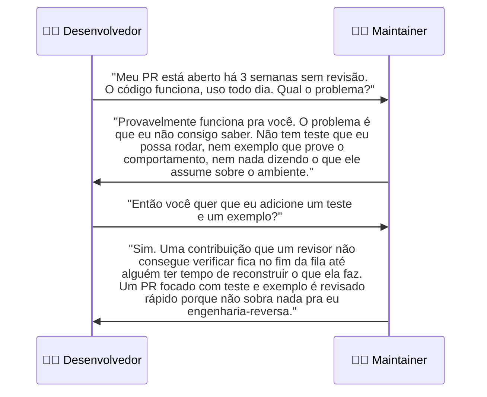
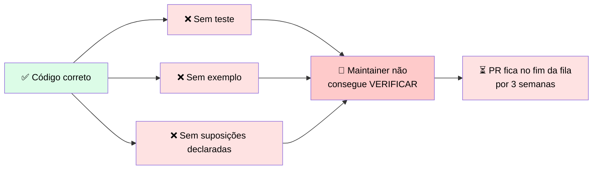

# 🔬 Post-mortem: o Pull Request que um Maintainer Não Conseguiu Verificar

> 🎯 **Setup:** você abriu a contribuição com o código exato que resolveu seu problema. Era a escolha natural porque funcionou no seu caso e estava acessível. Funcionou para você — e é exatamente por isso que faltava tudo que um estranho precisa para confiar nele.

---

## 💬 A troca

---

## 🕳️ Onde estava a falha

> <mark>O código estava correto. A contribuição travou porque o maintainer não conseguia verificá-lo sem reconstruir o trabalho do desenvolvedor.</mark> Essa lacuna é fácil de ignorar porque o autor já tem o contexto que falta. O exemplo, o teste, e a declaração de suposições parecem óbvios para quem criou o código — para o maintainer, **não são**, e um revisor que precisa reconstruir intenção sempre faz isso por último.

---

## 🚨 O que observar

> ✅ Antes de abrir uma contribuição, adicione: o **exemplo** que mostra rodando, o **teste** que prova o comportamento, e a **declaração curta** nomeando o que assume. <mark>Essas três coisas são o que move uma contribuição do fim da fila para uma revisão rápida, porque não deixam nada para o maintainer engenharia-reversar.</mark>

---

# 🧪 Checkpoint 2: escolha o canal de contribuição e o ajuste de prontidão

> 🎯 Combine cada caso com o canal certo, e com o item de prontidão que falta.

## 🎯 Match 1: caso → canal

| Caso | ✅ Canal correto |
|---|---|
| **A.** Tool focada que envolve uma única API numa função limpa. O snippet é a função e nada mais | O **repositório próprio** da tool |
| **B.** Aplicação completa de atendimento ao cliente compartilhada por inteiro, incluindo UI e scripts de deployment | O **Cookbook**, mas **só depois** de extrair o padrão reusável como um exemplo focado |
| **C.** Correção de uma linha num exemplo existente do Cookbook, trazida de um engagement de cliente | O **próprio repositório** do exemplo do Cookbook |

## 🎯 Match 2: caso → item de prontidão faltando

| Caso | ✅ Item faltando |
|---|---|
| **A.** Tool focada, só a função | Um **teste que prova que o wrapper se comporta** corretamente |
| **B.** Aplicação completa compartilhada por inteiro | **Redução a um único padrão focado** — uma aplicação inteira não cabe numa revisão montada para um padrão |
| **C.** Correção de uma linha, vinda de engagement de cliente | A **checagem de direitos** — código de engagement pode carregar uma restrição de licenciamento que bloqueia o merge antes de qualquer revisão técnica |

> <mark>Repare que cada caso tem um item de prontidão diferente faltando — não é sempre "falta teste": às vezes é escopo (Caso B) e às vezes é direitos legais (Caso C), não técnico.</mark>
