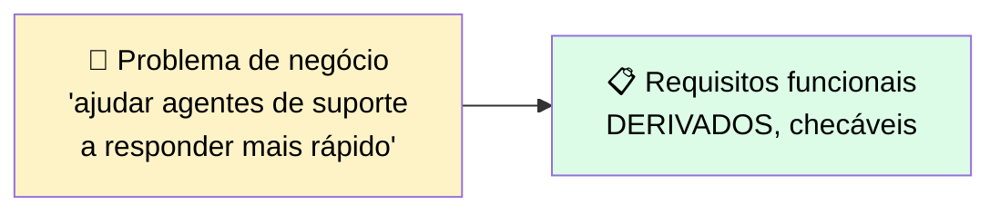
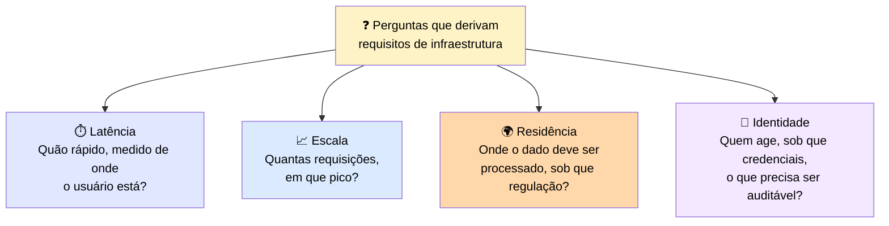
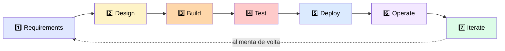

# 📐 Requisitos e Ciclo de Vida de Sistemas

> 🎯 **Ideia central:** as decisões de plataforma de deployment que vêm a seguir assumem que os requisitos já existem: a regra de residência, o alvo de latência, o modelo de identidade. Esta seção é de onde esses requisitos **vêm**.

---

## 🎯 1. Capturando requisitos funcionais a partir de um problema de negócio

> 💬 Um **requisito funcional** nomeia o que o sistema deve fazer, declarado com detalhe suficiente para ser checado.

**Exemplo de derivação:**
> *"Classificar cada ticket em uma de quatro filas; redigir uma resposta citando a política relevante; nunca auto-enviar sem aprovação humana."*

> <mark>A disciplina é escrever cada um como uma declaração checável de comportamento. Uma meta vaga não pode ser projetada nem verificada; uma específica vira uma linha num eval e um critério numa revisão.</mark>

---

## 🏗️ 2. Derivando requisitos de infraestrutura

> 💬 Requisitos de infraestrutura são as restrições **não-funcionais** que o deployment deve satisfazer. A maioria não está declarada no problema de negócio — você os deriva perguntando o que o problema **implica**.

> <mark>Latência, escala, residência e identidade são os requisitos de infraestrutura que mais decidem a plataforma de deployment — e são mais fáceis de capturar no início, antes de uma plataforma ser escolhida por outras razões.</mark>

---

## 📝 3. Documentando requisitos para que a decisão possa ser defendida

> 💬 Requisitos são escritos porque a decisão de deployment vai ser revisada por pessoas que não os coletaram. Um registro curto de requisitos — cobrindo comportamentos funcionais, restrições de infraestrutura, e a regulação de onde cada restrição vem — permite defender uma escolha de plataforma como decorrente dos requisitos, em vez de familiaridade.

---

# 🧪 Checkpoint 3: extraia os requisitos

> 🎯 **Cenário:** um banco regulado da UE quer um agente que resuma transcrições de chamadas de clientes para o time de suporte, com resumos revisados antes de serem armazenados na UE.

## ❓ Pergunta 1 — Requisito funcional

| Opção | Correta? |
|---|---|
| A) O agente deve ser rápido e preciso | ❌ Vago, não checável |
| **B) O agente produz um resumo que um humano aprova antes de ser armazenado** | ✅ **Correta** |
| C) O sistema deve ser construído usando um provedor de nuvem aprovado | ❌ Isso é infraestrutura, não funcional |
| D) Dado de transcrição não deve sair da UE | ❌ Isso é infraestrutura (residência), não funcional |

## ❓ Pergunta 2 — Requisito de infraestrutura

| Opção | Correta? |
|---|---|
| A) O agente deve produzir resumos rápido o suficiente para o time de suporte agir | ⚠️ Válido em espírito, mas vago — falta "medido de onde" |
| B) O agente resume transcrições usando um template de prompt pré-aprovado | ❌ Isso é funcional |
| **C) Dado de transcrição é processado na UE** | ✅ **Correta — é residência, uma restrição de infraestrutura clássica** |
| D) Um humano revisa cada resumo antes de ser armazenado | ❌ Isso é funcional |

---

## 🔄 4. O ciclo de vida de sistemas para aplicações Claude

> 💬 Uma aplicação Claude passa pelo **mesmo ciclo de vida** de qualquer sistema engenheirado, com o trabalho do modelo mapeado nele.

| # | Fase | O que acontece |
|---|---|---|
| 1️⃣ | **Requirements** | Capturar necessidades funcionais e de infraestrutura |
| 2️⃣ | **Design** | Escolher a plataforma, o modelo, e as fronteiras de confiança |
| 3️⃣ | **Build** | Escrever o agente, tools e prompts |
| 4️⃣ | **Test** | Evals, checagens unit/integration/e2e |
| 5️⃣ | **Deploy** | Fixar a versão, gatear a promoção no eval |
| 6️⃣ | **Operate** | Instrumentar custo/latência/erros; aplicar guardrails |
| 7️⃣ | **Iterate** | Alimentar descobertas de produção de volta para requisitos |

> ℹ️ As fases são as mesmas que os módulos anteriores ensinaram uma de cada vez. Identificá-las como um **ciclo de vida** é o que mostra como elas se conectam.

### 🚪 Gates entre fases

> 💬 Um **gate** é uma decisão de mover de uma fase para a próxima, e é onde um engagement regulado mantém controle. Você não move de design para build até a plataforma satisfazer o requisito de residência; não move de deploy para produção plena até a nova versão passar no eval contra a baseline fixada.

> <mark>Colocar o trabalho de engenharia na fase certa, e recusar pular um gate, é o que mantém uma aplicação Claude revisável.</mark>

| ✅ Funciona bem | ⚠️ Adiciona custo/complexidade | 🔄 Considere outra abordagem |
|---|---|---|
| Colocar cada peça de trabalho de engenharia na fase de ciclo de vida a que pertence, com um artefato e gate definidos | Gatear entre fases adiciona checkpoints que um time sob prazo é tentado a pular | Um experimento pontual pode colapsar fases, mas um deployment regulado não pode |

---

# 🧪 Checkpoint 4: coloque o trabalho na fase certa

| Atividade | ✅ Fase |
|---|---|
| **(a)** Fixar o ID completo do modelo e manter a versão anterior | **Deploy** |
| **(b)** Gatear a promoção no resultado do eval antes de uma versão ir a produção | **Deploy** |
| **(c)** Decidir que o dado deve ser processado numa região específica | **Requirements** |
| **(d)** Instrumentar custo de token e latência por chamada em produção | **Operate** |
| **(e)** Escolher Amazon Bedrock porque o cliente mantém sua postura de compliance lá | **Design** |

> <mark>Repare o padrão: decisões sobre "o que é exigido" são Requirements; decisões sobre "onde/como construir" são Design; decisões sobre "fixar e liberar controladamente" são Deploy; e medir o sistema rodando é Operate.</mark>
