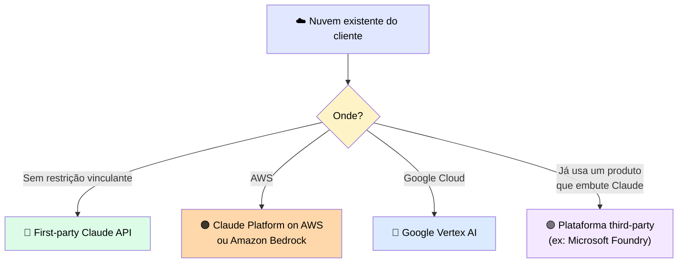
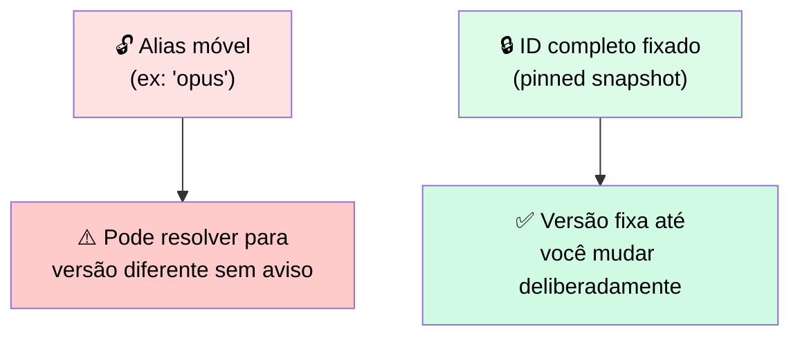

# 🚀 Escolhendo Onde um Workload Claude Roda e Versionando o que É Lançado

> 🎯 **Ideia central:** um ativo empacotado e um contribuído são ambos apenas código até algo rodá-los. A pergunta agora: **onde** rodam e como travar sua versão, para uma mudança upstream não virar uma mudança não-rastreada em produção.

> 💬 <mark>Essa decisão de plataforma raramente é só sobre mérito técnico. Na prática, é geralmente moldada por onde o cliente já tem infraestrutura de nuvem, gestão de identidade, e acordos de compliance em vigor.</mark>

---

## ☁️ 1. A nuvem do cliente geralmente determina a plataforma



| Plataforma | Detalhe |
|---|---|
| 🔷 **First-party Claude API** | Ambiente próprio da Anthropic — tipicamente recebe recursos novos primeiro |
| 🟠 **Claude Platform on AWS** | Acessado via conta AWS do cliente, usando IDs de modelo e ciclo de vida próprios da Anthropic; inferência é Anthropic-operated, **fora** da fronteira AWS |
| 🟠 **Claude in Amazon Bedrock** | Messages API em `/anthropic/v1/messages`, ampla paridade de recursos — confirme requisitos específicos contra a documentação Bedrock (existe lista de recursos não suportados) |
| 🟠 **Claude on Amazon Bedrock (legacy)** | APIs InvokeModel/Converse com identificadores versionados por ARN |
| 🔵 **Google Vertex AI** | O mesmo dentro do Google Cloud |
| 🟣 **Third-party (ex: Microsoft Foundry)** | Embute Claude num produto que o cliente já usa. Foundry oferece 2 formas de hosting: **Hosted on Azure** (Opus 4.8, Sonnet 5, Haiku 4.5 atualmente — inferência end-to-end na Azure, GA) e **Hosted on Anthropic** (demais modelos Foundry, inferência em infraestrutura Anthropic-operated) |

> ⚠️ <mark>Suposições de residência para clientes regulados dependem da forma de hosting do modelo específico.</mark> Confirme a forma de hosting e o split atual de modelos com a Microsoft na hora de construir.

---

## 🔑 2. Identidade e residência de dados são respondidas pela plataforma, não pelo seu código

| Plataforma | Identidade | Fronteira de dados |
|---|---|---|
| 🟠 Bedrock | Identidade AWS | Dado dentro da fronteira AWS do cliente |
| 🔵 Vertex | Identidade Google Cloud | Dado dentro da fronteira Google Cloud do cliente |

> ✅ Ambos oferecem roteamento regional quando residência é uma restrição. **Combinar a plataforma com o acordo de compliance existente do cliente evita uma revisão de residência de dados do zero.**

---

## 📌 3. Fixe a versão para uma mudança upstream de modelo não virar uma mudança silenciosa

> 💬 Todo ID de modelo Claude aponta para um **snapshot específico**. Aliases como Opus e Sonnet são convenientes, mas evoluem com o tempo e podem resolver para versões diferentes entre plataformas de deployment.

```python
# Exemplo pré-4.6: um alias de conveniência pode resolver
# para uma versão nova sem você saber
model = "claude-haiku-4-5"

# Pré-4.6 snapshot fixado: a versão fica fixa até você mudar esta linha
model = "claude-haiku-4-5-20251001"
```

> ℹ️ Para Claude 4.6 e posteriores, o ID do modelo sozinho já fixa um snapshot específico; para modelos anteriores, o ID mais um sufixo de data é necessário. Verifique a convenção atual em `platform.claude.com` na hora de construir.



✅ **Regra prática:** fixe a versão específica do modelo em vez do alias. Versione o prompt e o ativo junto com o código. Mantenha a versão anterior disponível para poder rollback. <mark>Um deployment não-fixado transforma toda atualização upstream de modelo numa mudança não-rastreada no seu output.</mark>

### 🚦 Promova uma versão através do eval

> 💬 Gateie a promoção no eval suite. Envie uma nova versão para uma parte do tráfego, compare contra a baseline fixada, e promova ou faça rollback com base no resultado. <mark>É aqui que o eval deixa de ser um teste único e vira o **gate de deployment**.</mark>

---

## 📋 4. Tabela de decisão de plataforma de deployment

| Plataforma | Modelo de identidade/dados | Quando escolher | Como a versão é fixada |
|---|---|---|---|
| 🔷 **First-party Claude API** | Identidade e termos da Anthropic | Cliente sem restrição vinculante de nuvem/residência, quer as capacidades mais novas | Fixar o ID completo do modelo, manter o snapshot anterior |
| 🟠 **Claude Platform on AWS** | Identidade/termos Anthropic, acessado via conta AWS do cliente; inferência Anthropic-operated fora da fronteira AWS. Ciclo de vida segue cronograma de depreciação da Anthropic | Cliente está na AWS mas quer IDs, ciclo de vida e paridade de recursos da Anthropic | Fixar usando o mesmo formato de ID da Claude API (ex.: `claude-opus-4-8`). Confirmar na hora de publicar |
| 🟠 **Claude in Amazon Bedrock** | Messages API, ampla paridade de recursos; dado fica dentro da fronteira AWS configurada do cliente | Cliente na AWS, quer ampla paridade de recursos, mantém postura de compliance lá | Fixar o ID completo usando o prefixo `anthropic.`. Datas de retirement diferem do cronograma da Anthropic — confirmar na hora de publicar |
| 🟠 **Claude on Amazon Bedrock (legacy)** | Identidade e billing AWS, APIs InvokeModel/Converse com IDs versionados por ARN | Cliente numa integração Bedrock existente via InvokeModel/Converse, ainda não migrou para Messages API | Fixar via identificadores versionados por ARN, conforme os controles de versionamento do Bedrock |
| 🔵 **Google Vertex AI** | Identidade Google Cloud, IAM, billing, com endpoints regionais/globais para residência | Cliente no Google Cloud, mantém postura de compliance lá | Fixar o ID completo antes do rollout, usando o formato de ID do Vertex. Datas de retirement diferem do cronograma da Anthropic |
| 🟣 **Third-party platform** | Identidade/billing do produto que embrulha Claude. Ex.: Microsoft Foundry — Hosted on Azure (Opus 4.8, Sonnet 5, Haiku 4.5; inferência end-to-end na Azure) e Hosted on Anthropic (demais modelos Foundry) | Cliente já roda a plataforma que embute Claude | Fixar conforme os controles de versionamento da plataforma. Confirmar termos de residência/compliance com a Microsoft antes de escolher esse caminho para cliente regulado |

---

## ⚖️ 5. Quando usar

| ✅ Funciona bem | ⚠️ Adiciona custo/complexidade | 🔄 Considere outra abordagem |
|---|---|---|
| Combinar a plataforma com a nuvem do cliente e fixar a versão mantém uma migração revisável e um rollback possível | Fixar, reter versões anteriores, e gatear promoção no eval adicionam overhead de processo de release a cada deployment | Para um protótipo descartável que nunca toca produção, um alias móvel é aceitável — fixar é para o que é lançado |

---

## ✅ Checklist de decisão

- [ ] A plataforma escolhida bate com a nuvem/compliance existente do cliente, não só com a familiaridade do time?
- [ ] Estou usando o ID completo do modelo (snapshot fixado), não um alias móvel?
- [ ] Mantenho a versão anterior disponível para rollback?
- [ ] Uma nova versão de modelo é promovida **só depois** de passar no eval contra a baseline fixada?
