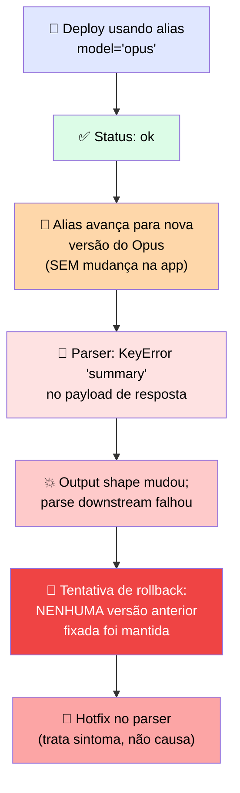

# 🔬 Post-mortem: o Deployment que Quebrou quando o Alias do Modelo Se Moveu

> 🎯 **Setup:** você lançou contra o alias que apontava para a versão recomendada, porque era o padrão conveniente e te dava o modelo mais novo de graça. Funcionou. Então o alias avançou, e o que era de graça acabou tendo um preço.

---

## 📜 O log de produção

```
--: deploy: model="opus" status=ok
--: alias advanced -> new opus version (no app change)
--: parser: KeyError "summary" in response payload
--: Error: output shape changed; downstream parse failed
--: rollback attempted -> no pinned prior version retained
--: incident: hotfix parser; root cause = unpinned deployment
```



---

## 🕳️ Onde estava a falha

> <mark>A aplicação nunca mudou, mas o alias mudou. Nenhuma versão anterior fixada tinha sido retida, então não havia nada para fazer rollback.</mark> O hotfix consertou o parser, mas deixou o deployment não-fixado no lugar — a mesma falha vai acontecer de novo na próxima vez que o alias avançar.

---

## 🚨 O que observar

| ✅ Prática | 💬 Por quê |
|---|---|
| Fixar o ID completo do modelo | Para uma atualização upstream ser algo que você **adota de propósito** |
| Manter a versão anterior fixada disponível | Para uma regressão ser um **rollback**, não um hotfix |
| Gatear a nova versão através do eval antes de promover | Para a mudança de output shape aparecer numa **rodada de teste**, não em produção |

---

# 🧪 Checkpoint 5: combine a plataforma de deployment e o pin de versão a cada cenário

> 🎯 **Cenário:** um cliente roda AWS com um requisito de residência de dados e precisa conseguir fazer rollback de uma atualização de modelo. Selecione a peça correta em cada grupo para montar a configuração mínima de deployment que satisfaz ambos.

## 🧩 Grupos de configuração

| Grupo | Opções | ✅ Escolha correta |
|---|---|---|
| **Platform Group** | First-party API / Amazon Bedrock / Google Vertex AI | **Amazon Bedrock** — o cliente já está na AWS |
| **Identity Group** | AWS identity reference / Anthropic API key | **AWS identity reference** — segue o modelo de identidade da plataforma escolhida |
| **Model reference group** | Um ID completo fixado / Um alias móvel | **Um ID completo fixado** — necessário para rollback ser possível |
| **Rollback Group** | Reter a versão anterior fixada / Sem retenção | **Reter a versão anterior fixada** — é exatamente o que permite o rollback exigido |

> <mark>As quatro escolhas se encaixam: a plataforma segue a nuvem do cliente (AWS→Bedrock), a identidade segue a plataforma (Bedrock→AWS identity), e o pin + retenção são o que tornam "conseguir fazer rollback" uma capacidade real, não uma promessa vazia.</mark>
