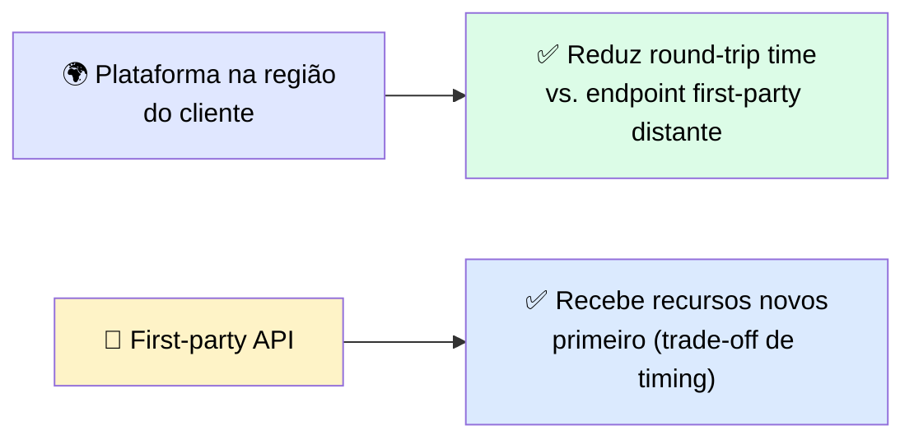
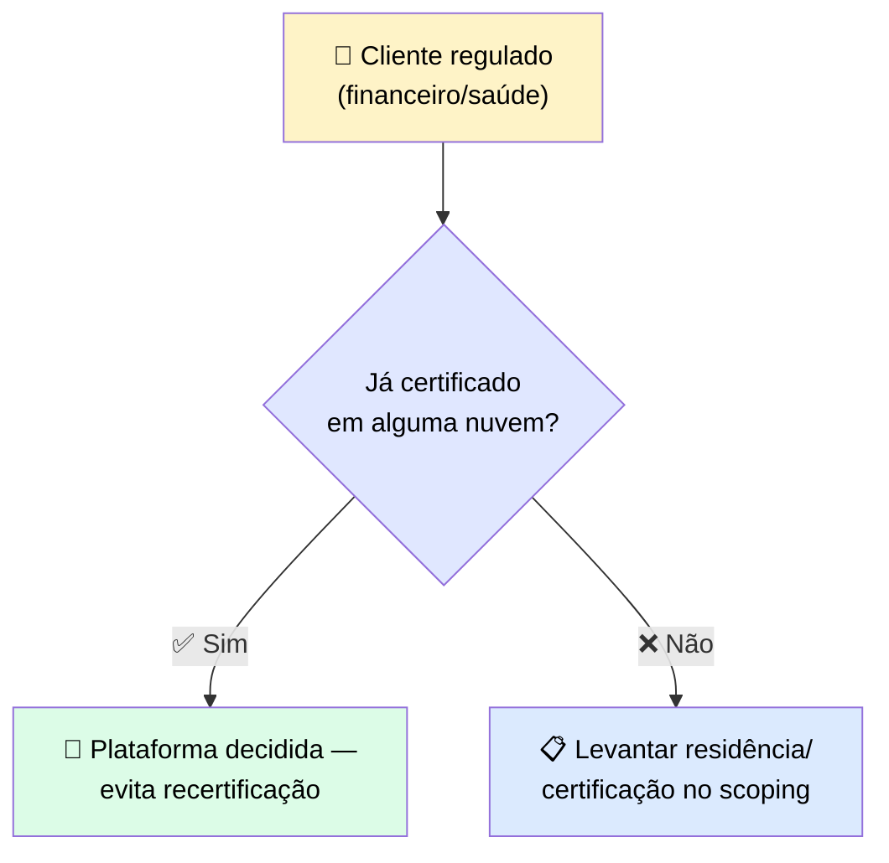
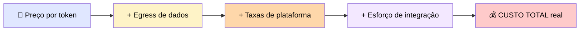

# ⚖️ Comparando Plataformas em Latência, Compliance e Custo

> 🎯 **Ideia central:** você escolheu uma plataforma e fixou sua versão. Essa escolha foi certa para a nuvem do cliente, mas "certa para a nuvem deles" ainda **não é um argumento** que um time de procurement e segurança vai assinar embaixo.

---

## ⏱️ 1. Meça latência a partir da região do cliente

> ⚠️ <mark>O número só é preciso quando medido a partir da região real do cliente contra o payload real dele.</mark> Uma medição do seu laptop esconde a penalidade de round-trip que aparece quando o workload roda de onde o cliente está.

> ℹ️ Dentro do Bedrock especificamente, a escolha entre endpoints **global** e **regional** é também o controle primário de residência, e pode afetar custo — meça a partir da região real do cliente contra as duas opções antes de se comprometer.

---

## 🏦 2. Compliance costuma determinar a plataforma

> 💬 Compliance é frequentemente a dimensão que **encerra o debate**. Um cliente que já mantém uma certificação numa nuvem dificilmente vai se recertificar em outra.

> ⚠️ <mark>Um cliente financeiro ou de saúde regulado trata isso como pass-or-fail, não como trade-off a balancear.</mark>

| Plataforma | Residência EU |
|---|---|
| 🔷 First-party Claude API | Pode **não** oferecer residência EU — confirme cobertura regional atual em `platform.claude.com` |
| 🟠 Bedrock / 🔵 Vertex AI | Residência EU-only tipicamente exige um destes |
| 🟣 Microsoft Foundry | Hosting é **por-modelo**: Azure-hosted roda inferência end-to-end na Azure; Anthropic-hosted **não** satisfaz requisitos de residência regional EU — confirmar por modelo e deployment com a Microsoft |

> ✅ **Regra prática:** levante a restrição de compliance durante o **scoping**, ou ela vai aparecer na revisão de contrato depois que o trabalho já foi feito.

---

## 💰 3. O que dirige custo total além da taxa por token

> 💬 Taxas por token são amplamente alinhadas entre plataformas; o custo total se move em **egress**, taxas de plataforma, e esforço de integração.

> ⚠️ <mark>Um preço de token mais baixo pode custar mais no total, uma vez que transferência de dados e integração são fatorados.</mark> Instrumente custo por chamada para cada plataforma. Confirme as páginas de preço atuais no momento do scoping.

---

## 📋 4. Referência de comparação cross-platform

| Dimensão | Como difere por plataforma | Como medir | Onde cada plataforma vence |
|---|---|---|---|
| ⏱️ **Latência** | Uma plataforma na região do cliente encurta o round trip; a first-party API pode alcançar recursos novos primeiro | Da região real do cliente, contra o payload real dele | Uma plataforma in-region vence em latência de round-trip; a first-party API vence em acesso mais cedo a recursos |
| 🏦 **Compliance** | Residência de dados, certificações e controles de auditoria são determinados pela plataforma de deployment | Contra a certificação e requisito de residência **existentes** do cliente, durante o scoping | A plataforma de nuvem que o cliente já certificou vence, porque não precisa de recertificação |
| 💰 **Custo** | Preço de token, egress de dados, taxas de plataforma, e esforço de integração variam | Custo total por chamada por plataforma, incluindo egress e integração — não só o preço de token | A plataforma com o menor custo total para o workload real vence — nem sempre é o token mais barato |

---

## ⚖️ 5. Quando usar

| ✅ Funciona bem | ⚠️ Adiciona custo/complexidade | 🔄 Considere outra abordagem |
|---|---|---|
| Medir as três dimensões por plataforma transforma um placement em algo que um time de procurement vai assinar | Instrumentar latência, compliance e custo entre plataformas exige trabalho real de medição antes de qualquer código ser lançado | Quando o requisito de compliance do cliente já é pass-or-fail, pule a comparação completa — essa restrição determina o placement sozinha |

---

## ✅ Checklist de decisão

- [ ] Medi latência da **região real** do cliente, não do meu laptop?
- [ ] Levantei residência/compliance no **scoping**, não na revisão de contrato?
- [ ] Instrumentei custo **total** por chamada (egress + taxas + integração), não só o preço de token?
- [ ] Se o cliente é regulado, tratei compliance como pass-or-fail, e não como um trade-off a balancear?
