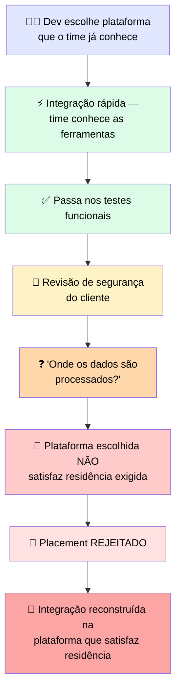

# 🔬 Post-mortem: a Plataforma Escolhida por Familiaridade que Falhou na Residência

> 🎯 **Setup:** você escolheu a plataforma que seu time já conhecia, porque a migração parecia fácil e o prazo estava se aproximando rapidamente. Funcionou de primeira; o problema é que "fácil de construir" e "permitido de lançar" são critérios diferentes.

---

## 🕵️ O que aconteceu



> ℹ️ Uma plataforma diferente, uma que o time conhecia menos bem, teria satisfeito o requisito através de opções de deployment regional que o cliente já tinha aprovado.

---

## 🕳️ Onde estava a falha

> <mark>Familiaridade otimizou para o teste errado. A migração fácil respondeu se o time conseguia construir rápido. Nunca respondeu se o deployment passaria na revisão de residência do cliente — que era o teste que determinava se poderia ser lançado.</mark>

> ⚠️ Porque o requisito de compliance não foi levantado no scoping, ele apareceu na revisão go-no-go em vez disso — <mark>o lugar mais caro de descobrir, porque a build já estava completa.</mark>

---

## 🚨 O que observar

> ✅ Uma plataforma fácil de construir para o seu time **não é necessariamente** uma plataforma que o cliente tem permissão de rodar. Quando o cliente é regulado, a restrição de residência/compliance é frequentemente pass-or-fail, não um trade-off. Identifique-as cedo, durante o scoping, e deixe-as influenciar o placement antes da familiaridade.

> <mark>Checar cedo custa uma conversa de scoping. Checar tarde custa uma reconstrução inteira.</mark>

---

# 🧪 Checkpoint 6: diagnostique o mismatch de plataforma a partir de um trace de comparação

> 🎯 O trace abaixo mostra uma plataforma de deployment escolhida por familiaridade falhando um requisito de cliente.

```
platform_selected = "team_default"  # chosen on familiarity
latency_test: measured from dev laptop -> 180ms (looked fine)
customer_region: eu-west, payload 12 KB
compliance_check: data residency = EU-only required
result: REJECTED reason="data processed outside EU on selected platform"
```

## 🔍 Diagnóstico

> <mark>A latência foi medida do laptop do desenvolvedor, não da região real do cliente (eu-west) — e mesmo que 180ms parecesse bom, isso não tem nada a ver com o motivo da rejeição. A rejeição foi por residência de dados, não por latência.</mark>

## 🛠️ Qual a correção certa?

| Opção | Correta? |
|---|---|
| A) Otimizar o parser para cortar os 180ms medidos no laptop | ❌ Ataca a métrica errada — latência não foi o problema |
| **B) Remedir latência a partir de eu-west e selecionar a plataforma cuja região satisfaz residência EU-only** | ✅ **Correta** |
| C) Adicionar uma camada de cache para reduzir custo por chamada na plataforma selecionada | ❌ Ataca custo, não o requisito que causou a rejeição |

> <mark>A correção certa ataca a causa raiz: a plataforma **selecionada** não satisfaz residência EU-only. Nenhuma otimização de latência ou custo na plataforma errada resolve isso — é preciso trocar de plataforma.</mark>
