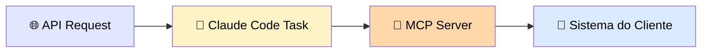
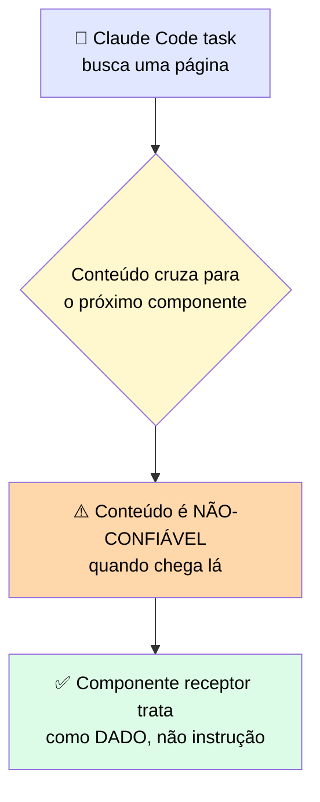
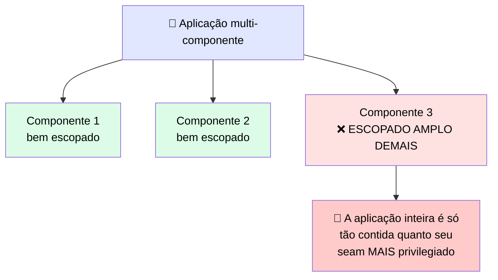

# 🔒 Coordenando Vários Deployments Claude com Fronteiras de Confiança que Sustentam Revisão

> 🎯 **Ideia central:** os accelerators, deployments e trade-offs agora se juntam numa única aplicação. Conectar componentes multiplica os lugares onde identidade, secrets, e input não-confiável podem cruzar. A disciplina é identificar **toda** fronteira antes de conectar qualquer coisa.

---

## 🗺️ 1. Mapeie o que cada componente faz antes de conectá-los

> 💬 Uma aplicação multi-componente coordena mais de uma capacidade Claude num único workflow. Uma requisição de API pode disparar uma tarefa do Claude Code, que então alcança um sistema de cliente através de um servidor MCP.

> ⚠️ Cada componente contribui uma capacidade que os outros não têm. O desafio: <mark>toda conexão entre eles cria um lugar onde identidade, secrets, e input não-confiável podem cruzar.</mark> Mapeie o que cada componente faz **antes** de conectar qualquer coisa.

---

## 🚧 2. A fronteira de confiança é onde o dado se move

> 💬 A **fronteira de confiança** é o ponto onde dado ou instruções se movem de um ambiente de deployment para outro. É exatamente onde os controles de injeção e acesso do módulo anterior se aplicam.

> <mark>A disciplina central aqui é identificar todo seam como uma fronteira. Não assuma que um componente é confiável só porque funcionou corretamente sozinho.</mark>

---

## 🔑 3. Menor privilégio se aplica à aplicação inteira

> 💬 Identidade e menor privilégio — dar a cada componente só o acesso que sua tarefa precisa, nada mais — se aplicam à aplicação **como um todo**.

> <mark>A aplicação é só tão contida quanto seu seam mais privilegiado — um único componente escopado amplo demais vira o ponto fraco, mesmo que todo outro componente esteja escopado corretamente.</mark> Escope cada componente ao menor privilégio que seu papel no workflow exige — isso é o que impede um componente direcionado de alcançar além da sua tarefa pretendida.

---

## 🏦 4. Escopar para uma revisão regulada amarra o módulo todo

> 💬 Uma revisão regulada exige justificar audit logging, decisões de residência de dados, e controles de permissão através da **aplicação completa**.

> ✅ Para deployments regulados, Bedrock e Vertex AI são tipicamente as plataformas que satisfazem restrições regionais de residência. <mark>Confirme elegibilidade de ZDR e HIPAA BAA para cada componente contra o Anthropic Trust Center e `platform.claude.com` antes de escopar.</mark>

---

## 🗺️ 5. O mapa de integração multi-componente

| Componente | O que contribui | A fronteira de confiança no seu seam | O controle que a aplica |
|---|---|---|---|
| 🌐 **First-party API** | Orquestra o workflow e segura o ponto de entrada | A requisição entrando na aplicação de fora | Validação de input e a identidade sob a qual a chamada roda |
| 🤖 **Claude Code task** | Roda o trabalho agêntico e pode buscar conteúdo externo | Conteúdo buscado, não-confiável downstream | Tratar conteúdo buscado como dado no próximo seam |
| 🔌 **MCP server** | Alcança um sistema de cliente para ler ou agir | O acesso ao sistema que segura em nome da aplicação | Escopar o servidor a menor privilégio e logar o acesso |

---

## ⚖️ 6. Quando usar

| ✅ Funciona bem | ⚠️ Adiciona custo/complexidade | 🔄 Considere outra abordagem |
|---|---|---|
| Nomear todo seam como uma fronteira e escopar cada componente a menor privilégio torna uma aplicação multi-componente deployável sob revisão | Mapear seams, aplicar controles em cada um, e logar cruzamentos de fronteira adiciona trabalho de design e auditoria a toda integração | Quando um seam não pode ser assegurado, não lance em volta dele — escale para um dono humano |

---

## ✅ Checklist de decisão

- [ ] Mapeei o que cada componente faz **antes** de conectá-los?
- [ ] Marquei todo ponto onde dado/instrução cruza entre ambientes como uma fronteira explícita?
- [ ] Cada componente está escopado ao **menor** privilégio que seu papel exige, não a um padrão amplo conveniente?
- [ ] Conteúdo buscado por qualquer componente é tratado como dado no componente receptor, nunca como instrução?
- [ ] Confirmei elegibilidade ZDR/HIPAA BAA por componente, se o deployment é regulado?
