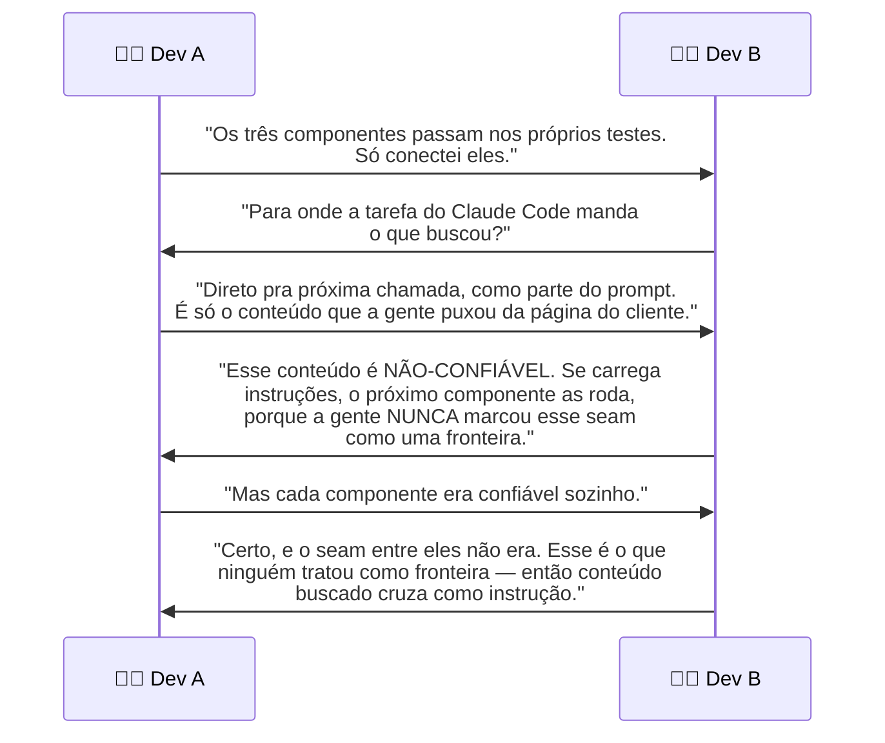
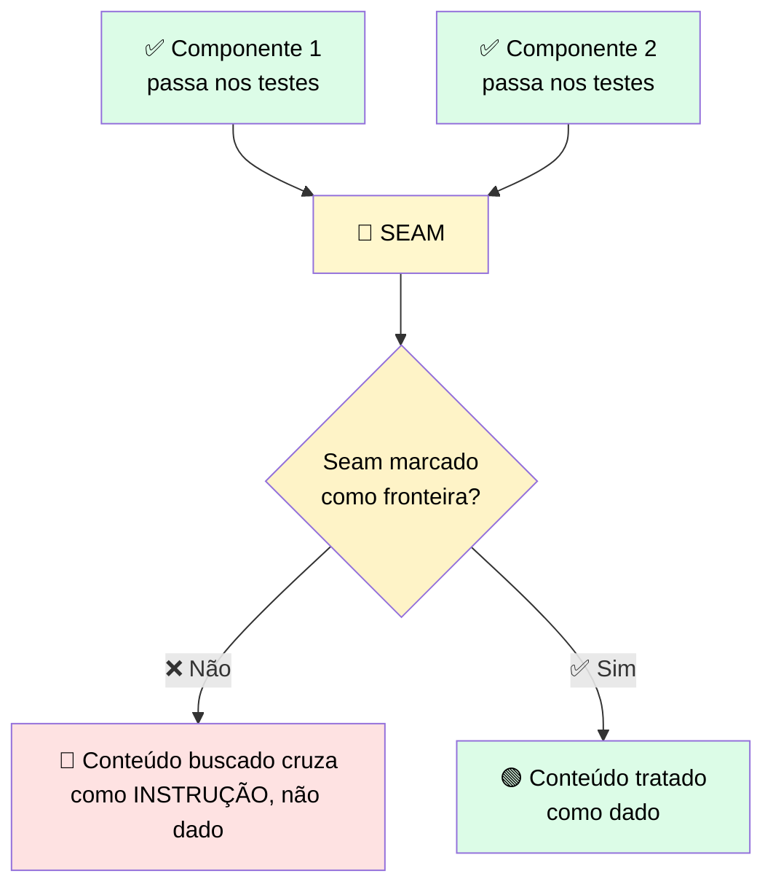

# 🔬 Post-mortem: o Seam que Ninguém Marcou como Fronteira

> 🎯 **Setup:** você conectou componentes que cada um passou nos próprios testes. As partes já estavam checadas, e conectar partes verificadas parece seguro. Cada uma era confiável isoladamente. A lacuna: um seam entre duas partes confiáveis não é automaticamente confiável ele mesmo.

---

## 💬 A sessão



---

## 🕳️ Onde estava a falha



> <mark>Cada componente ter passado nos próprios testes não dizia nada sobre o seam entre eles.</mark> O conteúdo buscado ficou não-confiável no momento em que saiu da tarefa do Claude Code. Chegou de um componente que funcionava isoladamente, e foi passado para a próxima chamada como se fosse instrução confiável. A fronteira existia no fluxo de dados — só não estava **marcada**, então nenhum controle a checou.

> ⚠️ Um componente que passa nos próprios testes **não tem** controles de nível de seam.

---

## 🚨 O que observar

> ✅ Um componente confiável isoladamente **não** torna automaticamente confiável o seam que sai dele. Marque todo lugar onde dado ou instrução cruza de um ambiente de deployment para outro como uma **fronteira**. Coloque ali um controle que trate conteúdo buscado como dado, em vez de instruções — exatamente como o trabalho de segurança do módulo anterior ensinou.

> <mark>O seam que ninguém identifica é o que uma ação direcionada cruza.</mark>

---

# 🧪 Checkpoint 7: complete a configuração de fronteira multi-componente

> 🎯 A aplicação abaixo está conectada, com duas lacunas. Arraste o controle certo para o seam que recebe conteúdo buscado não-confiável, e a identidade certa para o componente mais privilegiado.

## 🧩 A aplicação parcial

```python
# componentes conectados: API -> Claude Code task -> MCP server

fetched = code_task.run(fetch_url=customer_page)

# BLANK 1: controle no seam que recebe conteúdo buscado não-confiável
next_call(input=___(fetched))

# MCP server alcança o sistema do cliente (componente mais privilegiado)
mcp_server = MCPServer(
    system=customer_db,
    scope=___,  # BLANK 2: escopo de identidade
)
```

## 🎯 Bank de tokens (dois são distratores)

`treat_as_data` · `least_privilege_read_only` · `run_as_instructions` · `full_access`

## ✅ Respostas

| Blank | Resposta correta | Distrator correspondente |
|---|---|---|
| **BLANK 1** | `treat_as_data` | ❌ `run_as_instructions` — é exatamente o antipadrão do post-mortem |
| **BLANK 2** | `least_privilege_read_only` | ❌ `full_access` — o MCP server só precisa ler o sistema do cliente, não ter acesso total |

```python
next_call(input=treat_as_data(fetched))

mcp_server = MCPServer(
    system=customer_db,
    scope=least_privilege_read_only,
)
```

> <mark>Os dois distratores representam exatamente os dois erros que os post-mortems deste módulo ilustraram: tratar conteúdo buscado como instrução (Trust Boundaries) e dar acesso mais amplo do que a tarefa precisa (Menor Privilégio).</mark>
