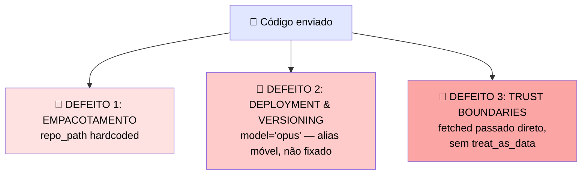

# 🧪 Tarefa Cumulativa: Encontre os Três, Explique Cada Um, Escreva a Correção

> 🎯 Abaixo está um accelerator empacotado e executável, deployado entre plataformas. Existem **três defeitos plantados**: um na camada de empacotamento, um na camada de deployment-e-versionamento, e um na camada de fronteira multi-componente.

---

## 🐛 O deployment como foi enviado

```python
# Packaged code-review accelerator, deployed for a regulated AWS customer

def build_agent():
    return Agent(
        model="opus",
        system_prompt=SYSTEM_PROMPT,
        repo_path="/home/acme/checkout",
        tools=[read_file, run_linter],
    )

deploy(platform="amazon_bedrock", identity=aws_role_arn)

# multi-component step: Claude Code task fetches a customer page
fetched = code_task.run(fetch_url=customer_page)
next_call(input=fetched)
```

---

## 🔍 Localizando os três defeitos



| # | Defeito | Camada | 💬 O que causa em runtime |
|---|---|---|---|
| 1️⃣ | `repo_path="/home/acme/checkout"` hardcoded | 📦 **Empacotamento** | O próximo time não consegue configurar o template — o path específico do cliente "acme" está enterrado no código, exatamente o padrão do post-mortem 1 |
| 2️⃣ | `model="opus"` — alias móvel, sem prefixo Bedrock, não fixado | 🚀 **Deployment & Versioning** | Uma atualização upstream do alias pode mudar o output shape silenciosamente em produção, sem rollback disponível — o padrão do post-mortem 2 |
| 3️⃣ | `next_call(input=fetched)` passa conteúdo buscado direto, sem tratá-lo como dado | 🔒 **Trust Boundaries** | A página do cliente buscada é conteúdo não-confiável — se carrega uma instrução injetada, o próximo componente a executa como comando — o padrão do post-mortem 3 |

---

# ✅ A Montagem: Deployment Corrigido

```python
def build_agent(repo_path):  # parametrizado para reuso
    return Agent(
        model="us.anthropic.claude-opus-4-8",  # ID completo Bedrock fixado
        system_prompt=SYSTEM_PROMPT,
        repo_path=repo_path,  # setado por engagement
        tools=[read_file, run_linter],
    )

deploy(platform="amazon_bedrock", identity=aws_role_arn,
       retain_previous_pinned_version=True)  # alvo de rollback mantido

fetched = code_task.run(fetch_url=customer_page)
next_call(input=treat_as_data(fetched))  # não-confiável -> dado, não instrução

# verificar antes de promover: gatear a versão através do eval empacotado
assert eval_suite.run(model="us.anthropic.claude-opus-4-8") >= baseline_score
```

---

## 🎯 Por que cada correção funciona

| Defeito | 🛠️ Correção | 💬 Por quê |
|---|---|---|
| 1️⃣ Path hardcoded | `build_agent(repo_path)` — parametrizado | Restaura reuso: um novo engagement seta o valor em vez de editar o loop |
| 2️⃣ Alias móvel não-fixado | `model="us.anthropic.claude-opus-4-8"` (ID completo Bedrock, com prefixo) + `retain_previous_pinned_version=True` | Restaura rollout controlado e dá um alvo de rollback caso a nova versão regrida |
| 3️⃣ Conteúdo buscado passado como instrução | `treat_as_data(fetched)` | Fecha a fronteira de confiança: conteúdo de fonte não-confiável é tratado como dado, não como algo em que o agente deve agir |

> ✅ A asserção final do eval **gateia a promoção** numa baseline comprovada antes da versão ser lançada — amarrando o eval suite (empacotamento) com o gate de deployment (versionamento).

---

## ✅ Checklist de auto-avaliação

- [ ] Identifiquei os três defeitos, um em cada camada do módulo (empacotamento, deployment/versioning, trust boundaries)?
- [ ] Entendi por que `model="opus"` é perigoso especificamente por ser um **alias**, não um erro de sintaxe?
- [ ] Minha correção do path usa parametrização, não outro valor hardcoded?
- [ ] Minha correção do conteúdo buscado usa `treat_as_data`, fechando a fronteira **antes** do próximo componente processar?
- [ ] Reconheço que os três defeitos são versões dos mesmos padrões dos post-mortems anteriores no módulo?
